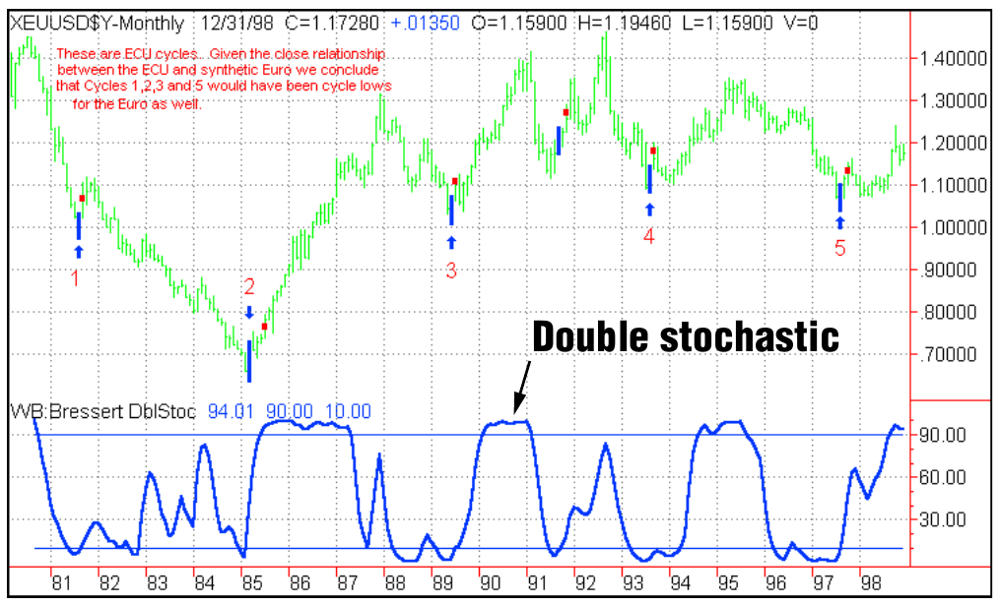
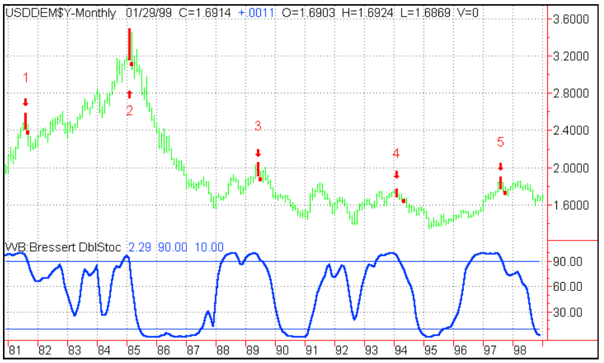
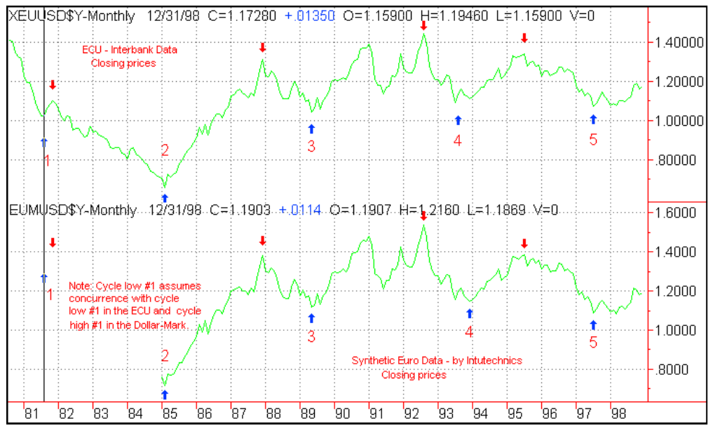
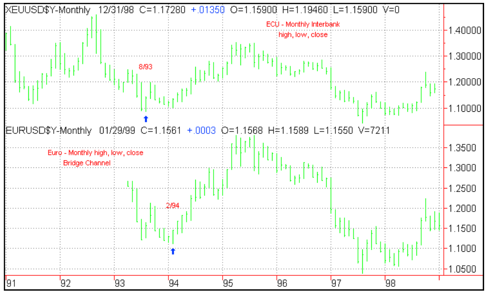
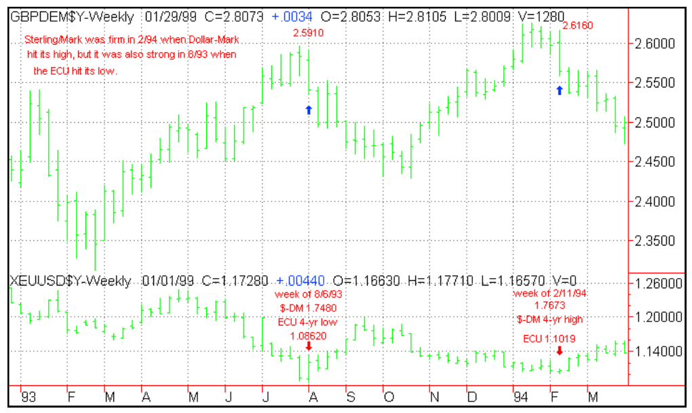
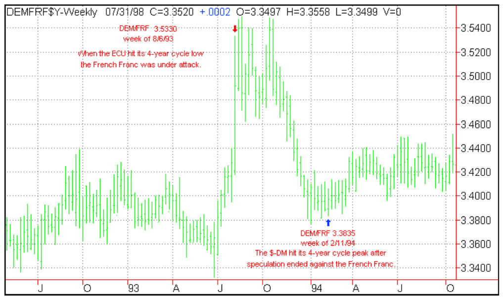
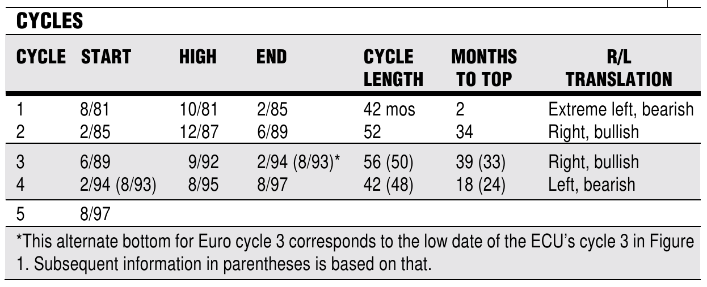
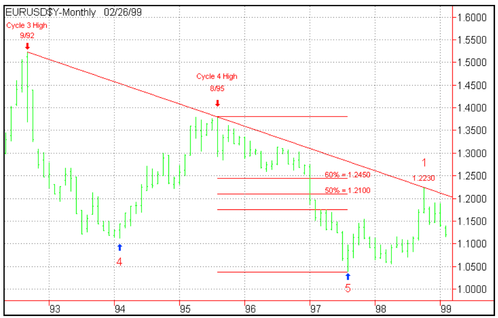
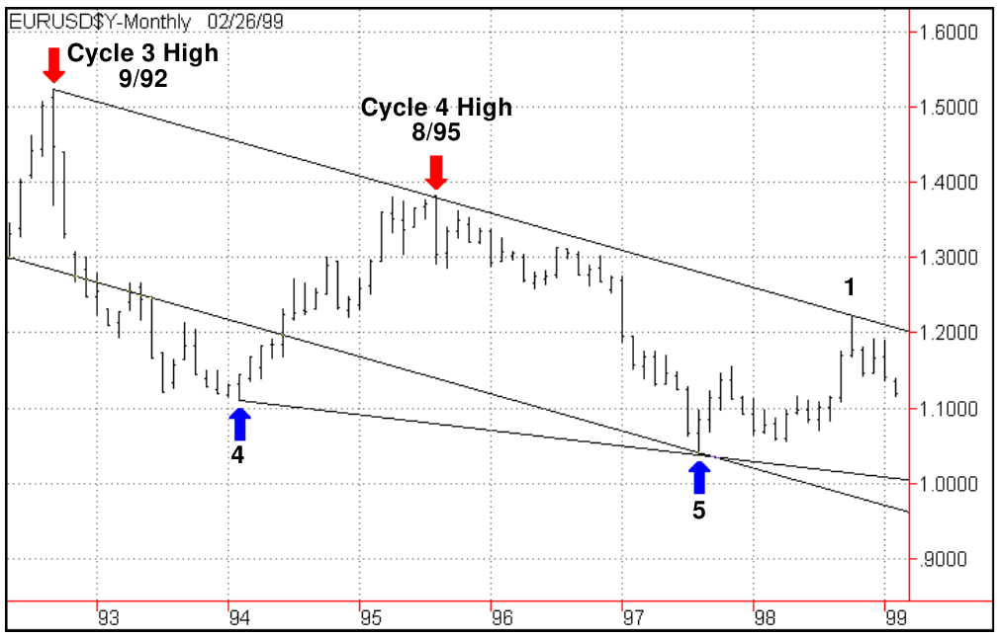

# The Euro's True Colors

- **Authors:** Walter Bressert and Doug Schaff
- **Publication:** Technical Analysis of STOCKS & COMMODITIES, Volume 17, May 1999, pp. 215–223
- **Article URL:** [Article PDF](https://technical.traders.com/archive/article.asp?file=\V17\C05\033EURO.pdf)

---

*How do you analyze the Euro, a currency that sprang to life with no price history?*

How do you analyze a full-fledged currency that came into being overnight? Despite its literal lack of price history, millions of foreign currency market participants — importers, exporters, investors, risk managers, not to mention others — instantly had exposures, long or short, the moment the Euro took its first breath.

There is no doubt that fundamental factors will determine the Euro's value, as they have for the German mark, the French franc, and other currencies. The problem arises in interpreting the direction and impact of gross domestic product (GDP), trade, interest rates, and politics in the short run. In addition, while fundamentals move the markets, they often look the most bullish at tops and the most bearish at bottoms.

On July 9, 1998, the mark, the franc, and other European currencies made cycle lows. The currencies rallied in October of that year on the back of weaker US capital markets and positive anticipation for the Euro — talk of economic synergies, a smooth start for the new currency, and capital flowing into Europe.

Now that the Euro has been established, the currencies are below the levels of October 1998, and reality has set in again. Market participants are beginning to wonder how this new currency is going to overcome the high taxes, expensive social policies, and bureaucratic structure that's kept Europe from creating any net (vs. gross) new jobs in the past decade.

Why the change in outlook? Have the Euro's fundamentals changed? No — but their interpretation or emphasis has. Cycle research can be of special assistance in this new environment to help balance economic and political analysis as a clearer fundamental picture emerges for this new currency.

If we could determine the Euro's long-term cycles and the position of the Euro within the current cycle, we could forecast price direction for the coming months and years, and even anticipate the next trend reversal. But this is not simply a case of analyzing cycles. What would we do for data? What could we say with confidence about this new currency? No matter how statistically impressive the data used to estimate the Euro's cycles is, we cannot forget the Euro has only traded since the beginning of 1999 — barely a few months.

Since no actual Euro price data exists prior to that date, we had to search for data that could approximate where the Euro would have traded if it had been in existence during the past 20 years and extrapolate from that point. There is extensive data on currencies such as the European currency unit (ECU) and the German mark, which can to some extent function as proxies for the Euro. Synthetically created histories of the Euro are based on currency histories of the countries participating in the new legal tender (referred to hereafter as "Euro currencies"). Neither solution to the data problem is perfect, but together, they can provide a firm basis on which to estimate the long-term cycles for the Euro and forecast future price movement.

## A Mixed Fundamental Picture

The Euro's economic potential is impressive, but its success against other currencies in a fragile global economy is not assured. It is now the official currency for 11 European Union (EU) member states — Austria, Belgium, Finland, France, Germany, Italy, Ireland, Luxembourg, the Netherlands, Spain, and Portugal. The currencies of those nations will continue to circulate as legal tender until 2002, when they will be withdrawn permanently. The Euro's economic zone rivals that of the United States. The population of the Euro's economic zone, at nearly 300 million, is slightly larger than that of the US. The Euro area makes up 20% of total world trade and global GDP.

With the Euro and without exchange rate risks, European business costs will be lower, boosting stock performance and attracting capital. The EU's foreign exchange reserves are $350 billion compared with about $50 billion for the US. The individual countries used to need enough reserves to separately defend their currencies; the group can now stabilize its single currency with much less capital. The result is that, for practical purposes, the EU is sitting on $200 billion to $300 billion worth of excess reserves. Most of these are in dollars and will be sold in coming years, putting a floor on the price of the Euro.

These are definitely pluses, but the Euro was born into strong competition. Impressive US economic growth makes the dollar attractive. Elsewhere, the global economy is fragile and could dampen Europe's economic momentum. If that happens, the European central bank is expected to lower interest rates, which could weaken the Euro relative to other currencies in 1999.

Cycle analysis can help risk managers amid this mixed fundamental picture to make price and timing decisions regarding the Euro. The basic principle in cyclical analysis is to identify the longest dominant cycle affecting price activity and then to work down, cycle by cycle, to the smallest cycle you wish to trade. In this first of two articles, we determine the Euro's dominant long-term cycles and provide a key overview of its expected price movement and trend.

## The ECU as a Substitute

The Euro's birth was simultaneous with the ECU's death. At that time, each ECU converted on a 1:1 ratio into a Euro. Despite this, the ECU's price history cannot be regarded as parent to the Euro. The Euro is a separate currency, not a basket of currencies, as was the ECU. The ECU did, however, contain nine of the 11 European currencies:

| Countries in the Euro | Countries in the ECU |
|---|---|
| Austria* | Belgium |
| Belgium | Denmark** |
| Finland* | France |
| France | Germany |
| Germany | Greece** |
| Ireland | Ireland |
| Italy | Italy |
| Luxembourg | Luxembourg |
| Netherlands | Netherlands |
| Portugal | Portugal |
| Spain | Spain |
| | UK** |

*Not in the ECU. **Not in the Euro.

The ECU did not contain the Austrian schilling or Finnish markka, both of which traded closely with the German mark. Of the ECU countries not in the Euro, the UK (which lately made up 12% of the ECU) is noteworthy. The British pound's absence probably accounts for most of the difference between the synthetic Euro prices and 24-hour interbank ECU prices used here. The Greek drachma represented a small fraction of the ECU, as did the Danish krone, which typically followed the German mark closely.

## The ECU's Longer-Term Cycles



**FIGURE 1: THE ECU.** A monthly chart of the ECU going back 20 years. ECU four-year cycle bottoms are shown in 1981 (1), 1985 (2), 1989 (3), August 1993 (4), and August 1997 (5). The blue indicator drawn under the price bars is the Bressert double stochastic, which does a good job of finding the four-year cycle bottoms. To target the four-year ECU cycles, use a cycle length of 20 as the input for the stochastic. A buy signal confirming each four-year low is constructed using the Bressert double-stochastic buy signal. When the oscillator turns up from below a buy line of 10, the price bar above it is painted blue.



**FIGURE 2: DOLLAR-MARK CYCLES.** The dollar–mark cycles were calculated similarly to those of the ECU and show four-year cycle tops in 1981, 1985, 1989, February 1994, and August 1997. Cycles 1, 2, 3, and 5 match those of the ECU. The cycle high 4 occurred six months after the cycle low for the ECU. The dollar–mark cycle high occurred at the second high of a double top, while the cycle low in the ECU occurred at the first low of a double bottom.

A buy signal confirming each four-year low is constructed using the Bressert double-stochastic buy signal (an indicator the code for which is available for no cost at www.walterbressert.com). When the oscillator turns up from below a buy line of 10, the price bar above it is painted blue. A move of 400 points above the setup bar is used to trigger the signal, marked by a small red square. Only six such signals have occurred since 1981: five at four-year lows for the ECU, and one in 1991 that marked a highly profitable trade in the two-year cycle. This signal identified the low bar of each four-year cycle. Once that cycle low is confirmed, you know the direction of the long-term trend.

## The Mark as Proxy

Official pre-Euro publications took a conservative stance in stressing the impossibility of creating a valid historical database for the Euro. The Euro is a brand-new currency; it is not an index or basket composed of 11 currencies. Further, each Euro currency has a distinct history. But on the whole, they have trended similarly. On a day-to-day basis, interbank traders priced the Dutch guilder, Italian lira, and others off a spread to the German mark that usually stayed within narrow limits.

Some Euro currencies have stayed within a narrow range against the mark. For the past five years, for example, the Austrian schilling has had only a 3% range versus the mark. So using the mark as a proxy for the Euro is not a bad place to start.

### Longer-Term Cycles

The dollar–mark cycles (Figure 2) were calculated similarly to those of the ECU and show four-year cycle tops in 1981, 1985, 1989, February 1994, and August 1997. Cycles 1, 2, 3, and 5 match those of the ECU. The cycle high 4 occurred six months after the cycle low for the ECU. The dollar–mark cycle high occurred at the second high of a double top, while the cycle low in the ECU occurred at the first low of a double bottom.

## Synthetic Price Histories

Mathematicians have been working overtime to create price histories for this new currency to tell us how the Euro might have traded in the past. Though the 11 Euro currencies have well-documented price histories, some, such as the Irish punt and Portuguese escudo, are thinly traded outside European hours. Therefore, the trading day for the synthetic Euro should be considered to be from 7 am to 8:45 pm Greenwich Mean Time (2 am to 3:45 pm New York time).

The approach to creating a synthetic price history for the Euro is to take the 11 actual price histories, decide how to combine them, and then with the computer calculate the resulting price history as far back as possible.

There are many ways to calculate a synthetic Euro. One way combines the 11 currencies according to the relative size of their 1997 GDPs. Another way is to use the same percentage weighting for currencies in the Euro as in the ECU and evenly distribute the weights of the pound, krone, and drachma to the schilling and markka.

The Euro will perform according to the economic performance of the group of countries that have adopted it. We used several methods but chose the GDP-weighting method for the price history on our charts.

## Divining Longer-Term Cycles



**FIGURE 3: EURO AND ECU.** Intutechnic's Euro data going back to 1985. Four-year cycle lows are shown in 1981, 1985, 1989, 1994, and 1997. The four-year dollar–mark and ECU cycles ended in August 1981. Due to the relationship of the three currencies discussed, a cycle low for the Euro has been ascribed in August 1981 and the count will begin there. Cycle tops are indicated by the red down arrows. Generally, the ECU and Euro look like mirror images. The major cycle tops and bottoms for the ECU and Euro all appear to line up except for the cycle low 4 in late 1993–early 1994. The dollar–mark cycle highs occurred the same time as the Euro cycle lows.



**FIGURE 4: EURO AND ECU.** Confirms that the ECU made an important low in August 1993, whereas the Euro didn't make its low until the following February six months later. Why would the ECU make a four-year low six months before the Euro?

## ECU, Dollar–Mark, and the Synthetic Euro

Generally, the ECU and Euro look like mirror images. In Figure 3, the major cycle tops and bottoms for the ECU and Euro all appear to line up except for the cycle low 4 in late 1993–early 1994. The dollar–mark cycle highs occurred the same time as the Euro cycle lows.

Figure 4 confirms that the ECU made an important low in August 1993, whereas the Euro didn't make its low until the following February six months later.

## Differences in the Cycle Lows

If the price difference between the Euro and ECU at the cycle lows in question was a 1/4 or 1/2 percent, we could explain it as due to the synthetic Euro being priced during European trading hours only. But the price difference of the ECU to the Euro on the August 1993 and February 1994 price bars was more than 2%. Further, the 24-hour dollar–mark cycle coincided with the synthetic Euro cycle, so we need to find out why the difference with the ECU occurred.



**FIGURE 5: POUND/MARK COMPARISON.** Could a large downdraft in the pound be responsible for an early low in the ECU? The pound was firm against the mark both at the ECU low in August 1993 and at the mark low (dollar high) in February 1994. The pound/mark traded in nearly the same range both the week of August 6, 1993, and February 11, 1994, although it made a 1% higher high at the dollar–mark's February 1994 peak than at the ECU's low.



**FIGURE 6: MARK/FRANC.** When the ECU hit its long-term cycle low, the French franc was under speculative attack. A weak franc appears as a higher mark price (it took more francs to buy a mark). The French franc fell nearly 5% in the month before the ECU hit bottom in August 1993. It stayed weak for two and a half months, then recovered the ground it had lost by the time the dollar–mark hit its high in February 1994.

## Comparative Strength

Was the German mark strong against the other components of the ECU when the ECU bottomed? The Bridge Channel product made this relatively simple to research. We began by looking at the German mark/French franc cross-rate.

When the ECU hit its long-term cycle low, the French franc was under speculative attack. The French franc fell nearly 5% in the month before the ECU hit bottom in August 1993. It stayed weak for two and a half months, then recovered the ground it had lost by the time the dollar–mark hit its high in February 1994.

What about the other components of the ECU? They performed in much the same way. Into the August 1993 ECU low, the Dutch guilder and Belgian franc declined 1%, but the others fell between 3% and 10%. No wonder the ECU cycle low was earlier than the dollar–mark's high.

## Real-World Solution

Nothing made sense until we realized how the foreign exchange dealing room works. In the July/August 1993 foreign exchange market, where all hell was breaking loose, the ECU came unglued. There was a disconnect between the prices of the "arbitrage" components of the ECU and the basket itself. Arbitrage is in quotes because, while the components of the ECU were all tradable, they were not deliverable against the basket.

In late July/early August 1993, how would you have arbitraged the ECU against its components? Anyone who's worked in a dealing room during a devaluation scare knows that it becomes well-nigh impossible to short a weak currency if you haven't generated bank balances in that currency in advance.

This unusual scenario is the most likely explanation for the early four-year cycle low in the ECU. What in normal times would have been a good correlation between the ECU and its component currencies broke down in late July and early August 1993.

## Cycle Low Confirmed

This disconnect between the ECU and its currencies may have signaled to the European central banks that something had to be done. Despite the difficult and very bearish market in August 1993, that is when the low for cycle 4 for the ECU occurred (four years and two months after the previous cycle low in June 1989).

Further research shows that on July 31, 1993, Europe's exchange rate mechanism (ERM) expanded the central parities around which the ERM currencies could fluctuate from 2¼% to 7½%. Two days prior, the Bundesbank had lowered its discount rate by ½%, but this was insufficient to defuse speculative pressures; intervention and expanded parities were.

## Cycle High Confirmed

By the way, the central banks won. Over the next six months, all those currencies that had been devaluation candidates against the mark regained most or all of their losses. The dollar was still strong, but there was no problem with the ECU. The dollar–mark cycle high in February 1994 makes perfect sense, occurring without a new low in the ECU.

## Conclusion for the Cycle Low

The question with regards to deciding the cycle low for the Euro is: Will the Euro trade like the ECU or will it trade more like a separate currency, like the mark?

The Euro is a separate currency, not a basket of currencies like the ECU was. It will be less prone to the kind of devaluations and dislocations that occurred within the European monetary system. In this case, the February 1994 cycle low for the synthetic Euro is preferable.

Until 2002, however, while the national currencies still exist, there could be a major distortion within the European monetary unit.

## Forecasting the Four-Year Cycle

Long-term cycles provide an overview of expected price movement and trend. Each market has an individual cycle profile. Having identified four-year cycle tops and bottoms for the Euro, how can they be used to identify tops and bottoms of upcoming price movements?

### How It Topped in Past Cycles



**FIGURE 7: CYCLE HISTORY.** In forecasting the next cycle high for the Euro, the first thing to look for is how it would have topped within previous cycles.

| Cycle | Start | High | End | Cycle Length | Months to Top | R/L Translation |
|-------|-------|------|-----|-------------|---------------|-----------------|
| 1 | 8/81 | 10/81 | 2/85 | 42 mos | 2 | Extreme left, bearish |
| 2 | 2/85 | 12/87 | 6/89 | 52 | 34 | Right, bullish |
| 3 | 6/89 | 9/92 | 2/94 (8/93) | 56 (50) | 39 (33) | Right, bullish |
| 4 | 2/94 (8/93) | 8/95 | 8/97 | 42 (48) | 18 (24) | Left, bearish |
| 5 | 8/97 | | | | | |

### Chasing the Larger Cycle

The key to successful trading is to trade with the trend, buying the dips in uptrends and selling the rallies in downtrends. Trend is defined as the direction of the next longer cycle than the one you are trading.

Cycle 2, which began in 1985, lasted 52 months and showed strong right translation, which is bullish. Cycle 4, which began in February 1994, was 42 months long and showed left translation. This cycle did not take out the previous cycle high, and the low of cycle 4 was lower than the low of cycle 3. Lower highs and lower lows are characteristic of downtrending markets.

## Up or Down?

### Bullish Scenario



**FIGURE 8: BULLISH SCENARIO.** The bullish scenario for the Euro would have prices up to $1.25 to $1.30 by year-end 2000. The Euro would make a monthly close above the downtrend line drawn across the tops of cycles 3 and 4. Then the bottom of the next longer dominant cycle would be in place and we would see a 60% to 70% retracement toward the August 1995 cycle high by August–December 2000.

Cycle analysis holds that when a downtrend line drawn across the tops of two cycles of the same length is penetrated significantly, the bottom of the next longer dominant cycle is in place. A significant penetration would mean a monthly close above the downtrend line.

As of February 1999, the downtrend line comes in at 1.22 and would decline to 1.20 by May. A monthly close above the trendline would imply that the bottom of the next longer dominant cycle is in place and indicate that higher prices for the Euro are expected.

In bullish cycles, with right translation, the Euro's cycles have risen 34 to 39 months to their tops. We could expect the same thing if the Euro's next longer cycle is moving up. This means we'd see a cycle top about three years from the low in August 1997. Look for a top in the Euro around November 2000.

### Bearish Scenario

Prices fall below $1.00 in the next 12 to 18 months. The Euro stays below the cycle 3 high/cycle 4 high downtrend line and develops left translation (a cycle high before August 1999). Prices test $1.00, and make a cycle low in the 98- to 99-cent range by autumn 2000.



**FIGURE 9: CYCLE LOWS.** A line drawn through cycle lows 4 and 5 comes in around the $1.00 level. It is dropping slowly and would provide support lower than that through August 2000, the expected time for the cycle low in this scenario. This line forms a wedge as, when extended, it eventually meets the higher downtrend line, forming a triangular wedge of prices.

Price objectives in a bear market:
- **$1.04** — The old cycle 5 low at $1.0390 will provide support.
- **$1.00** — Several months of congestion in early 1986 around the $1.00 level. The wedge line through cycle lows 4 and 5 comes in there as well.
- **92 to 95 cents** — A parallel channel line to the cycle 3 high/cycle 4 high line, drawn off the cycle 5 low, provides support in this area.

## Stay Tuned

Next time, we will apply additional technical tools, oscillators, and trend indicators to forecast a more specific time and price objective for the next four-year cycle top. In addition, we will develop a trading methodology for the Euro using weekly cycles.

## About The Authors

Walter Bressert and Doug Schaff collaborate to publish *FX Cycles* for interbank traders and risk managers and *Currency Cycles* for futures traders. Utilizing Bressert's cycle and technical analysis combined with Schaff's currency expertise and fundamental knowledge, these services combine long-, intermediate- and shorter-term cycle analysis to come up with timing and price forecasts, and trade recommendations for the major currencies, Euro crosses and other currency pairs.

## Related Reading

- Bressert, Walter, and Doug Schaff [1999]. *Currency Cycles*, www.walterbressert.com.
- Bressert, Walter, and Doug Schaff [1999]. *FX Cycles*, www.walterbressert.com.

---

## BibTeX

```bibtex
@article{bressert_schaff_1999_euros_true_colors,
  author    = {Walter Bressert and Doug Schaff},
  title     = {The Euro's True Colors},
  journal   = {Technical Analysis of STOCKS \& COMMODITIES},
  volume    = {17},
  number    = {5},
  pages     = {215--223},
  year      = {1999},
  url       = {https://technical.traders.com/archive/article.asp?file=\V17\C05\033EURO.pdf}
}
```
