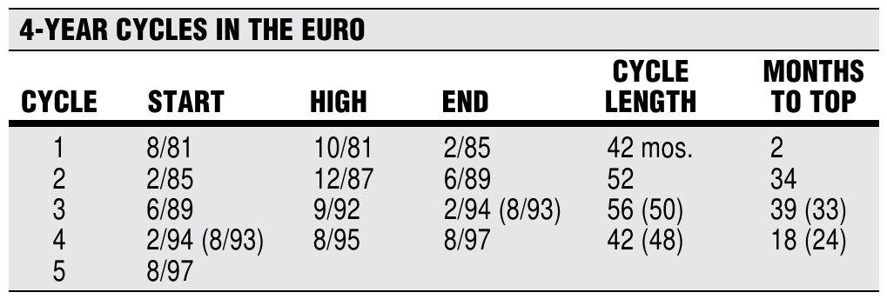
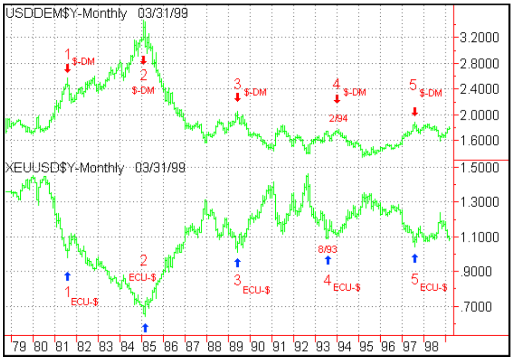
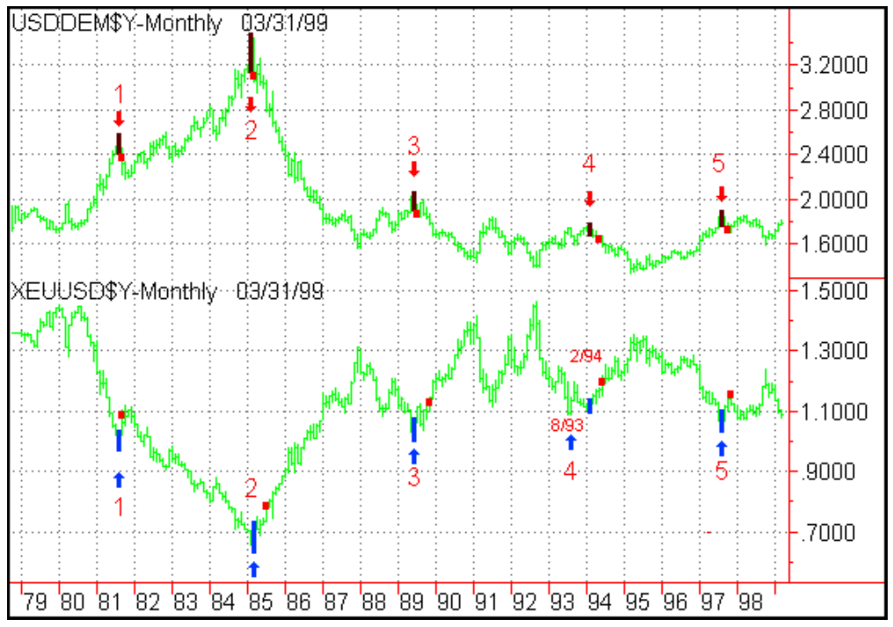
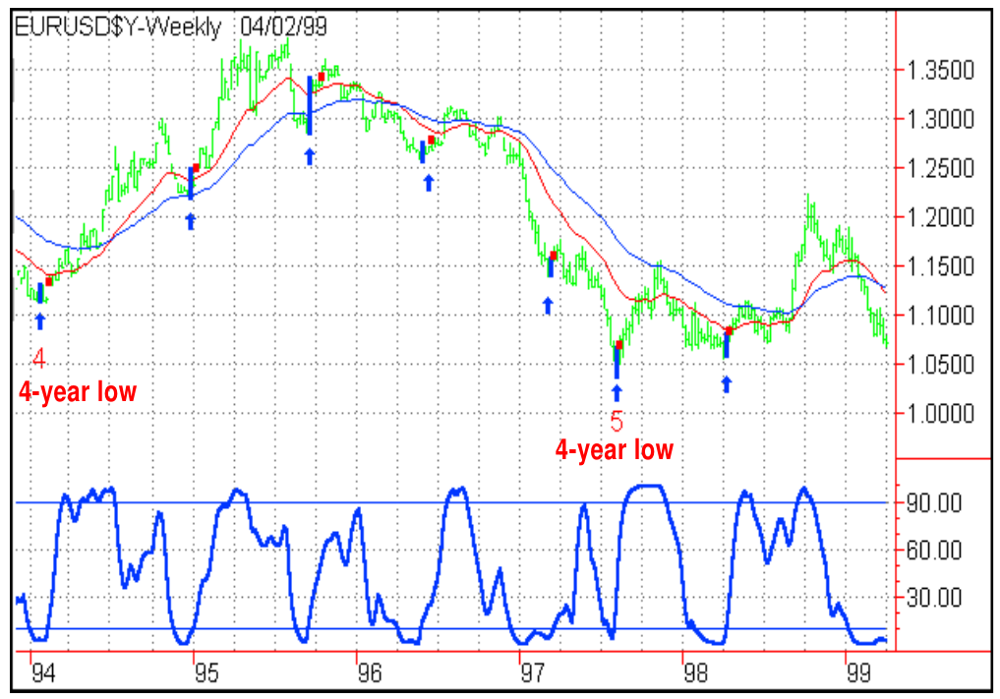
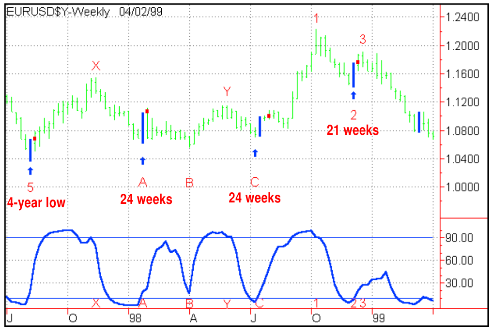
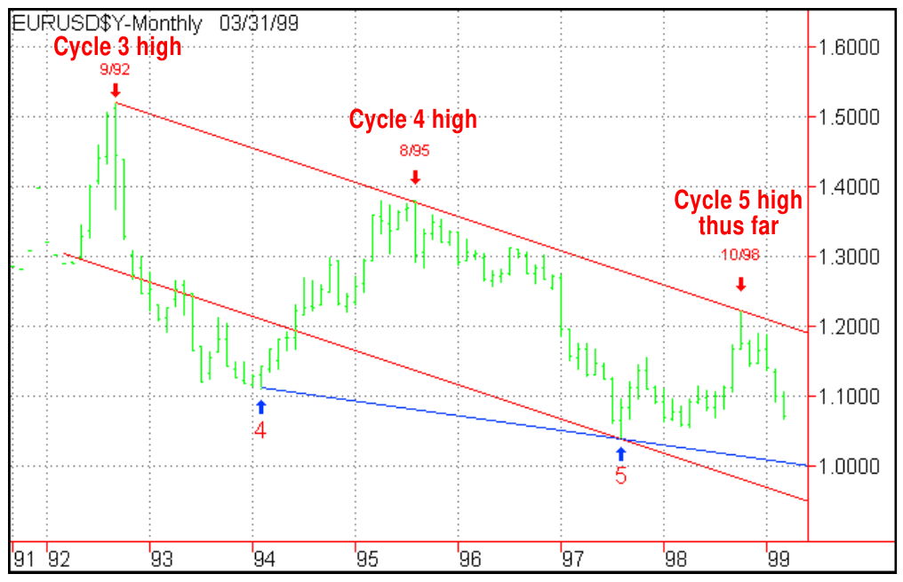

# The Euro's Weekly Cycles

- **Authors:** Walter Bressert and Doug Schaff
- **Publication:** Technical Analysis of STOCKS & COMMODITIES, Volume 17, June 1999, pp. 270–274
- **Article URL:** [Article PDF](https://technical.traders.com/archive/article.asp?file=\V17\C06\043EURO.pdf)

---

*As a followup to last month's introduction to the newborn European currency, here's what may happen to the Euro.*

On January 4, 1999, the 40-odd years of planning and 10 years of political and economic work paid off as the Euro began trading in a calm, orderly manner. But what's the bottom line? How will improved efficiencies from a single currency affect Europe's competitiveness? When will the Euro's status as a reserve currency begin to shift demand away from US dollars?

The brand-new European Central Bank (ECB) is determined to establish its credibility. Europeans, on the other hand, having accepted large doses of fiscal and monetary tightening to establish the Euro, are now ready for payback in the form of economic growth.

In the midst of this uncertainty, it's not so surprising that the Euro initially put in a weak price performance. Starting off at 1.1630, it quickly put in its high just above 1.1900 and by mid-February had traded down to 1.1200. The fundamentals will probably sort themselves out by summer. By then, the economic slowdown in Europe will most likely be over.

In the meantime, cycle analysis offers guidelines regarding time and price levels at which the Euro should bottom. Let us apply additional technical tools, oscillators, and trend indicators to develop a trading methodology for the Euro using weekly cycles.

The cycles and price levels are based on synthetic Euro prices from Bridge Channel's EuroCalc, calculated using historical foreign exchange prices for each of the participating countries. (EuroCalc is an online Web-based service that allows user-defined inputs to generate a synthetic foreign exchange Euro history by treating the Euro as a basket of currencies like the ECU.) The synthetic Euro prices fit seamlessly into actual interbank prices as the Euro began trading on January 4. We have confidence in this price data and therefore believe the analysis gives important guidelines as to where the Euro is likely to bottom and the extent of the coming move.

## Long-Term Cycles

Our article last month discovered a four-year cycle in the Euro similar to ones in the ECU and dollar–mark. Since 1981, there have been five such four-year cycles in the Euro (Figure 1).



**FIGURE 1: EURO CYCLES.** Our article last month discovered a four-year cycle in the Euro similar to ones in the ECU and dollar–mark. Since 1981, there have been five such four-year cycles in the Euro.

| Cycle | Start | High | End | Cycle Length | Months to Top |
|-------|-------|------|-----|-------------|---------------|
| 1 | 8/81 | 10/81 | 2/85 | 42 mos. | 2 |
| 2 | 2/85 | 12/87 | 6/89 | 52 | 34 |
| 3 | 6/89 | 9/92 | 2/94 (8/93) | 56 (50) | 39 (33) |
| 4 | 2/94 (8/93) | 8/95 | 8/97 | 42 (48) | 18 (24) |
| 5 | 8/97 | | | | |

*This alternate bottom for Euro cycle 3 corresponds to the low date of the ECU's cycle 3. Information in parentheses is based on that.

Four-year cycles for the dollar–mark and ECU (Figure 2) ended in the same months in 1981, 1985, 1989, and August 1997. Due to pressures from a strong German mark versus other European currencies, the ECU's cycle 3 bottomed in August 1993, six months prior to the cycle high for the dollar–mark. In effect, the dollar–mark cycle high occurred at the second high of a double top, while the cycle low in the ECU occurred at the first low of a double bottom.



**FIGURE 2: DOLLAR–MARK AND ECU.** Four-year cycles in the dollar–mark and the ECU ended in the same months in 1981, 1985, 1989, and August 1997.

A sell signal confirming each four-year cycle top for the dollar–mark can be constructed using the Bressert double-stochastic sell signal. To target the 48-month cycles, use half the cycle length, 24, as the input for the stochastic. You can see in Figure 3 that it locates the top of all the dollar–mark's four-year cycles.

The lower portion of Figure 3 shows mechanical buy signals confirming each ECU four-year low, constructed using the Bressert double-stochastic buy signal. When the oscillator turns up from below a buy line of 10, the price bar above it is painted blue.

For the ECU, a move of 600 points above the setup bar is used to trigger the signal, marked by a small red square. Only five such signals have occurred since 1981, each at a four-year low for the ECU. This signal located the low bar, and only the low bar, of each four-year cycle.

One reason February 1994 is the preferred date for the Euro's cycle 3 low is that the double-stochastic trade signals for the ECU and dollar–mark both occurred in that month.



**FIGURE 3: SELL SIGNALS.** Using the Bressert double-stochastic, a sell signal confirming each four-year cycle top for the dollar–mark can be constructed. To target the 48-month cycles, use half the cycle length, 24, as the input for the stochastic.

## The Euro's 40-Week Cycle

The synthetic Euro's dominant weekly cycle is 40 weeks. Up arrows on Figure 4 show the 40-week cycle lows. The EMA trend indicator is drawn over weekly prices to show the trend for the weekly chart.

Cycles show distinct tops and bottoms frequently accompanied by overbought and oversold levels of the double-stochastic. The double-stochastic is usually constructed using a time frame half the length of the cycle being studied. In Figure 4, a 20-week double-stochastic helps to visually pinpoint 40-week cycle lows. It can also be used to generate mechanical buy signals that mark those lows. The mechanical buy signals marking the cycle lows were constructed as follows:

1. The blue double-stochastic oscillator drops below a buy line of 10.
2. The oscillator turns up. The monthly price bar that turned the oscillator up is blue and called a setup bar.
3. A mechanical buy signal is triggered when the high of the setup bar is exceeded by 30 points and is indicated by a small red square.



**FIGURE 4: WEEKLY EURO.** Here, the Bressert long-term EMA trend indicator, which is made up of two exponential moving averages, is plotted on the weekly chart. The red line is the 23-month exponential moving average. The blue line is the 50-month exponential moving average.

Different cash foreign exchange sources can give somewhat different daily highs and lows. To avoid such price discrepancies and weed out false signals, we require price to exceed a weekly setup bar by 30 points before an entry signal is triggered. Note in Figure 4 how a setup bar was generated at or within one bar of each of the 40-week cycle lows.

## When Will the Current Cycle End?

When will the current 40-week cycle end? For an answer, let's look at a shorter cycle that will most likely be bottoming at the same time as the current 40-week cycle. Cycles of various lengths tend to nest together at major cycle highs and lows. At the last four-year cycle low (point 5 in Figure 4), the 20- and 40-week cycles all bottomed together.

## Adding 20-Week and 10-Week Cycles

The ECU had 20-week cycles, as does the dollar–mark. So it's not surprising that there are also 20-week cycles in the Euro. The current 20-week cycle can be expected to bottom as the 40-week cycle bottoms. To target the upcoming 40-week cycle low, let's look at this shorter-term cycle.

Figure 5 shows weekly Euro prices from the four-year low in August 1997. The lower portion has a blue 10-week double-stochastic.

The 10-week double-stochastic helps us pinpoint the corresponding tops and bottoms of the 20-week cycles. The 10-week double-stochastic turned up the week of March 12 from below the buy line and formed a blue setup bar. However, the Euro did not rise sufficiently above the setup bar to trigger an entry signal. This is an example of why we incorporate both a setup bar and trigger entry into our trading methodology. Together, the two improve the signal accuracy by up to 15% compared with using the setup bar alone. In addition, historically, this kind of setup bar and trigger entry is 70% or more accurate in identifying cycle tops and bottoms.

By using a dip and subsequent rise in the 10-week oscillator from below a buy line of 10, the Euro has completed three 20-week cycles since the last four-year low (at A, C, and 2 in Figure 5), and is 17 weeks into its fourth. On a straight weekly count, the current 20-week cycle lacks another three weeks. Cycles, however, can contract, expand, and even skip a beat now and then. For such reasons, the current 20-week cycle may shorten.

The second time the 10-week double-stochastic oscillator in Figure 5 bottomed was the week of July 10 at cycle low C. This suggests that the 40-week cycle extended to 48 weeks.

The third 20-week cycle low hit on the week of December 4, 1998 (cycle low 2 in Figure 5). The next 20, which the Euro is currently in, had extreme left translation — that is, cycle high 3 in Figure 5 occurred early in the cycle. In fact, it took the Euro just two weeks to make the high of its current 20-week cycle, at 1.1910, the week of December 18, 1998. As of April 2, the market should complete week 17 of that cycle.

Left translation is bearish. When the longer cycle is moving down, the crests of smaller cycles appear to shift to the left. Prices top early in those cycles. In such situations, each cycle low is usually below the previous low, and each high is often below the previous high. This is consistent with what has been going on with the Euro. This 20-week cycle is already decidedly below cycle low 2 in Figure 5.



**FIGURE 5: SYNTHETIC EURO.** The blue up arrows show the 20-week cycle lows in the Euro.

## Calculating Price Objectives

Market geometry can help identify price objectives for this 20- and 40-week cycle low. Old cycle highs and lows can indicate future support and resistance. The old April 1998 cycle low was at 1.0560. Below that, the cycle 5 low, at 1.0390, should provide support. It may seem unlikely that the Euro would fall below that level, but the Yugoslavian conflict alone adds enough uncertainty to warrant doing some research on this possibility. In particular, the war could become a prolonged conflict involving ground troops, which is not reflected in the market at present. Notwithstanding this possibility, there remains up to four weeks of trading until the 40-week cycle low is called for. As of the end of March, the past three weeks witnessed a market drop almost four cents from high to low. The Euro only needs to drop three cents below the 1.0678 low of March 28 to break the four-year cycle low at 5, made August 1997.

What price would the Euro fall to if it were to break its cycle 5 low at 1.0390? Two methods of calculating support discussed last month come into play, as shown in Figure 6:

- **$1.00** — In Figure 6, the dark blue wedge line through cycle lows 4 and 5 comes in at $1.00.
- **96 cents** — A parallel channel line to the cycle 3 high/cycle 4 high line, drawn off the cycle 5 low, provides support in this area (Figure 6).



**FIGURE 6: WEEKLY EURO.** What price would the Euro fall to if it were to break its cycle 5 low at 1.0390?

## Summary and Forecast

We expect the Euro's upcoming 20-week cycle low to occur no later than the end of April. It would be confirmed as follows: A blue setup bar will form based on a rise in the 10-week double-stochastic from below a buy line of 10. The market would then need to rise 30 points above the blue setup bar to trigger the entry signal. This would also confirm the 40-week cycle low. Our detailed forecast for the Euro has two parts:

- A 40-week cycle low to be confirmed no later than April 30
- Price and time objectives for the upcoming bull move.

### Part 1: A 40-Week Low No Later Than April 30

The second 20-week cycle is likely to contract. When the previous cycle extends, it is not unusual for the next cycle to contract. The first 40-week cycle after the August 1997 four-year low lasted 48 weeks. Therefore, it would not be unusual for the current 40-week cycle to be shorter than 40 weeks.

Cycles can often be subdivided into visible half-cycles. Such is the case with the Euro's 40-week cycle. When a 40-week cycle contracts, at least one of its 20-week cycles must also contract. The first 20 of this 40-week cycle lasted 21 weeks. So if this 40-week cycle is to contract, it must do so in its second half, the 20-week cycle that the Euro is now in. As of March 31, the Euro is in week 17 of that cycle. This suggests that a major low for the Euro could occur at any time.

The weekly oscillators are below the buy line. In markets other than foreign exchange, a buy line of 40 can often be used with double-stochastic oscillators to signal a cycle low. However, these oscillators normally overextend in currency markets. Indeed, all the 40-week cycle lows in Figure 4 were marked by upturns in the 20-week double-stochastic from below a buy line of 10.

The Euro's double-stochastic oscillator is at oversold levels. Any upturn in the oscillator from these levels, followed by a setup bar and trigger entry, would indicate the next 40-week cycle low has occurred.

### Part 2: Following the 40-Week Cycle Low

- The Euro could initially reach the level of 1.1150 of strong resistance. A rise above there would set up a test of 1.1550 to 1.1630 by mid-July.
- The Euro could see a September–October test of the long-term downtrend line (see Figure 6) at 1.1800 to 1.1900.
- However, even with a shift in the fundamental factors discussed below, the Euro is not likely to exceed the downtrend line and should remain below 1.1900 through year-end.

Once the 40-week cycle low is confirmed, the Euro should begin a sustained move higher. We look for the Euro to reach our first objective of 1.1150 in the first six weeks after the cycle low. The 1.1150 level at point Y in Figure 5 was the top of the Euro's trading range for the first seven months of 1998.

A Friday close above 1.1150 would probably be followed by a test of 1.1550 to 1.1630. This could occur as early as mid-July. The 1.1550 level was the high of the Euro's previous 40-week cycle point X in Figure 5; 1.1630 was the price that the Euro first traded at on January 1, 1999.

In the longer term, we expect the Euro to run into significant resistance at the 1.1800 to 1.1900 level. This would most likely occur during a September–October test of the monthly downtrend line shown in Figure 6. The trendline starts from the 1992 four-year cycle high at 3 and goes through the 1995 cycle high at 4. Extended out, you can see that last October's high, the current high of cycle 5, bounced off of it. We expect the Euro to remain below this downtrend line, even if the difference between European and US growth rates narrows, and if the US equity markets take a pause or correct downward.

## Overview

As explained in our previous article, the Euro has a dominant four-year cycle that bottomed in August 1997. The market is currently coming into 20- and 40-week cycle lows that could begin a significant upmove. As of March 31, we expect this low to occur no later than the end of April and to mark the start of a sustained move higher. We look initially for the Euro to reach 1.1150 by mid-June and 1.1550 by mid-July. A Friday close above 1.1550 could be followed by a test of the 1.18 to 1.19 level in the September–October time frame. This price level should contain the upmove, even if Europe's economic growth picks up relative to the US as expected, and if US financial markets take a pause or correct downward.

## Stay Tuned

Watch for a trading cycle low on the daily chart that occurs when the weekly double-stochastic oscillator bottoms. No matter when the major low for the Euro happens, a mechanical setup and trigger entry will signal the cycle low and get us into the market. The 10-week double-stochastic oscillator that tracks 20-week cycles can move sharply at the bottom, so we will wait for the setup bar and trigger entry.

We will be monitoring and updating this bullish situation. Check in at the Website to receive updated forecasts of time and price levels for the market moves after the bottom of the Euro's 40-week cycle low. The result should provide low dollar–risk/high-probability trading opportunities with expectations of a substantial rise into the 20-week and 40-week cycle tops.

Finally, following an April low for the Euro, the market is likely to rise initially to 1.1150 with a test of 1.1550 possible by mid-July. Expect the next major cycle high to be in place by September or October; 1.18 to 1.19 is our maximum objective for this move, and the high could occur below it.

## About The Authors

Walter Bressert and Doug Schaff collaborate to publish *FX Cycles* for interbank traders and risk managers and *Currency Report* for futures traders. Utilizing Bressert's cycle and technical analysis combined with Schaff's currency expertise and fundamental knowledge, these services combine long-, intermediate-, and shorter-term cycle analysis to come up with timing and price forecasts, and trade recommendations for the major currencies, Euro crosses and other currency pairs. The authors would like to thank Bridge Channel, Bridge Information Systems, and Intutechnics for providing the data used in this article.

## Related Reading

- Bressert, Walter, and Doug Schaff [1999]. "The Euro's True Colors," Technical Analysis of STOCKS & COMMODITIES, Volume 17: May.
- Bressert, Walter, and Doug Schaff [1999]. *Currency Report*, www.walterbressert.com.
- Bressert, Walter, and Doug Schaff [1999]. *FX Cycles*, www.walterbressert.com.

---

## BibTeX

```bibtex
@article{bressert_schaff_1999_euros_weekly_cycles,
  author    = {Walter Bressert and Doug Schaff},
  title     = {The Euro's Weekly Cycles},
  journal   = {Technical Analysis of STOCKS \& COMMODITIES},
  volume    = {17},
  number    = {6},
  pages     = {270--274},
  year      = {1999},
  url       = {https://technical.traders.com/archive/article.asp?file=\V17\C06\043EURO.pdf}
}
```
