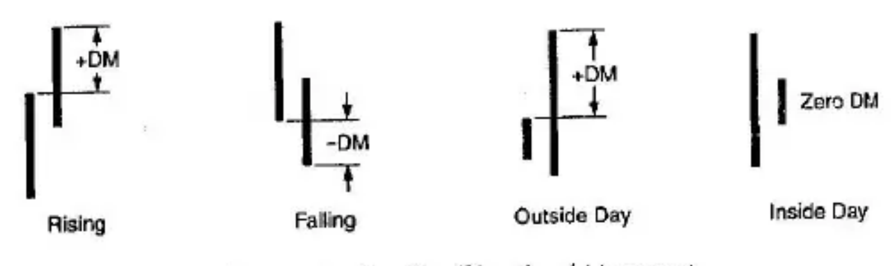

# Appendix A: Wilder's ADX

Many advances in the understanding of technical analysis occurred before the advent of the personal computer. One of the milestones was the publication by J. Welles Wilder in 1978 of *New Concepts in Technical Trading Systems* (see References). This book presented new indicators and trading techniques in spreadsheet form suitable for use with programmable calculators. This pioneering work of great stature has survived the test of time. Much of the content of this highly recommended book is still of prime value and in current use.

In this 1978 publication, Wilder said: "Directional movement is the most fascinating concept I have studied. Defining it is a little like chasing the end of a rainbow . . . you can see it, you know it's there, but the closer you get to it the more elusive it becomes." This feeling about directional movement persists today. Various investigators have tested Wilder's *DMI* techniques and their derivatives with varying degrees of success. The work of LeBeau and Lucas (see References) summarizes their own efforts and those of others.

Appendix A reviews in brief the *DMI* and *ADX* concepts of Wilder using his original notation as well as a method suggested by LeBeau and Lucas for using the *ADX*.

## ADX Formula Derivation

According to Wilder, the basic increment of directional movement is the largest part of today's range that is outside of yesterday's range. Using Wilder's notation, this is shown in Figure A-1 for a rising market with a $+DM$, a falling market with a $-DM$, and an outside day having both a $+DM$ and a $-DM$ (the largest of the two is retained), and an inside day for which $DM = 0$ is assigned. The notation $+DM$ signifies a directional movement up, whereas a $-DM$ stands for a down directional movement.

Wilder defines the true range to describe volatility as the largest of

1. The *difference* between today's high and today's low,
2. The *difference* between today's high and yesterday's close, or
3. The *difference* between today's low and yesterday's close.

The true range, $TR$, is a positive number.

Next, the Directional Indicator is calculated as $DI = DM/TR$ where $+DI = +DM/TR$ represents the percentage of the true range that is up for the day, and $-DM/TR$ is the percentage that is down for the day. Note: the $+$ and $-$ signs are labels to indicate positive and negative directions, *not* addition and subtraction.

Next, the true range is averaged over the past 14 days to obtain $TR_{14}$. Then the average over the same period of $+DM$s is taken to obtain $+DM_{14}$, and the average of the $-DM$s over 14-days produces $-DM_{14}$. With these values, Wilder then calculates the average upward directional indicator, $+DI_{14} = +DM_{14}/TR_{14}$, and a corresponding average downward directional indicator, $-DI_{14} = -DM_{14}/TR_{14}$.

Referring to the spreadsheet on pages 41–42 of Wilder's book, the absolute value of the difference between the up- and down-average directional indicators is formed as $DI\ DIFF = |(+DI_{14}) - (-DI_{14})|$ where the vertical enclosing bars indicate the absolute, or positive value. The sum is also calculated as $DI\ SUM = (+DI_{14}) + (-DI_{14})$, which is a positive value. (Remember, the $+$ and $-$ *DI*s are labeled to indicate up and down directions, *not* addition and subtraction.)

Next, the $DX$ or Directional Movement Index is defined by

$$DX = 100 \frac{(DI\ DIFF)}{(DI\ SUM)}$$

which can take on values from zero to $+100$. The $DX$ does not depend on the true range since it cancels out of the equation:

$$DX = 100 \frac{|(+DM_{14}) - (-DM_{14})|}{(+DM_{14}) + (-DM_{14})}$$

Finally, the average directional movement, the $ADX$, is calculated by taking an average of the 14-day period of the $DX$:

$$ADX = DX_{14}.$$

In effect, the $ADX$ uses a form of double smoothing.

## Interpretation

According to Wilder, the more directional the movement of a commodity or stock, the greater will be the difference between $+DI_{14}$ and $-DI_{14}$. You go *long* when $+DI_{14}$ crosses over $-DI_{14}$ and you go *short* when $-DI_{14}$ crosses over $-DI_{14}$. You only trade those markets that are high on a (positive only) $ADX$ scale. Methods of trading are discussed, where the use of the $ADX$ emphasizes amplitude.

LeBeau and Lucas review Wilder's work and that of others and conclude that the slope of the $ADX$ is of greater importance than its level. A rising $ADX$ indicates a strong trend is in process and that trend-following trading techniques should be used. They also conclude that a falling $ADX$ indicates a trendless market and that countertrend strategies (such as overbought and oversold strategies) should be applied. No action is best if you favor trend following.
