# Chapter 2: True Strength Index

Our interest in technical analysis is due to our interest in making money. Charts are a historical expression of the marketplace. If we can buy a stock or commodity at a low price and sell it later at a higher price, we will have made money. Easily said—but not so easily done. It is a simple matter to view a chart and, in retrospect, see trends. Although the trend is embedded in noisy variations and may whipsaw about, the brain has that wonderful faculty for smoothing out the fluctuations and casting aside the noise. This is great on historical data but not too useful for prices we have not yet seen. There are traders who can define trends by looking at price charts as they unfold; however, the great majority of people require additional assistance.

Enter the computer. The computer, or more correctly, the computer trading program can average out the noise and present us with smooth curves so that trends, up or down, may be more readily identified. This is generally accomplished using a moving average of price usually based on the close of each bar interval. If the chart is very noisy, more averaging is required to smooth it out so that the trend, if present, may be seen. However, since the averaging process takes time to perform, the existence of the trend will also take time to unfold. A rally, for example, could be well in process before it is indicated by the moving average. It is a fact that moving averages performed on prices produce *lag*. The longer the moving average, the greater the lag although the benefit is smoother response.

It seems the computer has helped us with the chore of determining the presence of a trend in a noisy environment, but at a cost—lag. We all have experienced the lag of very smooth moving averages by entering a trend late and losing the initial portion of the trend; we also have experienced giving back a portion of the profits by exiting a trend late.

## True Strength Index: TSI Formula

Figure 2-1 shows a bar graph of the S&P 500 Index, the celebrated "crash" of October 1987 with its True Strength Index plot below it. The True Strength Index (TSI) is a double-smoothed momentum indicator to be described shortly. Study the graphs closely. The TSI tracks the bar graph with little or no observable lag at major and intermediate turning points. The TSI graph is relatively smooth. An *exponential moving average* (EMA) is taken of the TSI and shown as a dotted Signal Line. When the TSI is above its Signal Line, the trend is up. A downtrend is indicated when the TSI is below its Signal Line.

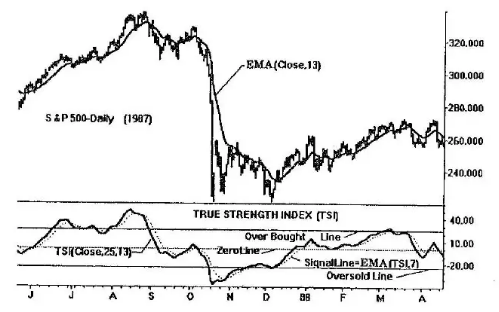

**Figure 2-1** Basic Configuration of the TSI

Although prices can theoretically range from zero to unlimited levels, the TSI can range only from −100 to +100. Historically, prices related to a TSI scale tend to come to extreme values and reverse above (or below) set thresholds. In the example of Figure 2-1, prices are said to be historically *overbought*, high prices that are ready for reversal or pause, above a TSI threshold set at +25. Similarly, prices are said to be *oversold*, low prices, at a TSI threshold set at −25. This characteristic of defining high or low price categories is useful for trading purposes.

The TSI formula is given in Figure 2-2. It deals with a quantity called *momentum*, which is further explained in Figures 2-3 and 2-4. The numerator of the TSI formula represents *double smoothing of momentum*. This means we take an exponential moving average (EMA) of momentum for r-days and obtain a result. We now take an EMA of this result for s-days. We have thus made two sequential exponential moving averages.

$$TSI(close, r, s) = 100 \cdot \frac{EMA(EMA(mtm, r), s)}{EMA(EMA(|mtm|, r), s)}$$

*In Numerator:*

- $mtm = close[today] - close[yesterday]$ (one-day momentum of the close)
- $EMA(mtm, r)$ = r-day EMA of mtm
- $EMA(EMA(mtm, r), s)$ = s-day EMA of EMA(mtm, r) (double-smoothing of mtm)

*In Denominator:*

- $|mtm|$ = absolute value of mtm
- $EMA(|mtm|, r)$ = r-day EMA of absolute value of momentum
- $EMA(EMA(|mtm|, r), s)$ = s-day EMA of EMA(|mtm|, r) (double-smoothing of absolute value of momentum)

*...The True Strength Index, TSI, is a "true" momentum indicator...*

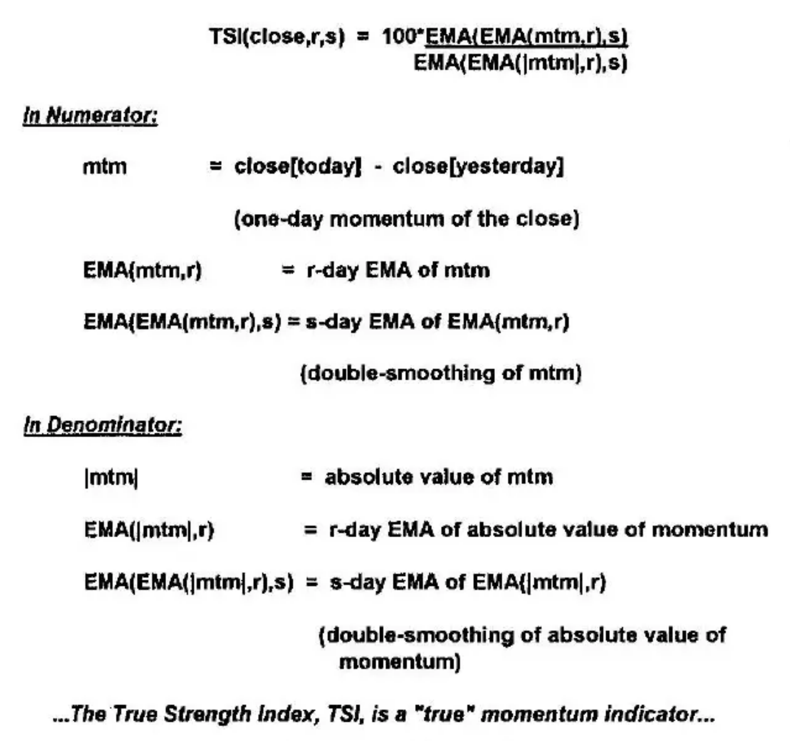

**Figure 2-2** TSI Formula

As we shall see later on, this simple procedure performed on momentum can give low lag, smooth curves which also show trending characteristics of prices. The denominator of the TSI is the absolute value (a value that can only be positive... no negative signs) of momentum and is double-smoothed. The purpose of the denominator is to compress the range of the momentum to +100 and −100. Double smoothing is indicated on charts by the 2-place notation, TSI(close,25,13), of Figure 2-1, which means the TSI is based on the close with a first smoothing of 25 bars and a second smoothing of 13 bars. Please note that the order of smoothing does not change the end values of the TSI formula.

It is not necessary to be a mathematician to use the TSI. Once the formula is set in your computer, the TSI can be used as simply as you use moving averages. The numerator of the TSI, double-smoothed momentum, may be calculated on most computers that permit the user to take moving averages.

## Momentum Defined: Properties

Figure 2-3 shows a portion of an idealized (smooth) price curve. Consider it to be a curve of the closes of the price bars drawn as a continuous curve. The curve is rising. It has an upward, or positive, *slope*. Momentum is defined so as to measure the slope of the price curve on a day-to-day basis. If today's close is C, and yesterday's close is C[1], then the 1-day momentum is defined as $mtm = C - C[1]$. In words, momentum equals today's close minus yesterday's close, the change in price over one day. With a rising curve, the momentum is a positive number shown graphically with an up-arrow.

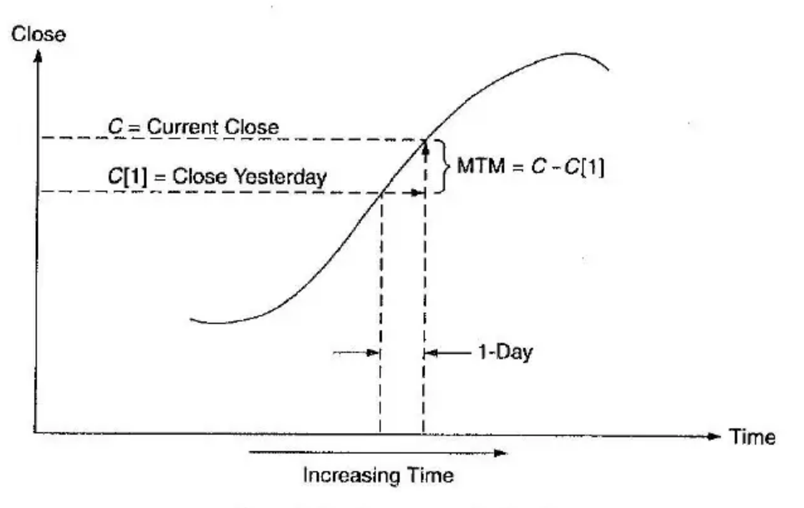

**Figure 2-3** Momentum Defined

Figure 2-4 depicts a number of different momentum situations. The curve shown has peaks and valleys with rising and falling sections. At point A, the price curve is rising and has positive momentum. At point B, the curve continues its upward ascent but at a slower pace. As a result, the 1-day momentum is smaller and is represented by the shorter upward arrow. Point D is the peak of the price curve, which is neither rising nor falling; at this point the curve has zero slope, or zero momentum. At point C, the price curve is going down; it has negative slope, negative momentum. The length of the downward arrow suggests the pace of the decline. Point E is a trough in the price curve. It has zero slope, zero momentum. Momentum has desirable properties for investing and trading: It expresses the direction of the market, shows the amount of movement or pace of the market, and highlights turning points.

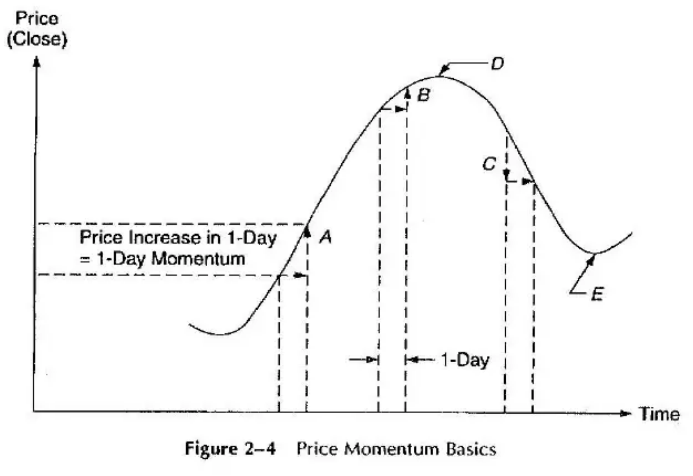

**Figure 2-4** Price Momentum Basics

## One-Day Momentum

Figure 2-5 is a bar graph of AMGEN on a long bull market. Below it is plotted the 1-day momentum, close today minus close yesterday, from November through May. In contrast to Figures 2-3 and 2-4, it is noiselike in appearance. This is the real world of noisy variations. The closes are not a smooth upward curve. The trend is up but successive closes are not straight up. Examination reveals that the successive closes are sometimes higher and sometimes lower; the momentum shifts rapidly from up to down and vice versa appearing on the chart as up and down zero-crossings. The net effect is that a rally has been in progress. If anything, however, it appears that going to a momentum description has made things worse—less recognizable—more noisy—more difficult to identify the trend.

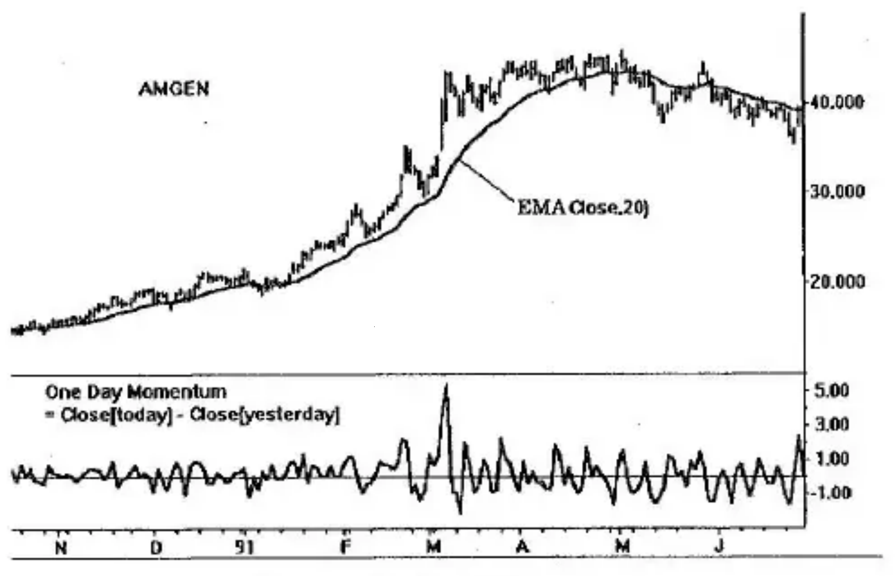

**Figure 2-5** One-Day Momentum

## Momentum Smoothing

In Figure 2-6, a moving average is applied to the 1-day momentum of Figure 2-5. The effect is pronounced. The response is shifted away from the zero line, above zero. The upward bias of the trend is immediately recognizable. Intermediate swings in prices on the uptrend may also be identified. Rapidly fluctuating noise variations are also preserved but appear on the "envelope," the slower varying shifted response, which represents the trend. The moving average has a beneficial effect—it has screened the slowly varying component that represents the trend; the moving average has performed a correlation process to ascertain the presence of the trend.

The desired result of applying a moving average to momentum data causes the trend line to vary slowly. The undesirable noise is still rapidly fluctuating. We wish to remove this noise without affecting the trend data. This is accomplished using a second moving average of short length as shown in Figure 2-7. Because of the short moving average, very little additional lag is introduced into the process. A comparison of Figures 2-6 and 2-7 shows that the trend and intermediate structure of the data are preserved and the noise is removed.

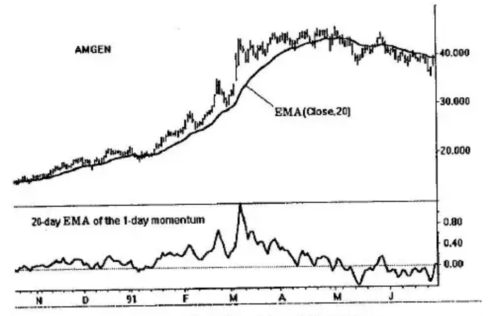

**Figure 2-6** Single Smoothing of Momentum

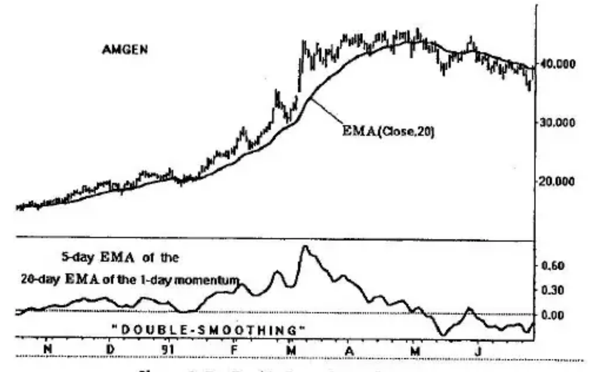

**Figure 2-7** Double Smoothing of Momentum

## Moving Averages

It is evident that moving averages play a key role in the development of indicators. What is a moving average? What is it that a moving average is actually performing? What are the effects of moving averages on prices when compared with moving averages on momentum?

Figure 2-8 shows a simplified explanation of the effect. The data on which a moving average is to be performed is a rectangular blip lasting 5 days, the top line of Figure 2-8. The moving average will have a length of 5 days as shown by the dotted moving window which is shifted in time over a 10-day interval. The rectangular window is shifted in time (to the right) so that its leading edge lines up with day 1. The shaded area on day 1 represents the overlap of the window with the data. The moving window is now incremented to day 2 (its leading edge lines up with day 2), and the overlap with the data is now observed to be twice as large. On the third day, the moving window is shifted in time by 3 days and the shaded overlap area with the data is three times as large as the first day. (The linear progression is unique to this example since we are dealing with rectangular data and a rectangular moving window of the same time duration.) The shaded overlap with the data represents the average performed by the moving window.

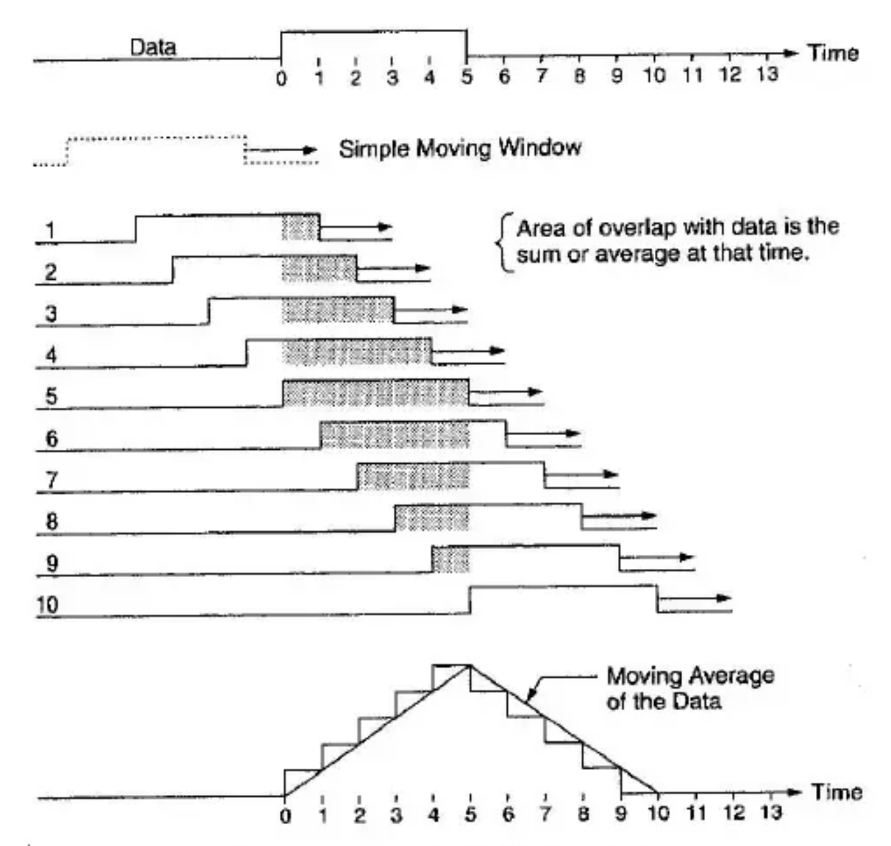

**Figure 2-8** Anatomy of a Moving Average

For each increment of time, there is a look-back of up to 5 days for making an average of all the data. The maximum look-back in our example occurs at day 5, at which time there is a complete overlap of the data, the largest average (largest shaded area). Progressing to day 6, the overlap area now diminishes. It further diminishes until at day 10 there is no longer any overlap with the data. The total day-by-day effect is summarized at the bottom of Figure 2-8 as an ascending staircase reaching its maximum value when the moving window completely overlaps the data. Thereafter with increasing time, the output of the moving average processing is a descending staircase.

What have we done with the moving average? The process of moving past one another in time and progressively averaging the overlap is the process of correlation, or convolution. We say that the data correlates well with the moving window when the data and moving window have similar appearance. When the shapes of the data and the moving window are identical (as in this example), we express this fact as perfect correlation. As the correlation increases, the moving average process (convolution) produces a larger more well-defined output, in this example, a definitive triangle.

Without going into great detail, consider what would happen if the data consisted of a train of short rectangles with successive rectangles going positive and negative. This is then to be correlated with a long positive rectangle as in our preceding example. In the moving average process, there will be days in which there is summing or averaging of positive and negative components, cancellations, so that a large well-defined output is not obtained. There is a lack of correlation of the data with the locally applied moving window, the moving average. Where correlation is lacking, the moving average rejects the rapidly fluctuating plus/minus train of rectangles—it "smoothes them out." The process of rejecting data not well correlated to the shape of the moving window is the process of smoothing the data. This is exactly what we do when we use a moving average on price data. The desired data more closely conform to our moving window than the noise fluctuations, which are removed by the moving average, or smoothing, process.

## Anatomy of a Rally: Price and Momentum

Our interest is in prices going up (or down) since it is in the change in prices that we make money. Figure 2-9 shows an idealized rally in prices and how it appears when subjected to the moving average process. The top line in the chart depicts prices at a constant level followed by a ramp, a rally at A, succeeded by prices at a constant level, B. In this simplified example, the moving window is a rectangle of time duration equal to the span of the rally, A. The result of performing the moving average is a rise with the rally but spread out over a time duration in excess of the time of the rally. The moving average reaches the end of the rise well after its actual completion: The moving average of the price rally is accompanied by lag.

In the lower panel of Figure 2-9, we examine the price rally when it is expressed in its momentum equivalent. Recalling that the one-bar momentum equals the price today minus the price yesterday, the momentum corresponding to the price rally at A is a rectangle. This is evident when we consider that successive prices during the rally at A are offset by the same amount giving rise to the flat momentum response during the rally. At the completion of the rally, the price plateau produces zero momentum since successive prices in this region have zero offset relative to each other.

A moving average (a moving rectangular window) is performed on the rectangular momentum, A. The result is immediately obtained as a triangular output (same as Figure 2-8). The triangle consists of a ramp, A, which rises in concert with the price rally. With the completion of the rally, a down ramp begins, B. The peak of the triangle marks the end of the rally. This idealized example shows zero lag suggesting that moving averages on momentum have a place in the description of prices.

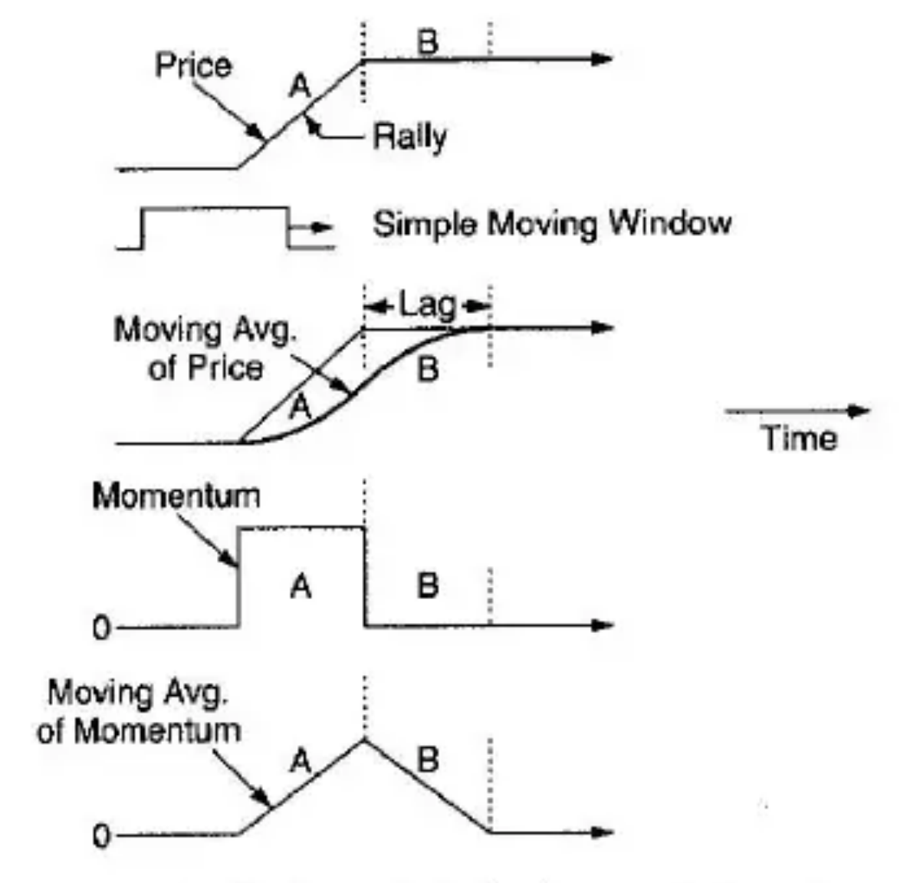

**Figure 2-9** Anatomy of a Rally: Price and Momentum

## Smoothed Momentum as a Proxy for Price

Moving averages performed on prices introduce lag. The longer the duration of the moving average, the greater is the lag. A 300-day moving average, for example, produces a tremendous amount of lag. A single moving average performed on the momentum of price behaves in an altogether different manner. By contrast, the longer the duration of the moving average on momentum, the lower is the lag. A 300-day moving average, for example, approximates a zero-lag situation. With emphasis, again: A large moving average on momentum produces low lag price determination.

Figure 2-10 displays this basic property of moving averages on momentum. The top panel is a plot of closing prices of the Deutsche mark. The middle panel refers to the numerator of the TSI termed the Divergence Indicator (DI) shown for single smoothing (see also Figure 2-2). A large interval 300-day moving average of momentum is seen to produce a curve that is a good approximation of price shape. The shape is also preserved for the compressed momentum, which defines the single-smoothed True Strength Index (TSI). If the vertical scales at the right side of the chart were absent, we would have difficulty in determining which was which: A large moving average of momentum provides an excellent stand-in for price—with the absence of lag. This is demonstrated in the enlarged view of Figure 2-11.

We can reason from a mathematics point of view that large moving averages of momentum (the first derivative of price, the close) have, in the limit, the exact shape of price. We would expect this because the largest possible moving average encompasses all of the available data. In this extreme situation, the moving average (or the moving sum) becomes a cumulative sum of the momentum—it is the mathematical integration of the first derivative, which is identical (except for a constant of integration) to the original curve, the price or close. Theoretically, there is an absence of lag with this very long moving average of momentum. In addition, the type of moving average is secondary, whether it is an exponential, weighted, or a perfectly uniform simple moving average. The proof of the foregoing is similar to the proof of the fundamental theorem of integral calculus found in first-year college calculus textbooks.

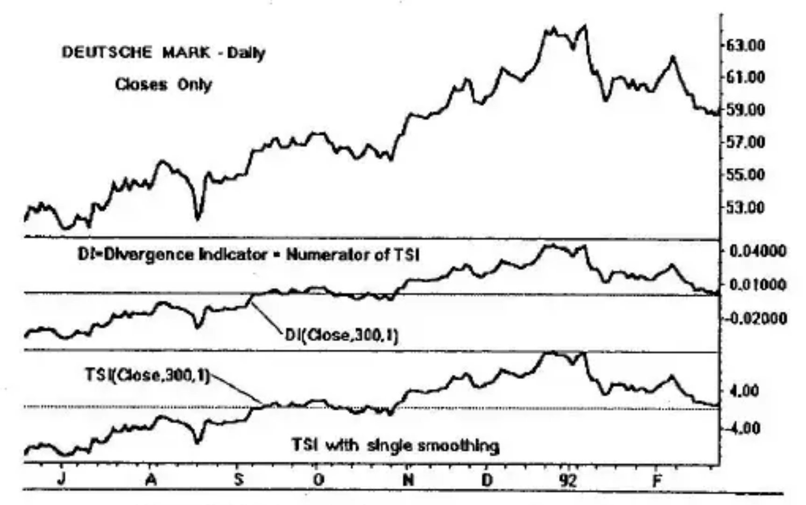

**Figure 2-10** Smoothed Momentum as a Proxy for Price

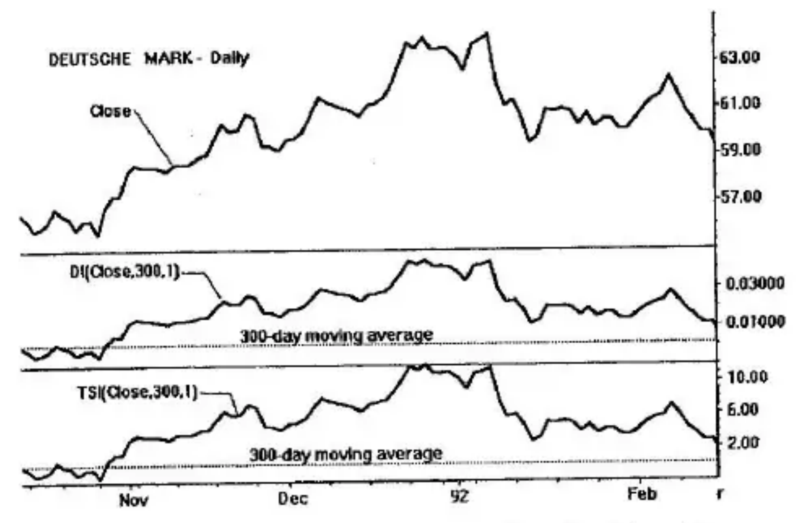

**Figure 2-11** Smoothed Momentum as a Proxy for Price: Enlarged View

## Double Smoothing of Momentum

Since the shape of momentum and price are approximately equal for a very large moving average on momentum, we may perform functions, or operations, on either price or large moving average of momentum with the same results, with the exception of a scale factor. This is shown in Figure 2-12 for a 5-day moving average performed on the close (top panel) and a True Strength Index with sequential smoothings of 300 days and 5 days, respectively. This then is the first blush of double smoothing: a noise-reduced, low-lag curve. The lag is that associated with the 5-day moving average. The shape of the TSI(close,300,5) approximates that of the 5-day EMA taken on the closes. We can think of double smoothing of momentum as an excellent proxy for price when one of the moving averages is very large.

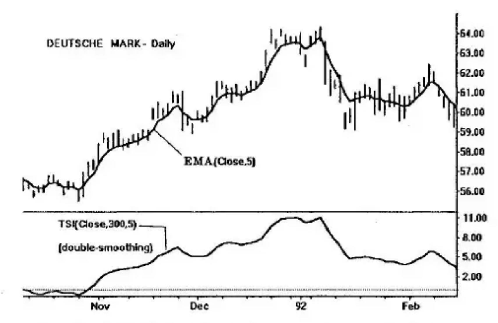

**Figure 2-12** Double Smoothing of Momentum: Very Long Moving Average

We may further reduce the duration of the moving average from a very large 300-day value to 20 days while maintaining the short duration moving average of 5 days as displayed in Figure 2-13. At this point, we have a somewhat lower lag situation indicated by earlier turning points P. The effect produces divergences with prices at A and B where they did not exist before. Divergences are seen to be a function of smoothing times. How is a divergence interpreted? It is a comparison of prices (closes) with momentum (or momentum indicator) of prices. Consider the down divergence at B. A peak in the TSI marks the beginning of the divergence. This peak has a corresponding close. A second lower peak in the TSI marks the end of the divergence, B. The corresponding close is flat or higher than its preceding close at the start of the process. There is a divergence from the direction of the momentum indicator, which is in a down direction. This down divergence of the TSI from its price often signals an imminent price change, flat or down. Divergences can give powerful signals. Care must be exercised in their use and interpretation since false indications occur often. These can be lessened by confining them to overbought or oversold regions of the momentum indicator. A major drawback of the price divergence is that it is not defined while it is being formed.

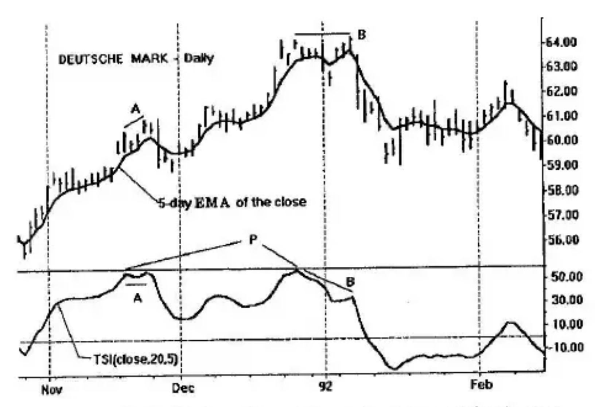

**Figure 2-13** Double Smoothing of Momentum: Short Moving Average

A further iteration now is to have both moving averages "large," or comparable. Typically, we are talking of spans such as 13,13, or 20,40, or 100,20. Our interest embraces more than just noise-cleaning. Our interest is in trending with respect to momentum as opposed to trending with respect to price. One of the advantages for the trader is that turning points in momentum often precede those in price. Another is the appearance of divergences, which often signal imminent price changes as shown in Figure 2-13. With the TSI, the user can assign number positions representing how "overbought" or "oversold" prices are, based on prior history.

We are accustomed to expect lag in dealing with moving averages directly on prices. Double smoothing of prices will experience a lag for each level of smoothing. Double smoothing of momentum of prices is a different phenomenon altogether. Only one of the smoothings will produce lag. The longer duration moving average is operative in reproducing an approximation to the shape of price, without lag. The shorter duration moving average is responsible for lag. These properties are useful in controlling the shape of trending momentum curves that are not available on price curves.

## Trading with the True Strength Index

The previous sections have described the properties and characteristics of double-smoothed momentum indicators using the True Strength Index as our test vehicle. It has been shown that double smoothing of momentum provides smooth and timely (low lag) price turning points and often can be used as a smoothed proxy for price. With these characteristics in mind, let us consider the TSI as it could appear as part of a trading system.

Our base system will be that of trend following. If we can determine when prices are trending, rising or falling, we then need a method of timing our entry to and exit from different levels of the trend. If the trend is rising, we wish to enter in the direction of rising prices—we wish to buy, and ideally when the trend direction changes, or ends—we wish to sell.

How do we define a trend? The first and obvious candidate for a measure of a trend is a moving average on prices. How do we determine our entry and/or exit points using the trend?

### The Ergodic Oscillator

For entry and/or exit, we may use a fast oscillator such as the Slow Stochastic. This indicator is one of the most popular today and much data and information about it is available in the open literature (see e.g., article by originator, George Lane, listed in References).

Since our exposition is about the True Strength Index, we shall employ a similar oscillator based on the True Strength Index called the Ergodic oscillator, or simply, the Ergodic. The oscillator consists of two parts: the Ergodic and its Signal Line given by

$$Ergodic(Close, r) = TSI(Close, r, 5)$$
$$SignalLine(Close, r) = EMA(TSI(Close, r, 5), 5)$$

The Ergodic is the double-smoothed TSI with one EMA smoothing fixed at five price bars. A further EMA smoothing by a fixed amount of five price bars produces its Signal Line. The Ergodic (with its Signal Line) is shown in the middle panel of Figure 2-14 for the daily Deutsche mark. For comparison, the Stochastic oscillator is displayed in the bottom panel.

Both oscillators have the same smoothing of r = 20 days. In mid-February, each oscillator crosses its respective signal line in a timely fashion indicating a down move in concert with the downturn of the moving average on the price chart. The oversold and overbought lines for the Stochastic are at 20 and 80. The oversold and overbought lines for the Ergodic are at −20 and +20. Both oscillators reach their thresholds at the same time. The Stochastic quickly "bottoms out" at an extreme oversold condition as the price decline continues into March. In March, the Stochastic and its Signal Line are compressed together with crossovers.

The Ergodic is more forgiving in its oversold region. In March, it also goes far into its oversold region, down below −80. Since its oversold threshold is at −20, there is ample room to move without compression. As a result, the Ergodic correctly registers the long decline in prices. Because the Stochastic rapidly traverses the distance between its compressed overbought and oversold regions, it is somewhat faster than the Ergodic for the same number of days of smoothing. However, it does have the compression problem with long rallies and declines, which is not so prevalent with the Ergodic. Otherwise most problems and cautions in the use of the Stochastic also apply to the Ergodic oscillator.

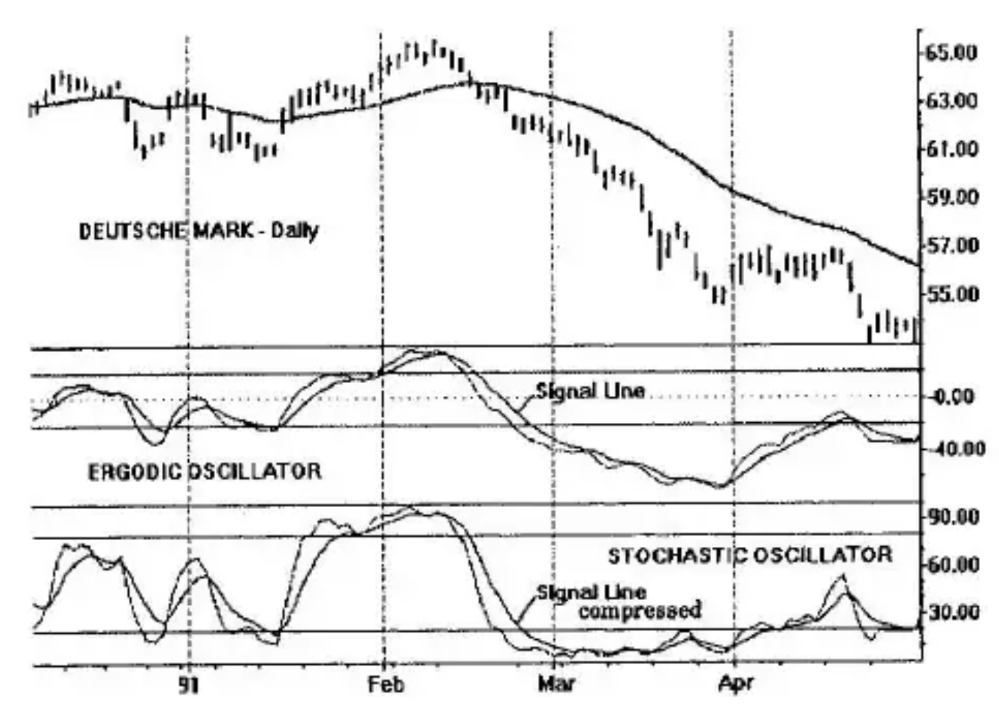

**Figure 2-14** Ergodic and Stochastic Oscillators

### Trading Ergodics with the Trend

We now have in place the basic elements of a trading system. The trend is defined by a moving average on price. The fast TSI, the ergodic oscillator, can provide the entry and/or exit points. We take a position when the slope of the trend, the moving average on price, and the slope of the Ergodic oscillator are in the same direction. We exit or stand aside when slopes are of opposite directions. A basic system demonstrating this principle is depicted in Figure 2-15 for the daily Deutsche mark. Possible rules for trading could be as follows:

**System 1**

1. Enter or hold a position only when the slope of the Ergodic Signal Line has the same direction as the trend.
2. Stand aside when the slope of the Ergodic Signal Line is in the opposite direction of the trend.
3. Enter or exit a position when the Ergodic and its Signal Line cross.

A variation of System 1 is:

**System 2**

1. Same as System 1.
2. Same as System 1.
3. Enter a position when the Ergodic and its Signal Line cross in the direction of the trend. See also (1).
4. Exit a position when the Ergodic reverses its direction.

A third variation of System 1 is:

**System 3**

1. Enter or hold a position only when the slope of the Ergodic Signal Line is in the same direction as the trend.
2. Exit a position or stand aside when the slope of the Ergodic Signal Line is in the opposite direction as the trend.

Other variations are possible. The following description of System 1 will demonstrate the general technique.

Referring to Figure 2-15, the EMA of the close is for 32 days; the Ergodic oscillator has a 32-day EMA. In early August, the Signal Line is first to slope downward followed by the 32-day moving average, the trend. We enter with a sell order at point A. Prices recede, and then at point A', the ergodic makes an upward crossover of its Signal Line and we exit the trade with a buy order. A downward crossover occurs shortly thereafter in early September. The trade if exercised would be a short position from B to B'. The trade may not be exercised since it occurs in oversold territory of the Ergodic.

The next trade starts at point C as the trend turns up. At this point, the Ergodic is already rising. The trade is completed at C' with a down crossover in the Ergodic oscillator. The next trade in the rally is a buy entry at D which is offset at a higher price at D'. The rally continues its upward journey commencing at point E going deeply into overbought territory—without compression. The exit is made at E'. An additional small jump up is made by the trade from F to F'. The last trade in the rally is made from G to G' just before the trend flattens out.

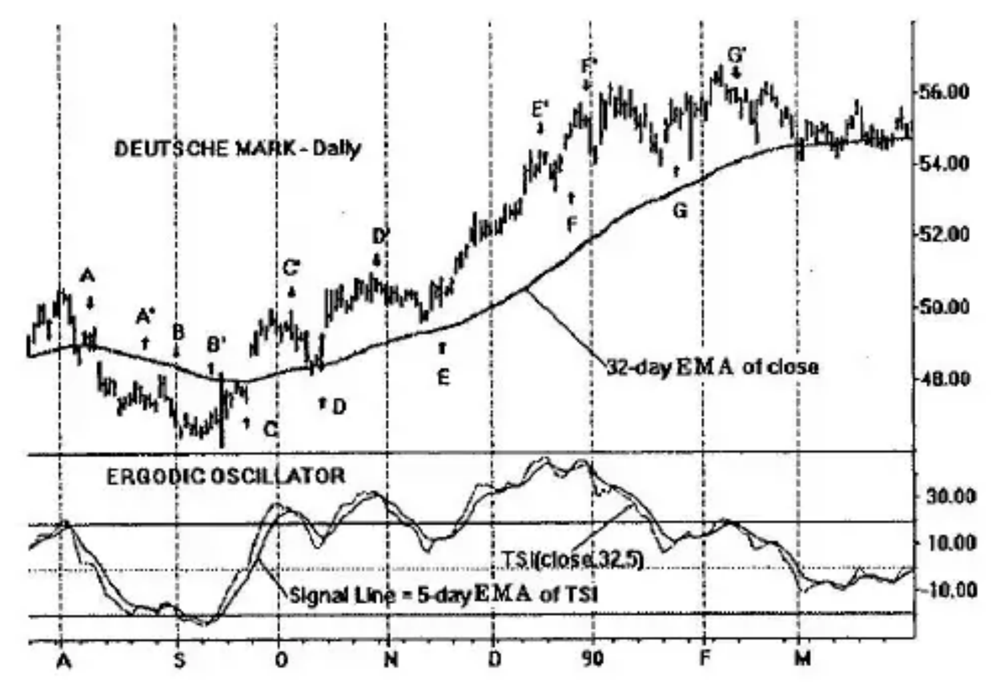

**Figure 2-15** Trading with the Ergodic Oscillator

### Trading Ergodics with a Slow TSI Trend

There are other candidates for the definition of the trend. Certainly the moving average on price qualified. What about a slow double-smoothed momentum indicator such as the True Strength Index? Refer to Figure 2-16, which shows a slow TSI(close,64,64) plotted against the daily Deutsche mark.

The main turning points in Figure 2-16 are evident with low lag despite the long moving averages of 64 days in each of the two smoothings. When the Deutsche mark trends, the slow TSI also trends. However, there is not always a one-to-one correspondence between price direction and TSI direction. This occurs in the first few months of 1990 when prices go into a trading range, a region of congestion. In these regions, the TSI continues to slope while prices are flat. This suggests that the double-smoothed momentum indicator may be an excellent smooth and timely substitute for price while prices are trending. While prices are in congestion, the indicator may not be entirely satisfactory as a substitute in its current form.

Using the slow TSI to define the trend presents special characteristics not available when a moving average on price is used to define the trend. Long moving averages based on momentum do not appreciably increase the lag of turning points as do those based on price. Long moving averages are required in trend definition for smooth and slowly varying transitions. A slow TSI trend has the property of specifying overbought and oversold regions based on historical data. In Figure 2-16, for example, the daily Deutsche mark tended to be in overbought territory when it exceeded a threshold of +15. Similarly, oversold territory corresponded to a region of the slow TSI that was less than −15. When the slow TSI trend exceeds these thresholds, it warns the trader of a possible reversal of prices, or the end of a price rally or decline based on previous history.

Other characteristics of great importance for trading are discussed in Chapter 7, "Directional Trending," and Chapter 8, "True Strength Directional Trending." Here we examine the trading possibilities of trading Ergodics going with a slow TSI trend as shown in Figure 2-17. We have selected an example that includes both a trading range and a deep trend to show the effect. Three systems may be considered as before with the moving average trend. The rules presented there remain the same except the "trend" is now produced by the slow TSI trend.

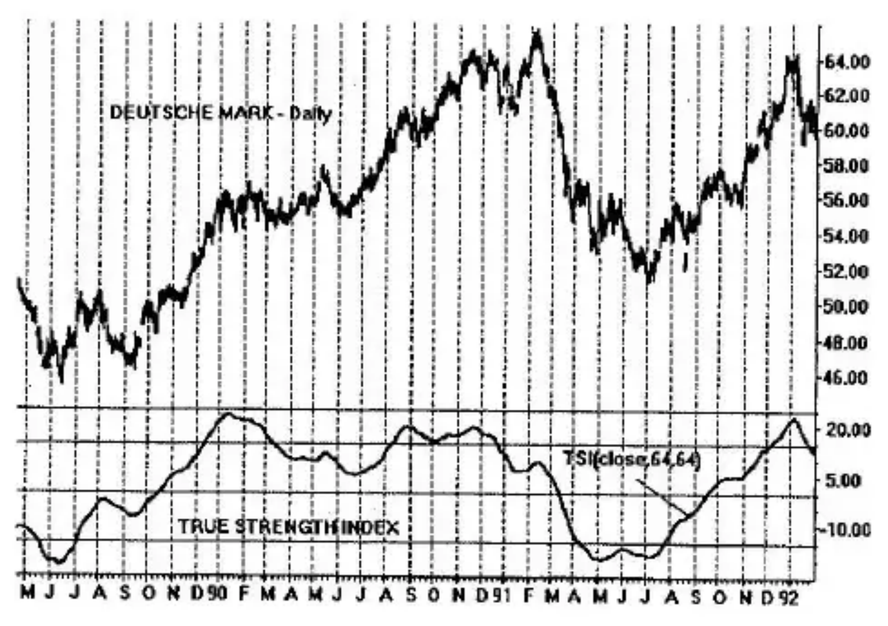

**Figure 2-16** Slow TSI Trend

The Deutsche mark chart shows a trading range from the beginning of November 1990 through January 1991. The slow TSI is in overbought territory so that caution should be exercised in taking a long position. We will always go with the trend using System 1 rules to demonstrate the effect of the trading range. The first entry is long at A which is offset at A' for a small gain. The second entry is short at B when the trend direction turns down, and the Ergodic is also down. This is quickly reversed on the Ergodic prompting an exit from the trade at B' for a small loss. The short trade from C to C' produces a small gain and the succeeding short trade from D to D' sustains a small loss. There are four trades with small gains and losses (excluding commission and slippage) due to the congestion regions in a 3-month interval. In mid-January, the (slow TSI) trend turns up, and we enter long at point E confirmed by the Ergodic, which had turned up earlier. The position is held until we are bumped out by a downturn in the Ergodic at point E'—a nice gain. At point F the trend turns down, and we enter short since the Ergodic is already down. We hold the position from mid-February until the beginning of April when the Ergodic ends the trade at F'.

Ideally we would like to eliminate the in-and-out trading that occurred in the congestion region because commission and slippage can add up.

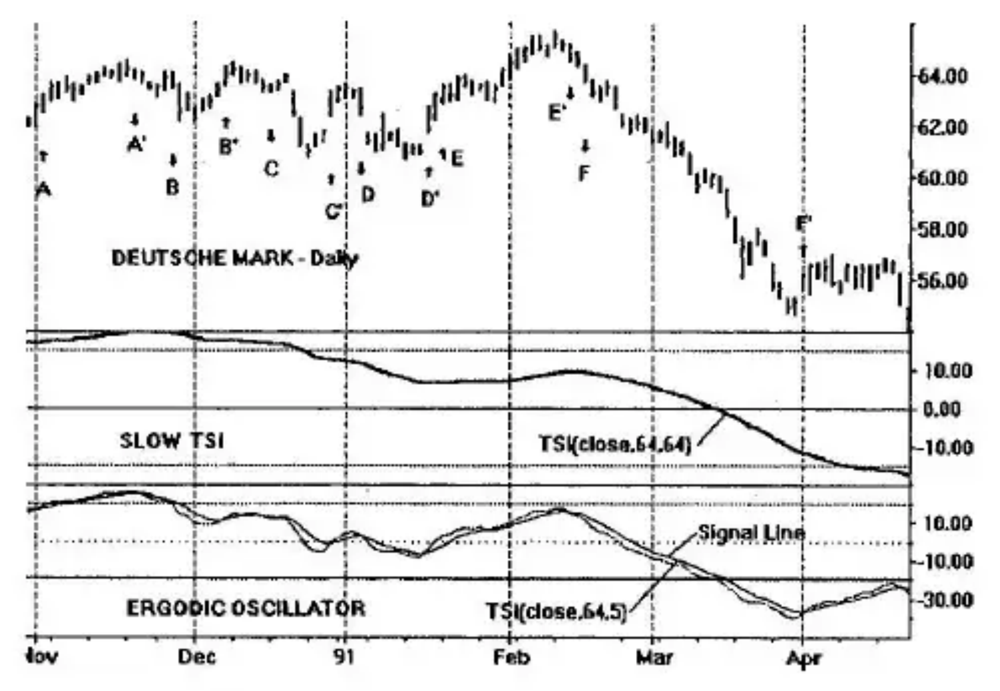

**Figure 2-17** Trading Ergodics with a Slow TSI Trend
