# Chapter 3: Stochastic Momentum

We begin this chapter by reviewing the very useful stochastic formulas attributed to and popularized by Dr. George Lane.

## Lane's Stochastics

There are two formulas: the Fast Stochastic and the Slow Stochastic. The unsmoothed (fast) stochastic formula is given by

$$k = 100 \cdot \frac{close - LL(q)}{HH(q) - LL(q)}$$

where

- $HH(q)$ = the highest high in the last $q$ price bars
- $LL(q)$ = the lowest low in the last $q$ price bars.

A graph of the 1987 DJ Industrials with the Fast Stochastic appears in Figure 3-1. The Fast Stochastic shown in the middle panel can vary over a range of zero to 100. It often oscillates rapidly between overbought and oversold regions with respective thresholds set at 80 and 20.

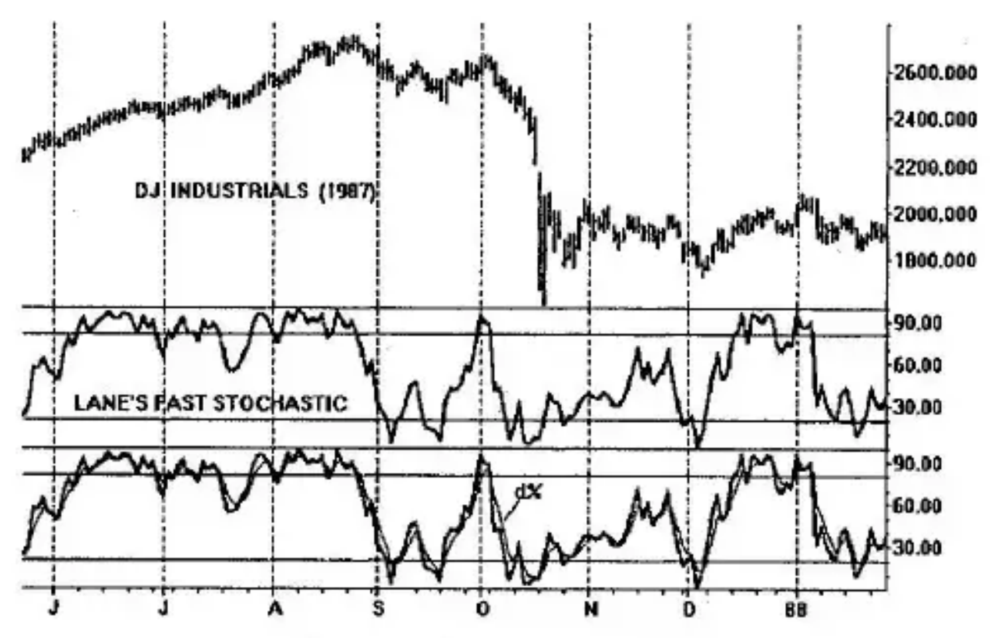

**Figure 3-1** Lane's Fast Stochastic

The indicator is seen to be very timely with turning points that often lead price turning points. The price paid for this desirable timeliness is noise giving rise to many possible false indications. A large amount of the noise is removed by using a crossover system based on the Fast Stochastic and a Signal Line, $d\%$, which is the 3-day simple moving average (SMA) of the Fast Stochastic. A buy action is indicated when the Stochastic crosses above its Signal Line. A sell action is indicated when the Stochastic crosses below its Signal Line.

Use of the 3-day Signal Line aids greatly in the reduction of false indications. However, false indications still occur too often. This prompts the use of an additional 3-day SMA smoothing as shown in Figure 3-2. The first smoothing is called the *Slow Stochastic*, $d\%$, which has its associated 3-day SMA Signal Line called Slow $d\%$. Observation of Figure 3-2 shows the useful smoothness and timeliness that is responsible for the Slow Stochastic's great popularity with traders.

One of the popular forms of the slow stochastic is given by

$$d\% = 100 \cdot \frac{SMA(3) \text{ of } (close - LL(q))}{SMA(3) \text{ of } (HH(q) - LL(q))}$$

where $SMA(3)$ is the 3-day simple moving average.

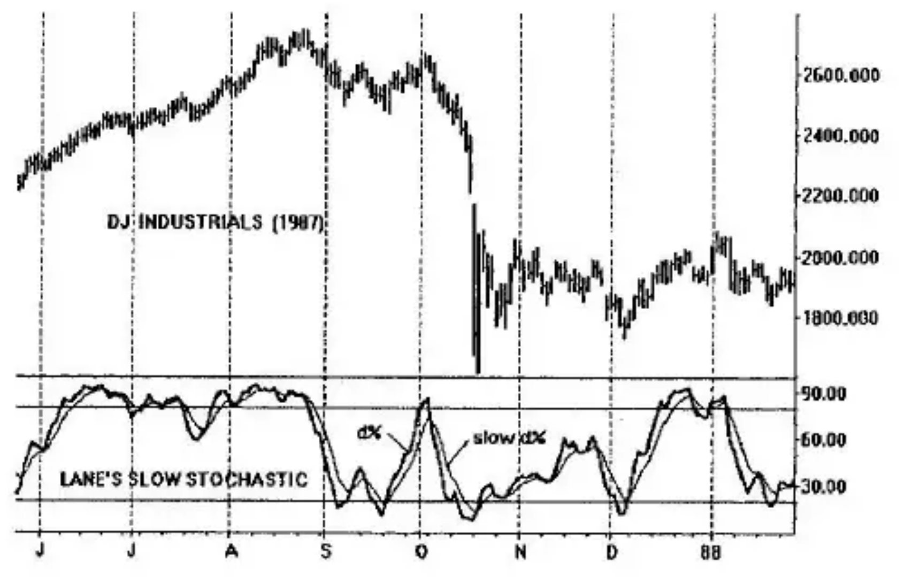

**Figure 3-2** Lane's Slow Stochastic

## Double-Smoothed Stochastics

We have observed the marked improvement of the slow stochastic over the fast stochastic. We shall explore this effect using a general formulation called the *DS-Stochastic* given by

$$DS(q,r,s) = 100 \cdot \frac{EMA(EMA(close - LL(q), r), s)}{EMA(EMA(HH(q) - LL(q), r), s)}$$

where

- $close - LL(q)$ = numerator of Lane's Fast Stochastic
- $EMA(close - LL(q), r)$ = r-day exponential moving average (EMA) of $close - LL(q)$
- $EMA(EMA(close - LL(q), r), s)$ = s-day EMA of $EMA(close - LL(q), r)$ = double (EMA) smoothing of numerator

and similarly for the denominator.

Figure 3-3 depicts a train of high, low, close, price bars. The dark bar on the right side describes the range, $HH(q) - LL(q)$, assumed by the price bars in a look-back of $q$-bars. The raw stochastic formula, $DS(q,1,1)$, represents where the current close is relative to the low point of the stochastic range. A close near the upper portion of the range will be near the highest high in the most recent $q$-bars.

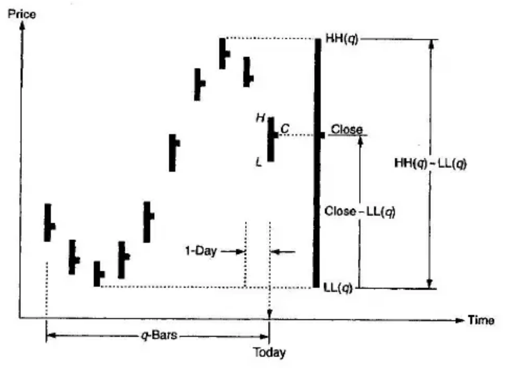

**Figure 3-3** DS-Stochastics

## Stochastic Momentum

Figure 3-4 shows the same train of high, low, close price bars but with different notation. The stochastic range remains unchanged. The close, however, is now referenced to the midpoint $0.5 \times (HH(q) + LL(q))$ of the range.

The distance of the current close from the midpoint defines *stochastic momentum* as

$$SM(q) = close - 0.5 \times (HH(q) + LL(q)).$$

As a momentum, $SM(q)$ takes on positive and negative values. The magnitude of the momentum is determined by how large a displacement there is of the close relative to the midpoint of the range. When the close is greater than the midpoint of the range, the stochastic momentum is positive. The largest plus value occurs when the close equals $HH(q)$. The stochastic momentum takes on negative values when the close is less than the midpoint having its greatest negative value when it is equal to the lowest low of the past $q$-bars.

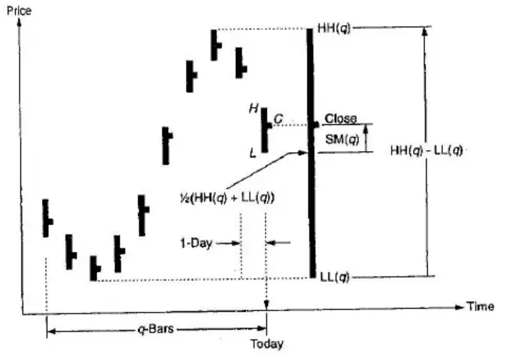

**Figure 3-4** Stochastic Momentum, $SM(q)$

A comparison is made in Figure 3-5 between the close momentum and stochastic momentum. "Close momentum" is the close, 20 days ago, subtracted from today's close. With stochastic momentum, a function of the close 20 days ago is subtracted from today's close. The similarity between the two is evident in Figure 3-5.

## Stochastic Momentum Index

Embracing stochastic momentum, the *Stochastic Momentum Index* (SMI) is now formulated as:

$$SMI(q,r,s) = 100 \cdot \frac{EMA(EMA(SM(q), r), s)}{0.5 \cdot EMA(EMA(HH(q) - LL(q), r), s)}$$

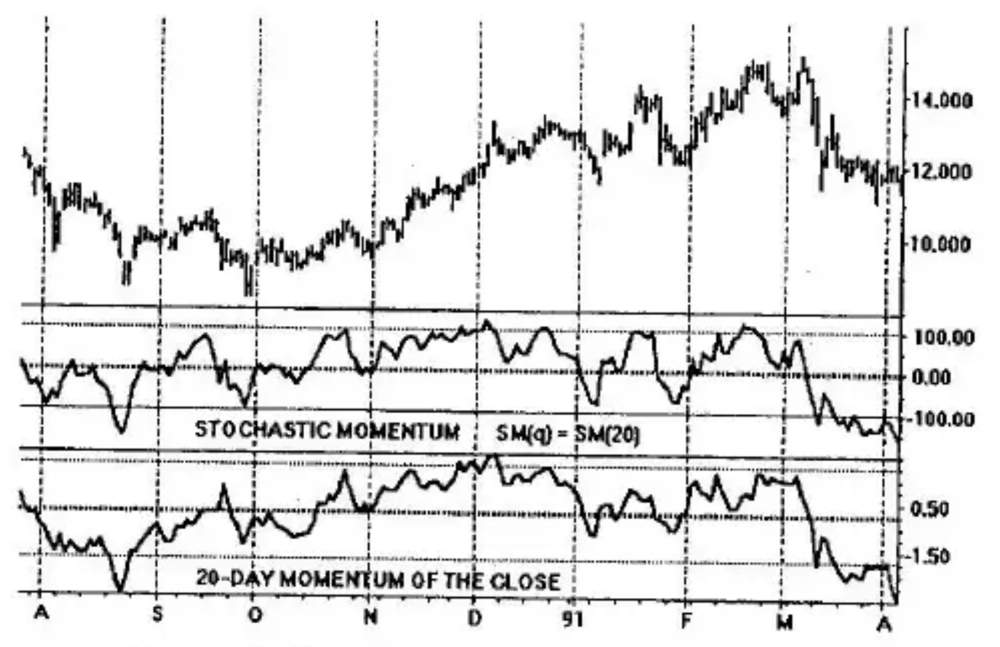

**Figure 3-5** Close Momentum versus Stochastic Momentum

where $SM(q)$ is Stochastic Momentum with a $q$-day look-back. The SMI is the bipolar (plus, minus) form of the DS-Stochastic which is always greater than zero. Both have the same shape.

The basic configuration of the Stochastic Momentum Index is shown in Figure 3-6 for a $q = 13$-day look-back with an EMA smoothing of 25 days. The indicator maps prices into a corresponding range from −100 to +100 on its scale. Prices are considered to be at "high" levels when the indicator is above its threshold overbought line (here set at +40). Prices are said to be at "low" levels when the indicator is below its threshold oversold line (here set at −40). The Signal Line shown is the EMA of $SMI(q,r,s)$. It is normally in the range of 3 to 12 bars. When the SMI is above its Signal Line, a price uptrend is indicated; a downtrend is defined when the SMI is below its Signal Line.

Double smoothing in the Stochastic Momentum Index $SMI(q,r,s)$ is obtained by using any two of the $q,r,s$ parameters while holding the remaining parameter fixed. Smoothing is readily evident in the $r,s$ parameters because they represent direct exponential moving averages. Smoothing is also intrinsic to the $q$ parameter describing Stochastic Momentum, $SM(q)$. See Figure 3-7 for the smoothing effect of the cumulative sum of the Stochastic Momentum. The result is comparable to taking an EMA of the close.

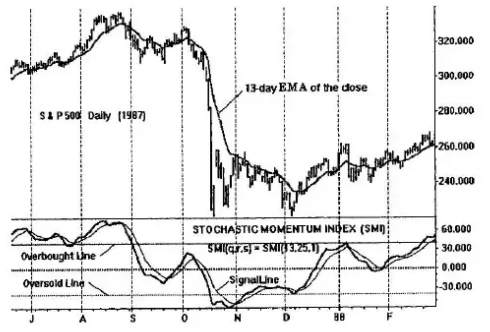

**Figure 3-6** Stochastic Momentum Index: Basic Configuration

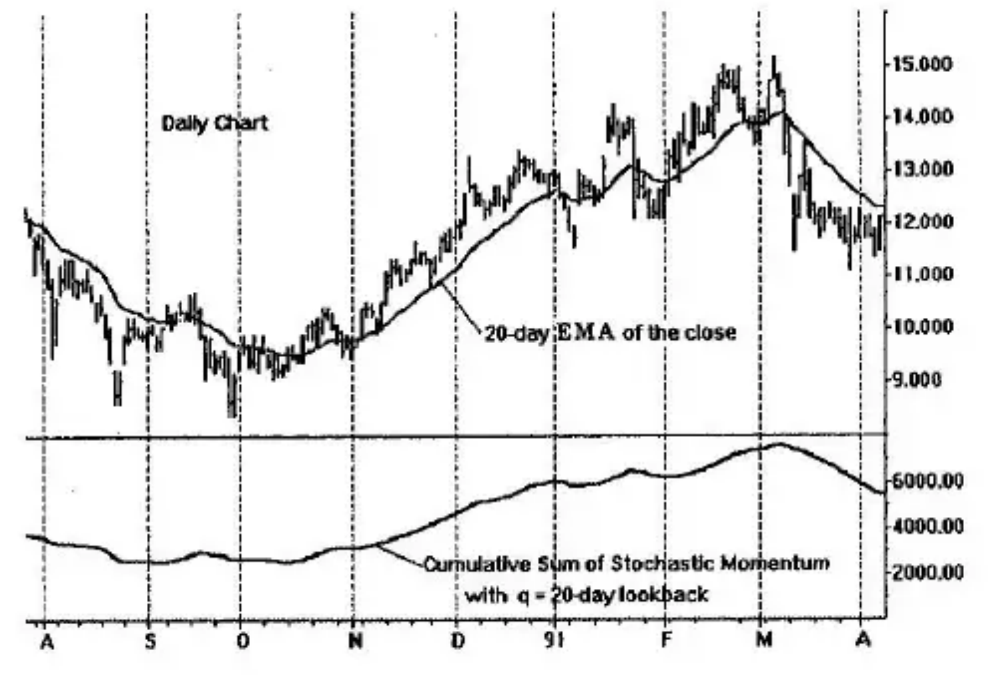

**Figure 3-7** Smoothing Effect of Stochastic Momentum

## Stochastic Momentum as a Proxy for Price

When the Stochastic Momentum is taken over a very large interval ($SM(q)$ where $q$ is a very large number), the Stochastic Momentum takes on the characteristics of price shape. Figure 3-8 shows the stochastic momentum, $SM(300)$ for $q = 300$, in the middle panel. This is the numerator of the Stochastic Momentum Index that is graphed in the bottom panel. It is observed that the shapes of panels are essentially the same. The SMI provides a +100 and −100 amplitude normalization. If the number scales on the right of the charts had been omitted, a user would be hard pressed to determine which was the close curve and which was the Stochastic Momentum.

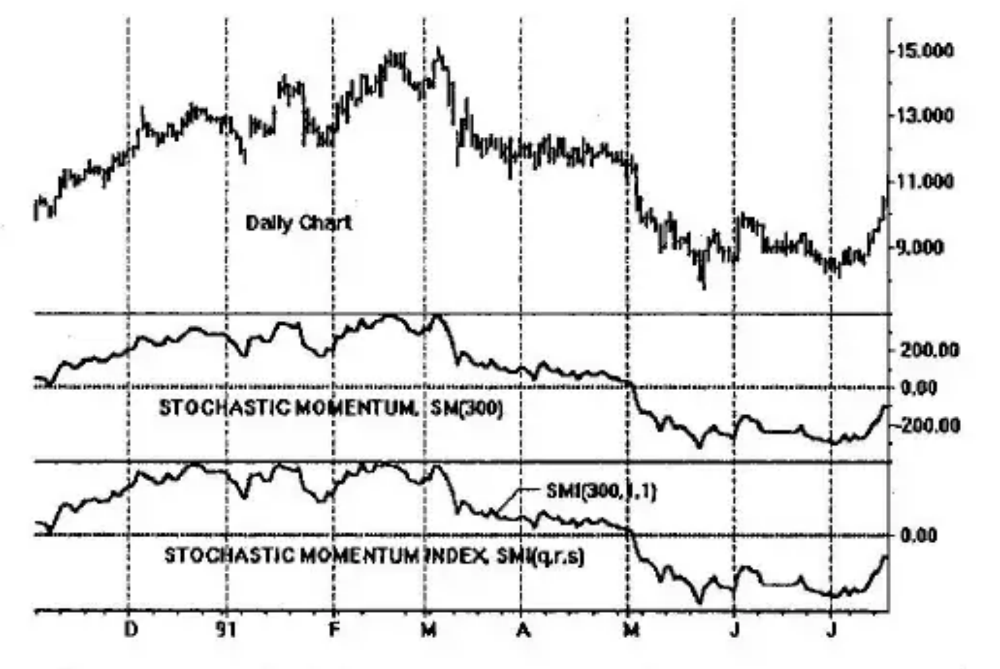

**Figure 3-8** Stochastic Momentum as a Proxy for Price: Very Large Interval

Figure 3-9 shows the large-interval Stochastic Momentum (the first "smoothing" for $q = 300$-day) with a second (EMA) smoothing of 5 days. The result is a stripping away of the high frequency noise fluctuations producing a smoother curve. Because a short-duration EMA is employed, the introduction of lag (delay due to moving average effects) is minimal.

Figure 3-9 shows double smoothing using the parameter pair: $q,r$. The only lag introduced was due to the $r$-day EMA. The $q$-day Stochastic Momentum did not (ideally) produce any lag although $q = 300$ is a very large number of days. This is a very important characteristic of double-smoothed momentum indicators: Generally, one of the smoothing functions will be of long duration; the other will be of shorter or equal duration. Only one will (ideally) introduce lag. This is certainly not the case when moving averages are taken on price: A 300-day span for a moving average on price produces a great deal of lag. This feature of double-smoothing of momentum indicators is fundamental to their timeliness and smoothness as indicators for stocks and commodities. Two of the most popular indicators in current usage are the Slow Stochastic and the MACD (moving average convergence divergence), which both use double smoothing.

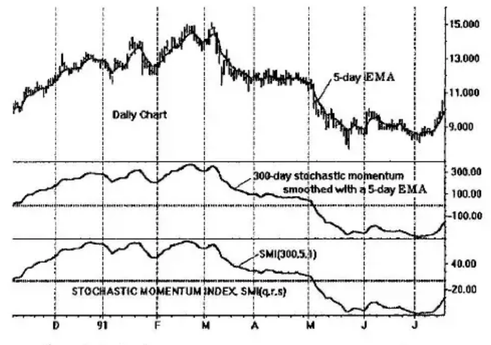

**Figure 3-9** Stochastic Momentum Smoothing for Noise Reduction

Normally, the very long time spans of 300 days are rarely used. Figure 3-10 shows a stochastic of $q = 20$-days with $r = 5$ days of EMA smoothing. (With $s = 1$, the pair: $q,r$ provides double smoothing.) The Stochastic Momentum, after double smoothing, is seen (middle panel) to be timely and relatively free of noise variations. The $SMI(q,r,s) = SMI(20,5,1)$ is noted to be similar in appearance. Divergences appear when smaller time spans are used. A down divergence is identified with points A and B, or A and C, indicating a possible end to the price rally. An up divergence is noted by points H and J, or H and K. Except for the regions F and G, the shapes of the middle and bottom panels are almost identical.

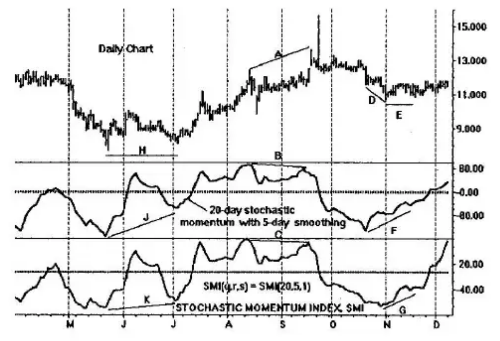

**Figure 3-10** Stochastic Momentum Smoothing: Shorter Interval

The Slow Stochastic and the Stochastic Momentum Index are compared in Figure 3-11. They approximate each other closely in terms of shape. The small disparity between the two shapes is due to the use of an exponential moving average (5-day) in the SMI versus a simple moving average (3-day) in the slow stochastic.

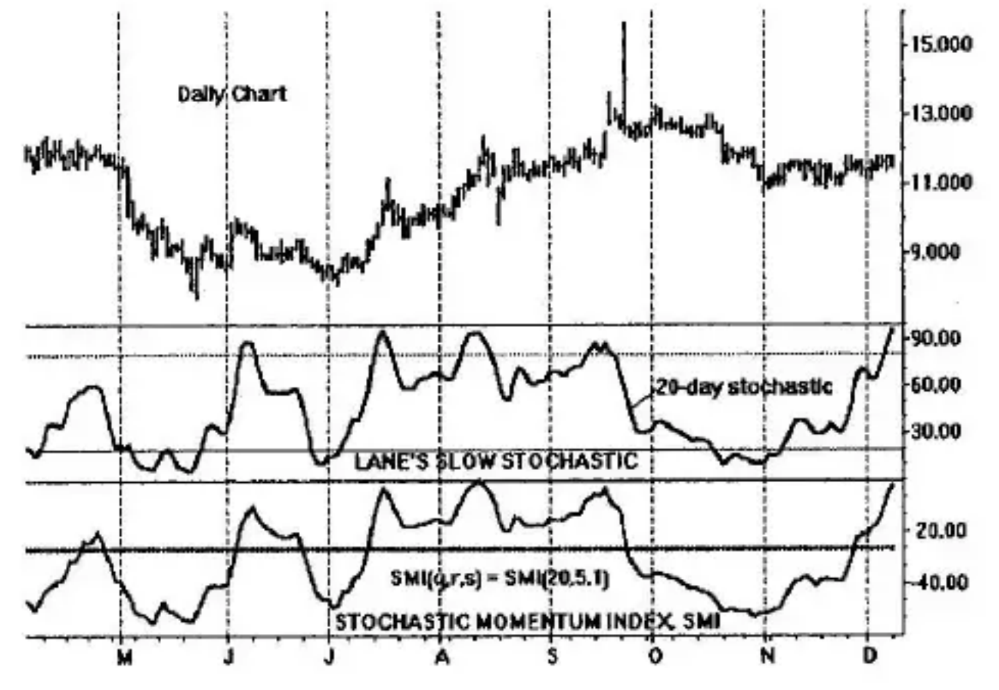

**Figure 3-11** Slow Stochastic and Stochastic Momentum Index

A departure from the Slow Stochastic is made in Figure 3-12 by increasing the EMA smoothing interval from 5 days to 20 days producing $SMI(q,r,s) = SMI(20,20,1)$. The Stochastic Momentum Index now appears to trend as prices trend. (The Slow Stochastic is included for the purpose of comparison). The major turning points are highlighted in a timely manner with lag less than, or equal to, that produced by the same moving average applied directly to price. Divergences now clearly appear at B, C, D, E, and F. A continuing divergence from the beginning of B to C signals the end of a price rally, or the beginning of a decline.

At A, the slope of the SMI trends up with prices. At A, the Slow Stochastic remains noisily flat in an overbought region. As shown, the Stochastic Momentum Index is slowly varying showing price trends, major turning points and labeling of turning points by way of divergences with price.

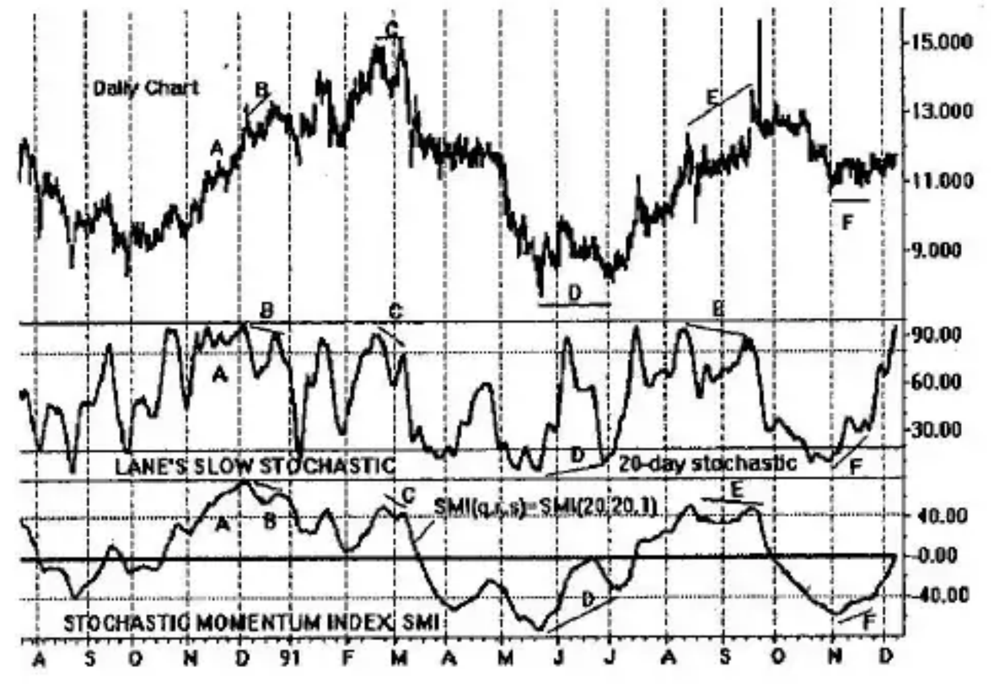

**Figure 3-12** Increasing the EMA Smoothing Interval

The Slow Stochastic may now be used as an entry (or exit) vehicle for trading . . . with the Stochastic Momentum Index defining the trend in prices. An example of this approach can be seen in Figure 3-13 for $SMI(q,r,s) = SMI(20,60,1)$ defining the trend and a 20-day Slow Stochastic. Note the smoothness of the SMI, by increasing the EMA period to 60 days, with essentially very little additional lag introduction at the major turning points. Divergences on the SMI now exist only at D and G. The divergences that were at B, C, E and F are now absent. The major turning point in March is keyed by the long divergence G and is further supported by the Slow Stochastic divergence at C.

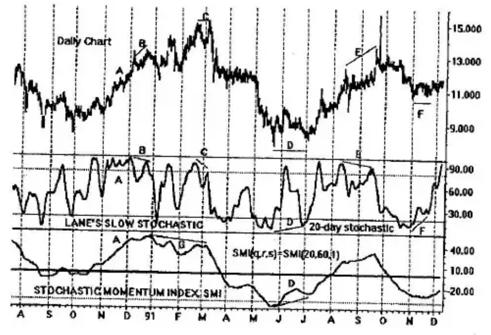

**Figure 3-13** Further Increase of the EMA Smoothing Interval

Long trends are often troublesome to those indicators that are inherently oscillators. Broadly speaking, when the duration of the trend exceeds the indicator's natural period of oscillation, the indicator may not properly show the direction of the trend. In the middle graph of Figure 3-14, $SMI(q,r,s) = SMI(20,20,1)$ is timely and smooth. However, it gives erroneous indications of the trend when the price trend is of very long duration. Starting in April, it indicates an uptrend while, in fact, prices continue to decline. The bottom panel of Figure 3-14, $SMI(20,150,1)$ removes the error so that the indicator again trends correctly with price. Timeliness and smoothness are present with very little additional lag. The lag is determined by the smallest value of $q$ and $r$ in the Stochastic Momentum Index, $SMI(q,r,1)$. The turning points to be retained, the major turning points, are filtered by the largest value of the double smoothing $(q,r)$ parameters. In Figure 3-14, the anomaly of having a downtrend in prices erroneously indicated is corrected by increasing the $r$ parameter from 20 to 150.

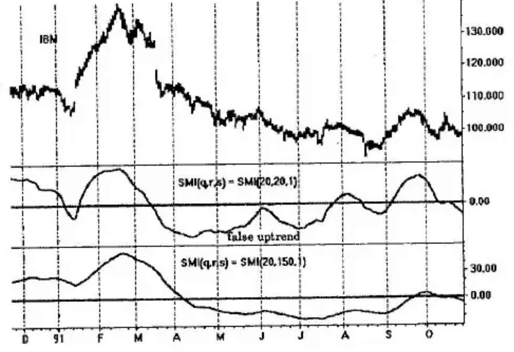

**Figure 3-14** Long Trend Anomaly

## Two-Day Stochastics

When $q = 2$, there are two price bars in the look-back period as shown in Figure 3-15. The Stochastic Momentum for two price bars is

$$SM(2) = close - 0.5 \times (HH(2) + LL(2)).$$

To determine if the 2-day stochastic is a reasonable proxy for price, a large (800-day) moving average is used in the Stochastic Momentum Index, $SMI(q,r,s) = SMI(2,300,1)$. Comparison with the price chart on Figure 3-16 reveals it to be an excellent substitute for price.

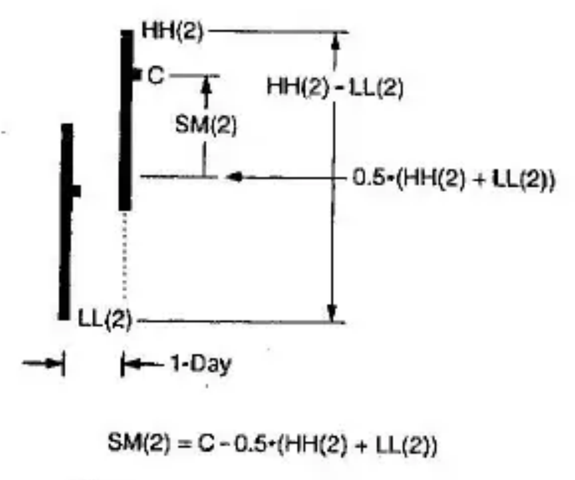

**Figure 3-15** Two-Day Momentum

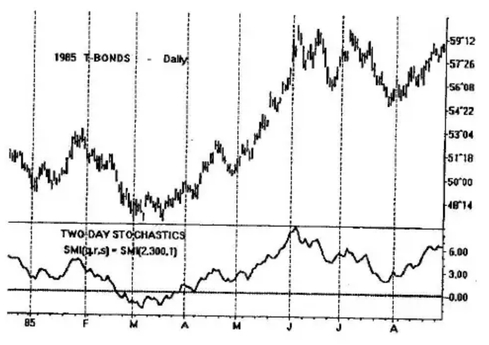

**Figure 3-16** Two-Day Stochastics

An example of 2-day stochastics is shown in Figure 3-17 for Treasury bonds where $SMI(q,r,s) = SMI(2,25,12)$. The fixed parameter is $q = 2$. The two-variable parameters for double smoothing are the $r$-day EMA, which is subsequently smoothed by an $s$-day EMA. The effect of the double smoothing is to remove high-frequency fluctuations obtaining a relatively smooth trending curve. The curve is seen to be timely (low lag) with access to major turning points in prices. The timeliness is noteworthy when compared with a similar 12-day exponential moving average on the close.

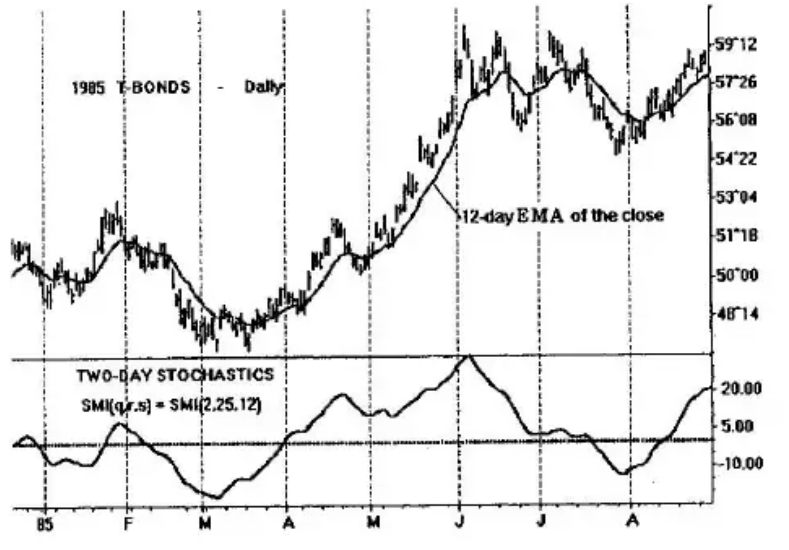

**Figure 3-17** Two-Day Stochastics on T-Bonds

An interesting situation is depicted in Figure 3-18: the effect of a key reversal pattern. A key reversal occurring in mid-September produces a 2-day Stochastic Momentum Index (SMI) that has a curve markedly different from a True Strength Index (TSI) curve both using the same smoothing parameters. The $TSI(close,40,20)$ tracks the close-to-close price curve while remaining unaffected by the key reversal. However, the long spike of the key reversal has a dramatic response with the 2-day $SMI(2,40,20)$. This is to be expected because 2-day stochastics are very sensitive to the location of the close relative to the extreme prices today and yesterday. Note the sudden drop in the response of the $SMI(2,40,20)$ detecting the presence of the key reversal pattern.

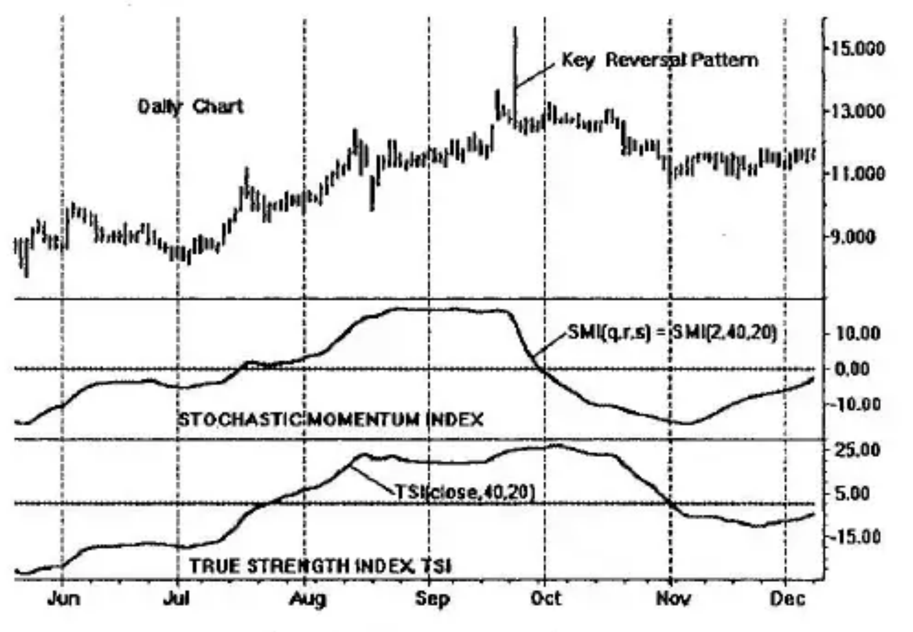

**Figure 3-18** Key Reversal Pattern

### The Two-Day Stochastic Oscillator

Lane's slow stochastic is an oscillator based on the past $q$-days. (See $d\%$ formula at beginning of chapter and Figures 3-1 and 3-2). Can we devise a stochastic oscillator based on the Stochastic Momentum Index with a $q = 2$-day look-back? The answer is yes. Is the response different from Lane's stochastic oscillator? Again, the answer is yes.

Let us define the 2-day stochastic oscillator and its associated signal line by:

$$\text{2dStochastic}(r) = SMI(2,r,5)$$

$$\text{2dSignalLine}(r) = EMA(SMI(2,r,5), 5)$$

The 2-day stochastic is defined for $SMI(q,r,s) = SMI(2,r,5)$ where a fixed look-back of 2 days is used and a fixed EMA smoothing of (nominally) $s = 5$ days is invoked. This again is double smoothing. The Signal Line is defined as the 5-day EMA of the 2-day stochastic. The use of a 5-day EMA is arbitrary depending on volatility of price conditions. The range of the EMA will generally fall between 3 and 12 days.

A plot of the 2-day stochastic with $r = 32$ and a 7-day EMA Signal Line is shown in Figure 3-19 for the daily Deutsche mark. Lane's 32-day Slow Stochastic and the Ergodic oscillator (based on the True Strength Index, TSI) with a 7-day EMA Signal Line are also shown for comparison. It is apparent that the 2-day stochastic oscillator and the Ergodic oscillator are similar to each other: Both track prices smoothly and timely (low lag) as prices trend and change direction. The slow stochastic is somewhat more timely but registers compression effects. As prices trend up from points A to B, the slow stochastic is in its overbought region noisily intertwined with its signal line.

Prices decline from B to C. The 2-day stochastic and ergodic also decline going below their signal lines. The slow stochastic also declines but not smoothly: It oscillates above and below its signal line as it declines. Prices decline further between points C and D and are appropriately indicated by the 2-day stochastic and the Ergodic. The Slow Stochastic is now registering a flat response in its oversold region: Compression again. As shown in Figure 3-19, the Slow Stochastic would generate many false trades in a compression region such as A to B.

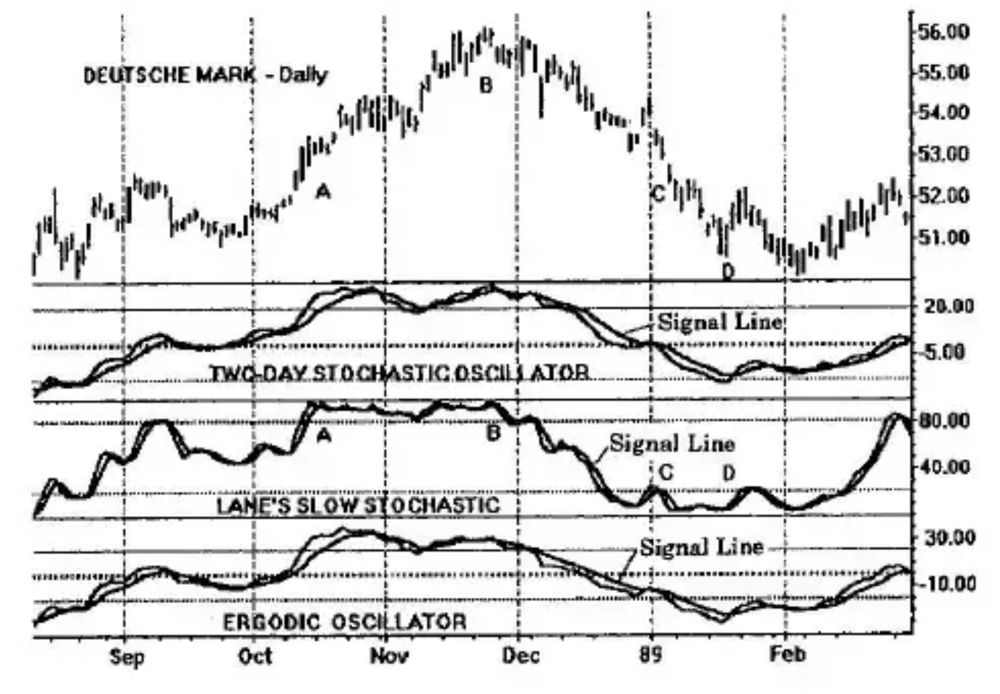

**Figure 3-19** Two-Day Stochastic Oscillator

Trading with these oscillators can be as described in Chapter 2 for the Ergodic oscillator. The simplest policy, for example, could be to buy when the oscillator crosses above its signal line and to sell when the oscillator crosses below its signal line, subject to other trading system constraints. The Ergodic and 2-day stochastics do not exhibit compression effects to the extent of the Slow Stochastic and consequently generate fewer false trades.

## One-Day Stochastics

The Stochastic Momentum Index for $q = 1$ is shown in Figure 3-20. When $q = 1$, the stochastic momentum is defined within the highest high and lowest low of the day:

$$SM(1) = close - 0.5 \times (high + low).$$

The Stochastic Momentum Index becomes:

$$SMI(1,r,s) = 100 \cdot \frac{EMA(EMA(SM(1), r), s)}{0.5 \cdot EMA(EMA(high - low, r), s)}$$

The 1-day stochastic is sensitive to the location of the close relative to the high and low of the day. The 1-day stochastic is an excellent substitute for price when a (single-smoothed) 300-day EMA is taken, $SMI(1,300,1)$. Double smoothing provides smooth and timely indications of price. Applications of the 1-day stochastic include day trading, where the trader does not hold a position overnight. When opening gaps are present, close-to-close indicators such as the True Strength Index, or the MACD, will register the gap and affect the response curve for many subsequent bars from the opening. The 1-day stochastic is unaffected by the opening gap and thus is an excellent tool for the day trader.

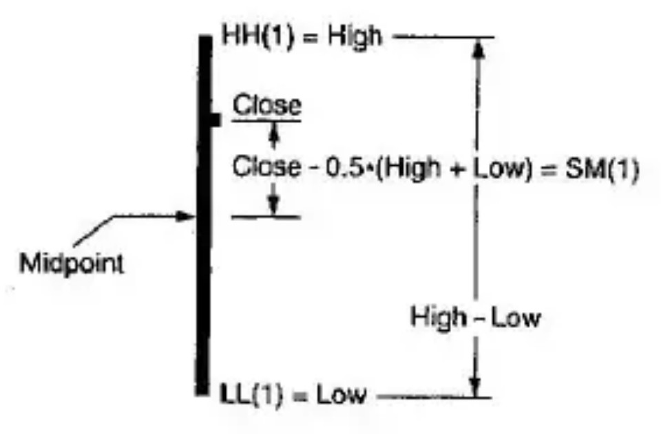

**Figure 3-20** One-Day Stochastic
