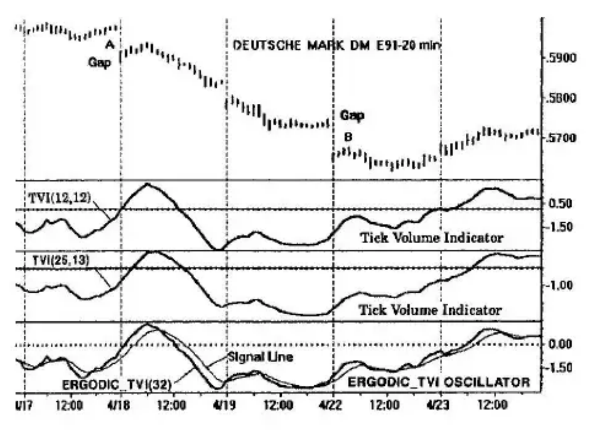

# Chapter 4: Tick Volume Indicator

Tick data is a continuous stream of prices representing all transactions between buyers and sellers. It gets its name from the ticker tape. Within a specified time interval, the number of transactions may be large or small depending on market activity. And, market activity may be defined in terms of the volume of ticks. A particular transaction is considered to be an *uptick* if its price is higher than the price of the preceding transaction. Similarly, if the price of a transaction is lower than its preceding transaction, it is defined as a *downtick*. If all the ticks are up (all prices are always higher in a 20-minute interval), the close of the high-low bar will most certainly be at the high. Generally, this is not the case, and in any particular interval, the tick volume will be split between upticks and downticks.

Indicating the frequency of upticks and downticks within the high-low bar, or time period, is useful information for the day trader. The problem is gaps at the opening for intraday markets. For example, an indicator based on the close will register a strong reaction to an opening gap since the close for the previous day is largely displaced from today's close of the opening bar. The gap will bias the indicator response for a substantial period of time preventing a real assessment of the market during this period.

## Tick Volume Indicator

Let us devise an indicator for day trading that separates the upticks and downticks in each price bar interval. (Upticks and downticks are available as direct intraday data using Omega Research's computer program for traders, TradeStation, for example). Let us define DEMA(upticks, r, s) as the double (EMA) smoothing of the upticks. By this, we first perform an exponential moving average of the upticks for r-bars; the result of the first smoothing is then exponentially smoothed for s-bars. Similarly, we define DEMA(downticks, r, s) as the double (EMA) smoothing of the downticks.

We then define the *Tick Volume Indicator* (TVI) as

$$TVI(r,s) = 100 \cdot \frac{DEMA(upticks, r, s) - DEMA(downticks, r, s)}{DEMA(upticks, r, s) + DEMA(downticks, r, s)}$$

which has a range from -100 to +100. (Note: An alternate definition that produces similar results may be made by taking the double EMA of the difference between the upticks and downticks in the numerator with the double EMA of the sum in the denominator.)

An example is shown in Figure 4-1 for an Omega Research continuous contract for the Deutsche mark with 20-minute bars. The second panel down shows TVI for double smoothing of 12 and 12 bars. The third panel down is for a slower TVI with double smoothing of 25 and 13 bars.

We immediately note the large down opening gaps at A and B. At A, prices are rising before and after the gap. Examination of TVI before and after the gap shows it is also rising before and after the gap. A similar situation exists at gap B. TVI ignores the gaps entirely. The Tick Volume Indicator (TVI) is a useful proxy for prices for the day trader.

## Ergodic_TVI Oscillator

A particularly useful form of the TVI for day traders is the *Ergodic_TVI oscillator* patterned after the Ergodic oscillator of the True Strength Index. It consists of two parts: the oscillator and its Signal Line:

$$Ergodic\_TVI(r) = TVI(r, 5)$$

$$SignalLine(r) = EMA(TVI(r, 5), 5)$$

The Ergodic_TVI is the double-smoothed TVI with one EMA smoothing fixed at 5 price bars. A further EMA smoothing of 5 price bars produces its Signal Line. This is shown in the bottom panel of Figure 4-1 for an EMA smoothing of r = 32 price bars. Note that the Ergodic_TVI(32) approximates TVI(12,12) and its Signal Line approximates TVI(25,13).

The two-part oscillator provides a convenient crossover system for day trading. Trading is performed in the direction of the trend. For example, assuming the trend direction has been determined to be down on April 18, a short entry can be made when the Ergodic crosses down under its Signal Line just prior to 12:00 noon. The trade is completed by an up crossover at the end of the day.
