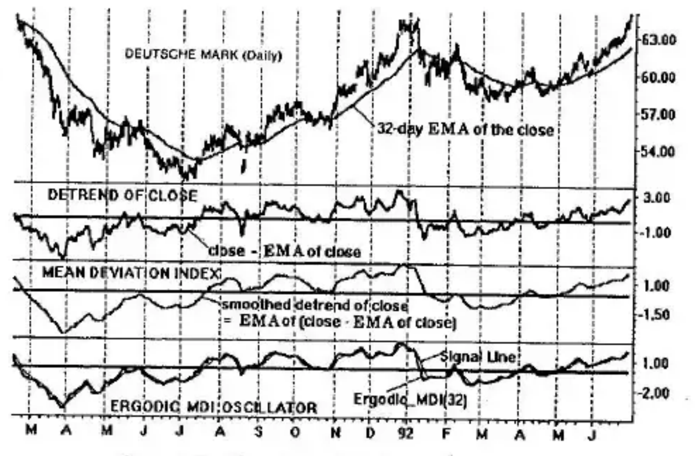
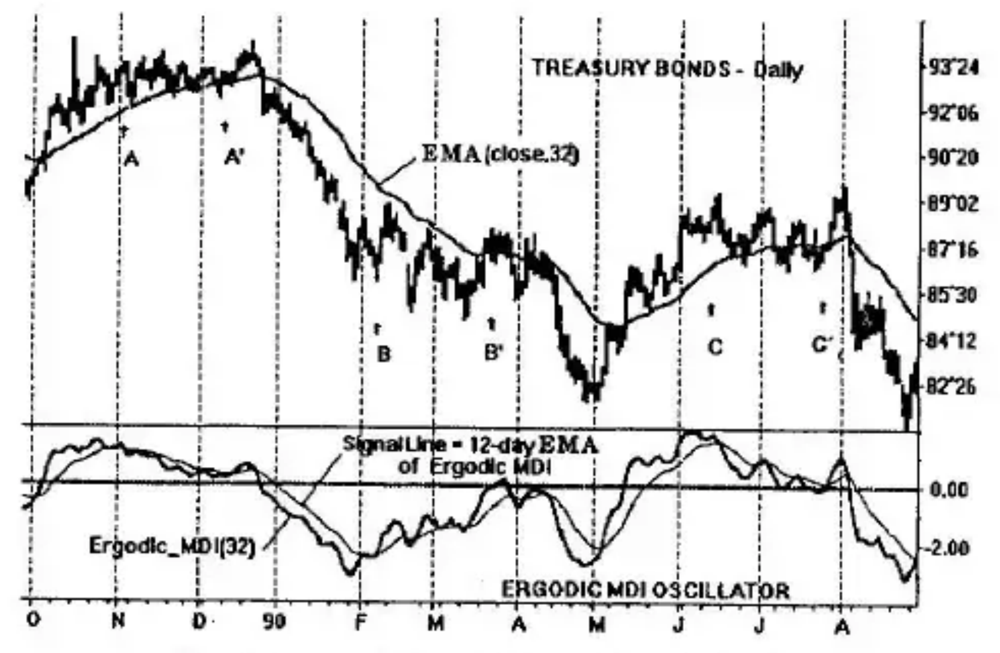

# Chapter 5: A Detrending Indicator

Up to this point, we have devised double-smoothed indicators based on price alone (the close, for example)—the True Strength Index; then a family of indicators based on the high, low and close—the Stochastic Momentum Index; and lastly, a day trading indicator based on the tick volume—the Tick Volume Indicator (TVI). All of these indicators are smooth and timely since they are based on the principles of double smoothing, and they are essentially momentum indicators (they are determined by comparing price levels at different times).

Other useful indicators are based on comparative differences. In this chapter, we shall present a double-smoothed indicator based on *detrending*.

## Detrend

A *trend* may be defined in terms of a moving average. If the moving average of the close is rising, we say the market is on an uptrend. The moving average is smooth and introduces lag, which is evident at turning points based on prices. A technique called "detrending" may be applied in which the moving average is subtracted from the close. This deviation

$$\text{close} - EMA(\text{close}, r)$$

is then plotted in lieu of the close (see second panel down of Figure 5-1 shown with an $r = 32$-day exponential moving average). The curve is observed to be jagged in appearance. To remove the noise, the detrended close is smoothed in the third panel down by an amount equal to $s = 12$-days. *Double smoothing* has been performed to obtain the clean curve.

## Mean Deviation Index

Let us define an indicator

$$MDI(\text{close}, r, s) = EMA(\text{close} - EMA(\text{close}, r), s)$$

called the *Mean Deviation Index*, *MDI*, using two moving averages. The first smoothing is of the close for $r$-days. The price series is detrended by subtraction of the moving average from the close. A second moving average for $s$-days is performed on the deviation; hence, the name, Mean Deviation Index. This is shown in the third panel of Figure 5-1 where the detrended close is smoothed an amount sufficient to produce a smooth and timely curve.

## MACD Approximation

Under certain conditions, the MDI and the MACD (moving average convergence divergence) indicators approximate each other rather well. For example, when the double smoothing consists of one long interval, $r$, and a short interval, $s$, then

$$MDI(\text{close}, r, s) \approx EMA(\text{close}, s) - EMA(\text{close}, r)$$

which is the definition of the MACD. It can be shown that except for a scale factor, the MDI and MACD have almost interchangeable shapes. (As the intervals approach each other, the MACD becomes very small in amplitude.) The basic double smoothing format, however, is in the formulation of the MDI, which accepts all values of $r$ and $s$.

## The Ergodic MDI Oscillator

An ergodic format useful as a trading tool is possible with the Mean Deviation Index. This is shown in the bottom panel of Figure 5-1 consisting of an Ergodic_MDI oscillator and its Signal Line:

$$Ergodic\_MDI(r) = MDI(\text{close}, r, 5)$$

$$Signal\_Line(r) = EMA(MDI(\text{close}, r, 5), 5)$$

The ergodic MDI is the double-smoothed MDI with one of the smoothings fixed at 5 price bars. The signal line is a moving average of the ergodic MDI for 5 price bars. The amount of smoothing to obtain the signal line may be adjusted to suit. Usually, 3 to 12 price bars of smoothing are used. We use 5 price bars here.

### Trading with the Ergodic MDI Oscillator

The Ergodic MDI oscillator with its Signal Line provides a convenient means of trading on a close-to-close basis. An example is shown in Figure 5-2 for daily T-bonds.

A 32-day EMA of the close, $EMA(\text{close}, 32)$, defines the trend. A 32-day Ergodic MDI, $Ergodic\_MDI(32)$, is used as the trading instrument with a Signal Line assigned as a 12-day EMA of the Ergodic MDI: $Signal\_Line(32) = EMA(MDI(\text{close}, 32, 5), 12)$.

Observation of the prices shows there are potential hazards for trading manifested by the three congestion regions: November–December 1989, February–March 1990, June–July 1990. Otherwise, prices trend very nicely having the potential for successful trading. We observe that the signal line is relatively smooth due to its 12-day smoothing interval and further that the slope of the signal line is in the same direction as the slope of the moving average on the close when prices are trending. In the congestion regions between points A and A', B and B', and C and C', the slope of the signal line diverges from the slope of the moving average on the close: *The slopes are in opposition*. This *slope divergence* tells us that we are in a trading range, a region of congestion. With this knowledge, we may opt to exit a trade if we are holding one, or to stand aside and not trade if we are trend followers. On the other hand, it also permits us to exercise countertrend trading methods. The important item is that a *slope divergence* (see also Chapter 12) tells us we are entering or within a congestion region of prices.

When the Signal Line is going in the same direction as the trend defined by the 32-day EMA on the close, prices are trending and we should be alert for trading opportunities. For example, using crossover philosophy, the Ergodic MDI crosses below its Signal Line following the slope divergence of the interval from A to A'. This occurs in late December 1989 and continues on a long decline for the month of January 1990 ending in the start of the slope divergence from B to B'.

The completion of the trading range from B to B' heralds the next down move in mid-April, which is entered by the Ergodic MDI crossing below its Signal Line. A long signal occurs in early May and exits at the beginning of a slope divergence (trading range) at C.

## The Ergodic MACD Oscillator

The MACD is similar to the mean deviation index, MDI. Both indicators are double-smoothed momentum indicators. We would expect that the MACD would also have an ergodic representation. The MACD is given by the difference between two exponential moving averages of the close:

$$MACD(\text{close}, r, s) = EMA(\text{close}, s) - EMA(\text{close}, r)$$

where $EMA(\text{close}, s)$ is the EMA of the close for $s$-days, and $EMA(\text{close}, r)$ is the EMA of the close for $r$-days, with $s$ less than $r$. The Ergodic MACD then becomes

$$Ergodic\_MACD(r) = MACD(\text{close}, r, 5) = EMA(\text{close}, 5) - EMA(\text{close}, r)$$

and its Signal Line is represented by

$$Signal\_Line(r) = EMA(MACD(\text{close}, r, 5), 5)$$

which is a 5-day EMA of the Ergodic MACD. The curves reproduce those of the MDI within a scale factor.
