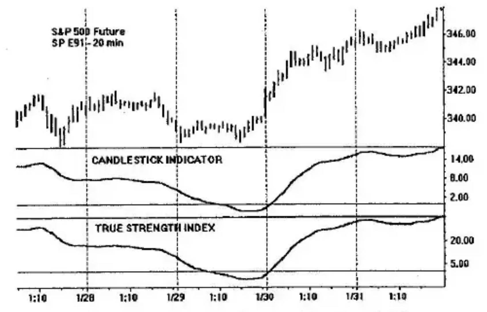
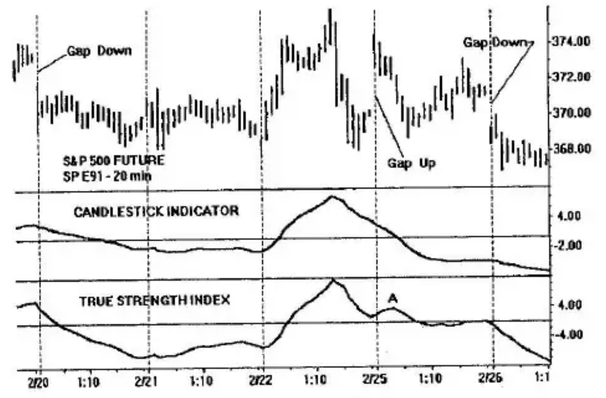
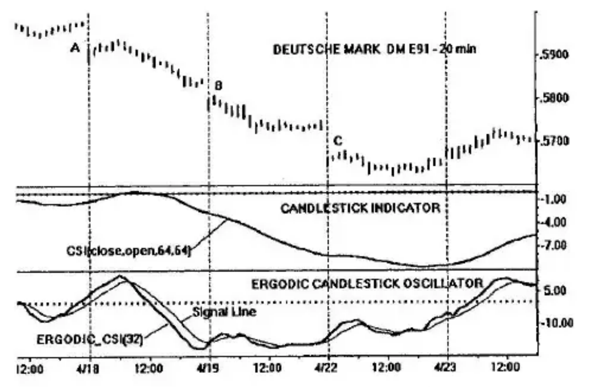

# Chapter 6: Candlestick Momentum

Candlestick charting is a chart representation used in Japan to describe prices. Since its recent introduction in the West, the subject has appeared in many articles, and in computer trading programs.

In lieu of a bar chart described by the open, high, low, and close, using a single vertical line, the candlestick chart is much more colorful and informative. The Japanese have developed a structure of pattern recognition inclusive of price reversals, or rally/decline terminations, and chart continuation patterns. These patterns are couched in a language peculiar to the history and lore of Japanese trading that developed over hundreds of years. Great emphasis is placed on the *real body* of the price bar, the portion of the price bar between the close and the open. The *shadows*, the portions of the price bar outside of the real body, hold a secondary position in candle hierarchy.

Our interest in candlestick momentum is prompted by the effect of gaps on price charts on momentum indicators based on the close only (e.g., the MACD and TSI). The problem is significant in day trading, which is subject to frequent gaps in the opening price bar compared with the previous closing price bar. A large opening gap biases the MACD, or TSI, in its direction although prices may actually be progressing in the other direction. The erroneous information from the gap must be taken into account until the gap effect subsides.

In this chapter, a comparison is made between traditional charting and candlestick charting in terms of momentum. We shall show that for intraday trading the indicators based on candlestick momentum produce curves comparable to those of indicators based on close-only momentum—with one major exception: Candlestick momentum removes the bias due to gap effect. Day traders using the candlestick indicators in this chapter may trade without the worry of opening gaps biasing their indicator readings.

## Momentum

Generally speaking, momentum is the slope of the curve describing the price phenomenon. A positive momentum corresponds to a price rise; conversely, negative momentum represents a price decline.

In technical analysis of stocks and commodities, momentum is classically defined as the current price (typically, the close) minus the price one time interval ago (e.g., today's close minus yesterday's close) although it can refer to the price difference over any time interval. With candlestick charts, the price bar is formed over a fixed time interval specified by the opening price, open, and the closing price, close. The change in price over this fixed interval is a momentum that I call the *candlestick momentum*:

$$cmtm = close - open$$

The $cmtm$ can be plus or minus in the sense that an up momentum is positive when the close is greater than the open; the reverse is true when the open is greater than the close giving a negative value to the downward momentum.

## Candlestick Momentum Index

Since candlestick momentum is a bona fide momentum in accordance with our definition, it is anticipated that methods of classical technical analysis momentum should be directly applicable. Following the method developed for the True Strength Index in Chapter 2, a *Candlestick Momentum Index* (*CMI*) can be constructed along the same lines:

$$CMI(close, open, r, s) = 100 \times \frac{EMA(EMA(cmtm, r), s)}{EMA(EMA(|cmtm|, r), s)}$$

The vertical bars in the denominator specify the absolute value, the positive value of the close − open momentum. Double smoothing is used in both the numerator and denominator to obtain smooth contours (low noise) with low lag. $EMA(cmtm, r)$ is the first exponential moving average (EMA) of $r$ price bars; this result is again smoothed for $s$ bars by the second exponential moving average, $EMA(EMA(cmtm, r), s)$. The numerator by itself is double-smoothed candlestick momentum. The denominator performs the function of amplitude normalization, forcing the CMI to range from +100 to −100.

The CMI formula has the same format as the True Strength Index (TSI) and produces results similar to it. The maximum and minimum values of the CMI are 100 and −100, respectively. Prices are said to be overbought when the CMI is above a set threshold based on historical data; the oversold condition is attributed to prices when the CMI is less than a set negative threshold. Because the Candlestick Momentum Index uses differences, it will have many of the properties of other differencing indicators such as divergences, highlighting of price tops and bottoms, support and resistance, and trend lines. Price bar highs and lows do not enter into consideration for the CMI, only the close and open.

## Candlestick Indicator

An alternate formula using candlestick momentum is the *Candlestick Indicator* (*CSI*), which I have defined as

$$CSI(close, open, r, s) = 100 \times \frac{EMA(EMA(close - open, r), s)}{EMA(EMA(high - low, r), s)}$$

This formula is more intuitive since we can visualize the close and open that define the limits of the candlestick graph along the price bar bounded by the high and low. In the numerator, an exponential moving average is taken of the close−open for $r$ price bars. A second EMA is taken of this result for $s$ price bars. A similar double smoothing is made in the denominator of the high−low price range of the bar. It is evident that the CSI ranges over +100 and −100. The value +100 is reached when the close is at the extreme point, the high, and the open occurs at the low. When the converse happens, the CSI will produce −100.

Figures 6-1 and 6-2 compare the CSI and TSI on S&P 500 futures 20-minute charts. Both the CSI and TSI are shown for double smoothings of 32 bars for each EMA smoothing. In Figure 6-1, the Candlestick Indicator based on the close-open momentum and the True Strength Index based on close-to-close momentum produce comparable results. Both rise and fall together and have near identical turning points. It appears either indicator can essentially be used interchangeably—*on intraday charts*. The interchangeability cannot always be made on daily charts.

Figure 6-2 is another time segment of the SP E91 (Omega Research continuous data S&P 500) 20-minute intraday chart. Three gap openings are present: two down gaps and one gap up. Prices following the down gaps continue lower in this example; both the Candlestick Indicator and the True Strength Index also decline.

The gap up represents a different situation. Prior to the gap, prices are declining. Immediately following the up gap, prices continue to decline. Except for the gap, a falloff in prices is present before and after the opening. The Candlestick Indicator registers this fact exactly permitting the day trader to immediately take action: The bias of the opening gap is ignored entirely. The direction of prices (except for the gap) is preserved by the Candlestick Indicator.

The effect of the gap is not avoided by the True Strength Index, which faithfully records the close-to-close amplitude of prices. Although the gap occurs for one price bar, its effect provides an erroneous reading of prices as shown at point A.

## Ergodic Candlestick Oscillator

A good tool for the day trader is the ergodic oscillator using the Candlestick Indicator, CSI. It consists of two parts, the oscillator and its Signal Line:

$$Ergodic\_CSI(r) = CSI(close, open, r, 5)$$

$$SignalLine(r) = EMA(Ergodic\_CSI(r), 5)$$

The Ergodic CSI is the double-smoothed CSI with one EMA smoothing fixed at 5 price bars. A further smoothing of 5 price bars produces its Signal Line. This is shown in the bottom panel of Figure 6-3 for an EMA smoothing of $r = 32$ price bars. The oscillator is unaffected by the opening gaps, A, B, C. Therefore, all regions of the price bar are unbiased and are available for day trading. A slowly varying CSI in the middle panel of Figure 6-3 shows the direction of the trend. The Ergodic oscillator permits entry points that should be taken only in the direction of the trend.

