# Chapter 7: Directional Trending

One of the primary objectives of the investor/trader is to determine the direction of the market. Is it going generally up, or is it going down? Is the trend up, or down? If it is going up and we are comfortable that it is on a steady rise, we simply buy and hold; at a later time, we sell. It seems so easy to buy low and sell high. Why are we not all billionaires?

The markets do not always cooperate with the precepts of order and simplicity. Just when we feel comfortable and start counting our (paper) profits, the market whipsaws. Is this a real reversal? Are we entering a region of congestion, a narrow trading range? Should we get out? Is this just a minor variation in the ongoing trend? Then again, how much drawdown in equity should we tolerate if we decide to hold this position? Perhaps we should take our profits and get out? Should we cut our losses quickly? Depending on the situation, there are many possibilities. These are the familiar dilemmas of everyone who trades.

In this chapter, we shall attempt to quantify trending, directional movement, in terms of the highs and lows in the price bar graph. Starting with a momentum definition suitable for the highs and lows (the close is not used), a double-smoothed indicator is developed. Characteristics of the indicator relative to the bar graph are investigated to evaluate the existence of trends.

## Composite High-Low Momentum

Directional movement up, or *upward trending*, is first seen as a high of the price bar. The language of trading is replete with expressions such as "The rally began with an upside breakout of the high" and "The rally continues with day-to-day increasing highs." If the highs move up, increasing highs signify an uptrend.

Similarly, downtrends are first evidenced by the lows going lower. "The recent decline continues with lower lows appearing every day"; "The market had a late afternoon selloff with an avalanche of decreasing lows." In effect, lows moving to lower levels specify a downtrend, directional movement down.

The preceding word descriptions sound very much like momentum. An uptrend is positive direction with the amount of the upward change also specified. This sounds similar to the momentum of the high. The downtrend is in a down (negative) direction, and it is also specified with an amount. We recognize the downtrend word description as the momentum of the low.

We are in need of a different definition of momentum in this situation. The 1-day momentum of the close is given by close today minus close yesterday. The cumulative sum of this close momentum gives a curve that is, except for scaling, identical to the close.

What form may an appropriate momentum description have using both highs and lows? Let us define a *composite high-low momentum* as

$$HLM = High\_Mtm\_Up - Low\_Mtm\_Down = HMU - LMD$$

where the upside momentum, $HMU$, is based solely on the highs, and the downside momentum, $LMD$, is calculated using only the lows. Only when the momentum of the highs is increasing is it used in the high-low momentum. Similarly, the momentum of the lows appears as $LMD$ but only when it is decreasing. The upside momentum is calculated as follows:

If $high[today] - high[yesterday] > 0$ then:

$$HMU = high[today] - high[yesterday]$$

Else:

$$HMU = 0$$

Similarly, for the downside momentum:

If $low[today] - low[yesterday] < 0$ then:

$$LMD = -(low[today] - low[yesterday])$$

Else:

$$LMD = 0$$

## Virtual Close

When the cumulative sum is taken of the composite high-low momentum, a single curve is obtained. This curve represents both the highs and lows; it is termed the *virtual close* and is shown in Figure 7-1 compared with the actual close. It is evident that the virtual close and actual close track fairly well.

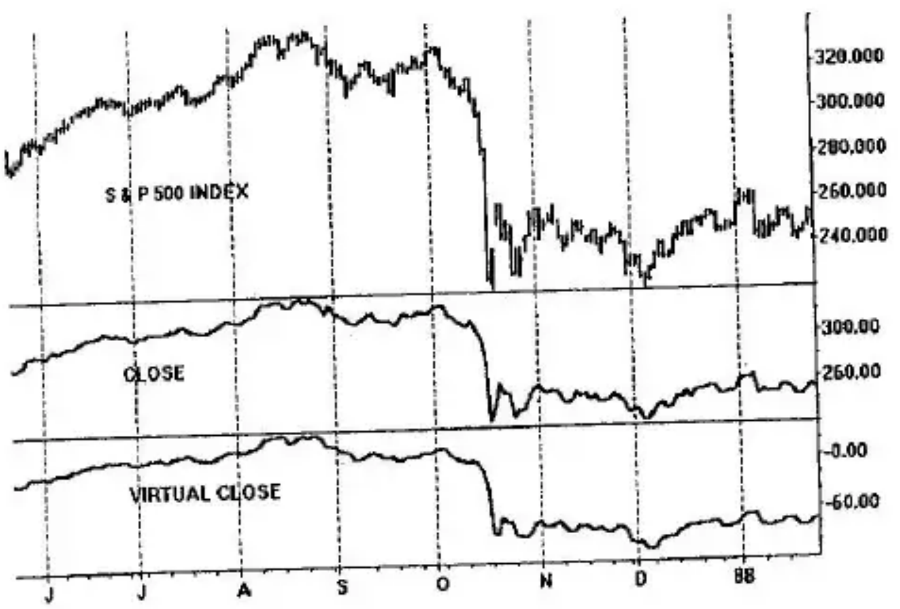

## Directional Trend Index

The information for trending as defined by the increasing momentum of the highs in a rising trend and the decreasing momentum of the lows in a declining trend is embedded in the high-low momentum, $HLM$. In its raw form, it is very choppy with frequent changes from positive and negative values. Smoothing is required to make the information useful. Double smoothing is used in the definition of the *Directional Trend Index* ($DTI$) as

$$DTI(HLM, r, s) = 100 \cdot \frac{EMA(EMA(HLM, r), s)}{EMA(EMA(|HLM|, r), s)}$$

where, for the numerator:

- $EMA(HLM, r)$ = exponential moving average of $HLM$ for $r$-days
- $EMA(EMA(HLM, r), s)$ = exponential moving average of $EMA(HLM, r)$ for $s$-days

and for the denominator:

- $EMA(|HLM|, r)$ = exponential moving average of the absolute value of $HLM$ for $r$-days
- $EMA(EMA(|HLM|, r), s)$ = exponential moving average of $EMA(|HLM|, r)$ for $s$-days

The numerator is the double exponential moving average of the high-low momentum, $HLM$, and the denominator is the double smoothing of its absolute magnitude, its positive value. In the numerator, the $HLM$ is first smoothed for $r$-days. This result is smoothed with an $s$-day exponential. This is double smoothing of the numerator.

The Directional Trend Index presents characteristics that closely identify it with the True Strength Index given in Chapter 2. This is to be expected since it is a momentum indicator using the same algebraic format as the TSI. The DTI is double-sided in that it can vary over a range bracketed by +100 and -100. The DTI expresses overbought and oversold price conditions and it highlights divergences between it and the price curve (specifically, the virtual close curve) from which it is derived. An example of the Directional Trend Index is given in Figure 7-2.

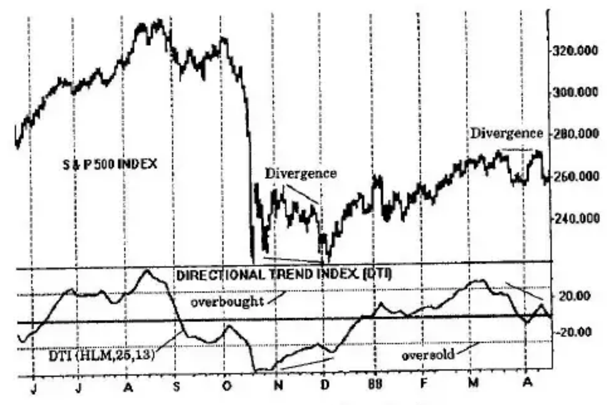

## Measuring Directional Movement with the DTI

The DTI provides an excellent substitute for price. When the market goes up, the DTI goes up. There are times, however, when the DTI goes up although the market is in a trading range, or region of congestion. Similarly, when the market declines, the DTI also declines, but there are exceptions when the DTI declines during a market that is in congestion.

A study of many plots of the Directional Trend Index reveals its special characteristics for tracking trends. In the positive region of the DTI between zero and +100, a rising DTI corresponds to rising prices. A declining DTI in the positive region indicates falling prices or flat prices (a region of congestion); thus, the decreasing DTI provides an ambiguous indication of the direction of prices.

Similarly, in the negative region of the DTI between zero and -100, a decline corresponds to a decline in prices. However, an ambiguous situation again occurs for a rising DTI, which indicates either rising prices or flat prices.

Sideways movement of the indicator provides two additional possibilities, that is, a sideways movement of prices or transition in the gradual reversal of prices for all regions of the DTI.

Great care therefore must be exercised in the use of the indicator since it correctly identifies trends only under the following limited conditions:

- A positive price trend is uniquely identified by a rise occurring in the positive region of the DTI momentum indicator.
- A negative price trend is uniquely identified by a decline occurring in the negative region of the momentum indicator.
- All other regions of the momentum indicator are potentially erroneous.

These conditions are not unique to the DTI. They prevail for indicators based on differences (momentum indicators).

## Ambiguous Indications

The examples of Figures 7-3 and 7-4 demonstrate the ambiguous nature of the DTI. The stock AMGEN of Figure 7-3 is shown from August 1990 through December 1991 with a corresponding Directional Trend Index mostly in its positive region. From August to the end of October 1990, period A, the DTI has a negative slope, declining, and the corresponding prices are in a narrow trading range. The long price congestion region at B is also heralded by a negative slope of the DTI. Finally, at C the slope of the DTI is again negative but this time prices are also declining. In two cases, the negative slope showed congestion whereas in one case, the negative slope showed a downtrend. Had we assumed a downtrend in the first two cases and entered the market short, this would have resulted in a small loss. Positive slopes on the DTI in its positive region all made correct assessments of rising prices because of the one-to-one correspondence of the slopes of prices and the DTI.

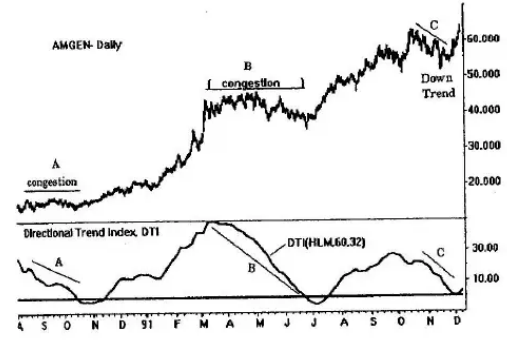

Figure 7-4 is a plot of a half-hour bar graph of the Deutsche mark (an Omega Research continuous graph). This graph shows the possibilities in a momentum indicator such as the Directional Trend Index. The bottom panel contains the DTI above and below its zero line. In section A, the DTI is in its negative region and declining; prices in this section should also be uniquely declining—and they are. Except for the lag in sections B and C, the DTI is rising while in its negative region. This means that prices can be either rising or flat. It is observed that B is rising while C is flat. In this situation, the DTI could have been interpreted erroneously as C rising with B flat, which is seen to be patently incorrect.

Section D shows the indicator in its positive region rising sharply; prices in section D are also rising. The continued rally of the indicator in section E is shallow, almost flat. A sharp drop in the indicator all while in its positive region occurs in section F meaning that prices are either dropping or are in congestion; both of these conditions are present at different times in section F.

All of section G to November 30 is in a declining mode and occurs in the negative region of the indicator. This uniquely defines a corresponding decline in prices that is observed to take place. Section H shows an increase in the indicator while it is in its negative region. This indicates one of two possibilities: a price rise, or flat prices. Here, observe a slow increase in prices.

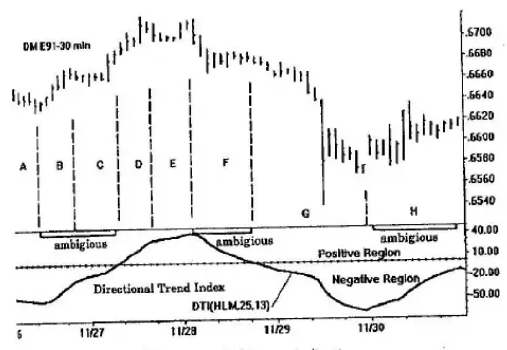

## Trading with the Trend

If we wish to follow trends with the intent of making money by buying or selling at different levels of the trend, it is essential that we know a trend is in effect. This is accomplished by smoothing prices, or smoothing of a momentum indicator of prices. Because smoothing prices directly has introduced lag, we have focused our attention on double smoothing of momentum indicators as surrogates of prices, which intrinsically have lower lag. We have seen in Figures 7-3 and 7-4 how the momentum indicator is a surrogate for price on a one-to-one basis only for specific regions; in other regions, it is an ambiguous surrogate, at best.

## Nonambiguous Trending

If flat prices or frequent trading ranges occur, wrong trading decisions can be made when these decisions are based on momentum indicators. On the other hand, we can avoid many of the "wrong decisions" by following the indicators only under limited conditions. These conditions are:

- Permit trading only when the indicator is increasing and is in its positive region.
- Permit trading only when the indicator is decreasing and is in its negative region.

These two conditions are the only ones that are assured to be nonambiguous.

An example of *nonambiguous trending*, called $DTI\_Trade(25,13)$, is shown in the bottom panel of Figure 7-5. This notation specifies double smoothing in the Directional Trend Index of 25 and 13 bars, respectively, where only the indicator rising in its positive region and falling in its negative region is retained. All other regions of the DTI are absent. This encompasses sections A, D, E, and G on the 30-minute bar graph. Trading will be permitted only in these sections because it is only in these sections that trending is uniquely defined as up or down (within the lag limitations of the indicator).

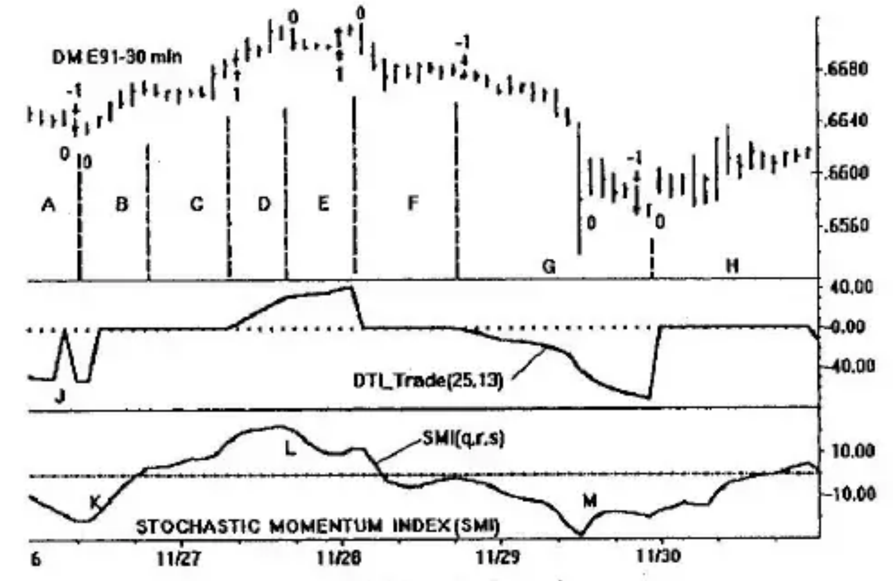

If a position is taken in sections D and E, it must be long since $DTI\_Trade$ is rising in these sections. Similarly, if it is decided to take a position in segment G, it must be short since the $DTI\_Trade$ indicator is falling.

Section A in Figure 7-5 showing the end of a decline also shows that the smoothing used was insufficient to prevent a return to zero caused by a single high-low bar having a noisy virtual close. This can be removed by using longer term smoothing—accepting the additional lag introduced by the additional smoothing.

## A Rudimentary Trading Vehicle

We now have the basic tools to construct a simple trading system—exclusive of money management. Our system will be based on $DTI\_Trade$ shown in the middle panel of Figure 7-6 and the Stochastic Momentum Index, $SMI(q,r,s)$, in the lower panel operating as an oscillator. We will enter the market only when the $DTI\_Trade$ indicator (middle panel) moves away from zero.

- **Long entry** occurs when $DTI\_Trade$ goes positive. The position is held as long as the SMI oscillator (bottom panel) has the same slope going in the same direction as the trend shown in the middle panel of Figure 7-6.
- **Long exit** occurs when the slope of the SMI oscillator reverses such as at points L and M, or when $DTI\_Trade$ returns to zero—whichever comes first.
- **Reentry.** If the exit is based on a reversal of the oscillator, a reentry can be made when the oscillator turns again in the direction of the $DTI\_Trade$ indicator; exit on the reentry follows the same rules as a standard exit.

Similar rules apply for short entry and exit.

This is shown in Figure 7-6 with the following notation: An up-arrow accompanied by a "1" signifies a long entry of one contract. A subsequent "0" indicates an exit from this long position. A down-arrow with a "-1" specifies a short entry of one contract. A "0" then indicates an exit from the short position.

Note that the noise at position J of the center panel produces a short entry that is immediately followed by a short exit one bar later. A similar situation occurs just prior to November 30. A long entry followed quickly by its exit occurs at November 28. These in-and-out trades are undesirable. They are the result of small noise variations and ever-present lag because of the averaging required to reduce these noise variations.

Smoothing improves results as shown in Figures 7-7 and 7-8. Figure 7-7 is a plot of the daily Deutsche mark with a Directional Trend Index with double smoothing of 20 days for each smoothing (middle panel). The portion of this curve that shows nonambiguous trending is directly below it and is seen to be very noisy. Faulty trades could be generated at positions A through K. With 5-day EMA smoothing of the DTI, potentially bad trades at positions A, B (maybe), G, H, and J are removed.

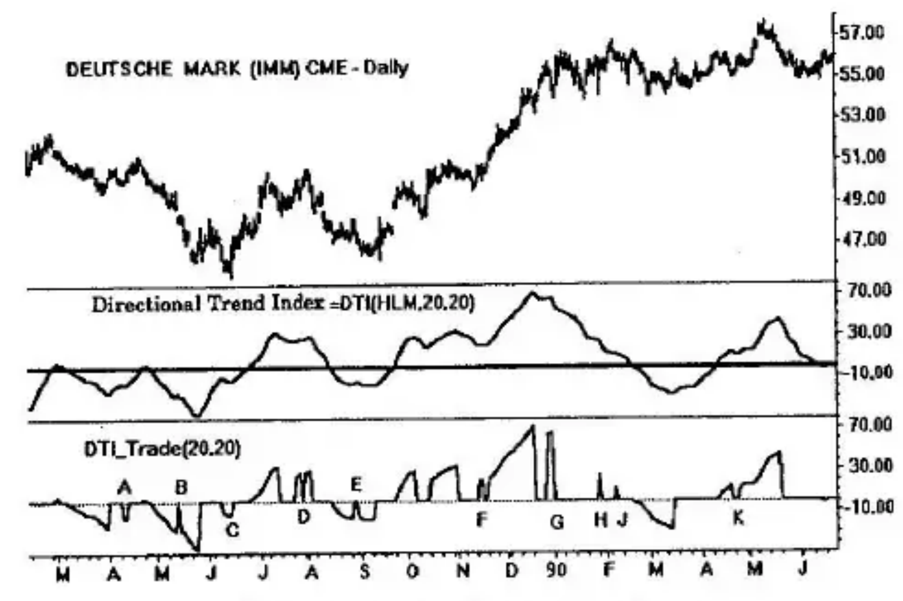

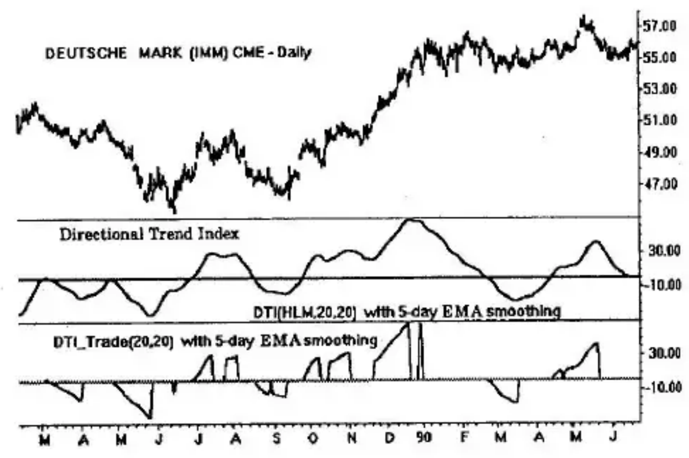

Nonambiguous trading is possible only when there are clear up-and-down patterns (ramps) in the $DTI\_Trade$. If the duration of a ramp is too short, or the ramp itself is not sufficiently steep, poor trading may result. In Figure 7-8, many of the $DTI\_Trade$ ramps are smooth and steep indicating that these regions are excellent for trading.

$DTI\_Trade$ exists only for trends. It filters out trading ranges, congestion regions, and flat prices. It performs this important function at the cost of some missed trading opportunities.

## DTI_Trade Performance

Does trading using the $DTI\_Trade$ system work? The answer is yes. The answer is an emphatic yes if the market trends strongly and smoothly. $DTI\_Trade$ aids trading since it tends to prevent taking a position in trading ranges, congestion regions, or regions of flat prices. It identifies this category of prices as it occurs.

We may select markets that have a history of trending with the assumption that trending will continue into the future. Further, we may select a particular market and optimize it for best results on the recent past assuming the past data is likely to be similar in the future. These assumptions contain many difficulties: In the latter case, we can be rightly accused of curve-fitting the past, which will almost always produce stellar results . . . for the past. There is no one best way to "optimize."

Since we are attempting to show performance under limited conditions, we will set forth the following ground rules in this chapter:

- Daily Deutsche mark and daily T-bonds are compared using double smoothing of 28 days each with an additional 5-day smoothing to reduce noise.
- Both markets are further filtered by a smoothed Stochastic Momentum Index, $SMI(q,r,s)$, where the filtering is identical in all cases.
- Commission cost per trade is \$20.
- Slippage cost per trade is \$60.
- The performance is based on one contract traded.
- The performance summaries of Figures 7-9 through 7-12 are based on Omega Research's Easy Language and produced using the TradeStation computer program.

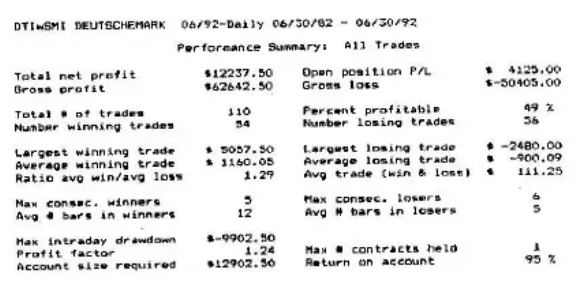

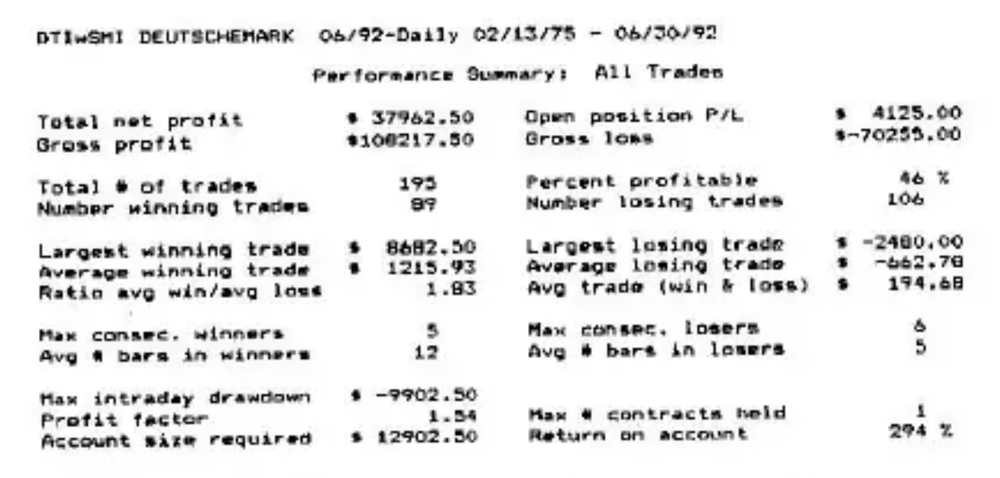

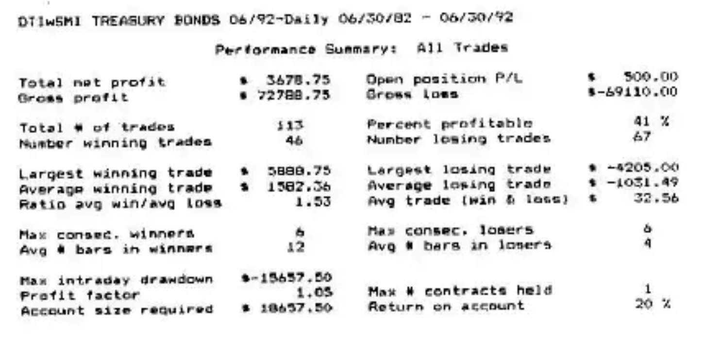

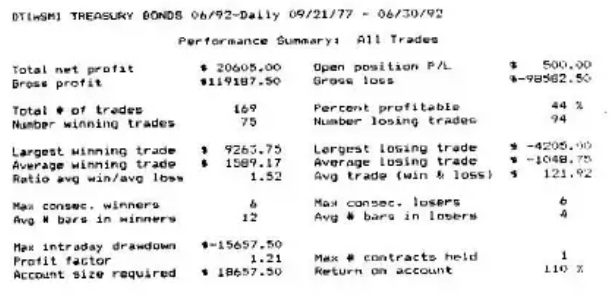

A visual examination of daily DM and T-bonds long-term charts will show that they are both trending markets. The DM trends better and smoother; consequently, we would expect to obtain better performance from the DM. According to the TradeStation program, the performance summary of Figure 7-9 for the daily Deutsche mark produces a total net profit of \$12,237 in 10 years using 110 trades over this period, or roughly one trade, on average, per month. Half the trades were profitable; winning and losing trades were split almost equally. The intraday drawdown over the 10-year period was -\$9,902; with a \$3,000 margin required to trade the account, the account size required was \$12,902 producing a return on the account of 95%. Not earth shaking, but nonetheless profitable at an average of 9.5% per annum considering that no attempt was made to systematically optimize. The 28-day double smoothing was selected because it produced visually smooth curves.

Trading was then performed on the DM for 17 years inclusive of the preceding 10-year interval. All other conditions remained unchanged. The trading net profit tripled to \$37,962 using the same account size; the return on the account also tripled. The tripled numbers occurred by extending the trading vista backward by only 7 years. The DM was trending to a greater degree and much smoother in those early years. Examination of the DM price chart confirms this.

Figure 7-11 shows the trading results for one Treasury bond contract over the same 10-year period as the DM with all conditions held the same, inclusive of commission and slippage costs. The net profit was only \$3,678 producing a return on the account of 20%, or 2% per year, on average. Performance over the 15-year interval that contains the 10-year interval is greatly enhanced as depicted in Figure 7-12. Total net profit increased better than fivefold. The account return also increased better than fivefold averaging better than 7% per year. Once again, the additional 5-year interval contained improved trending with less noise: fewer and longer successful trades. T-bonds results are not as good as the Deutsche mark since they are not as trending. Recent declines in performance are due to less trendiness than in earlier years.

## Single-Sided, Double-Smoothed Indicators

Up to this juncture, the $HLM$ was defined on a daily basis and then double smoothing was applied. Scaling was obtained using a denominator resulting in a bipolar (plus and minus) Directional Trend Index. It was then determined that a rising DTI in its plus region uniquely corresponded to rising prices; similarly, a falling DTI in its minus region uniquely corresponded to falling prices. All other possibilities were ambiguous and potentially erroneous. The $DTI\_Trade$ curve retained only the singular conditions of the DTI and made all other regions equal to zero. The zero regions excluded congestion regions and flat regions of prices. The zero regions also excluded some regions of price trends—missed trading opportunities.

Other forms of processing the $HLM$ are possible. For example, we may take the (double-sided) DTI and compute its absolute value, or we may double-smooth the $HLM$ in following the procedure:

1. Single-smooth the $HLM$.
2. Take the absolute value of (1).
3. Smooth the absolute value.

This method of double smoothing is used in Wilder's ADX, and described in Appendix A. We shall identify this smoothing sequence as an *ADX-type double smoothing*.

## Absolute Value of the DTI

The Directional Trend Index with double smoothings of 32 days each is shown for the daily Deutsche mark in the middle panel of Figure 7-13. It appears to be relatively smooth and timely. The lower panel of Figure 7-13 is the absolute value of the DTI. The absolute value of the double-smoothed momentum indicator provides a method for separating price trends from flat prices and congestion regions. Positive regions of the DTI are unchanged by the absolute value. Negative regions, however, are folded over into the positive region. Negative slopes in the negative region are folded over into the positive region appearing as positive slopes. Positive slopes in the negative region become negative slopes in the positive region by using the absolute value.

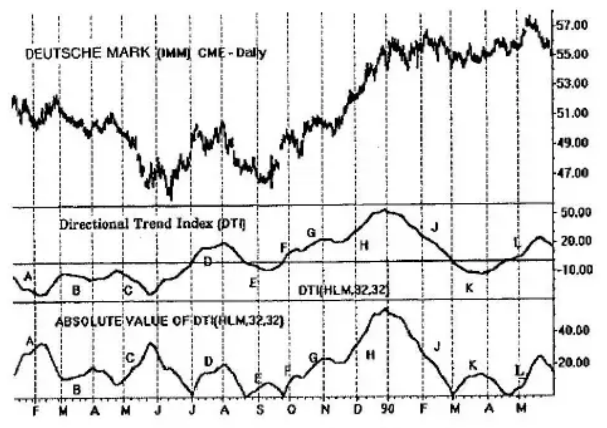

Positive slopes on the absolute value of the DTI correspond to trending. Negative slopes on the absolute value of the DTI correspond to either price flats, congestion regions, or price trends. By confining trades to the positive slopes of the absolute magnitude, we will avoid price regions of little or no directional movement, which can be hazardous for trading. There will be times, however, when this technique rejects trends that are perfectly suitable for trading.

Negative slopes in the negative region of the DTI (middle panel of Figure 7-13) include segments A, B, C, E, and K which have positive slopes in the absolute value of the DTI (bottom panel). Positive slopes in the positive region of the DTI include segments D, F, G, H, and L which also have positive slopes in the absolute value of the DTI. All of these segments have positive slopes in the absolute value and uniquely identify either rising or falling prices, directional movement. The direction of prices is lost in the absolute value and must be found by other available means, such as a moving average. Negative slopes on the absolute value of the DTI are potentially erroneous as seen by the trading range indicated in the segment J.

No new information is gained by taking the absolute value of the DTI. The ability to identify unique rising or falling prices is preserved by observation of rising slopes. The ability to determine direction without outside assistance is lost, however. The $DTI\_Trade$ formulation is preferred because it provides both uniqueness and direction.

## ADX-Type Double Smoothing

Pre- and post-smoothing of the absolute value of the $HLM$ is shown in the bottom panel of Figure 7-14. This is ADX-type double smoothing as previously described (see also Appendix A). It is observed to be similar in appearance to the absolute value of the DTI. Closer examination reveals the differences between the two. Following LeBeau and Lucas, we consider a trend to be in force when the slope is positive, the curve is rising. We will make comparisons with the absolute value of the DTI, also shown in Figure 7-14. The DTI, which is also plotted, will be used to show direction.

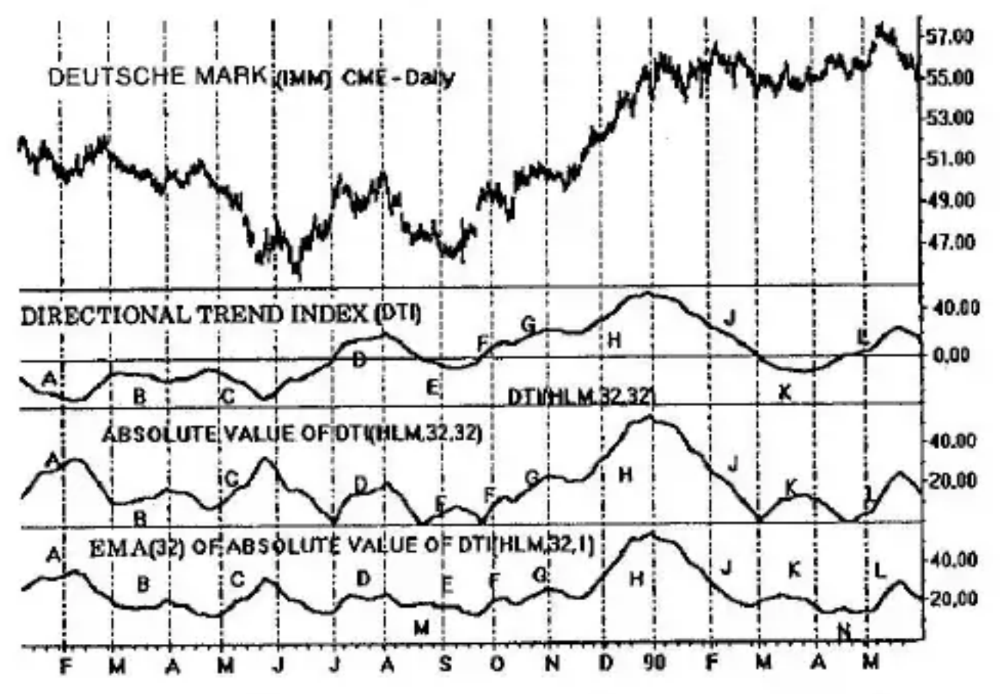

Segment A is rising, a directional movement that is seen in the DTI to be declining prices. (Remember: The absolute value destroys information on direction.) Segment B is a rise in DTI absolute value corresponding to a downtrend in prices. The ADX-type filter is flat in the B segment indicating no directional movement, a missed opportunity to trade. Segment C is a sharp downturn in prices which is indicated by rising curves.

Segment D is a fast double top in prices. The DTI processing does not detect the double top although it does indicate that the segment is tradable because of its positive slope. The ADX-type processing attempts, within its lag limitations, to track the double top using two small segments of positive slope.

Segment E on the DTI processing correctly shows a decline in prices by its rising curve. The ADX-type filtering disagrees showing a falling curve, a possible missed opportunity to trade. Segments F, G, H, K, and L are in agreement identifying possible trading (trending) opportunities.

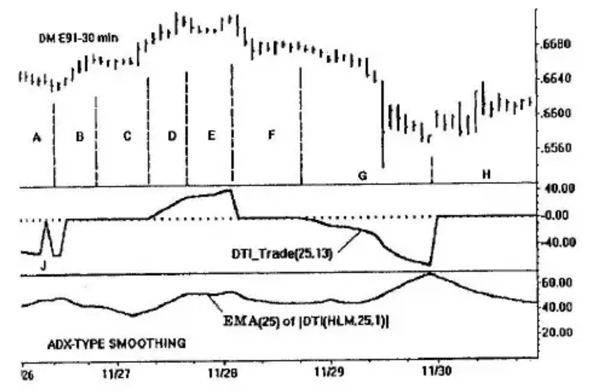

Figure 7-15 displays both $DTI\_Trade$ filtering and ADX-type filtering using the same smoothing times for 30-minute day trading. Using the strategy of trading opportunity only for positive slope of the ADX-type filter, and stand aside or exit for negative slopes, both forms of filtering are comparable. Again in this example, the ADX-type filter is slightly more sensitive to variations in the price curve.

It is not possible at this point to make a declaration as to which form of processing is "better." They both produce comparable, yet different results.
