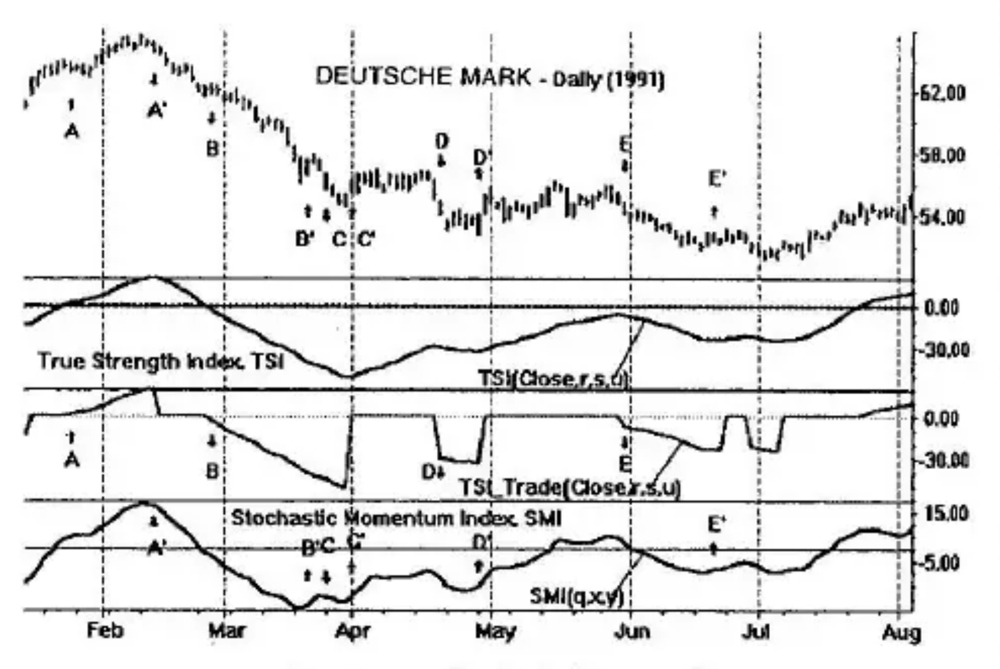

# Chapter 8: True Strength Directional Trending

We have shown how directional movement is defined in terms of the highs and lows. Leaning on the intuitive reasoning that increasing highs go with an uptrend and decreasing lows go with a downtrend, we defined an indicator based on a high-low momentum that measured trending. *Trending*, the directional movement of prices, was tied directly to the definition of momentum.

This raises a very important question: If momentum is basic to directional movement, are other indicators available to measure trending based on other definitions of momentum?

In this chapter, we explore the use of the True Strength Index (TSI), introduced in Chapter 2, as a momentum trading vehicle based on the close (or the high, or the low) only.

## Measuring Directional Movement Using the True Strength Index

An extensive review of many plots of the TSI and the close curves from which they are derived show that the indicator is loaded with potentially erroneous data. In the technical analysis of stocks and commodities, the compelling reason for using momentum indicators is the lower lag these indicators exhibit. Prices are noisy and require smoothing. Smoothing of price is accompanied by lagging response. Using momentum, the lag is significantly reduced and many of the momentum characteristics are helpful in trading: Overbought, oversold data are available and divergences are present that are not available in the price alone.

Momentum indicators, however, are potentially flawed because they can provide ambiguous signals. When the TSI momentum indicator (using the closing price) is between zero and +100, a rising TSI (increasing one-bar momentum) corresponds to rising closes. A falling TSI is identified with two possible price conditions: falling prices or flat prices.

A similar situation exists for the TSI while it ranges from 0 to -100 where a falling TSI corresponds to falling prices. However, a rising TSI in this region can provide two possible interpretations: rising prices or flat prices.

An example is shown in Figure 8-1. From mid-January 1991 to mid-February, the TSI (above zero) rises with rising prices. From mid-February to the end of the month, the TSI (still above zero) declines with falling prices. The TSI correctly identified falling prices in this case although a falling TSI in the positive region can also occur for flat prices. The month of March shows the TSI declining while in its negative region specifying a one-to-one correspondence with falling prices. Next, from the beginning of April, the TSI remains in its negative region and is on a rise; however, prices remain flat. This is one of the two possible conditions indicated by a rising TSI while in its negative region. This situation occurs again for the entire month of May.

Fast price changes are not always correctly specified by the TSI because of inherent lag. There is always a delay in the response. When the TSI is created using slower moving averages, it has a larger lag. The presence of some lag is an unavoidable problem for any analysis based on smoothing.

The True Strength Index in Figure 8-1 is used with three levels of smoothing for the daily Deutsche mark: $r = 32$ days, $s = 13$ days, and $u = 3$ days. Normally, we use double smoothing of $r$ and $s$ days. However, a third level of smoothing for a small number of days is applied here to remove small but rapid fluctuations. The small number of days in the smoothing process does not add appreciably to the lag.

## TSI_Trade Filter

We want to trade using the TSI as a trend indicator. We wish to have an indicator that shows prices trending in the direction of the indicator. A rising trend in the indicator corresponds uniquely with increasing prices; a falling indicator corresponds one-to-one with falling prices. We define $\text{TSI\_Trade}(close, r, s, u)$ to accomplish this. It is exactly the $\text{TSI}(close, r, s, u)$ that exists in those regions. At all other times, it is made equal to zero. This is shown in Figure 8-1.

## A Basic Trading System

Think of the TSI_Trade curve as a filter. Whatever passes the filter can then be traded using any strategy. For example, consider using an indicator such as the Stochastic Momentum Index (SMI) of Chapter 3 as a trading instrument as shown in the bottom panel of Figure 8-1. The following rules are listed:

**Long Positions**

- Enter long when TSI_Trade rises above zero and the slopes of TSI_Trade and the SMI are both positive.
- Exit long when SMI slope turns negative or when TSI_Trade reverts back to zero, whichever comes first.

**Short Positions**

- Enter short when TSI_Trade declines below zero and the slopes of TSI_Trade and the SMI are both negative.
- Exit short when SMI slope turns positive or when TSI_Trade reverts back to zero, whichever comes first.

*Caution: This is not intended to be a complete trading system. It is included here to demonstrate principles only.*

Starting in late January, a long entry occurs at point A (see Figure 8-1) and an exit is caused by the SMI slope reversal at A'. We then stand aside. Toward the latter part of February, a short position is taken at point B; the position is held for the fall in prices until the exit at point B'. Because of a wiggle of the SMI, another short entry is made at point C of the March falloff; the exit was taken due to the simultaneous SMI reversal and TSI_Trade revert to zero.

We stand aside for the flat prices in early to mid-April. A short position is held from points D to D'. This is not a good trade because of the lag. The trade was indicated properly, but too late. It is not a costly trade. May is a poor month for trading; TSI_Trade filter has us stand aside. Next, we enter a short at E at the end of May and exit the position at E' due to a reversal of the SMI slope.
