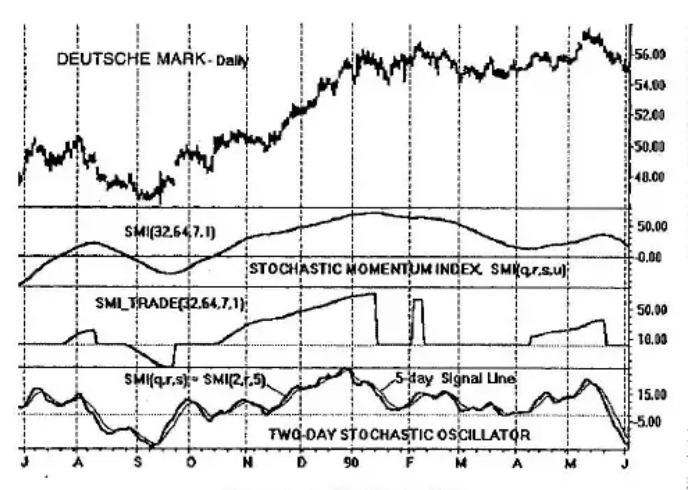
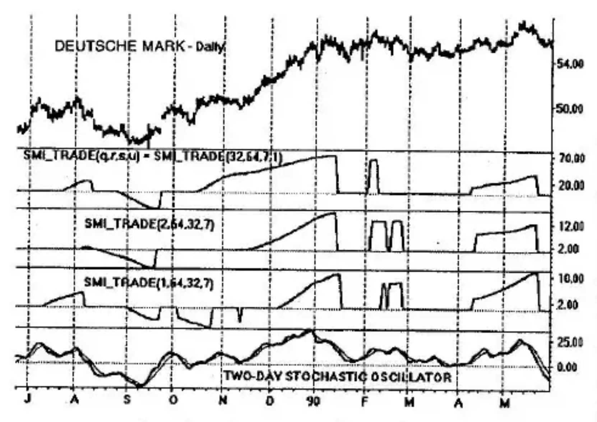

# Chapter 9: Stochastic Trade Filtering

Directional trending was accomplished in the previous chapter using the True Strength Index (*TSI*). In this chapter, we shall briefly describe the use of the Stochastic Momentum Index (*SMI*) for directional trending. The reader will find a description of the *SMI* and its double-smoothed properties in Chapter 3. We shall use a version of the Stochastic Momentum Index, *SMI(q,r,s,u)*, in which *q* is the look-back period, *r* and *s* are *EMA* smoothing increments. An additional smoothing of *u* bars is used when needed to remove high-frequency noise.

## Measuring Directional Movement with the Stochastic Momentum Index

Like all other momentum indicators, the *SMI* can provide erroneous signals. The *SMI* is defined over a range from +100 to -100. When it is rising and is above zero, it correctly identifies a rising trend (after a delay or lag has taken place). Similarly, when it is falling and is below zero, there is a one-to-one correspondence between the *SMI* and the declining price. All other conditions are *potentially* incorrect. For example, when the *SMI* is falling and in its positive region, it is indicative of two possible conditions: (1) falling prices, or (2) flat prices. When the *SMI* is rising and the rise takes place in its negative region, it indicates two possible conditions: (1) rising prices, or (2) flat prices.

Our objective is to identify clear, unambiguous trends. To accomplish this identification, we do not use all portions of the Stochastic Momentum Index, *SMI(q,r,s,u)*. We only use that portion which rises while in the positive region, or that portion which falls while in its negative region. All other regions are declared to be equal to zero. This defines *SMI\_Trade(q,r,s,u)* as shown in Figure 9-1.

The complete *SMI(q,r,s,u)* is also shown in Figure 9-1. It has a period of $q = 32$ days which is *EMA*-smoothed by $r = 64$ days. These two parameters define double stochastic smoothing. An additional smoothing of $s = 7$ days is applied to remove most of the high-frequency fluctuations. The $u$ parameter performs no smoothing function here and is set equal to 1. It is observed that the *SMI* has both rising and falling segments.

From January 1990 on through March 1990, prices are more or less flat, in congestion. We wish to identify this region, or at minimum

to stand aside. During this interval, the *SMI* is falling, which could lead to an erroneous interpretation that prices are also falling. This is avoided entirely by the definition of the *SMI\_Trade(q,r,s,u)* shown in Figure 9-1.

The bottom panel shows the 2-day stochastic oscillator, described in Chapter 3, which is used to identify turning points which are passed by the *SMI\_Trade* filter. Only those regions of the *SMI\_Trade* filter that are nonzero may be considered. This eliminates the need for trading for most of the congestion period.

## SMI\_Trade Modes

The *SMI* used here has four parameters: *q,r,s,u*. Only three are required to describe the various *SMI* operating modes. The fourth is included for noise cleanup and is usually a small number to prevent adding appreciable lag. Any two parameters define an *SMI* operating mode. Modes are defined (bold print) as:

1. **SMI(q,r,s,1)**. *s* is used for noise cleanup.
2. **SMI(2,r,s,u)**. *u* is used for noise cleanup.
3. **SMI(1,r,s,u)**. *u* is used for noise cleanup.

The various modes are shown in Figure 9-2 for the same-valued parameters.

The *SMI\_Trade* filtering is somewhat different for each of the modes. The *(q,r,s,1)* mode is the second panel down. It passes the mid-October to mid-January trend (although the first month of this trend is flat). The congestion starting in mid-January is correctly avoided except for a spike in early February. We say that the *SMI\_Trade* filter has "rejected" the congestion since it is zero.

By comparison, the *(2,r,s,u)* mode identifies the rally from mid-November to mid-January during its strongest rise. During the following congestion, two spike are present.

Finally, mode 3 *(1,r,s,u)* is shown in the fourth lower panel.

Regardless of the mode used, *SMI\_Trade* acts as a prefilter for the fast-acting entry/exit oscillator that is a part of the trading system. It tends to prevent trading during regions of price congestion, trading ranges. In performance of this valuable function, it can miss trading opportunities.

**Figure 9-2** Comparison of SMI_Trade Modes

Trade entry depends on both SMI\_Trade and the SMI(q,r,s,u) oscillator. For example, the spikes in Figure 9-2 would not be entered long because the SMI oscillator in February 1990 is in an overbought condition. The filtering action of *SMI\_Trade* eliminates those regions where the trends are ambiguous—it rejects congestion and flat prices. The fast oscillator provides the timing for entry and exit within the filtered trend regions that are not rejected by *SMI\_Trade*.
