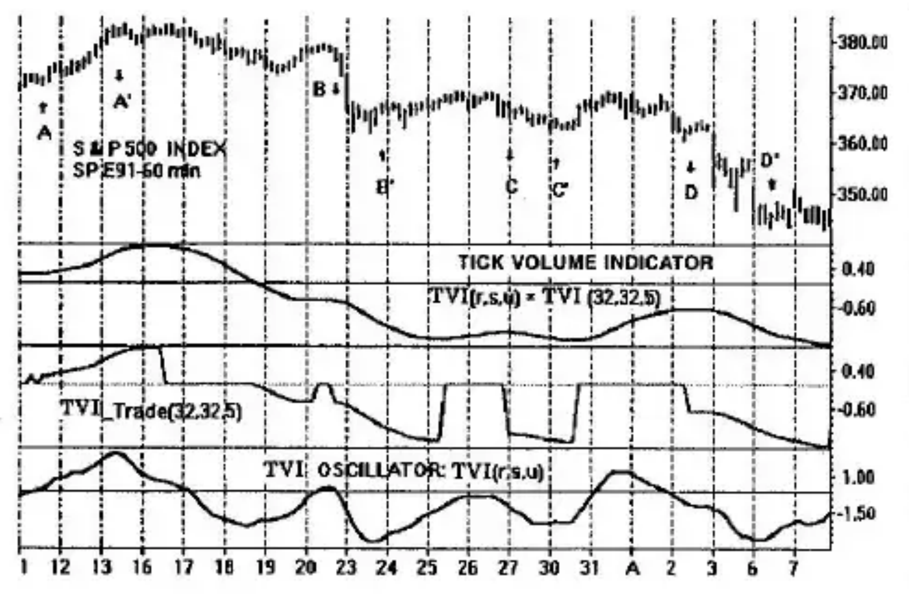

# Chapter 10: TVI_Trade Filtering

In Chapter 4, we defined an indicator based on the upticks and downticks occurring during the formation of a high-low price bar. The *Tick Volume Indicator* (TVI) was especially useful since it was unaffected by gaps. This property makes it a prime candidate for intraday trading application where opening gaps occur often. These gaps bias the response of many other indicators and, in so doing, prevent trading until the gap effects disappear.

## Directional Movement with the Tick Volume Indicator

All momentum-type indicators can show erroneous information. This is also the case for the Tick Volume Indicator of Chapter 4. Examination of the indicator over many price applications shows that trends are indicated without ambiguity (within lag constraints) when the indicator is rising and is positive (a rising trend), and when the indicator is falling and is negative (a declining trend).

Our aim is to use the TVI as an indicator of trends and to either avoid or identify flat prices and congestion regions. An example is shown in Figure 10-1 for the S&P 500 continuous contract (Omega Research method) with 60-minute bars. The Tick Volume Indicator is shown with three levels of smoothing: $TVI(r,s,u) = TVI(32,32,5)$. The third level of smoothing of 5 bars is included to help in high-frequency noise cleanup.

The third panel depicts $TVI\_Trade(r,s,u) = TVI\_Trade(32,32,5)$. When TVI is rising and is in its positive region or when TVI is falling and is in its negative region, then TVI_Trade and TVI are equal; for all other situations, TVI_Trade is equal to zero.

## A Basic TVI Intraday Trading System

Consider TVI_Trade as a filter. When it is zero, trading is not permitted. When it exists sloping upward, long positions may be taken and completed. Similarly, when it is sloping downward, short positions may be entered and exited.

In the bottom panel of Figure 10-1, a TVI oscillator is used as a trading instrument. We are permitted entry only in the direction of the TVI_Trade trend; exit is expressed as oscillator reversal from the trend.

**Caution:** This is not intended to be a complete trading system. It is included here to illustrate principles only.

Rules for entry and exit are as follows:

**Long Positions**

- Enter long when TVI_Trade rises above zero and the slopes of TVI_Trade and the TVI oscillator are both positive.
- Exit long when the TVI oscillator slope turns negative or when TVI_Trade reverts back to zero, whichever comes first.

**Short Positions**

- Enter short when TVI_Trade declines below zero and the slopes of TVI_Trade and the TVI oscillator are both negative.
- Exit short when the TVI oscillator slope turns positive or when TVI_Trade reverts back to zero, whichever comes first.

The TVI oscillator has 3 levels of smoothing in this example. The third level is used for noise cleanup. Typically, it will be a small value, from 2 to 5 price bars, and does not add appreciable lag to its turning points.

The first trade shown is a long entry at point A. Both TVI_Trade and the TVI oscillator have positive slope at this point. The trade exits at point A' due to a reversal of slope of the TVI oscillator. Although the TVI_Trade filter continues on with its positive slope, further entry is not permitted since the oscillator has an opposing (negative) slope.

On day 19, TVI_Trade shows a downward slope opening the gate for short trading. Trade entry is not permitted, however, since the TVI oscillator slope is in opposition; it is positive.

The next opportunity by TVI_Trade occurs on the latter part of day 20. A short entry is made at point B since both slopes are negative, going down. The short position exits at point B' when the oscillator reverses slope. Trade from C to C' and from D to D' are completed in similar fashion. Note that the gap did not affect trade from D to D'.
