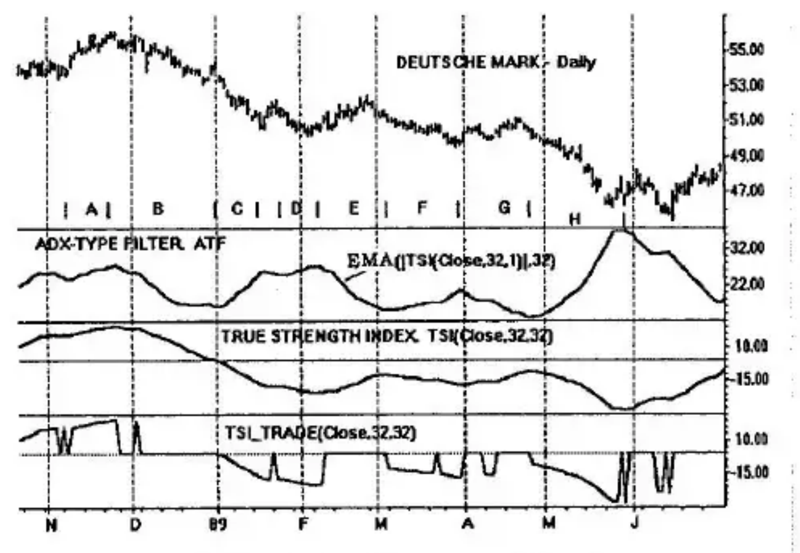
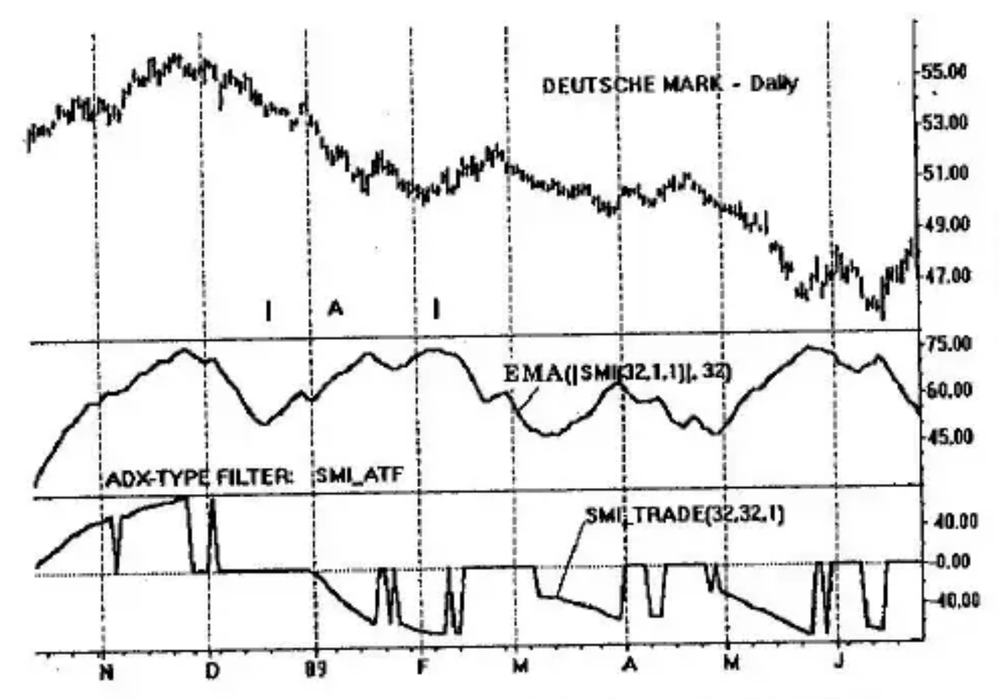

# Chapter 11: ADX-Type Filtering

In Appendix A, an attempt is made to reproduce the substance and flavor of Wilder's ADX, an indicator intended to measure and use directional movement. The process uses double smoothing where the first smoothing involves functions of the highs and lows, the *DI Diff* and *DI Sum* (Wilder's notation). At this point, the absolute value of the process is taken resulting in the DX, or *Directional Movement Index*. Finally, a second moving average is taken of the DX resulting in the ADX, or *average directional movement*. In Chapter 7, under the heading ADX-Type Double Smoothing, the process was introduced for the high-low momentum, HLM.

This very unusual process of double smoothing forms the basis of a class of filtering which we will call an *ADX-Type Filter*, or by the acronym, *ATF*.

## The ATF Process

The object of the ATF process is to construct filters that detect trends and directional movement, and reject or identify congestion regions of prices. It is intended to be a filter that is applied prior to the trader's "usual" processing strategy. The following basic steps are applicable:

1. Select a single-smoothed, double-sided momentum indicator as a trading instrument.
2. Take the absolute value of the indicator of Step 1.
3. Single-smooth Step 2.
4. Trends are deemed to exist only for positive slopes found in Step 3.

We shall apply this process using the example of Figure 11-1 for the daily Deutsche mark. The second panel down is a plot of the ATF filter. The third panel is the True Strength Index (*TSI*), from which it is derived. The fourth panel is *TSI_Trade* of Chapter 8 used for comparison.

Starting with Step 1, the single-smoothed, bipolar, momentum indicator selected here is the True Strength Index, $TSI(close, r, s) = TSI(close, 32, 1)$. The TSI formula is for double smoothing of $r$- and $s$-days. By letting $r = 32$ and $s = 1$, the formula represents single smoothing of 32-days.

With Step 2, the absolute value of the TSI is $|TSI(close, 32, 1)|$, where vertical bars enclosing the single-smoothed TSI are the notation for absolute value.

Step 3 requires single-smoothing of the absolute value of the TSI of Step 2. This result is the definition of *TSI_ADX-Type Filter*, *TSI_ATF*:

$$TSI\_ATF(close, 32, 32) = EMA(|TSI(close, 32, 1)|, 32)$$

where $EMA(|TSI(close, 32, 1)|, 32)$ is the 32-day exponential moving average of the absolute value of the 32-day single-smoothed TSI.

The effect of performing the absolute value is to take negative values of the single-smoothed TSI and fold them over into the positive scale bounded by 0 and +100. The effect takes negative slopes from the negative region and transforms them into positive slopes in the positive region. Single-smoothing of this result brings us to Step 4 of the process. Trends are identified by this process; the direction of the trends, however, are not indicated.

## Ambiguous Indications

Let us trace the ATF of Figure 11-1 viewing its positive slopes separately from its negative slopes. At the same time, we will compare it with the double-smoothed TSI and the TSI_Trade using the same parameters.

In segments A, C, D, F, and H, the slope of the ATF is positive, a rising ATF. This correctly indicates the directional movement as trending. In segment A, the trend is up. In segments C, D, F, and H, prices are going down. This is corroborated by $TSI\_Trade(close, 32, 32)$, which also shows direction. In segments B, E, and G, the slope of the ATF is negative. These correspond to zero regions of the TSI_Trade. Negative slopes of the ATF do not always mean a congestion region is present in prices. Segment B shows a price decline. Segment E indicates a price advance. Segment G shows flat prices. The negative slope of the ATF can be easily interpreted erroneously. Trending is uniquely indicated only for positive slopes of the ATF. The direction of the trending, however, is not indicated by the ATF. Direction must be obtained from sources such as a momentum indicator or a moving average.

## An ATF Filter Using Stochastic Momentum

We repeat the ATF process selecting the Stochastic Momentum Index, $SMI(q, r, s) = SMI(32, 1, 1)$ as shown in Figure 11-2. The SMI formula is for double smoothing when any two of the $q, r, s$ parameters are selected. In this example, we set the look-back interval at $q = 32$ with $r = s = 1$; the formula then represents single smoothing of 32 days.

Next we obtain the absolute value of the single-smoothed SMI as $|SMI(32, 1, 1)|$. Note again the meaning of the vertical bars as the absolute value of that enclosed between the bars.

Next we perform single-smoothing of the absolute value. This result is the definition of the *SMI_ADX-Type Filter*, the *SMI_ATF*:

$$SMI\_ATF(32, 32) = EMA(|SMI(32, 1, 1)|, 32)$$

where $EMA(|SMI(32, 1, 1)|, 32)$ is the 32-day exponential moving average of the absolute value of the 32-day (look-back) single-smoothed stochastic momentum index (SMI).

This brings us to Step 4 of the ATF process where we examine only the positive slopes of the SMI_ATF for trends. Comparison is made with $SMI\_Trade(q, r, s) = SMI\_Trade(32, 32, 1)$ and differences do occur in filtering. See segment A, for example, where the ATF has a positive slope indicating trending well before it occurred in its corresponding SMI_Trade.
