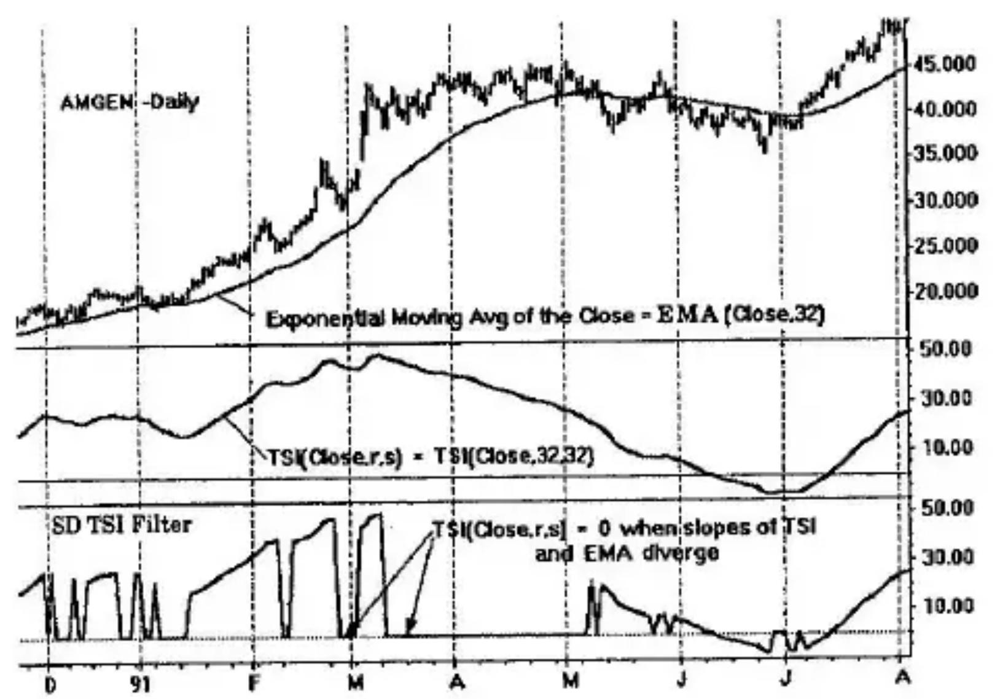
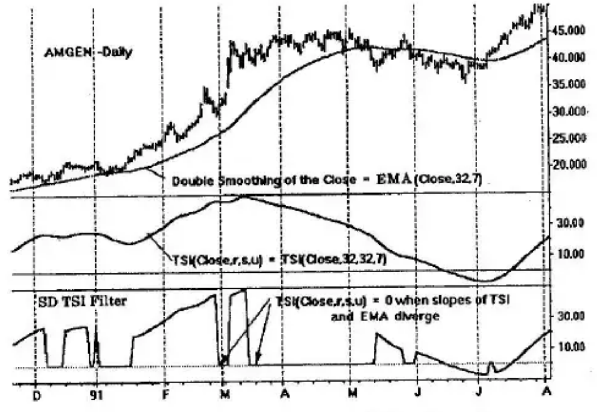
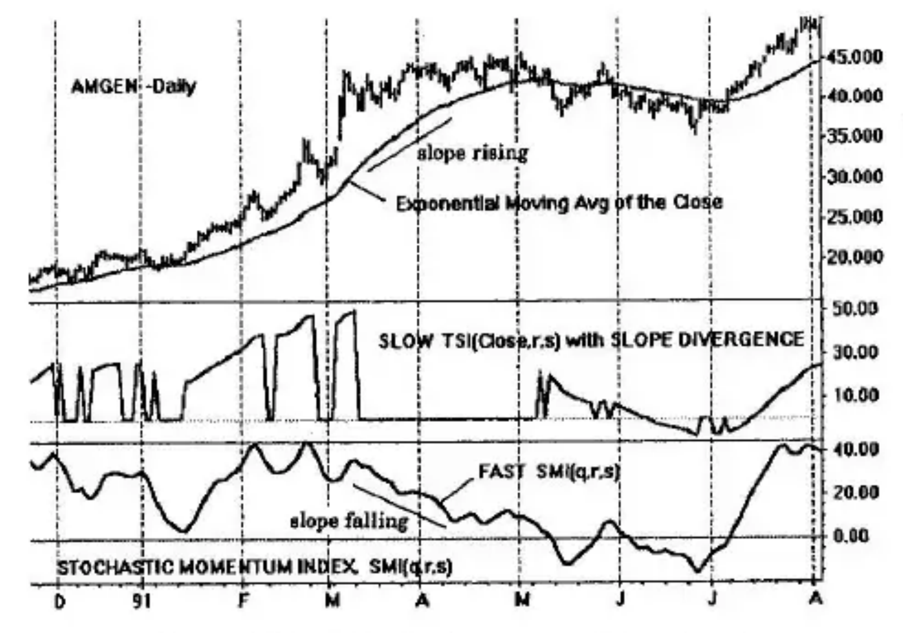
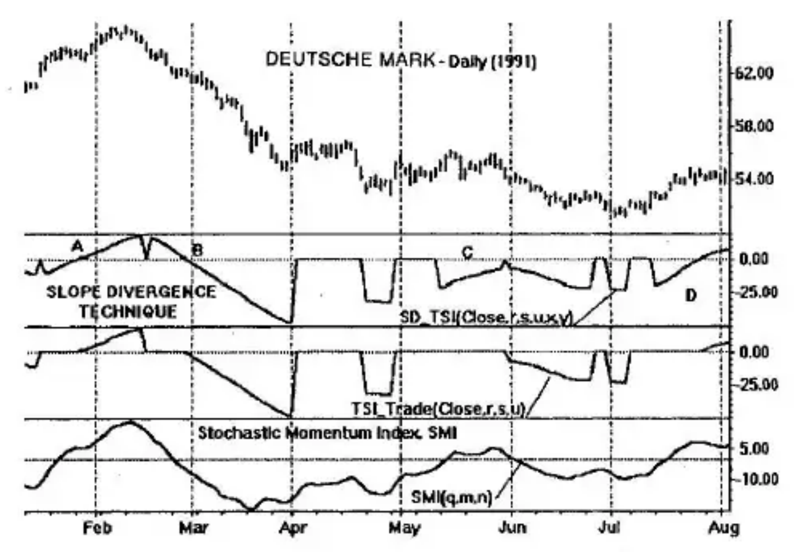
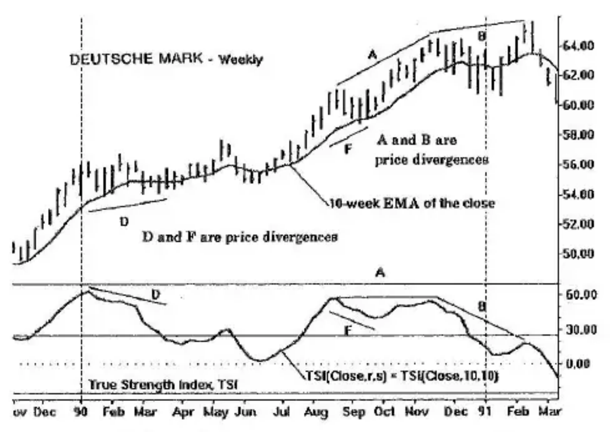

# Chapter 12: Slope Divergence

We have used various forms of prefiltering with the objective of separating price trends from regions of congestion. The techniques all used double smoothing of bipolar momentum indicators, in other words, momentum indicators whose values fluctuate from positive to negative. To isolate regions of congestion, trends were identified only in those regions of the indicator which were rising and positive, or were falling and negative. Other regions of the momentum indicators were potentially erroneous indicating either congestion or trends. Although this procedure uniquely identified trends (within lag limitations), it did not pick out all the trends that were present. There were many missed opportunities.

Ideally, we are in search of a technique that directly isolates the congestion regions, those regions of flat prices. If we can do this, all other regions will be trends, which is what we seek as trend followers.

## Slope Divergence

Two ingredients are required to directly identify "flat" prices: (1) a moving average of prices, and (2) a bipolar momentum indicator of prices based on moving average(s) of momentum. The technique is best explained by examples.

Figure 2-9 (Anatomy of a Rally: Price and Momentum) in Chapter 2 is an idealized figure showing a price rally at *A* followed by a region of flat prices at *B*. A moving average of the rally and its subsequent flat region is shown to be constantly rising. A momentum description appears in the bottom half of the Figure 2-9. For the rally at *A*, the momentum is flat and the moving average of momentum is rising together with the moving average of prices. For the flat region of *B*, the momentum is zero and the moving average of momentum decays to zero while the moving average of prices continues to rise. In the region of flat prices, the slope of the moving average of prices and the slope of the moving average of the momentum of prices are in opposite directions—we have a *slope divergence* situation.

By contrast, trending requires the moving average of momentum to be going in the same direction as the moving average of prices. If we define a trend by its moving average on its price, then the maxim, "go with the trend," is exemplified by the direction of the slopes relative to each other. We go with the trend when the slopes are in the same direction. We stand aside, or use countertrend trading techniques, when the slopes are in opposition, or *divergent*.

An example of the slope divergence technique is shown in Figure 12-1 for AMGEN and its long rally terminating in the congestion of prices of March and April 1991. On the top panel, the bar chart is shown with an overlay of a 32-day *EMA* of the close, *EMA*(close,32). The *EMA* rises with the rally and continues its rise through the flat congestion region. In the second panel, a plot of the *TSI*(close,*r*,*s*) = *TSI*(close,32,32) is used as the bipolar momentum indicator. Double smoothing of 32 days each is used. It is observed that the *TSI* tracks the rally: Its slope follows that of the moving average of price when prices are rising and goes in opposition when prices oppose the moving average. In early to mid-January, there are flat prices. In this region, the moving average (*EMA*) continues its rally up; however, slope divergence is present since the *TSI* is going down.

## Slope Divergence *TSI* Filter

The bottom panel of Figure 12-1 is a single plot of the slope divergence technique. It is the same as the *TSI* of the middle panel with the exception that it goes to zero whenever slope divergence exists. It is nonzero whenever slope divergence is absent; it is nonzero whenever trending exists. Limitations from this ideal once again are imposed by ever-present *lag* and price fluctuations not in tune with the moving average periods used in the momentum indicator.

**Figure 12-1** Slope Divergence

We define a slope divergence filter using the True Strength Index (*TSI*) as *SD_TSI*(close,*r*,*s*,*u*,*x*,*y*). In this notation, a triple-smoothed *TSI*(close,*r*,*s*,*u*) is used with sequential exponential moving averages of *r*, *s*, and *u* time intervals, respectively. In addition, a double exponential moving average is used as the moving average on price. Thus, sequential exponential moving averages of *x* and *y* intervals are evaluated on the close. In this way, the bottom panel of Figure 12-1 is expressed as *SD_TSI*(close,32,32,1,32,1). The technique is depicted with double smoothing of 32 days each in the *TSI* since *u* = *1*. In addition, since *y* = *1* single smoothing of 32 days is applied to the close.

Are these parameters apropos for AMGEN? They appear to be timely: Wherever there is a flat region in prices, or a changeover from rising to falling prices (and vice versa), the *SD_TSI* filter goes to zero in a timely fashion. In other regions where prices are trending, the *SD_TSI* filter also trends in the same direction. The problem, however, is the noisiness, which could be harmful in a trading system.

Additional smoothing is needed to clean up the high-frequency noise variation, as shown in Figure 12-2. A third level of smoothing where *u* = 7 days is used in the *TSI*. Also a second level of smoothing with *y* = 7 days is applied to the close. With these values, the *SD_TSI* filter in the bottom panel is expressed as *SD_TSI*(close,32,32,7,32,7). The resulting response is cleaner and smoother but at a cost of additional *lag*. How much additional smoothing should be applied is a function of the trading system used with the *SD_TSI* filter and the volatility of prices.

**Figure 12-2** Slope Divergence: Additional Smoothing

## A Basic Slope Divergence *TSI* Trading System

Following the same approach used in Chapter 8 for *TSI*_Trade, we may consider the slope divergence technique based on the *SD_TSI* as a prefilter to our usual trading methods. Figure 12-3 illustrates this using the slope divergence method of Figure 12-1 as a prefilter for an indicator such as the Stochastic Momentum Index, *SMI*(*q*,*r*,*s*). We may think of the *SD_TSI* as a "slow *TSI*" which goes to zero for flat regions of prices. We may further think of this modulated slow *TSI* as a substitute for trending prices.

A fast-acting indicator, for example, a "fast *SMI*" is introduced in the bottom panel. This indicator is used for trading purposes to accompany the trend represented by the surrogate. We take a position when the slopes are in the same direction. We exit a position when slopes are in opposition.

**Figure 12-3** Basic Slope Divergence Trading System

## Slope Divergence Technique Versus *TSI*_Trade

Ideally, the slope divergence technique would identify regions of price congestion, or flat prices. What remains would then be trends, either positive or negative. Does this actually happen? *TSI*_Trade identified trends but many escaped its view. Are these missed trading opportunities regained by the slope divergence technique? Again, the answer to these questions is unclear.

Consider the comparison of the *TSI*_Trade and *SD_TSI* plots of Figure 12-4 using the same moving average values. A fast-acting Stochastic Momentum Index (*SMI*) is used as the trading instrument after prefiltering. Note that slope divergence extends the time on the price rally for the segment at *A* compared with *TSI*_Trade. A similar situation exists at segment *B*. Slope divergence excels in this situation.

Consider segment *C*, which shows a minor fluctuation that may not be tradable. This is not a problem for *TSI*_Trade which is at zero negating the possibility of trading. Finally, segment *D* of the slope divergence method catches a small rally that is missed entirely by *TSI*_Trade.

**Figure 12-4** Slope Divergence versus *TSI* Trade

## Slope Divergence Versus Price Divergence

Figure 12-5 is a comparison of slope divergence and price divergence for the weekly Deutsche mark. Usually, the term divergence, when associated with a momentum indicator is a comparison of the indicator directly with its corresponding prices. Consider the price divergence *B*. The closing prices begin and end segment *B* at approximately the same level. The corresponding points on the *B* segment for the True Strength Index (*TSI*) do *not* have the same levels. The peaks are directed down. This divergence is termed a down-divergence indicating that subsequent prices will *likely* be lower. In this case, prices were lower.

Segment *A* also describes a downward divergence. Here the amplitude of prices is rising without a corresponding rise in the *TSI*. This is often followed by a flat region with another divergence such as at *B*. The resultant double divergence is construed to be a stronger indication of a trend change. Triple divergences (not shown) are even more powerful indications of trend change when they occur. Price divergences must be especially heeded when they occur near historically overbought or oversold regions as they did in Figure 12-5.

Slope divergence is different from price divergence. With slope divergence, a comparison is made of the *slope of the momentum indicator* and that of the *slope of the moving average of price*. When the slopes diverge, we usually will be in a region of flat prices, a congestion region. Unlike price divergences where we must wait for the second amplitude to signal the occurrence of a divergence, slope divergence is indicated without delay. This is exactly what happens at the slope divergences of segments *D* and *F*. Prices are rising and then enter a flat region. The moving average of price is also rising and continues to rise throughout the flat price region at *D*. The situation is entirely different for the *TSI* momentum indicator. As prices rise, the *TSI* also rises. However, immediately on entering the congestion region, the *TSI* quickly reverses direction, going down. The slopes of the *TSI* and the moving average of price are in opposition: A slope divergence is *in process* indicating flat prices are *in process*.

**Figure 12-5** Price Divergence versus Slope Divergence
