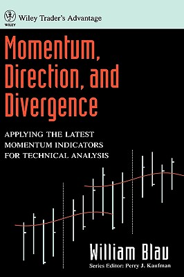

# Momentum, Direction, and Divergence



- **Author:** William Blau
- **Publisher:** John Wiley & Sons
- **Year:** 1995
- **Series:** Wiley Trader's Advantage
- **ISBN:** 978-0-471-02729-4

## Chapters

1. [Introduction](ch-01.md)
2. [True Strength Index](ch-02.md)
3. [Stochastic Momentum](ch-03.md)
4. [Tick Volume Indicator](ch-04.md)
5. [A Detrending Indicator](ch-05.md)
6. [Candlestick Momentum](ch-06.md)
7. [Directional Trending](ch-07.md)
8. [True Strength Directional Trending](ch-08.md)
9. [Stochastic Trade Filtering](ch-09.md)
10. [Tick Volume Trade Filtering](ch-10.md)
11. [ADX-Type Filtering](ch-11.md)
12. [Slope Divergence](ch-12.md)

## Appendices

- [Appendix A: Wilder's ADX](ap-01.md)
- [Appendix B: TradeStation and SuperCharts Code](ap-02.md)

## BibTeX

```bibtex
@book{Blau1995,
  author    = {Blau, William},
  title     = {Momentum, Direction, and Divergence: Applying the Latest Momentum Indicators for Technical Analysis},
  publisher = {John Wiley \& Sons},
  year      = {1995},
  isbn      = {978-0-471-02729-4},
  series    = {Wiley Trader's Advantage},
  pages     = {160},
  url       = {https://www.amazon.com/Momentum-Direction-Divergence-Applying-Convergence/dp/0471027294},
}
```
