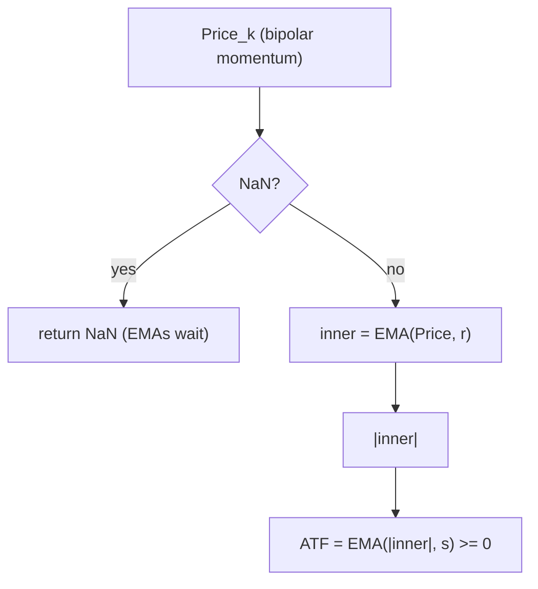

# ADX-Type Filter (ATF) — William Blau (Figure B-24)

> **Indicator (Group 9, "Trade Filters" — 9.2).**
> A non-negative **trend-strength** filter, analogous to Wilder's ADX. It
> rectifies and double-smooths a *bipolar momentum* series so that direction is
> discarded and only amplitude remains: a **rising** ATF signals a strengthening
> trend (use trend-following), a **falling** ATF signals a ranging market (use
> counter-trend). Per LeBeau & Lucas, the **slope** of the ATF matters more than
> its level.
>
> This file is **self-contained**. The EMA primitive is **embedded** (inlined). A
> porting agent needs only this document and `adx-type-filter.py`.
>
> **Input:** any *bipolar* (signed) momentum series. The two named instances take
> `close` (TSI_ATF) or `high/low/close` (SMI_ATF).

---

## 1. Definition (book Fig B-24)

$$\boxed{\;ATF(Price, r, s) = EMA\big(\,\big|EMA(Price, r)\big|\,,\; s\big)\;}$$

In Blau's EasyLanguage (Fig B-24):

```easylanguage
ATF = XAverage( AbsValue( XAverage(Price, r) ), s ) ;
```

`XAverage` is the Blau EMA ($\alpha = 2/(n+1)$, seeded with its first input;
period $1$ = passthrough). The pipeline is: **inner smooth** `EMA(·, r)` →
**rectify** `|·|` → **outer smooth** `EMA(·, s)`.

Because the output is a smoothed absolute value, **`ATF ≥ 0` always**. There is no
division and hence **no division guard**.

### 1.1 Canonical bipolar inputs

`Price` is any signed momentum/oscillator. Blau lists (Fig B-24):

| `Price` | Source | Formula |
|---------|--------|---------|
| TSI numerator | price momentum | $C_k - C_{k-(q-1)}$ |
| DTI numerator | high-low momentum | $HMU_k - LMD_k$, with $HMU_k=\max(H_k-H_{k-(q-1)},0)$, $LMD_k=\max(L_{k-(q-1)}-L_k,0)$ |
| TVI | tick balance | $Upticks_k - Downticks_k$ (synthetic proxy $= 2C_k - H_k - L_k$) |
| SMI raw | stochastic momentum | $C_k - 0.5\,(HH_q + LL_q)$, $HH_q=\max H$, $LL_q=\min L$ over $q$ bars |

### 1.2 Normalized-indicator form

Blau's note: `Price` may instead be a *single-smoothed normalized* indicator such
as `TSI(price, r, 1, 1)`, which then **replaces the inner** `EMA(Price, r)`:

$$ATF_{norm}(X, s) = EMA(|X|, s)$$

This is exactly :class:`AdxTypeFilter` with **`r = 1`** (inner EMA passthrough),
fed the normalized oscillator $X$. The catalog's
$TSI\_ATF(price, r) = EMA(|TSI(price, r, 1)|, r)$ is this form with $s = r$ and the
single-smoothed TSI as $X$.

---

## 2. Priming / warm-up (Option B) and NaN propagation

- Each EMA stage seeds on its first received **finite** value (Option B).
- A **leading NaN** in `Price` (e.g. the TSI/SMI momentum during its look-back
  warm-up) is **propagated**: ATF returns NaN and the inner/outer EMAs do **not**
  advance until the first finite input, at which point both stages seed together.
- The two **named** instances determine their own warm-up:
  - **TSI_ATF** (`mtm = C - C[q-1]`): NaN on bars $0..q-2$ (one NaN at bar 0 for
    the default $q=2$).
  - **SMI_ATF** (`sm = C - 0.5(HH_q+LL_q)`): NaN on bars $0..q-2$ (the $q$-bar
    HH/LL look-back). With the default $q=32$, bars $0..30$ are NaN.
- **Output ≥ 0** on every finite bar.



---

## 3. Parameters

### Generic `AdxTypeFilter(r, s)` / `atf_series(values, r, s)`

| Name | Symbol | Type | Range | Default | Meaning |
|------|--------|------|-------|---------|---------|
| `r` | $r$ | int | $\ge 1$ | 32 | Inner EMA period (smooths the signed momentum). $r=1$ ⇒ normalized-indicator form $EMA(|x|,s)$. |
| `s` | $s$ | int | $\ge 1$ | 32 | Outer EMA period (smooths the rectified amplitude). |

### `TsiAtf(q, r, s)` / `tsi_atf_series(closes, q, r, s)`

| Name | Type | Range | Default | Meaning |
|------|------|-------|---------|---------|
| `q` | int | $\ge 1$ | 2  | Momentum look-back for $C - C_{q-1}$. |
| `r` | int | $\ge 1$ | 32 | Inner EMA period. |
| `s` | int | $\ge 1$ | 32 | Outer EMA period. |

### `SmiAtf(q, r, s)` / `smi_atf_series(highs, lows, closes, q, r, s)`

| Name | Type | Range | Default | Meaning |
|------|------|-------|---------|---------|
| `q` | int | $\ge 1$ | 32 | HH/LL look-back for $C - 0.5(HH_q+LL_q)$. |
| `r` | int | $\ge 1$ | 32 | Inner EMA period. |
| `s` | int | $\ge 1$ | 32 | Outer EMA period. |

**Common configurations:** `TSI_ATF(price, 32)` = `tsi_atf_series(closes, q=2,
r=32, s=32)`; `SMI_ATF(32, 32)` = `smi_atf_series(highs, lows, closes, q=32,
r=32, s=32)`.

---

## 4. Reference implementation contract

```text
# Generic book ATF (Fig B-24).
AdxTypeFilter(r, s):
    inner = EMA(r); outer = EMA(s)
    update(x):
        if isnan(x): return NaN            # propagate; EMAs do not advance
        return outer( |inner(x)| )

# TSI_ATF: ATF on the TSI numerator.
TsiAtf(q, r, s):
    hist = last q closes; atf = AdxTypeFilter(r, s)
    update(close):
        push close
        if len(hist) < q: return NaN
        return atf( close - hist[oldest] )   # mtm = C - C[q-1]

# SMI_ATF: ATF on the SMI raw stochastic momentum.
SmiAtf(q, r, s):
    highs, lows = last q; atf = AdxTypeFilter(r, s)
    update(high, low, close):
        push high, low
        if len < q: return NaN
        return atf( close - 0.5*(max(highs) + min(lows)) )
```

The embedded `ExponentialMovingAverage` is copied verbatim from its own folder —
do not alter its numerics. Each EMA is a distinct, independently-primed instance.

**Invariant.** With `r = s = 1` both EMAs are passthroughs, so `ATF == |Price|`
exactly (bit-for-bit). Used as a verification check.

---

## 5. References

1. Blau, William. *Momentum, Direction, and Divergence.* Wiley, 1995 — **Figure
   B-24** gives the EasyLanguage user function
   `ATF = XAverage(AbsValue(XAverage(Price, r)), s)` and the list of canonical
   bipolar inputs (TSI/DTI numerators, TVI, SMI raw) plus the single-smoothed
   normalized-indicator alternative. **Appendix A** reviews Wilder's DMI/ADX that
   this filter emulates (LeBeau & Lucas: the ADX slope, not level, signals trend
   strength).
2. Wilder, J. Welles. *New Concepts in Technical Trading Systems.* Trend Research,
   1978 — original DMI / ADX.

### BibTeX

```bibtex
@book{blau1995momentum,
  author    = {Blau, William},
  title     = {Momentum, Direction, and Divergence: Applying the Latest
               Momentum Indicators for Technical Analysis},
  publisher = {John Wiley \& Sons},
  address   = {New York},
  year      = {1995},
  isbn      = {9780471027294}
}

@book{wilder1978newconcepts,
  author    = {Wilder, J. Welles},
  title     = {New Concepts in Technical Trading Systems},
  publisher = {Trend Research},
  address   = {Greensboro, NC},
  year      = {1978},
  isbn      = {9780894590276}
}
```

> **Note.** The definition follows the **book Figure B-24** (authoritative
> EasyLanguage), which is more general (two periods $r, s$; any bipolar momentum)
> than the catalog's one-period `ATF(X, r) = EMA(|single_smoothed_X|, r)` — the
> latter is the $s = r$, normalized-input special case (§1.2). There is no
> dedicated MQL5 reference file for ATF.
