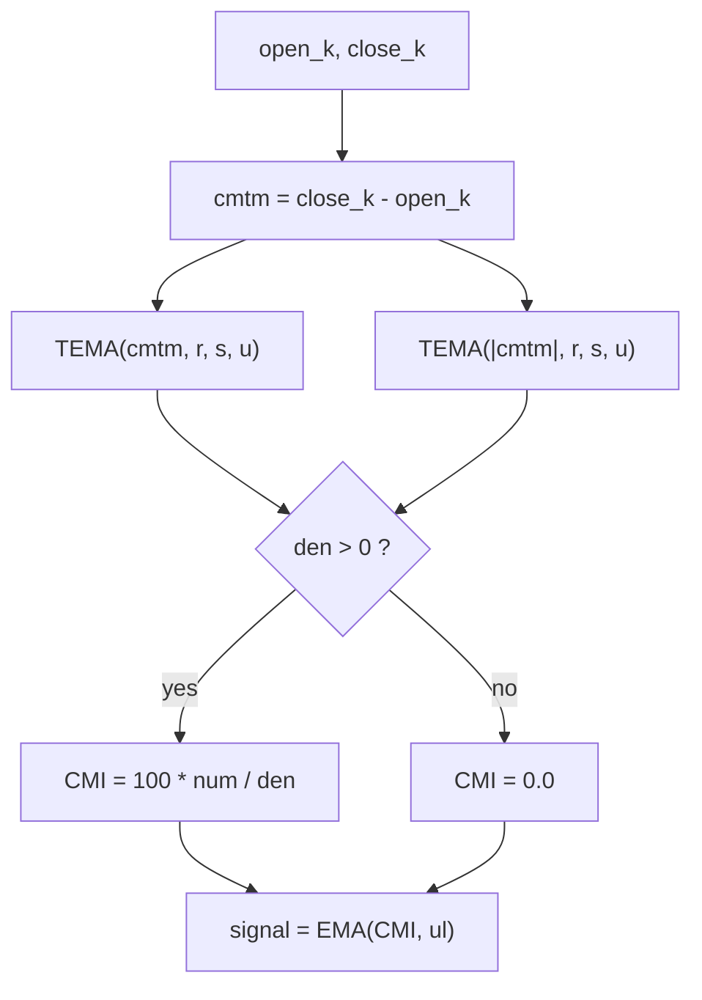

# Candlestick Momentum Index (CMI) — William Blau

> **Indicator (Group 6: Candlestick Momentum).**
> The CMI is the True Strength Index applied not to inter-bar price momentum but
> to **intra-bar candle momentum** — the candle body $close - open$. Because it
> measures only what happens *inside* each bar, it is immune to overnight/inter-bar
> gaps. Like the TSI it is a double-/triple-smoothed oscillator bounded to
> $[-100, +100]$.
>
> This file is **self-contained**. The EMA primitive is **embedded** (inlined) in
> the implementation — see `../core/exponential-moving-average/description.md` for
> its full derivation. A porting agent needs only this document and
> `candlestick-momentum-index.py`.
>
> **Inputs:** **Open and Close** series, aligned bar-for-bar. (No high/low used.)
>
> **This is a two-output indicator.** Each `update` returns a named tuple
> `(cmi, signal)`: the oscillator above, plus an `ul`-period EMA of it (the
> **signal line**, Blau's *Ergodic* form, ch. 6.4). Both outputs are finite from
> bar 0 (no NaN warm-up). Set `ul = 1` for a passthrough signal (`signal == cmi`).

---

## 1. Definition

### 1.1 Candle momentum

The candle momentum is the signed body of the candle:

$$cmtm_k = close_k - open_k$$

It is positive on an up (white/green) candle, negative on a down
(black/red) candle, and zero on a doji. Unlike a close-to-close momentum it never
sees the gap between yesterday's close and today's open, so it isolates pure
intra-session direction.

### 1.2 The index

The CMI is $100\times$ the triple-smoothed candle momentum over the
triple-smoothed absolute candle momentum, using the same EMA cascade as the TSI:

$$\boxed{\;CMI(r,s,u)_k = 100 \cdot \frac{\mathrm{TEMA}(cmtm, r, s, u)_k}{\mathrm{TEMA}(|cmtm|, r, s, u)_k}\;}$$

where $\mathrm{TEMA}(x, r, s, u) = EMA(EMA(EMA(x, r), s), u)$ and `EMA(x, n)` is
the Blau EMA ($\alpha = 2/(n+1)$, seeded with its first input; period 1 =
passthrough).

> **Note on the momentum period $q$.** The MQL5 reference `Blau_CMI.mq5`
> generalizes the body as $cmtm_k = close_k - open_{k-(q-1)}$ with default
> $q=1$. This port **fixes $q=1$** (the classic candle body $close-open$ from
> Blau's book), so there is no look-back and no NaN warm-up region.

### 1.3 Division guard

If $\mathrm{TEMA}(|cmtm|, r, s, u) = 0$ the value is **`0.0`** (matches
`Blau_CMI.mq5`: `value2>0 ? value1/value2 : 0`). Because $|cmtm| \ge 0$ and the
EMA of non-negatives is non-negative, this triggers only when every candle body
seen so far is exactly zero (all dojis).

### 1.4 Bounds

Since $|cmtm_k| = |close_k - open_k|$ dominates the signed series,
$|\mathrm{TEMA}(cmtm)| \le \mathrm{TEMA}(|cmtm|)$, so $CMI \in [-100, +100]$.

### 1.5 Signal line (second output)

The signal line is an `ul`-period EMA of the oscillator:

$$signal_k = EMA(CMI, ul)_k$$

Combining the CMI with its signal line is the **Ergodic** form (ch. 6.4). The
signal EMA seeds on the oscillator's **bar-0** value (the CMI has no NaN warm-up),
so the signal is finite from bar 0 too. With $ul = 1$ the EMA is a passthrough,
so $signal_k = CMI_k$ for every bar.

---

## 2. Priming convention (Option B — book / EasyLanguage)

Same convention as the TSI (see `../true-strength-index/description.md` §2), but
**simpler**: with $q=1$ the candle momentum $cmtm_k = close_k - open_k$ is
defined from **bar 0**, so there is **no NaN warm-up region** — all six EMA
stages seed on bar 0 and the CMI is finite for every bar (the very first bar is
$\pm100$ or $0$ via the all-passthrough/guard logic).



---

## 3. Parameters

| Name | Symbol | Type | Range | Default | Meaning |
|------|--------|------|-------|---------|---------|
| `r`  | $r$  | int | $\ge 1$ | 20 | 1st EMA period (on $cmtm$). |
| `s`  | $s$  | int | $\ge 1$ | 5  | 2nd EMA period. |
| `u`  | $u$  | int | $\ge 1$ | 3  | 3rd EMA period ($u=1$ ⇒ double smoothing). |
| `ul` | $ul$ | int | $\ge 1$ | 3  | Signal-line EMA period (2nd output). $ul=1$ ⇒ signal = CMI. |

**Common configurations:**

- `CMI(20,5,3)` — MQL5 / book reference default (triple-smoothed).
- `CMI(r,s,1)` — double-smoothed variant.
- `CMI(1,1,1)` — raw $\mathrm{sign}(close-open)\times100$, $0$ on a doji.

---

## 4. Output

Two parallel outputs per bar, `(cmi, signal)`, both in range $[-100, +100]$:

**Oscillator (`cmi`):**

- `> 0` — up candles (close above open) dominate (bullish intra-bar pressure);
- `< 0` — down candles dominate (bearish);
- common alert levels at $\pm 25$.

**Signal line (`signal`):**

- An `ul`-period EMA of the oscillator (§1.5), the **Ergodic** signal line.
- Finite from bar 0 (the oscillator has no NaN warm-up). $ul = 1$ ⇒
  `signal == cmi` exactly.

---

## 5. Reference implementation contract

```text
state:
    num_r,s,u : three chained EMAs for the cmtm cascade
    den_r,s,u : three chained EMAs for the |cmtm| cascade
    sig_ema   : EMA(ul) for the signal line (2nd output)

update(open, close) -> (cmi, signal):
    cmtm = close - open
    num  = num_u(num_s(num_r(cmtm)))
    den  = den_u(den_s(den_r(abs(cmtm))))
    cmi    = 0.0 if den <= 0 else 100.0 * num / den
    signal = sig_ema(cmi)                    # seeds on bar-0 cmi (no NaN warm-up)
    return (cmi, signal)
```

The embedded `ExponentialMovingAverage` class is copied verbatim from its own
folder — do not alter its numerics.

---

## 6. References

1. Blau, William. *Momentum, Direction, and Divergence.* Wiley, 1995. Defines
   Candlestick Momentum $cmtm = close - open$ and the Candlestick Momentum Index
   $CMI = 100\,\mathrm{TEMA}(cmtm)/\mathrm{TEMA}(|cmtm|)$.
2. MetaQuotes Software Corp. *Blau_CMI.mq5* / *WilliamBlau.mqh*, 2011. MQL5 port;
   generalizes with a momentum period $q$ (default $1$); division guard
   `value2>0 ? … : 0`; defaults $r=20, s=5, u=3$.

### BibTeX

```bibtex
@book{blau1995momentum,
  author    = {Blau, William},
  title     = {Momentum, Direction, and Divergence: Applying the Latest
               Momentum Indicators for Technical Analysis},
  publisher = {John Wiley \& Sons},
  address   = {New York},
  year      = {1995},
  isbn      = {9780471027294}
}

@misc{metaquotes2011blaucmi,
  author       = {{MetaQuotes Software Corp.}},
  title        = {{Blau\_CMI.mq5}: Candlestick Momentum Index (William Blau), MQL5},
  year         = {2011},
  howpublished = {\url{https://www.mql5.com}},
  note         = {CMI(r,s,u) = 100*TEMA(cmtm,r,s,u)/TEMA(|cmtm|,r,s,u);
                  cmtm = close - open; division guard value2>0 ? : 0;
                  defaults r=20,s=5,u=3}
}
```
