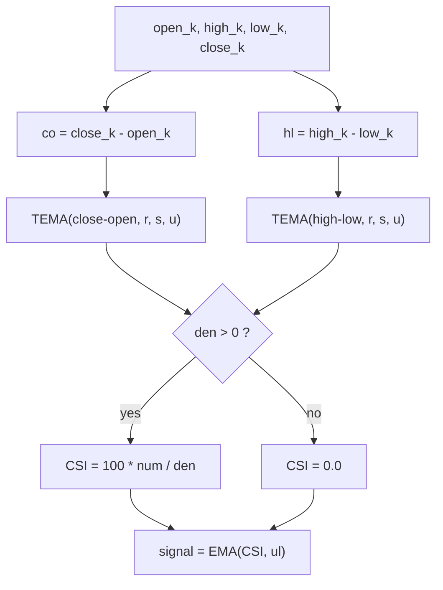

# Candlestick Index (CSI) — William Blau

> **Indicator (Group 6: Candlestick Momentum).**
> The CSI is a **signed** oscillator that measures the **candle body**
> ($close - open$) relative to the bar's **range** ($high - low$), each smoothed
> by a triple EMA cascade. It answers "are the candle bodies persistently
> bullish (close above open) or bearish (close below open) relative to how wide
> the bars are?" and is bounded to $[-100, +100]$.
>
> This file is **self-contained**. The EMA primitive is **embedded** (inlined) in
> the implementation — see `../core/exponential-moving-average/description.md` for
> its full derivation. A porting agent needs only this document and
> `candlestick-strength-index.py`.
>
> **Inputs:** **Open, High, Low and Close** series, aligned bar-for-bar.
>
> **Two outputs.** Following Blau's *Ergodic* construction (book, Ch. 6.4), each
> bar yields **both** the CSI oscillator **and** an EMA **signal line**
> $signal_k = EMA(CSI, ul)_k$. `update` returns a named tuple `(csi, signal)`;
> `csi_series` returns two parallel lists. Set `ul = 1` for a passthrough signal
> (`signal == csi` every bar).

---

## 1. Definition

### 1.1 Intra-bar candle body and range

Two intra-bar quantities per bar:

$$co_k = close_k - open_k \qquad (\text{signed candle body})$$

$$hl_k = high_k - low_k \qquad (\text{the bar's full range, } \ge 0)$$

The body $co_k$ is **signed** (positive on a bullish bar, negative on a bearish
bar), while the range $hl_k \ge 0$. Because both $open$ and $close$ lie inside
$[low, high]$, every bar satisfies $|co_k| \le hl_k$.

### 1.2 The index

The CSI is $100\times$ the triple-smoothed candle body over the triple-smoothed
range:

$$\boxed{\;CSI(r,s,u)_k = 100 \cdot \frac{\mathrm{TEMA}(close - open, r, s, u)_k}{\mathrm{TEMA}(high - low, r, s, u)_k}\;}$$

where $\mathrm{TEMA}(x, r, s, u) = EMA(EMA(EMA(x, r), s), u)$ and `EMA(x, n)` is
the Blau EMA ($\alpha = 2/(n+1)$, seeded with its first input; period 1 =
passthrough).

This is Blau's **CandleStick Indicator** (book Ch. 6; Appendix B, Figure B-15;
MQL5 `Blau_CSI.mq5`). It is the *range-normalized* sibling of the candlestick
**momentum** index `CMI` $= 100\,\mathrm{TEMA}(close-open)/
\mathrm{TEMA}(|close-open|)$: both share the same signed numerator
$\mathrm{TEMA}(close-open)$, but CSI divides by the smoothed **range** while CMI
divides by the smoothed **absolute body**.

### 1.3 Division guard

If $\mathrm{TEMA}(high-low, r, s, u) \le 0$ the value is **`0.0`**. Because
$high-low \ge 0$, this triggers only when every bar seen so far has $high=low$
(a zero-range bar, e.g. a limit-locked market).

### 1.4 Bounds

Since $|close-open| \le high-low$ on every bar and the EMA preserves these
bounds (a convex blend of values in $[-hl, +hl]$ stays in range),
$|\mathrm{TEMA}(close-open)| \le \mathrm{TEMA}(high-low)$, so
$CSI \in [-100, +100]$. The extreme $+100$ is approached when closes pin the
high while opens pin the low (relentless bullish bodies); $-100$ is the
mirror-image bearish case; $0$ when bodies net out.

### 1.5 Signal line (Ergodic form)

Blau pairs the oscillator with a short EMA **signal line** (Ch. 6.4):

$$signal_k = EMA(CSI, ul)_k$$

Because the CSI is finite from bar 0 (no NaN warm-up), the signal EMA seeds on
bar 0's oscillator value and is finite everywhere. Being an EMA of a
$[-100,100]$ series, the signal also lies in $[-100,100]$. The default $ul = 3$;
$ul = 1$ makes the signal a passthrough (`signal == csi`). Crossovers of the CSI
through its signal line are the usual Ergodic trade trigger.

---

## 2. Priming convention (Option B — book / EasyLanguage)

Same convention as the CMI (see `../candlestick-momentum-index/description.md`
§2): both intra-bar series $close-open$ and $high-low$ are defined from
**bar 0** (no look-back), so there is **no NaN warm-up region** — all six EMA
stages seed on bar 0 and the CSI is finite for every bar.



---

## 3. Parameters

| Name | Symbol | Type | Range | Default | Meaning |
|------|--------|------|-------|---------|---------|
| `r`  | $r$  | int | $\ge 1$ | 20 | 1st EMA period. |
| `s`  | $s$  | int | $\ge 1$ | 5  | 2nd EMA period. |
| `u`  | $u$  | int | $\ge 1$ | 3  | 3rd EMA period ($u=1$ ⇒ double smoothing). |
| `ul` | $ul$ | int | $\ge 1$ | 3  | Signal-line EMA period ($ul=1$ ⇒ passthrough). |

**Common configurations:**

- `CSI(20,5,3)` — MQL5 reference default (triple-smoothed).
- `CSI(32,32,1)` — slow double-smoothed variant.
- `CSI(1,1,1)` — raw candle body / range $\times100$, $0$ on a zero-range bar.

---

## 4. Output

**Two values per bar** — the CSI oscillator and its signal line — both in
$[-100, +100]$:

- near `+100` — bodies persistently bullish and span most of the range (strong up);
- near `-100` — bodies persistently bearish (strong down);
- near `0` — bullish and bearish bodies net out (no candle bias);
- common alert levels around $\pm25$;
- `signal` is the $ul$-period EMA of `csi`; CSI/signal crossovers are the
  Ergodic trade trigger.

---

## 5. Reference implementation contract

```text
state:
    num_r,s,u : three chained EMAs for the (close-open) cascade
    den_r,s,u : three chained EMAs for the (high-low) cascade
    signal_ema: ul-period EMA of the oscillator

update(open, high, low, close) -> (csi, signal):
    co     = close - open
    hl     = high  - low
    num    = num_u(num_s(num_r(co)))
    den    = den_u(den_s(den_r(hl)))
    csi    = 0.0 if den <= 0 else 100.0 * num / den
    signal = signal_ema(csi)        # seeds on bar 0; finite everywhere
    return (csi, signal)
```

The embedded `ExponentialMovingAverage` class is copied verbatim from its own
folder — do not alter its numerics.

---

## 6. References

1. Blau, William. *Momentum, Direction, and Divergence.* Wiley, 1995, ch. 6 and
   Appendix B (Figure B-15). Defines the CandleStick Indicator as
   $CSI = 100\,\mathrm{TEMA}(close-open)/\mathrm{TEMA}(high-low)$; range
   $[-100,+100]$; triple exponential smoothing $r, s, u$ (double smoothing with
   $u = 1$ suffices for most applications).
2. Zelinsky, Andrey F. *William Blau's indicators in MQL5* (2011),
   `Blau_CSI.mq5`. Same definition with a $q$-bar lookback on the body and range
   (`CMtm = close - open[q-1]`, `HHLL = HH(q) - LL(q)`); defaults
   $q=1, r=20, s=5, u=3$, displayed scale $[-100,100]$. This port fixes $q=1$
   (the book's Appendix B form).

### BibTeX

```bibtex
@book{blau1995momentum,
  author    = {Blau, William},
  title     = {Momentum, Direction, and Divergence: Applying the Latest
               Momentum Indicators for Technical Analysis},
  publisher = {John Wiley \& Sons},
  address   = {New York},
  year      = {1995},
  isbn      = {9780471027294}
}
```

> **Naming note.** The folder is named `candlestick-strength-index`, but Blau's
> own name for this indicator is the **CandleStick Indicator (CSI)**. The
> numerator is the *signed* candle body $close-open$ (not the close-in-range
> distance $close-low$); the result is two-sided in $[-100,+100]$.
