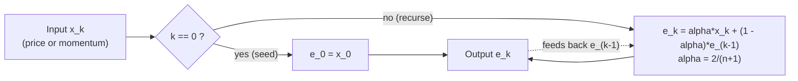
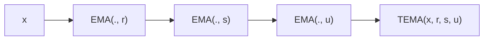

# Exponential Moving Average (Blau / EasyLanguage `XAverage`)

> **Building block, not a shipped indicator.**
> This document defines the single most important primitive in William Blau's
> *Momentum, Direction, and Divergence* (1995) toolkit: the exponential moving
> average (EMA), exactly as EasyLanguage implements it under the name
> `XAverage`. Every Blau indicator (TSI, SMI, DTI, Ergodic, CMI, ...) is built
> by **cascading** this EMA two or three times. Because the porting target
> embeds (inlines) this code into each indicator rather than importing a shared
> module, this file is the **single source of truth** for the EMA's exact
> numerical behaviour. Port it byte-for-byte.

---

## 1. Definition

The EMA is a recursive (infinite-impulse-response) smoother. Given an input
series $x_0, x_1, x_2, \dots$ and an integer period $n \ge 1$, the EMA output
series $e_0, e_1, e_2, \dots$ is defined by a **seed** and a **recursion**:

$$e_0 = x_0$$

$$e_k = e_{k-1} + \alpha \cdot (x_k - e_{k-1}), \qquad k \ge 1$$

where the **smoothing factor** $\alpha$ depends only on the period $n$:

$$\alpha = \frac{2}{n + 1}$$

The recursion is algebraically identical to the weighted-blend form used in the
MQL5 reference port:

$$e_k = \alpha \cdot x_k + (1 - \alpha) \cdot e_{k-1}$$

Both forms produce bit-identical results in IEEE-754 only up to rounding; this
library standardises on the **blend form** $e_k = \alpha x_k + (1-\alpha)e_{k-1}$
to match the MQL5 reference (`WilliamBlau.mqh`) exactly. See §6.

### 1.1 Smoothing factor table

| $n$ | $\alpha = 2/(n+1)$ |
|----:|:-------------------|
| 1   | 1.0 (passthrough)  |
| 2   | 0.6666...          |
| 3   | 0.5                |
| 5   | 0.3333...          |
| 9   | 0.2                |
| 20  | 0.0952...          |
| 50  | 0.0392...          |

---

## 2. The two conventions that matter

These are the only two places where naive EMA implementations diverge from
Blau's, and **getting either wrong silently corrupts every downstream
indicator**.

### 2.1 Seeding: first output equals first input

The EMA is **primed from bar 0**: the very first output equals the very first
input, $e_0 = x_0$. There is **no NaN / warm-up gap** and no "average the first
$n$ values" simple-moving-average seed. Consequently:

- The EMA emits a finite value on **every** bar, starting at index 0.
- A cascade `EMA(EMA(x, r), s)` is also finite from bar 0, because the inner
  EMA is finite from bar 0.

> The NaN / "not-primed" concept *does* appear in Blau indicators, but it comes
> from **momentum look-backs** (e.g. $x_k - x_{k-q}$ needs $q$ prior bars), not
> from the EMA. The EMA itself never produces NaN.

### 2.2 Period 1 is a pure passthrough

When $n = 1$:

$$\alpha = \frac{2}{1+1} = 1 \implies e_k = 1 \cdot x_k + 0 \cdot e_{k-1} = x_k$$

So **`EMA(x, 1) = x`** identically. This is not an edge case to guard against —
it is a *designed feature*. Blau routinely sets one stage of a double/triple
cascade to period 1 to "switch off" that stage:

- `DEMA(x, r, 1) = EMA(EMA(x, r), 1) = EMA(x, r)` → single smoothing.
- `TEMA(x, r, s, 1) = EMA(EMA(EMA(x,r),s),1) = EMA(EMA(x,r),s)` → double smoothing.

Your implementation **must** accept $n = 1$ and return the input unchanged. Do
not special-case it; the formula already handles it. (Reject only $n < 1$.)

---

## 3. Parameters

| Name     | Symbol | Type | Range        | Default | Meaning                                   |
|----------|--------|------|--------------|---------|-------------------------------------------|
| `period` | $n$    | int  | $n \ge 1$    | (none)  | EMA length. Larger ⇒ smoother, more lag.  |

There is **no universal default** for a bare EMA — the caller always supplies a
period appropriate to the enclosing indicator (e.g. Blau's triple-smoothing
defaults are $r=20, s=5, u=3$ for the TSI). Common stage periods in Blau's work
range from 1 (passthrough) to ~300 (long-memory smoothing).

---

## 4. Lag and frequency response (intuition for porters)

- **Lag.** An $n$-period EMA delays a trend by roughly $(n-1)/2$ bars. This is
  why Blau builds momentum first, then smooths it: smoothing *momentum* adds the
  lag of only one stage, whereas smoothing *price* directly with a long period
  is sluggish.
- **Memory.** Because the recursion never fully forgets old data, the EMA has
  infinite memory. The seed's influence decays as $(1-\alpha)^k$ and becomes
  negligible after a handful of multiples of $n$, but it is **never exactly
  zero**. This is precisely why the seed convention (§2.1) must be reproduced
  exactly — a different seed perturbs early outputs and, in a cascade, those
  perturbations propagate.

---

## 5. Data flow



Cascading (how every Blau indicator uses it):



---

## 6. Reference implementation (authoritative pseudocode)

```text
state:
    primed : bool   = false
    prev   : float  = 0.0
    alpha  : float  = 2.0 / (1.0 + period)      # computed once at construction

update(x) -> float:
    if not primed:
        prev   = x                              # seed: e_0 = x_0
        primed = true
        return prev
    e    = alpha * x + (1.0 - alpha) * prev      # blend form (matches MQL5)
    prev = e
    return e
```

**Why the blend form and not the increment form?** The two are equal in exact
arithmetic, but `alpha*x + (1-alpha)*prev` is the literal expression evaluated
by the MQL5 reference (`buffer[i]=price[i]*dSmoothFactor+buffer[i-1]*(1.0-dSmoothFactor)`).
Reproducing the *same* floating-point operation order keeps every language's
output bit-identical to the published reference values in the test corpus.

### 6.1 MQL5 reference (verbatim, for provenance)

From `WilliamBlau.mqh`, `ExponentialMAOnBufferWB`:

```cpp
if(period<1 || rates_total-begin<period) return(0);   // reject period < 1
double dSmoothFactor = 2.0/(1.0+period);              // alpha
...
buffer[begin] = price[begin];                         // seed e_0 = x_0
for(i=begin+1; i<limit; i++)
    buffer[i] = price[i]*dSmoothFactor + buffer[i-1]*(1.0-dSmoothFactor);
```

This library fixes `begin = 0` (streaming from the first bar), so
`buffer[0] = price[0]`.

---

## 7. Worked micro-example

Input $x = [10, 12, 11]$, period $n = 3 \Rightarrow \alpha = 0.5$:

| $k$ | $x_k$ | computation                        | $e_k$ |
|----:|------:|------------------------------------|------:|
| 0   | 10    | seed                               | 10.0  |
| 1   | 12    | $0.5 \cdot 12 + 0.5 \cdot 10$      | 11.0  |
| 2   | 11    | $0.5 \cdot 11 + 0.5 \cdot 11$      | 11.0  |

With $n = 1$ the same input returns $[10, 12, 11]$ unchanged (passthrough).

---

## 8. Edge cases & contract

- **`period < 1`** → invalid; raise / reject at construction. (MQL5 returns 0,
  i.e. computes nothing.)
- **`period == 1`** → valid; pure passthrough (§2.2).
- **First call** → returns the input value unchanged (seed).
- **NaN/Inf input** → not handled specially; propagates per IEEE-754. Blau data
  is clean OHLC, so no special guarding is required.
- **Statefulness** → each instance carries `prev` + `primed`. One instance per
  series. Cascades use one instance per stage, wired output→input.

---

## 9. References

1. Blau, William. *Momentum, Direction, and Divergence: Applying the Latest
   Momentum Indicators for Technical Analysis.* New York: John Wiley & Sons,
   1995. (Defines all indicators in terms of EMA cascades; EasyLanguage source
   in Appendix B uses `XAverage` for the EMA.)
2. MetaQuotes Software Corp. *WilliamBlau.mqh* (MQL5 port of Blau's indicators),
   2010. Function `ExponentialMAOnBufferWB` — the authoritative numerical
   reference reproduced in §6.1.
3. EasyLanguage / TradeStation. `XAverage` reserved word — the exponential
   moving average primitive Blau's book builds upon.

### BibTeX

```bibtex
@book{blau1995momentum,
  author    = {Blau, William},
  title     = {Momentum, Direction, and Divergence: Applying the Latest
               Momentum Indicators for Technical Analysis},
  publisher = {John Wiley \& Sons},
  address   = {New York},
  year      = {1995},
  isbn      = {9780471027294}
}

@misc{metaquotes2010williamblau,
  author       = {{MetaQuotes Software Corp.}},
  title        = {{WilliamBlau.mqh}: MQL5 Implementation of William Blau's
                  Momentum Indicators},
  year         = {2010},
  howpublished = {\url{https://www.mql5.com}},
  note         = {Function \texttt{ExponentialMAOnBufferWB}; smoothing factor
                  $2/(1+\mathrm{period})$, seed $e_0 = x_0$}
}
```
