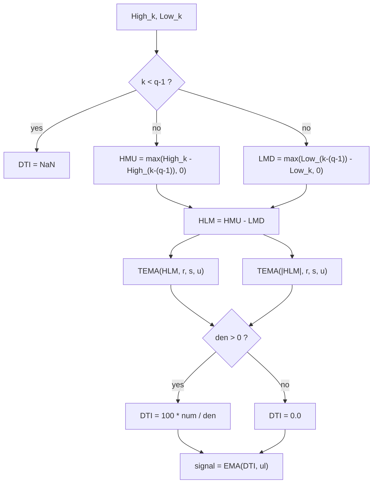

# Directional Trend Index (DTI) — William Blau

> **Indicator (Group 7: Directional Trending / High-Low Momentum).**
> The DTI is the True Strength Index applied not to price momentum but to
> **High-Low Momentum (HLM)** — a composite built from how far the bar's high
> rises and its low falls relative to $q-1$ bars ago. Like the TSI it is a
> double-/triple-smoothed oscillator bounded to $[-100, +100]$.
>
> This file is **self-contained**. The EMA primitive is **embedded** (inlined) in
> the implementation — see `../core/exponential-moving-average/description.md` for
> its full derivation. A porting agent needs only this document and
> `directional-trend-index.py`.
>
> **Inputs:** **High and Low** series, aligned bar-for-bar. (No close is used.)
>
> **This is a two-output indicator.** Each `update` returns a named tuple
> `(dti, signal)`: the oscillator above, plus an `ul`-period EMA of it (the
> **signal line**, Blau's *Ergodic* form, ch. 7.3). Both outputs share the same
> NaN warm-up region. Set `ul = 1` for a passthrough signal (`signal == dti`).

---

## 1. Definition

### 1.1 High-Low Momentum

For a look-back of $q$ bars, compare each extreme with its value $q-1$ bars ago:

$$HMU_k = \max\!\big(High_k - High_{k-(q-1)},\; 0\big) \qquad\text{(upward high movement)}$$

$$LMD_k = \max\!\big(Low_{k-(q-1)} - Low_k,\; 0\big) \qquad\text{(downward low movement)}$$

$$HLM_k = HMU_k - LMD_k \qquad\text{(composite high-low momentum)}$$

$HMU$ captures how much the high pushed **up**; $LMD$ how much the low pushed
**down**; their difference $HLM$ is positive in rising markets, negative in
falling ones. For the common $q=2$ this reduces to the book's one-bar form
$HMU=\max(High_k-High_{k-1},0)$, $LMD=\max(Low_{k-1}-Low_k,0)$.

### 1.2 The index

The DTI is $100\times$ the triple-smoothed $HLM$ over the triple-smoothed
$|HLM|$, using the same EMA cascade as the TSI:

$$\boxed{\;DTI(q,r,s,u)_k = 100 \cdot \frac{\mathrm{TEMA}(HLM, r, s, u)_k}{\mathrm{TEMA}(|HLM|, r, s, u)_k}\;}$$

where $\mathrm{TEMA}(x, r, s, u) = EMA(EMA(EMA(x, r), s), u)$ and `EMA(x, n)` is
the Blau EMA ($\alpha = 2/(n+1)$, seeded with its first input; period 1 =
passthrough).

### 1.3 Division guard

If $\mathrm{TEMA}(|HLM|, r, s, u) = 0$ the value is **`0.0`** (matches
`Blau_DTI.mq5`: `value2>0 ? value1/value2 : 0`). Because $|HLM| \ge 0$ and the
EMA of non-negatives is non-negative, this triggers only when every $HLM$ seen
so far is zero (e.g. $q=1$, where $HLM \equiv 0$).

### 1.4 Bounds

Since $|HLM_k| = |\,HMU_k - LMD_k\,|$ and the absolute series dominates the
signed series, $|\mathrm{TEMA}(HLM)| \le \mathrm{TEMA}(|HLM|)$, so
$DTI \in [-100, +100]$.

### 1.5 Degenerate $q = 1$

With $q=1$, $High_k - High_{k-(q-1)} = High_k - High_k = 0$ and likewise for the
low, so $HMU_k = LMD_k = HLM_k = 0$ for **every** bar. The denominator is then
zero and the division guard yields $DTI \equiv 0.0$ (no NaN warm-up). This is a
useful structural test of the guard.

### 1.6 Signal line (second output)

The signal line is an `ul`-period EMA of the oscillator:

$$signal_k = EMA(DTI, ul)_k$$

Combining the DTI with its signal line is the **Ergodic** form (ch. 7.3). The
signal EMA seeds on the **first finite** DTI value (bar $q-1$), so it shares the
oscillator's NaN warm-up region exactly. With $ul = 1$ the EMA is a passthrough,
so $signal_k = DTI_k$ for every bar.

---

## 2. Priming convention (Option B — book / EasyLanguage)

Same convention as the TSI (see `../true-strength-index/description.md` §2). The
$HLM$ series needs a High/Low from $q-1$ bars ago, so it is valid only from bar
$q-1$; all six EMA stages seed there together. Therefore:

- **DTI is `NaN` for bars $0 \dots q-2$** and finite from bar $q-1$ onward.
  For the default $q=2$ only bar $0$ is `NaN`; for $q=1$ there is no NaN region
  (the output is the degenerate $0.0$).
- We deliberately do **not** replicate the MQL5 begin-offset priming.



---

## 3. Parameters

| Name | Symbol | Type | Range | Default | Meaning |
|------|--------|------|-------|---------|---------|
| `q`  | $q$  | int | $\ge 1$ ($\ge 2$ meaningful) | 2  | High-Low momentum look-back is $q-1$ bars. $q=1$ ⇒ degenerate $0$. |
| `r`  | $r$  | int | $\ge 1$ | 20 | 1st EMA period (on $HLM$). |
| `s`  | $s$  | int | $\ge 1$ | 5  | 2nd EMA period. |
| `u`  | $u$  | int | $\ge 1$ | 3  | 3rd EMA period ($u=1$ ⇒ double smoothing). |
| `ul` | $ul$ | int | $\ge 1$ | 3  | Signal-line EMA period (2nd output). $ul=1$ ⇒ signal = DTI. |

**Common configurations:**

- `DTI(2,20,5,3)` — MQL5 reference default.
- `DTI(2,25,13,1)` — book alternative (double-smoothed).
- `DTI(2,28,28,5)` — the DTI_Trade slow-trend filter parameters.

---

## 4. Output

Two parallel outputs per bar, `(dti, signal)`, both in range $[-100, +100]$:

**Oscillator (`dti`):**

- `> 0` — highs rising faster than lows falling (uptrend pressure);
- `< 0` — lows falling faster than highs rising (downtrend pressure);
- common alert levels at $\pm 25$.

**Signal line (`signal`):**

- An `ul`-period EMA of the oscillator (§1.6), the **Ergodic** signal line.
- Seeds on the first finite oscillator value, so it carries the same NaN warm-up
  as the oscillator. $ul = 1$ ⇒ `signal == dti` exactly.

---

## 5. Reference implementation contract

```text
state:
    q          : int
    prev_highs : ring buffer of last q High values
    prev_lows  : ring buffer of last q Low values
    num_r,s,u  : three chained EMAs for the HLM cascade
    den_r,s,u  : three chained EMAs for the |HLM| cascade
    sig_ema    : EMA(ul) for the signal line (2nd output)

update(high, low) -> (dti, signal):
    push high/low (keep last q)
    if fewer than q bars buffered: return (NaN, NaN)   # do not advance sig_ema
    hmu = max(high - oldest_high, 0)        # oldest_* is the value q-1 bars ago
    lmd = max(oldest_low - low, 0)
    hlm = hmu - lmd
    num = num_u(num_s(num_r(hlm)))
    den = den_u(den_s(den_r(abs(hlm))))
    dti = 0.0 if den <= 0 else 100.0 * num / den
    signal = sig_ema(dti)                   # seeds on first finite dti
    return (dti, signal)
```

The embedded `ExponentialMovingAverage` class is copied verbatim from its own
folder — do not alter its numerics.

---

## 6. References

1. Blau, William. *Momentum, Direction, and Divergence.* Wiley, 1995. Defines
   High-Low Momentum $HLM = HMU - LMD$ and the Directional Trend Index
   $DTI = 100\,\mathrm{TEMA}(HLM)/\mathrm{TEMA}(|HLM|)$.
2. MetaQuotes Software Corp. *Blau_DTI.mq5* / *WilliamBlau.mqh*, 2011. MQL5 port;
   generalizes with a momentum period $q$; defaults $q=2, r=20, s=5, u=3$;
   division guard `value2>0 ? … : 0`.

### BibTeX

```bibtex
@book{blau1995momentum,
  author    = {Blau, William},
  title     = {Momentum, Direction, and Divergence: Applying the Latest
               Momentum Indicators for Technical Analysis},
  publisher = {John Wiley \& Sons},
  address   = {New York},
  year      = {1995},
  isbn      = {9780471027294}
}

@misc{metaquotes2011blaudti,
  author       = {{MetaQuotes Software Corp.}},
  title        = {{Blau\_DTI.mq5}: Directional Trend Index (William Blau), MQL5},
  year         = {2011},
  howpublished = {\url{https://www.mql5.com}},
  note         = {DTI(q,r,s,u) = 100*TEMA(HLM,r,s,u)/TEMA(|HLM|,r,s,u);
                  HLM = max(High-High[q-1],0) - max(Low[q-1]-Low,0);
                  defaults q=2,r=20,s=5,u=3}
}
```
