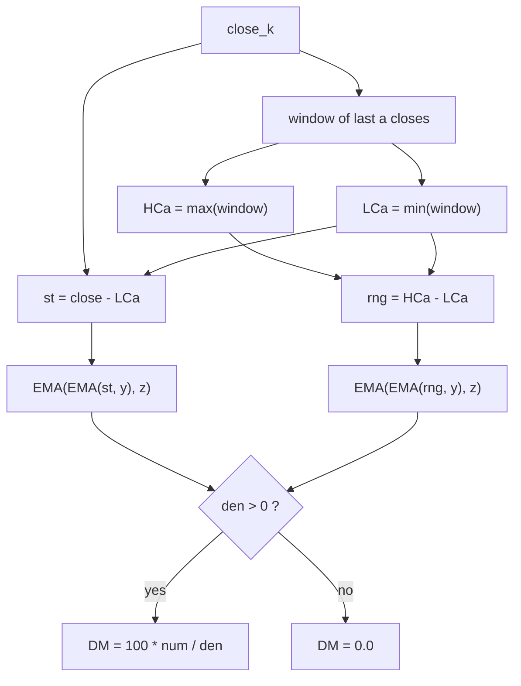

# Double-Smoothed Momenta (DM) / Double-Smoothed RSI (DRSI) — William Blau

> **Indicator (Group 10, "Double-Smoothed RSI / DM family").**
> A close-based, double-smoothed momentum oscillator in $[0, 100]$. It is
> structurally the Double-Smoothed Stochastic computed on the **close** (it uses
> the highest/lowest *close* over $a$ bars rather than the bar's high/low) and has
> **no signal line**. Its headline property is a proven identity: with $a = 2$ and
> a passthrough inner EMA it reduces to the (EMA-form) **RSI**. It generalises the
> RSI into a tunable, double-smoothed family.
>
> This file is **self-contained**. The EMA primitive is **embedded** (inlined). A
> porting agent needs only this document and `double-smoothed-momenta.py`.
>
> **Input:** one price series — `close`.

---

## 1. Definition

For look-back $a$ and EMA periods $y$ (inner) and $z$ (outer):

$$LC_a(k) = \min_{0 \le i < a} Close_{k-i}, \qquad HC_a(k) = \max_{0 \le i < a} Close_{k-i}$$

$$st_k = Close_k - LC_a(k) \ \ (\ge 0), \qquad rng_k = HC_a(k) - LC_a(k) \ \ (\ge 0)$$

$$\boxed{\;DM(a, y, z)_k = 100 \cdot \frac{EMA\!\big(EMA(st, y), z\big)_k}{EMA\!\big(EMA(rng, y), z\big)_k}\;}$$

where `EMA(·, n)` is the Blau EMA ($\alpha = 2/(n+1)$, seeded with its first
input; period $1$ = passthrough). Both numerator and denominator are
double-smoothed by an inner EMA of period $y$ then an outer EMA of period $z$
(Blau's $E_z(E_y(\cdot))$).

### 1.1 Bounds

Since $0 \le st_k \le rng_k$ and the EMA of non-negative inputs is non-negative
and monotone in that sense, $0 \le EMA(EMA(st)) \le EMA(EMA(rng))$, so
$DM \in [0, 100]$.

### 1.2 Division guard

If $EMA(EMA(rng, y), z) \le 0$ (only when every $rng$ seen so far is $0$, i.e. a
fully flat close window), the value is **`0.0`**.

---

## 2. Named instances and the RSI equivalence

### 2.1 `DM(2, 1, z) = RSI(z)` (EMA-form)

With $a = 2$: $LC_2 = \min(Close_k, Close_{k-1})$ and $HC_2 = \max(Close_k,
Close_{k-1})$, so

$$st_k = Close_k - \min(Close_k, Close_{k-1}) = \max(0,\ Close_k - Close_{k-1}) = up_k$$
$$rng_k = |Close_k - Close_{k-1}| = up_k + dn_k$$

where $up_k, dn_k$ are the up- and down-moves. With $y = 1$ the inner EMA is a
passthrough, so

$$DM(2,1,z) = 100 \cdot \frac{EMA(up, z)}{EMA(up + dn, z)} = 100 \cdot \frac{EMA(up, z)}{EMA(up, z) + EMA(dn, z)} = RSI(z)$$

the last step by **linearity** of the EMA ($EMA(up) + EMA(dn) = EMA(up+dn)$).

> **Important — which RSI.** This identity holds for the **EMA-form RSI**
> ($\alpha = 2/(z+1)$), the convention Blau uses everywhere. It is **not** Wilder's
> classic RSI, which smooths with the RMA / Wilder average ($\alpha = 1/z$). This
> port verifies `DM(2,1,z)` against an independently-coded EMA-form RSI as a
> bit-for-bit invariant (see §5).

### 2.2 `DRSI(y, z) = DM(2, y, z)`

The "double-smoothed RSI" fixes the look-back at $a = 2$ and exposes the two
smoothing periods. Provided as `drsi_series(closes, y, z)`.

---

## 3. Priming / warm-up (Option B)

Consistent with the DS-Stochastic and the rest of the library:

- $st/rng$ are defined once $a$ closes exist (bar $a-1$); all four EMA stages seed
  there. **DM is `NaN` for bars $0 .. a-2$** and finite from bar $a-1$.
- For the headline $a = 2$ this is a **single `NaN` at bar 0**; the indicator is
  finite from bar 1.
- For $a = 1$ there is no NaN warm-up, but the $1$-bar close range is always $0$,
  so DM is $0.0$ on every bar (a degenerate setting, surfaced by the guard).



---

## 4. Parameters

| Name | Symbol | Type | Range | Default | Meaning |
|------|--------|------|-------|---------|---------|
| `a`  | $a$ | int | $\ge 1$ | 2  | Highest/lowest **close** look-back. $a=2$ ⇒ one-bar momentum (RSI family). |
| `y`  | $y$ | int | $\ge 1$ | 2  | Inner EMA period. $y=1$ ⇒ passthrough; $DM(2,1,z)=RSI(z)$. |
| `z`  | $z$ | int | $\ge 1$ | 14 | Outer EMA period (the dominant smoothing; RSI-style default 14). |

**Common configurations:**

- `DM(2, 1, z)` — the EMA-form `RSI(z)` (e.g. `DM(2,1,14)` = RSI(14)).
- `DRSI(y, z) = DM(2, y, z)` — double-smoothed RSI, e.g. `DRSI(2, 14)`.
- `DM(a, y, z)` with $a > 2$ — a double-smoothed **stochastic of the close** over
  $a$ bars.

---

## 5. Reference implementation contract

```text
state:
    closes    : last a closes (for highest/lowest close)
    num_y,z   : two chained EMAs for EMA(EMA(st, y), z)
    den_y,z   : two chained EMAs for EMA(EMA(rng, y), z)

update(close) -> float:
    push close into closes
    if len(closes) < a: return NaN          # a-bar warm-up
    hc = max(closes); lc = min(closes)
    st = close - lc; rng = hc - lc
    num = num_z(num_y(st))
    den = den_z(den_y(rng))
    return 0.0 if den <= 0 else 100 * num / den
```

**Verification invariant.** For every $z$, `DM(2,1,z)` must equal — bit-for-bit —
the EMA-form RSI:

```text
ema_rsi(close, z):
    out[0] = NaN
    for k >= 1:
        d  = close[k] - close[k-1]
        up = max(0, d); dn = max(0, -d)
        nu = EMA(up,      z)         # streaming
        de = EMA(up + dn, z)         # streaming
        out[k] = 0 if de <= 0 else 100 * nu / de
```

The embedded `ExponentialMovingAverage` class is copied verbatim from its own
folder — do not alter its numerics.

---

## 6. References

1. Blau, William. *Momentum, Direction, and Divergence.* Wiley, 1995 — establishes
   the double-smoothing framework ($EMA(EMA(\cdot))$) and the EMA-everywhere
   convention used here. The **DM / DRSI** close-based family and the
   $DM(2,1,z)=RSI(z)$ equivalence are from Blau's *Technical Analysis of Stocks &
   Commodities* articles (1991–1993) on double-smoothed momentum; the formula
   $DM(a,y,z) = 100\,E_z(E_y(C - LC_a)) / E_z(E_y(HC_a - LC_a))$, range $[0,100]$,
   with $DRSI(y,z) = DM(2,y,z)$, is catalogued in this library's `indicators.md`
   (Group 10).
2. Wilder, J. Welles. *New Concepts in Technical Trading Systems.* Trend Research,
   1978 — original (RMA-smoothed) RSI, for contrast with the EMA-form RSI used in
   the §2.1 equivalence.

### BibTeX

```bibtex
@book{blau1995momentum,
  author    = {Blau, William},
  title     = {Momentum, Direction, and Divergence: Applying the Latest
               Momentum Indicators for Technical Analysis},
  publisher = {John Wiley \& Sons},
  address   = {New York},
  year      = {1995},
  isbn      = {9780471027294}
}

@book{wilder1978newconcepts,
  author    = {Wilder, J. Welles},
  title     = {New Concepts in Technical Trading Systems},
  publisher = {Trend Research},
  address   = {Greensboro, NC},
  year      = {1978},
  isbn      = {9780894590276}
}
```

> **Note.** There is **no MQL5 reference file** and **no dedicated book chapter**
> for the DM family in the reference set; the definition is taken from the catalog
> (`indicators.md`, Group 10), which derives it from Blau's TASC articles. The
> $DM(2,1,z)=RSI(z)$ identity is reproduced here for the **EMA-form** RSI (Blau's
> convention), not Wilder's RMA RSI.
