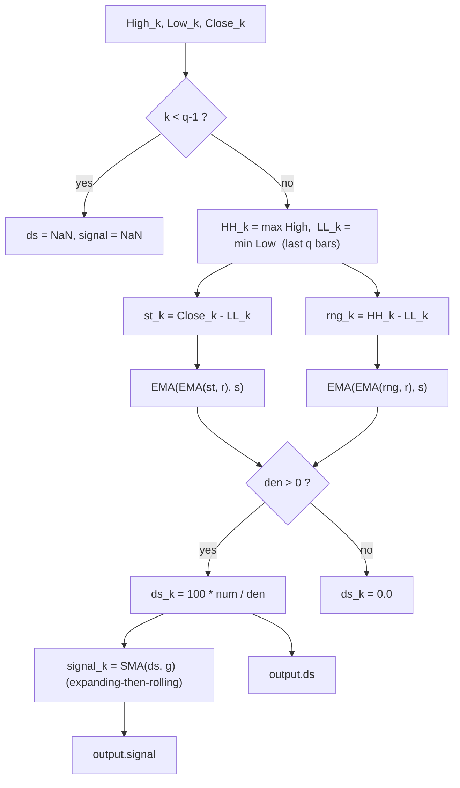

# Double-Smoothed Stochastic (DS-Stochastic) — William Blau

> **Indicator (Group 2: Stochastic-based).**
> Blau's DS-Stochastic is a classic double-smoothed stochastic oscillator bounded
> to $[0, 100]$. It measures where the close sits inside the recent high–low
> range (like an ordinary stochastic) but smooths the raw stochastic and the
> range *separately* with a **two-stage EMA cascade**, then takes their ratio.
> It has **two outputs**: the oscillator (`ds`) and a **signal line** that is a
> short simple moving average of the oscillator (`signal`).
>
> This file is **self-contained**. Two primitives are **embedded** (inlined):
> the Blau EMA (see `../core/exponential-moving-average/description.md`) and a
> simple moving average (SMA) used only for the signal line. A porting agent
> needs only this document and `double-smoothed-stochastic.py`.
>
> **Inputs:** High, Low and Close series, aligned bar-for-bar.

---

## 1. Definition

### 1.1 The oscillator

For a look-back of $q$ bars, the rolling extremes are

$$HH_k = \max_{\,k-(q-1) \le j \le k} High_j, \qquad LL_k = \min_{\,k-(q-1) \le j \le k} Low_j.$$

Define the **raw stochastic** (distance of the close above the lowest low) and
the **range**:

$$st_k = Close_k - LL_k, \qquad rng_k = HH_k - LL_k.$$

The DS-Stochastic double-smooths each with the **same** two-stage EMA cascade
($r$ then $s$) and divides:

$$\boxed{\;DS(q,r,s)_k = 100 \cdot \frac{EMA(EMA(st, r), s)_k}{EMA(EMA(rng, r), s)_k}\;}$$

This is exactly the MQL5 `Blau_TStochI` reference with its third EMA period
$u = 1$ (a passthrough): $DS(q,r,s) = TStochI(q,r,s,1)$.

### 1.2 The signal line

$$signal_k = SMA(ds, g)_k$$

a $g$-bar **simple moving average** of the oscillator (Blau's "3-day SMA
crossover", default $g = 3$). See §2.2 for its priming.

### 1.3 Division guard

If $EMA(EMA(rng, r), s) = 0$ the oscillator value is **`0.0`** (matches
`Blau_TStochI.mq5`: `value2>0 ? value1/value2 : 0`). Because $rng \ge 0$ and the
EMA of non-negatives is non-negative, this triggers only on a fully-flat
$HH=LL$ window.

### 1.4 Bounds

Since $LL_k \le Close_k \le HH_k$ we have $0 \le st_k \le rng_k$, so after the
(convex) double EMA the ratio lies in $[0, 1]$ and $DS \in [0, 100]$. The signal,
being an average of $DS$ values, is also in $[0, 100]$.

### 1.5 One-bar HLC index ($q = 1$)

With $q = 1$ the window is a single bar, so $HH_k = High_k$, $LL_k = Low_k$ and

$$DS(1, r, s)_k = 100 \cdot \frac{EMA(EMA(Close - Low, r), s)_k}{EMA(EMA(High - Low, r), s)_k}.$$

This is Blau's **HLC Index** (one-bar DS-Stochastic): very fast, gap-immune,
reports the single-bar close position. There is **no NaN warm-up** when $q=1$.

---

## 2. Priming conventions (Option B — book / EasyLanguage)

### 2.1 Oscillator

Same convention as the SMI/TSI. The $st$ and $rng$ series become valid once $q$
bars of High/Low exist, i.e. at bar $q-1$; all four EMA stages (two for the
numerator, two for the denominator) seed there together. Therefore the
**oscillator is `NaN` for bars $0 \dots q-2$** and finite from bar $q-1$. For
$q=1$ there is no NaN region. We do **not** replicate the MQL5 begin-offset
priming.

### 2.2 Signal line (SMA) — expanding-then-rolling, no extra warm-up

The signal is **finite wherever the oscillator is finite** (same NaN region
$0 \dots q-2$), matching the Ergodic signal precedent. Concretely, starting from
the first finite oscillator value (bar $q-1$):

- for the first $g-1$ finite bars it returns the mean of the oscillator values
  seen **so far** (an expanding window of size $\le g$);
- from the $g$-th finite bar onward it returns the full $g$-bar rolling mean.

So $signal_{q-1} = ds_{q-1}$ (mean of one value), and with $g = 1$ the signal is
a passthrough: **$signal_k = ds_k$ for every bar** (useful invariant to test).



---

## 3. Parameters

| Name | Symbol | Type | Range | Default | Meaning |
|------|--------|------|-------|---------|---------|
| `q`  | $q$  | int | $\ge 1$ | 5 | Stochastic look-back (bars for HH/LL). $q=1$ ⇒ one-bar HLC index. |
| `r`  | $r$  | int | $\ge 1$ | 7 | 1st EMA period (on $st$ and $rng$). |
| `s`  | $s$  | int | $\ge 1$ | 3 | 2nd EMA period. |
| `g`  | $g$  | int | $\ge 1$ | 3 | **Signal-line** SMA period ($g=1$ ⇒ signal == oscillator). |

**Common configurations:**

- `DS(5,7,3)` with `g=3` — book default + 3-day signal.
- `DS(2,3,15)` with `g=3` — book alternative.

---

## 4. Output

A pair `(ds, signal)` per bar (named tuple / struct / two arrays):

- **`ds`** — the double-smoothed stochastic, range $[0, 100]$.
- **`signal`** — $g$-bar SMA of `ds`, same range.
- **Trading reading:** `ds` crossing above `signal` is bullish, below is bearish;
  alert bands commonly at 20 / 80.

---

## 5. Reference implementation contract

```text
state:
    q          : int
    highs      : ring buffer of last q High values
    lows       : ring buffer of last q Low values
    num_r, num_s : two chained EMAs for the st cascade
    den_r, den_s : two chained EMAs for the rng cascade
    sig        : SMA(g)   # embedded simple moving average, signal line

update(high, low, close) -> (ds, signal):
    push high/low (keep last q)
    if fewer than q bars buffered: return (NaN, NaN)   # do NOT advance sig
    HH = max(highs); LL = min(lows)
    st  = close - LL
    rng = HH - LL
    num = num_s(num_r(st))
    den = den_s(den_r(rng))
    ds  = 0.0 if den <= 0 else 100.0 * num / den
    signal = sig.update(ds)        # seeds on first finite ds (bar q-1)
    return (ds, signal)

# Embedded SMA(g): keep a ring buffer of the last g inputs; each update returns
# the mean of the buffer's current contents (expanding while < g, then rolling).
```

The embedded `ExponentialMovingAverage` is copied verbatim from its own folder —
do not alter its numerics. The embedded `SimpleMovingAverage` implements the
expanding-then-rolling mean described in §2.2.

---

## 6. References

1. Blau, William. *Momentum, Direction, and Divergence.* Wiley, 1995. Group 2
   stochastics: DS-Stochastic $= 100\,EMA(EMA(C-LL,r),s)/EMA(EMA(HH-LL,r),s)$;
   3-day SMA signal crossover; one-bar HLC index.
2. MetaQuotes Software Corp. *Blau_TStochI.mq5* / *WilliamBlau.mqh*, 2011. MQL5
   port of the normalized triple stochastic index $TStochI(q,r,s,u)$; division
   guard `value2>0 ? … : 0`. DS-Stochastic is the $u=1$ case.

### BibTeX

```bibtex
@book{blau1995momentum,
  author    = {Blau, William},
  title     = {Momentum, Direction, and Divergence: Applying the Latest
               Momentum Indicators for Technical Analysis},
  publisher = {John Wiley \& Sons},
  address   = {New York},
  year      = {1995},
  isbn      = {9780471027294}
}

@misc{metaquotes2011blautstochi,
  author       = {{MetaQuotes Software Corp.}},
  title        = {{Blau\_TStochI.mq5}: q-period Stochastic Index
                  (William Blau), MQL5},
  year         = {2011},
  howpublished = {\url{https://www.mql5.com}},
  note         = {TStochI = 100*TEMA(close-LL,r,s,u)/TEMA(HH-LL,r,s,u);
                  DS-Stochastic is the u=1 (double-smoothing) case}
}
```
