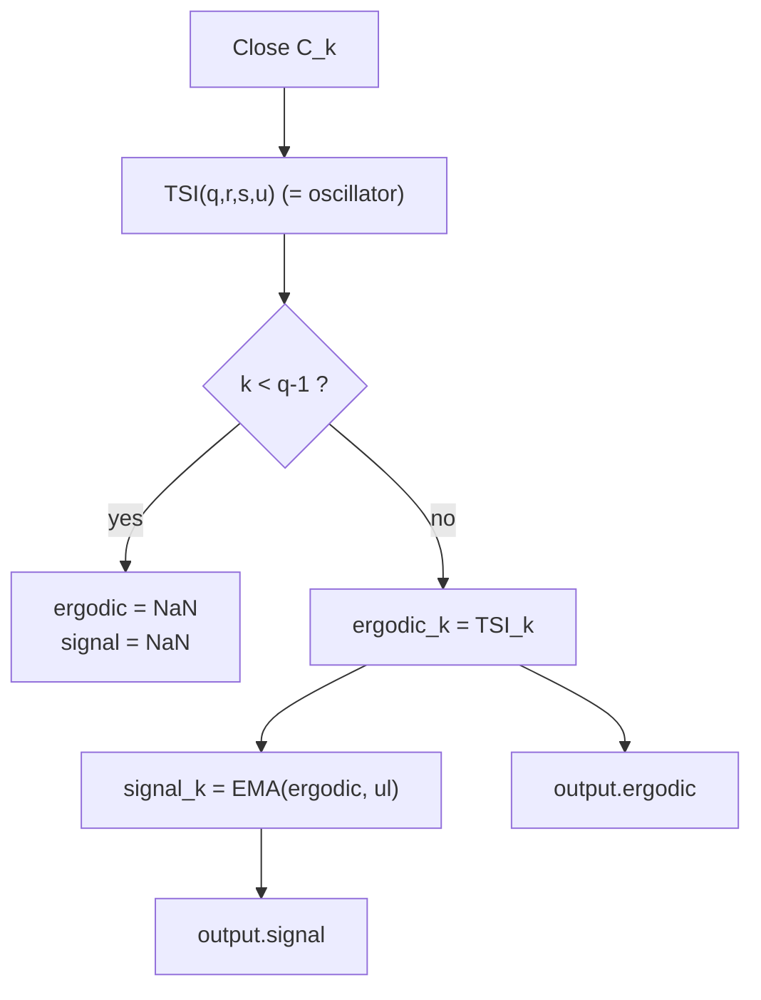

# Ergodic Oscillator — William Blau

> **Indicator (Group 1: Momentum-based).**
> The Ergodic oscillator *is* the True Strength Index plotted together with a
> **signal line** — an EMA of the TSI. Blau introduces it as the trading vehicle
> for the TSI: when the Ergodic crosses above its signal line the trend is up,
> below it the trend is down (ch. 2, Fig. 2-14). It therefore has **two
> outputs**: the oscillator (`ergodic`) and its `signal` line.
>
> This file is **self-contained**. The TSI and the EMA primitive are both
> **embedded** (inlined) in the implementation — see
> `../true-strength-index/description.md` and
> `../core/exponential-moving-average/description.md` for their full
> derivations. A porting agent needs only this document and
> `ergodic-oscillator.py`.

---

## 1. Definition

### 1.1 The two outputs

$$\mathrm{ergodic}_k = TSI(q, r, s, u)_k = 100 \cdot \frac{\mathrm{TEMA}(mtm, r, s, u)_k}{\mathrm{TEMA}(|mtm|, r, s, u)_k}$$

$$\mathrm{signal}_k = EMA(\mathrm{ergodic}, ul)_k$$

where (identical to the TSI):

- $mtm_k = C_k - C_{k-(q-1)}$ — the $q$-period momentum,
- $\mathrm{TEMA}(x, r, s, u) = EMA(EMA(EMA(x, r), s), u)$ — the triple EMA cascade,
- `EMA(x, n)` is the Blau EMA ($\alpha = 2/(n+1)$, seeded with its first input;
  period 1 = passthrough).

The **oscillator output is exactly the TSI** — same formula, same parameters
$q, r, s, u$. The Ergodic adds nothing to it except the companion **signal
line**, a single $ul$-period EMA taken of the oscillator. In the book's
two-parameter notation (ch. 2):

$$Ergodic(close, r) = TSI(close, r, 5), \qquad SignalLine(close, r) = EMA(TSI(close, r, 5),\, 5)$$

i.e. $q=2, s=5, u=1, ul=5$ with $r$ free.

### 1.2 Division guard

As in the TSI: if $\mathrm{TEMA}(|mtm|, r, s, u) = 0$ the oscillator value is
defined as **`0.0`** (matches `Blau_Ergodic.mq5`: `value2>0 ? value1/value2 : 0`).
The signal-line EMA is then taken of that value normally.

---

## 2. Priming convention (Option B — book / EasyLanguage)

Same convention as the TSI (see `../true-strength-index/description.md` §2). The
signal EMA seeds on the **first valid oscillator value**, which occurs at bar
$q-1$. Therefore:

- **Both outputs are `NaN` for bars $0 \dots q-2$** (momentum look-back only) and
  finite from bar $q-1$ onward. For the default $q=2$, only bar $0$ is `NaN`.
- At bar $q-1$ the signal seeds: $\mathrm{signal}_{q-1} = \mathrm{ergodic}_{q-1}$.
- **`ul = 1` ⇒ signal is a passthrough ⇒ `signal == ergodic` for every bar.**
  (Useful invariant to test.)

We deliberately do **not** replicate the MQL5 `begin`-offset priming, which
would blank the oscillator for $(q-1)+(r-1)+(s-1)+(u-1)$ bars and the signal for
a further $(ul-1)$ bars.



---

## 3. Parameters

| Name | Symbol | Type | Range | Default | Meaning |
|------|--------|------|-------|---------|---------|
| `q`  | $q$  | int | $\ge 1$ ($\ge 2$ meaningful) | 2  | Momentum look-back is $q-1$ bars. |
| `r`  | $r$  | int | $\ge 1$ | 20 | 1st EMA period (on momentum). |
| `s`  | $s$  | int | $\ge 1$ | 5  | 2nd EMA period. |
| `u`  | $u$  | int | $\ge 1$ | 3  | 3rd EMA period ($u=1$ ⇒ double smoothing). |
| `ul` | $ul$ | int | $\ge 1$ | 3  | **Signal-line** EMA period ($ul=1$ ⇒ signal == oscillator). |

**Common configurations:**

- `Ergodic(2,20,5,3,3)` — MQL5 default.
- `Ergodic(2,32,5,1,5)` — book Ergodic(close,32) with 5-bar signal (Fig. 2-14).
- `Ergodic(2,r,5,1,7)` — 7-bar signal line variant (ch. 3, Deutsche mark).

---

## 4. Output

A pair `(ergodic, signal)` per bar (named tuple / struct / two arrays):

- **`ergodic`** — the TSI oscillator, range $[-100, +100]$.
- **`signal`** — `ul`-period EMA of `ergodic`, same range.
- **Trading reading:** `ergodic > signal` ⇒ uptrend; `ergodic < signal` ⇒
  downtrend. Threshold lines commonly at $\pm 25$.

---

## 5. Worked seed example

With $q=2$ (1-bar momentum), $ul$ arbitrary, closes $C = [10, 12, 11, \dots]$:

| $k$ | $C_k$ | $mtm_k$ | ergodic | signal |
|----:|------:|--------:|---------|--------|
| 0 | 10 | — | `NaN` | `NaN` |
| 1 | 12 | $+2$ | TSI seed (e.g. $+100$) | seeds = ergodic$_1$ |
| 2 | 11 | $-1$ | TSI recurse | $EMA$ of ergodic |

With `ul = 1`, column `signal` equals column `ergodic` exactly.

---

## 6. Reference implementation contract

```text
state:
    tsi        : TrueStrengthIndex(q, r, s, u)   # embedded; produces oscillator
    signal_ema : EMA(ul)                          # embedded; signal line

update(price) -> (ergodic, signal):
    ergodic = tsi.update(price)        # NaN while k < q-1
    if isnan(ergodic):
        return (NaN, NaN)              # do NOT advance signal_ema yet
    signal = signal_ema.update(ergodic)  # seeds on first valid ergodic
    return (ergodic, signal)
```

The embedded `TrueStrengthIndex` and `ExponentialMovingAverage` classes are
copied verbatim from their own folders — do not alter their numerics.

---

## 7. References

1. Blau, William. *Momentum, Direction, and Divergence.* Wiley, 1995. Chapter 2
   defines the Ergodic and its Signal Line, $Ergodic(close,r)=TSI(close,r,5)$,
   $SignalLine=EMA(\cdot,5)$; Appendix B Fig. B-3 gives the EasyLanguage source
   (`Ergodic`, default $r=32$).
2. MetaQuotes Software Corp. *Blau_Ergodic.mq5* / *WilliamBlau.mqh*, 2011. MQL5
   port; default params $q=2, r=20, s=5, u=3, ul=3$ (uses begin-offset priming).

### BibTeX

```bibtex
@book{blau1995momentum,
  author    = {Blau, William},
  title     = {Momentum, Direction, and Divergence: Applying the Latest
               Momentum Indicators for Technical Analysis},
  publisher = {John Wiley \& Sons},
  address   = {New York},
  year      = {1995},
  isbn      = {9780471027294}
}

@misc{metaquotes2011blauergodic,
  author       = {{MetaQuotes Software Corp.}},
  title        = {{Blau\_Ergodic.mq5}: Ergodic Oscillator (William Blau), MQL5},
  year         = {2011},
  howpublished = {\url{https://www.mql5.com}},
  note         = {Ergodic = TSI(q,r,s,u); Signal = EMA(Ergodic, ul);
                  defaults q=2,r=20,s=5,u=3,ul=3}
}
```
