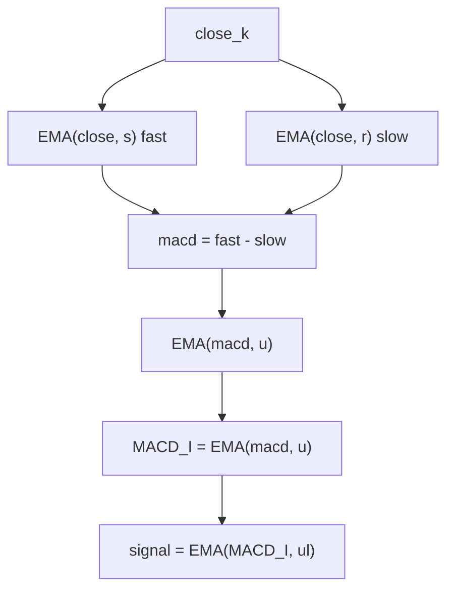

# MACD Index (MACD_I) — William Blau (book ch. 5 / Appendix B-13)

> **Indicator (Group 5, "MACD-Based").**
> Blau's MACD line is the difference of two EMAs of the close, optionally smoothed
> by a third EMA. It is a **double-smoothed momentum** line in **raw price units** —
> the classic MACD — which Blau notes has nearly the same shape as the Mean
> Deviation Index (MDI) within a scale factor.
>
> This file is **self-contained**. The EMA primitive is **embedded** (inlined). A
> porting agent needs only this document and `macd-index.py`.
>
> **Input:** one price series — `close`.
>
> **This is a two-output indicator.** Each `update` returns a named tuple
> `(macdi, signal)`: the MACD line above, plus an `ul`-period EMA of it (the
> **signal line**, Blau's *Ergodic MACD* form, ch. 5). Both outputs are finite
> from bar 0 (no NaN warm-up). Set `ul = 1` for a passthrough signal
> (`signal == macdi`).
>
> **It is NOT normalized.** There is no $100 \cdot TEMA/TEMA$ ratio and no fixed
> range: the output is in the same price units as the input (the classic MACD line)
> and may take any sign or magnitude.

---

## 1. Definition

For a **slow** period $r$ and a **fast** period $s$ with $s < r$, and a smoothing
period $u$:

$$macd_k = EMA(close, s)_k - EMA(close, r)_k \qquad \text{(the MACD line)}$$

$$\boxed{\;MACD\_I(r, s, u)_k = EMA(macd, u)_k\;}$$

where `EMA(·, n)` is the Blau EMA ($\alpha = 2/(n+1)$, seeded with its first input;
period $1$ = passthrough). The book (ch. 5) defines the pure two-EMA line
$MACD(close, r, s) = EMA(close, s) - EMA(close, r)$; the MQL5 `Blau_MACD.mq5` code
adds the third smoothing $u$, giving the boxed form. Set $u = 1$ to recover the
book's pure MACD line.

> **Note — fast/slow convention.** Blau writes the line as *fast minus slow*:
> $EMA(close, s) - EMA(close, r)$ with $s < r$ (the **MQL5 inputs** are literally
> labelled `r` = "1st EMA (Slow)", `s` = "2nd EMA (Fast)", `u` = "3rd EMA"). This is
> the opposite ordering to the conventional "12/26" notation but the same line: a
> rising market gives a positive value.

### 1.1 Relationship to the MDI

The MACD and the MDI are both **double-smoothed momentum** indicators. The MDI
smooths the detrended deviation $close - EMA(close, r)$; the MACD smooths the
difference of two EMAs. Blau notes (ch. 5, "MACD Approximation") that when the MDI
uses one long interval $r$ and one short interval $s$, the MDI's inner smoothing
reduces to $EMA(close, s) - EMA(close, r)$ — exactly the MACD line — so the two
indicators have almost interchangeable shapes (within a scale factor).

### 1.2 No division / no guard

This form has **no division**: the MACD line is simply smoothed by $EMA(\cdot, u)$.
There is no denominator and therefore no division guard. (Contrast the normalized
TSI-family indicators, which divide by $TEMA(|x|)$.)

### 1.3 Bounds

The output is **unbounded** — it is in raw price units, the classic MACD line, and
can take any sign or magnitude. There is no $[-100, +100]$ clamp.

### 1.4 Signal line (second output)

The signal line is an `ul`-period EMA of the MACD_I line:

$$signal_k = EMA(MACD\_I, ul)_k$$

Combining the line with its signal line is the **Ergodic MACD** form (ch. 5). The
signal EMA seeds on the line's **bar-0** value (the line has no NaN warm-up), so
the signal is finite from bar 0 too. With $ul = 1$ the EMA is a passthrough, so
$signal_k = MACD\_I_k$ for every bar.

---

## 2. Priming / warm-up (Option B) — **no NaN region**

Consistent with the rest of the library, every EMA stage seeds on its first
received value (Option B). The crucial consequence here:

- The MACD line is the difference of two EMAs that **both seed at bar 0** (each to
  $close_0$), so $macd_0 = 0$ and the line is defined on **every** bar.
- Therefore **`MACD_I` has no NaN warm-up region** — every output is finite.
- **Bar 0 is exactly `0.0`**: $macd_0 = 0 \Rightarrow EMA(macd, u)_0 = 0$.
- The $u$ smoothing and the signal EMA likewise seed at bar 0.



---

## 3. Parameters

| Name | Symbol | Type | Range | Default | Meaning |
|------|--------|------|-------|---------|---------|
| `r`  | $r$ | int | $\ge 1$, **$s < r$** | 20 | Slow EMA period of the MACD line. |
| `s`  | $s$ | int | $\ge 1$, $s < r$ | 5  | Fast EMA period of the MACD line. |
| `u`  | $u$ | int | $\ge 1$ | 3  | Smoothing EMA period on the MACD line. $u=1$ ⇒ book's pure line. |
| `ul` | $ul$ | int | $\ge 1$ | 3  | Signal-line EMA period (2nd output). $ul=1$ ⇒ signal = MACD_I. |

**Validation.** `s >= r` is rejected (`ValueError`): the MACD line is *fast minus
slow*, so the fast period must be strictly shorter. ($s = r$ gives an
identically-zero line; $s > r$ silently flips the sign convention.) The individual
periods $\ge 1$ are enforced by the EMA constructor.

**Common configurations:**

- `MACD_I(20, 5, 3)` — catalog / MQL5 default (`Blau_MACD.mq5`).
- `MACD_I(r, s, 1)` — book's pure two-EMA MACD line ($u=1$).
- `MACD_I(26, 12, 1)` — the classic 12/26 MACD line in Blau's slow/fast ordering.
- The built-in signal line `EMA(MACD_I, ul)` makes this the **Ergodic MACD
  Oscillator** (catalog 5.2); `ul=1` collapses the signal onto the line.

---

## 4. Reference implementation contract

```text
state:
    ema_fast : EMA(s) on close   (fast)
    ema_slow : EMA(r) on close   (slow)
    smooth_u : EMA(u) on the MACD line
    sig_ema  : EMA(ul) for the signal line (2nd output)

update(close) -> (macdi, signal):     # both always finite (no NaN warm-up)
    macd   = ema_fast(close) - ema_slow(close)
    macdi  = smooth_u(macd)            # smoothing only; no ratio, no guard
    signal = sig_ema(macdi)            # seeds on bar-0 macdi
    return (macdi, signal)
```

The embedded `ExponentialMovingAverage` class is copied verbatim from its own
folder — do not alter its numerics. Each `EMA` is a distinct, independently-primed
instance.

---

## 5. References

1. Blau, William. *Momentum, Direction, and Divergence.* Wiley, 1995, ch. 5 and
   Appendix B-13. Defines the MACD as $MACD(close, r, s) = EMA(close, s) -
   EMA(close, r)$ with $s < r$ (fast minus slow), its Ergodic signal line
   $EMA(MACD, ul)$, and notes the MACD approximates the MDI within a scale factor.
   The MQL5 `Blau_MACD.mq5` code adds a third smoothing $u$; defaults $r=20$ (slow),
   $s=5$ (fast), $u=3$.
2. Appel, Gerald. *Technical Analysis: Power Tools for Active Investors.* FT Press,
   2005 — the classic 12/26 MACD line.

### BibTeX

```bibtex
@book{blau1995momentum,
  author    = {Blau, William},
  title     = {Momentum, Direction, and Divergence: Applying the Latest
               Momentum Indicators for Technical Analysis},
  publisher = {John Wiley \& Sons},
  address   = {New York},
  year      = {1995},
  isbn      = {9780471027294}
}

@book{appel2005technical,
  author    = {Appel, Gerald},
  title     = {Technical Analysis: Power Tools for Active Investors},
  publisher = {FT Press},
  address   = {Upper Saddle River, NJ},
  year      = {2005},
  isbn      = {9780131479029}
}
```

> **Note.** This port follows Blau's authoritative **un-normalized** definition
> (book ch. 5 + Appendix B-13 + MQL5 `Blau_MACD.mq5`): a raw MACD line
> $EMA(close, s) - EMA(close, r)$ ($s < r$) optionally smoothed by $EMA(\cdot, u)$,
> in raw price units with no $[-100,100]$ ratio. (An earlier draft of this catalog
> mistakenly used a normalized TSI-format $100\,TEMA(macd)/TEMA(|macd|)$ with
> separate fast/slow periods $q_1{=}12, q_2{=}26$; that was incorrect and has been
> replaced.)
