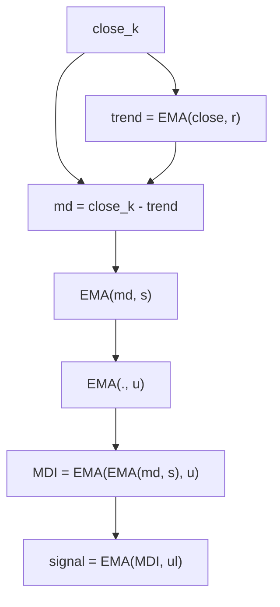

# Mean Deviation Index (MDI) — William Blau

> **Indicator (Group 4: Detrending / Mean Deviation).**
> The MDI is a **detrended, smoothed momentum line in raw price units**. It
> measures the **deviation** $md = close - EMA(close, r)$ — how far price sits
> above or below its own $r$-period EMA trend — then double-/triple-smooths that
> deviation. Blau notes the MDI **approximates the MACD** when the baseline period
> $r$ is long and the smoothing period $s$ is short.
>
> This file is **self-contained**. The EMA primitive is **embedded** (inlined) in
> the implementation — see `../core/exponential-moving-average/description.md` for
> its full derivation. A porting agent needs only this document and
> `mean-deviation-index.py`.
>
> **Inputs:** a single **price** series (Close by default).
>
> **This is a two-output indicator.** Each `update` returns a named tuple
> `(mdi, signal)`: the MDI line above, plus an `ul`-period EMA of it (the
> **signal line**, Blau's *Ergodic* form, ch. 5). Both outputs are finite from
> bar 0 (no NaN warm-up). Set `ul = 1` for a passthrough signal (`signal == mdi`).
>
> **It is NOT normalized.** There is no $100 \cdot \mathrm{TEMA}/\mathrm{TEMA}$
> ratio and no fixed range: the output is in the same price units as the input
> (like a MACD line) and may take any sign or magnitude.

---

## 1. Definition

### 1.1 Mean deviation (detrending)

Detrend price by subtracting its own $r$-period EMA:

$$md_k = close_k - EMA(close, r)_k$$

This is positive when price is above its trend, negative when below. Because the
EMA seeds on the first price ($EMA(close,r)_0 = close_0$), the very first
deviation is exactly $md_0 = 0$.

### 1.2 The index

The MDI is the **double-/triple-smoothed deviation** — no ratio, no scaling:

$$\boxed{\;MDI(r,s,u)_k = EMA\big(EMA(md, s), u\big)_k\;}$$

where `EMA(x, n)` is the Blau EMA ($\alpha = 2/(n+1)$, seeded with its first
input; period 1 = passthrough). The book (ch. 5) defines the pure double-smoothed
form $MDI(close, r, s) = EMA(close - EMA(close, r), s)$; the MQL5
`Blau_MDI.mq5` code adds the third smoothing $u$, giving the form boxed above. Set
$u = 1$ to recover the book's pure double-smoothed line.

> **Note — $r$ is the baseline EMA period, not a look-back window.** The MDI has
> **no separate momentum period $q$** (unlike TSI/SMI/DTI). $r$ is the period of
> the *detrending EMA*, which is defined from bar 0, so **the MDI has no NaN
> warm-up region** — every bar produces a finite value (bar 0 is exactly $0.0$,
> see §2).

### 1.3 No division / no guard

This form has **no division**: the deviation is simply smoothed. There is no
denominator and therefore no division guard. (Contrast the normalized TSI-family
indicators, which divide by $\mathrm{TEMA}(|x|)$.)

### 1.4 Bounds

The output is **unbounded** — it is in raw price units, like a MACD line, and can
take any sign or magnitude. There is no $[-100, +100]$ clamp.

### 1.5 Degenerate $r = 1$

With $r=1$ the detrending EMA is a passthrough ($EMA(close,1) = close$), so
$md_k = close_k - close_k = 0$ for **every** bar. Both smoothing EMAs then seed
and stay at $0$, giving $MDI \equiv 0.0$ (no NaN). This is a useful structural
test.

### 1.6 Signal line (second output)

The signal line is an `ul`-period EMA of the MDI line:

$$signal_k = EMA(MDI, ul)_k$$

Combining the MDI with its signal line is the **Ergodic** form (ch. 5). The
signal EMA seeds on the line's **bar-0** value (the MDI has no NaN warm-up), so
the signal is finite from bar 0 too. With $ul = 1$ the EMA is a passthrough, so
$signal_k = MDI_k$ for every bar.

---

## 2. Priming convention (Option B — book / EasyLanguage)

Same convention as the rest of the family (see
`../true-strength-index/description.md` §2). All three embedded EMAs (one detrend
+ two smoothing) plus the signal EMA seed on their first input at **bar 0**:

- The detrend EMA seeds at $close_0$, so $md_0 = 0$.
- The two smoothing EMAs therefore seed with $md_0 = 0$, so $MDI_0 = 0.0$.
- The signal EMA seeds on $MDI_0 = 0$.
- **No NaN warm-up region** — the MDI is finite for every bar.
- We deliberately do **not** replicate the MQL5 begin-offset priming.



---

## 3. Parameters

| Name | Symbol | Type | Range | Default | Meaning |
|------|--------|------|-------|---------|---------|
| `r`  | $r$  | int | $\ge 1$ | 20 | Baseline / detrending EMA period. $r=1$ ⇒ passthrough ⇒ degenerate $0$. |
| `s`  | $s$  | int | $\ge 1$ | 5  | 1st smoothing EMA period (on $md$). |
| `u`  | $u$  | int | $\ge 1$ | 3  | 2nd smoothing EMA period ($u=1$ ⇒ book's pure double smoothing). |
| `ul` | $ul$ | int | $\ge 1$ | 3  | Signal-line EMA period (2nd output). $ul=1$ ⇒ signal = MDI. |

**Common configurations:**

- `MDI(20,5,3)` — catalog / MQL5 reference default.
- `MDI(r,s,1)` — book's pure double-smoothed form $EMA(close - EMA(close,r), s)$.
- Large $r$ relative to $s,u$ ⇒ behaves like a MACD line.

---

## 4. Output

Two parallel outputs per bar, `(mdi, signal)`, both in **raw price units**
(unbounded, may be negative):

**Line (`mdi`):**

- `> 0` — price persistently above its $r$-EMA trend (bullish detrend);
- `< 0` — price persistently below trend (bearish);
- zero-line crossings are the primary signal (as with the MACD).

**Signal line (`signal`):**

- An `ul`-period EMA of the line (§1.6), the **Ergodic** signal line.
- Finite from bar 0 (the line has no NaN warm-up). $ul = 1$ ⇒
  `signal == mdi` exactly.

---

## 5. Reference implementation contract

```text
state:
    trend     : one EMA(r) on close  (the detrending baseline)
    smooth_s  : EMA(s) smoothing the deviation
    smooth_u  : EMA(u) smoothing again
    sig_ema   : EMA(ul) for the signal line (2nd output)

update(close) -> (mdi, signal):
    md  = close - trend.update(close)        # deviation from own r-EMA
    mdi = smooth_u(smooth_s(md))             # double smoothing; no ratio, no guard
    signal = sig_ema(mdi)                     # seeds on bar-0 mdi (no NaN warm-up)
    return (mdi, signal)
```

The embedded `ExponentialMovingAverage` class is copied verbatim from its own
folder — do not alter its numerics.

---

## 6. References

1. Blau, William. *Momentum, Direction, and Divergence.* Wiley, 1995, ch. 5 and
   Appendix B-11. Defines the detrended mean deviation $md = close - EMA(close, r)$
   and the **un-normalized** Mean Deviation Index
   $MDI(close, r, s) = EMA(close - EMA(close, r), s)$ (raw price units, MACD-like,
   no ratio); explicitly noted to approximate the MACD. Defaults $r=20, s=5$;
   the MQL5 `Blau_MDI.mq5` code adds a third smoothing $u=3$.

### BibTeX

```bibtex
@book{blau1995momentum,
  author    = {Blau, William},
  title     = {Momentum, Direction, and Divergence: Applying the Latest
               Momentum Indicators for Technical Analysis},
  publisher = {John Wiley \& Sons},
  address   = {New York},
  year      = {1995},
  isbn      = {9780471027294}
}
```

> **Note.** This port follows Blau's authoritative **un-normalized** definition
> (book ch. 5 + Appendix B-11 + MQL5 `Blau_MDI.mq5`): raw price units, MACD-like,
> no $[-100,100]$ ratio and no separate detrend period $q$. The baseline period is
> $r$ itself. (An earlier draft of this catalog mistakenly used a normalized
> TSI-format $100\,\mathrm{TEMA}(md)/\mathrm{TEMA}(|md|)$ with a separate $q$; that
> was incorrect and has been replaced.)
