# William Blau's Indicators and Trading Systems in MQL5. Part 1: Indicators

**Andrey F. Zelinsky**
*MQL5 Articles, 2 August 2011*

Source: <https://www.mql5.com/en/articles/190>

---

> *Technical trading can only be exploited if good tools are available. The tools of a good trader are experience, judgement, and a mathematical hierarchy provided by good trading computer program.*
> — **William Blau**

## Introduction

This article is a description of indicators and oscillators described by William Blau in the book ["Momentum, Direction, and Divergence"](https://www.amazon.com/Momentum-Direction-Divergence-Indicators-Technical/dp/0471027294). The indicators and oscillators are presented as source codes in MQL5 language.

**The key idea of analysis by William Blau:**

1. Using the price series data (q bars) the indicator is calculated and plotted at chart. *The indicator does not reflect the general trend of the price movement, and does not allow to determine the trend reversal points.*
2. The indicator is smoothed several times using the EMA method: the first time (with period r), the second time (with period s), and the third time (with period u); a smoothed indicator is plotted. *A smoothed indicator fairly accurately reproduces the price fluctuations with a minimum lag.*
3. The smoothed indicator is normalized, a normalized smoothed indicator is plotted. *The normalization allows the indicator value to be interpreted as the overbought or oversold states of the market.*
4. A normalized smoothed indicator is smoothed once by the EMA method (period ul); an oscillator is constructed. *Oscillator allows us to distinguish the overbought/oversold states of the market, the reversal points and the end of a trend.*

## Indicators

The article describes the following groups of indicators:

### 1. Indicators based on the Momentum
- **Blau_Mtm.mq5** — Momentum (q-period Momentum; smoothed q-period Momentum)
- **Blau_TSI.mq5** — The True Strength Index (normalized smoothed q-period Momentum)
- **Blau_Ergodic.mq5** — Ergodic Oscillator (based on the True Strength Index)

### 2. Indicators based on Stochastic
- **Blau_TStoch.mq5** — Stochastic
- **Blau_TStochI.mq5** — Stochastic Index
- **Blau_TS_Stochastic.mq5** — Stochastic Oscillator

### 3. Indicators based on the Stochastic Momentum
- **Blau_SM.mq5** — Stochastic Momentum
- **Blau_SMI.mq5** — Stochastic Momentum Indicator
- **Blau_SM_Stochastic.mq5** — Stochastic Momentum Oscillator

### 4. Indicators based on Mean Deviation from Market Trends
- **Blau_MDI.mq5** — Mean Deviation Index Indicator
- **Blau_Ergodic_MDI.mq5** — Ergodic MDI-oscillator

### 5. Indicators based on Moving Average Convergence/Divergence
- **Blau_MACD.mq5** — MACD indicator
- **Blau_Ergodic_MACD.mq5** — Ergodic MACD-oscillator

### 6. Indicators based on Candlestick Momentum
- **Blau_CMtm.mq5** — Candlestick Momentum
- **Blau_CMI.mq5** — The Candlestick Momentum Index
- **Blau_CSI.mq5** — Candlestick Index Indicator
- **Blau_Ergodic_CMI.mq5** — Ergodic CMI-Oscillator
- **Blau_Ergodic_CSI.mq5** — Ergodic CSI-Oscillator

### 7. Indicators based on Composite High-Low Momentum
- **Blau_HLM.mq5** — Indicator of the Virtual Close
- **Blau_DTI.mq5** — Directional Trend Index Indicator
- **Blau_Ergodic_DTI.mq5** — Ergodic DTI Oscillator

---

## 1. The True Strength Index

### 1.1. Momentum

#### 1.1.1. Technical analysis using Momentum indicator

The task of technical analysis of the price chart is to determine the current trend of the price movement, reveal the price peaks and bottoms and predict the direction of the price change in the coming period of time.

**What William Blau has proposed:**

1. **The first difference: the Momentum.** William Blau calculated the Momentum as a relative price change for every period of time and created the Momentum indicator. From a mathematical point of view the Momentum function is the first derivative of the price.

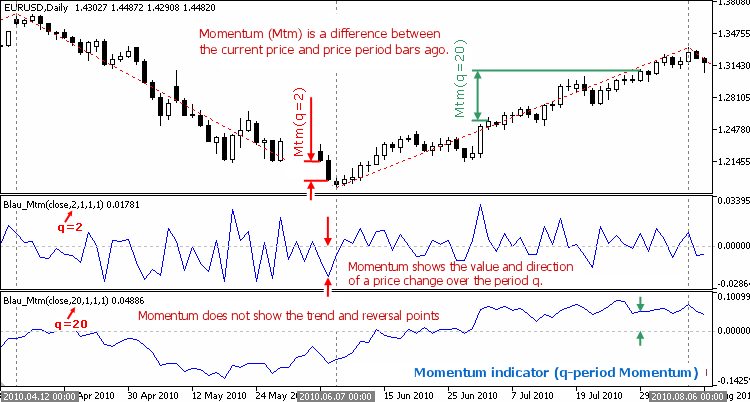

**Fig. 1.1.** Momentum Indicator (q-period Momentum)

The Momentum displays one-day period price fluctuations, shows the speed (magnitude) and the direction of the price changes over this period, but it does not reflect the general trend of the price movement, and does not determine the trend reversal points.

2. **The second difference is the smoothing.** The moving average of the Momentum almost exactly reproduces both the major and local variations of the price curve. The higher the period of the Moving Average, the more accurately the smoothed Momentum approximates the fluctuations of the price curve.

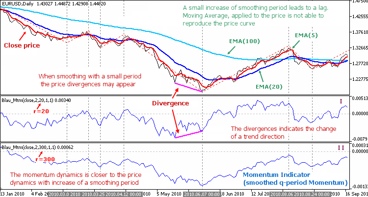

**Fig. 1.2 (a).** Momentum Indicator (smoothed q-period Momentum)

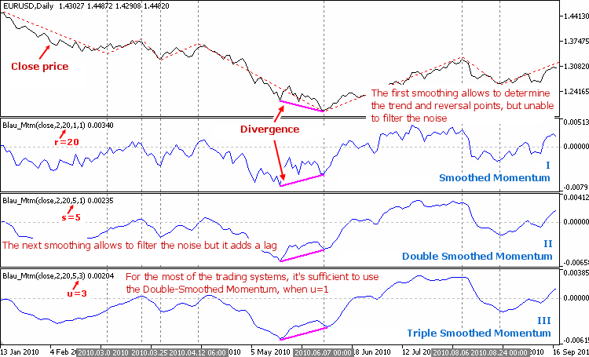

**Fig. 1.2 (b).** Momentum Indicator (smoothed q-period Momentum)

3. **The third difference is the resmoothing.** The first smoothing defines the main trend and reversal points, but does not eliminate the noise. To eliminate the price noise a re-smoothing is needed with a small period of the moving average. A repeated smoothing eliminates the price noise, but adds a slight shift (lag).

4. **The fourth difference: divergence as a signal of changing trends.** Smoothing of Momentum with a small averaging period may lead to a divergence of the smoothed Momentum with the trend of the price curve. Such differences often indicate a trend change.

#### 1.1.2. Definition of the Momentum

**The Momentum** is a relative price change. The sign shows direction; the magnitude shows the relative speed of change (first derivative of price).

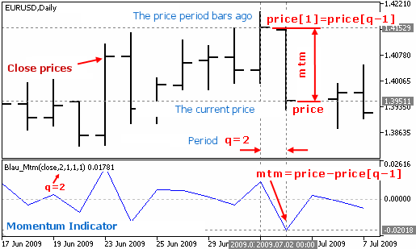

**Fig. 1.3.** Definition of the Momentum

**Formula of the Momentum:**

```
mtm(price) = price - price[1]
```

**Formula of q-period Momentum:**

```
mtm(price,q) = price - price[q-1]
```

where:
- q — number of bars used in the calculation
- price — closing price of the current period
- price[q-1] — closing price (q-1) periods ago

**Formula of smoothed q-period Momentum:**

```
Mtm(price,q,r,s,u) = EMA(EMA(EMA( mtm(price,q) ,r),s),u)
```

where:
- EMA(mtm(price,q), r) — first smoothing: EMA(r) applied to q-period Momentum
- EMA(EMA(...,r),s) — second smoothing: EMA(s) applied to result of 1st smoothing
- EMA(EMA(EMA(...,r),s),u) — third smoothing: EMA(u) applied to result of 2nd smoothing

#### 1.1.3. Mtm(price,q,r,s,u) — Momentum Indicator Specification

- **File**: Blau_Mtm.mq5
- **Input parameters**:
  - q = 2 — period for Momentum calculation
  - r = 20 — period of 1st EMA
  - s = 5 — period of 2nd EMA
  - u = 3 — period of 3rd EMA
  - AppliedPrice = PRICE_CLOSE

### 1.2. The True Strength Index

#### 1.2.1. Technical analysis using the True Strength Index

5. **The fifth: normalization.** Bringing values of the smoothed Momentum to a single scale (mapping to [-1, +1]) allows determining overbought or oversold states. Multiplication by 100 converts to percentage range [-100, +100].

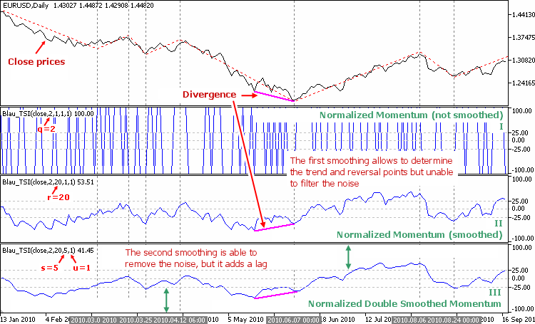

**Fig. 1.4.** Normalized Smoothed Momentum

A discrepancy as a signal of changing trends can be considered reliable if the normalized smoothed momentum is in the state of overbought or oversold.

#### 1.2.2. Definition of the True Strength Index

The **True Strength Index** (TSI) is an indicator of the normalized Momentum. Normalization of each value of the smoothed Momentum by the smoothed absolute value of Momentum maps to [-100, +100].

**Formula:**

```
                     100 * EMA(EMA(EMA( mtm(price,q) ,r),s),u)
TSI(price,q,r,s,u) = ———————————————————————————————————————————
                       EMA(EMA(EMA( |mtm(price,q)| ,r),s),u)
```

If denominator = 0, then TSI = 0.

#### 1.2.3. TSI(price,q,r,s,u) — True Strength Index Specification

- **File**: Blau_TSI.mq5
- **Input parameters**: q=2, r=20, s=5, u=3, AppliedPrice=PRICE_CLOSE
- **Levels**: -25 and +25 (overbought/oversold)
- **Scale**: [-100, +100]

### 1.3. Ergodic Oscillator

#### 1.3.1. Technical analysis using the Ergodic Oscillator

6. **Sixth: overbought/oversold areas.** The interval [-100, +100] allows defining overbought/oversold market areas. Oscillators are ineffective on trending markets.

7. **Seventh: The Signal Line.** To obtain a signal about the end of a trend, a signal line is used. Buy signal: main line crosses signal line from bottom up. Sell signal: main line crosses signal line from top down. The signal line is a re-smoothing of the ergodic (TSI).

8. **Eighth: trend of price movement.** Uptrend when main line (ergodic) passes above signal line. Downtrend when below.

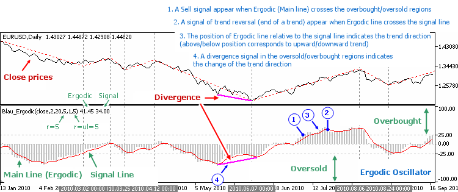

**Fig. 1.5.** Ergodic Oscillator

#### 1.3.2. Definition of the Ergodic Oscillator

```
Ergodic(price,q,r,s,u) = TSI(price,q,r,s,u)

SignalLine(price,q,r,s,u,ul) = EMA( Ergodic(price,q,r,s,u) ,ul)
```

where ul should equal the period of the last significant (>1) EMA of the ergodic.

#### 1.3.3. Ergodic Oscillator Specification

- **File**: Blau_Ergodic.mq5
- **Input parameters**: q=2, r=20, s=5, u=3, ul=3, AppliedPrice=PRICE_CLOSE
- **Levels**: -25 and +25

### 1.4. The Code (detailed description)

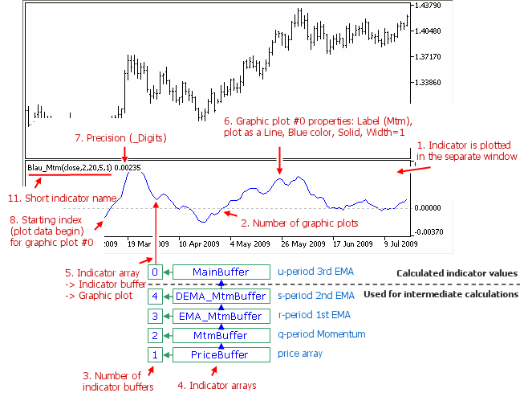

**Fig. 1.6.** Momentum Indicator Mtm(price,q,r,s,u)

The complete source code for all indicators is available in the `code/` subdirectory. Key implementation details:

- **WilliamBlau.mqh** — Library include file with `ExponentialMAOnBufferWB()` function (modified to accept period n=1 as no smoothing)
- EMA function: `EMA(k,n) = EMA(k-1,n) + 2/(n+1) * (price(k) - EMA(k-1,n))`
- The `PriceName()` and `CalculatePriceBuffer()` utility functions

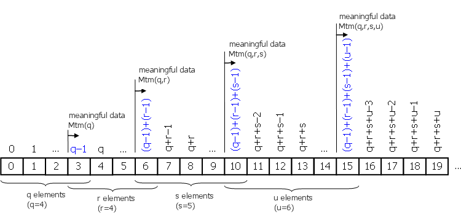

**Fig. 1.7.** True Strength Index TSI(price,q,r,s,u)

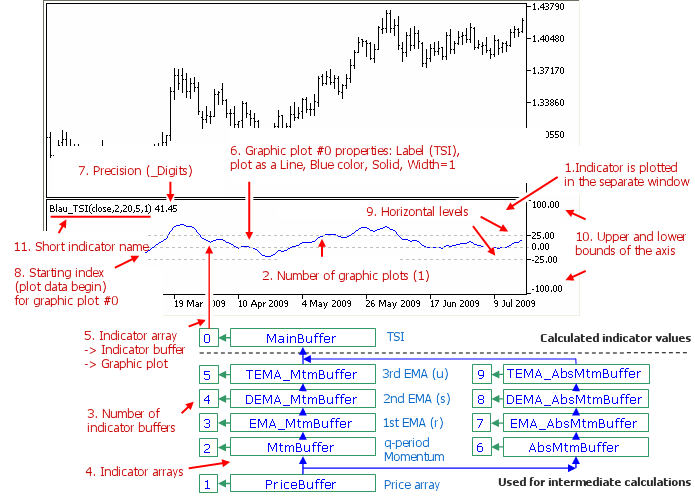

**Fig. 1.8.** Ergodic Oscillator

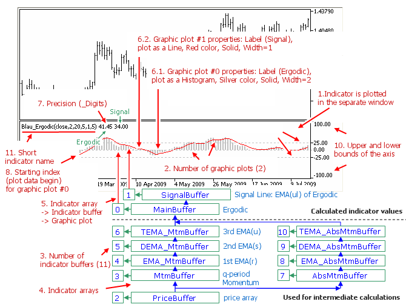

**Fig. 1.9.** Indicator indexing and data access

---

## 2. Stochastic

The stochastic by William Blau is a modification of George Lane's stochastic with double/triple EMA smoothing.

### 2.1. Stochastic Definition

**Formula of q-period Stochastic:**

```
stoch(price,q) = price - LL(q)
```

where:
- LL(q) = lowest low over q bars
- HH(q) = highest high over q bars

**Smoothed Stochastic:**

```
TStoch(price,q,r,s,u) = EMA(EMA(EMA( stoch(price,q) ,r),s),u)
```

### 2.2. Stochastic Index (Normalized)

```
                          100 * EMA(EMA(EMA( stoch(price,q) ,r),s),u)
TStochI(price,q,r,s,u) = ———————————————————————————————————————————————
                           EMA(EMA(EMA( HH(q)-LL(q) ,r),s),u)
```

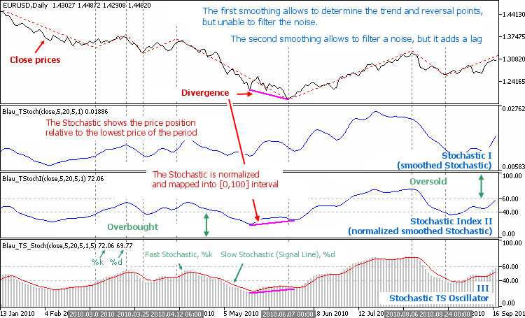

**Fig. 2.1.** Stochastic indicators

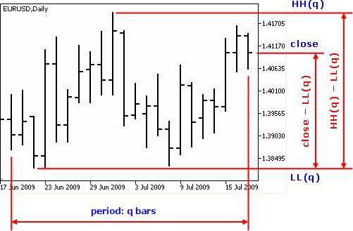

**Fig. 2.2.** Stochastic comparison

### 2.3. Stochastic Oscillator

- **File**: Blau_TS_Stochastic.mq5
- Ergodic = TStochI; Signal Line = EMA(Ergodic, ul)

---

## 3. Stochastic Momentum

### 3.1. Stochastic Momentum Definition

**Formula:**

```
sm(price,q) = price - 0.5*(HH(q) + LL(q))
```

The stochastic momentum measures the distance of the close from the midpoint of the range.

**Smoothed Stochastic Momentum:**

```
SM(price,q,r,s,u) = EMA(EMA(EMA( sm(price,q) ,r),s),u)
```

### 3.2. Stochastic Momentum Index (SMI)

```
                       100 * EMA(EMA(EMA( sm(price,q) ,r),s),u)
SMI(price,q,r,s,u) = ———————————————————————————————————————————
                      0.5 * EMA(EMA(EMA( HH(q)-LL(q) ,r),s),u)
```

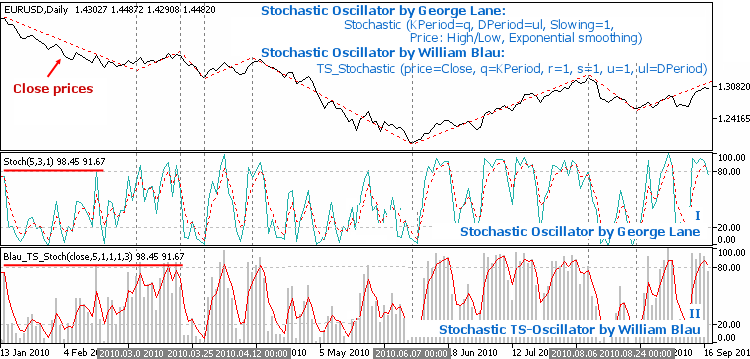

**Fig. 3.1.** Stochastic Momentum indicators

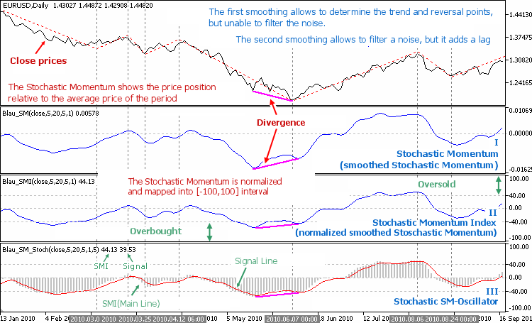

**Fig. 3.2.** Stochastic Momentum Index

### 3.3. Stochastic Momentum Oscillator

- **File**: Blau_SM_Stochastic.mq5
- Ergodic = SMI; Signal Line = EMA(Ergodic, ul)

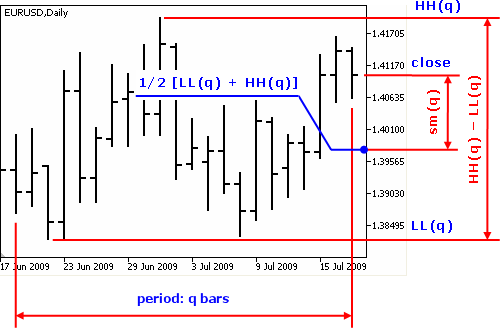

**Fig. 3.3.** Stochastic Momentum Oscillator

---

## 4. Mean Deviation Index

### 4.1. Definition

The Mean Deviation measures the distance of the price from its EMA (moving average).

```
md(price,q) = price - EMA(price,q)
```

**Mean Deviation Index:**

```
                       100 * EMA(EMA(EMA( md(price,q) ,r),s),u)
MDI(price,q,r,s,u) = ———————————————————————————————————————————
                       EMA(EMA(EMA( |md(price,q)| ,r),s),u)
```

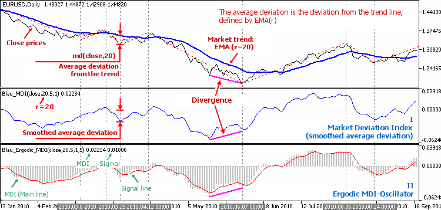

**Fig. 4.1.** Mean Deviation indicators

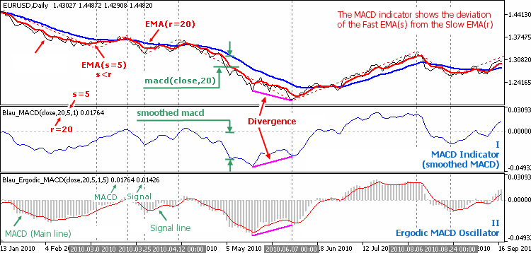

**Fig. 4.2.** Ergodic MDI Oscillator

### 4.2. Specifications

- **Blau_MDI.mq5** — Mean Deviation Index (q=2, r=20, s=5, u=3)
- **Blau_Ergodic_MDI.mq5** — Ergodic MDI-oscillator (q=2, r=20, s=5, u=3, ul=3)

---

## 5. MACD

### 5.1. Definition

William Blau's MACD uses the difference of two EMAs as the basis for the TSI-style normalization.

```
macd(price,q1,q2) = EMA(price,q1) - EMA(price,q2)
```

**MACD Index:**

```
                          100 * EMA(EMA(EMA( macd(price,q1,q2) ,r),s),u)
MACD_I(price,q1,q2,r,s,u) = ————————————————————————————————————————————————
                              EMA(EMA(EMA( |macd(price,q1,q2)| ,r),s),u)
```

### 5.2. Specifications

- **Blau_MACD.mq5** — MACD indicator (q1=12, q2=26, r=1, s=1, u=1)
- **Blau_Ergodic_MACD.mq5** — Ergodic MACD-oscillator (q1=12, q2=26, r=20, s=5, u=3, ul=3)

---

## 6. Candlestick Momentum

### 6.1. Definition

Candlestick Momentum uses the relationship of the close to the high and low of the current bar.

```
cmtm(price) = Close - Open
```

Or in the generalized form:

```
cmtm_up = Close - Low    (bullish component)
cmtm_dn = High - Close   (bearish component)
```

**Candlestick Momentum Index:**

```
                    100 * EMA(EMA(EMA( cmtm ,r),s),u)
CMI(price,r,s,u) = ——————————————————————————————————
                    EMA(EMA(EMA( |cmtm| ,r),s),u)
```

**Candlestick Strength Index:**

```
                    100 * EMA(EMA(EMA( cmtm_up ,r),s),u)
CSI(price,r,s,u) = ———————————————————————————————————————————————————————
                    EMA(EMA(EMA( cmtm_up ,r),s),u) + EMA(EMA(EMA( cmtm_dn ,r),s),u)
```

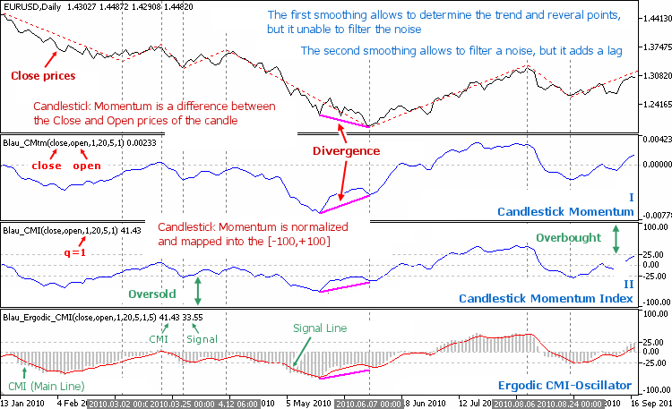

**Fig. 6.1.** Candlestick Momentum indicators

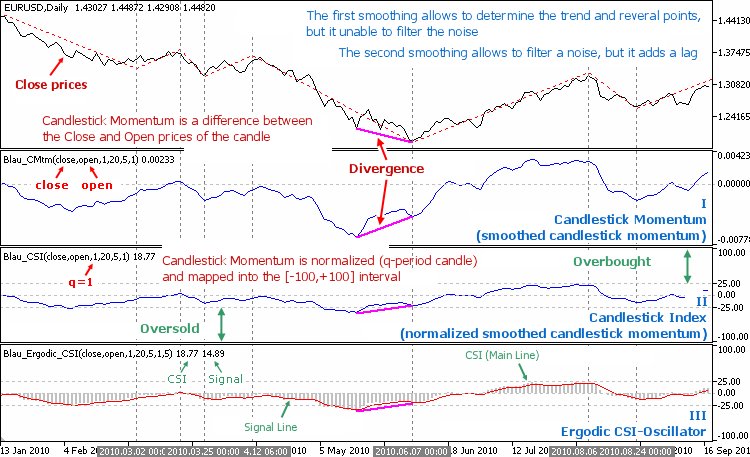

**Fig. 6.2.** Candlestick Momentum Index

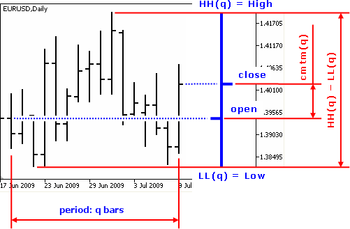

**Fig. 6.3.** Candlestick Oscillators

### 6.2. Specifications

- **Blau_CMtm.mq5** — Candlestick Momentum (r=20, s=5, u=3)
- **Blau_CMI.mq5** — Candlestick Momentum Index (r=20, s=5, u=3)
- **Blau_CSI.mq5** — Candlestick Strength Index (r=20, s=5, u=3)
- **Blau_Ergodic_CMI.mq5** — Ergodic CMI-oscillator (r=20, s=5, u=3, ul=3)
- **Blau_Ergodic_CSI.mq5** — Ergodic CSI-oscillator (r=20, s=5, u=3, ul=3)

---

## 7. Composite High-Low Momentum (Directional Trend Index)

### 7.1. Definition

The Composite High-Low Momentum uses both high and low prices to determine the virtual close and directional momentum.

```
HLM = (High - High[1]) + (Low - Low[1])
```

**Directional Trend Index:**

```
                       100 * EMA(EMA(EMA( HLM ,r),s),u)
DTI(price,q,r,s,u) = ———————————————————————————————————
                       EMA(EMA(EMA( |HLM| ,r),s),u)
```

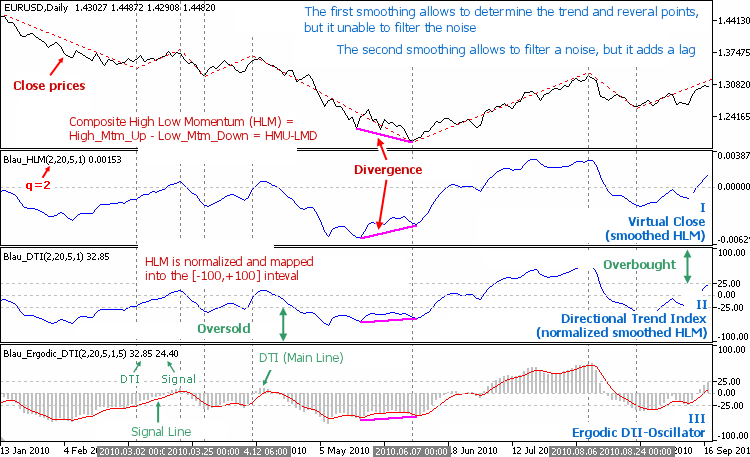

**Fig. 7.1.** High-Low Momentum and Directional Trend Index

### 7.2. Specifications

- **Blau_HLM.mq5** — Indicator of the Virtual Close (q=2, r=20, s=5, u=3)
- **Blau_DTI.mq5** — Directional Trend Index (q=2, r=20, s=5, u=3)
- **Blau_Ergodic_DTI.mq5** — Ergodic DTI Oscillator (q=2, r=20, s=5, u=3, ul=3)

---

## EMA Function

The Exponential Moving Average used throughout:

```
EMA(k,n) = EMA(k-1,n) + 2/(n+1) * (price(k) - EMA(k-1,n))
```

William Blau uses period n=1 as "absence of smoothing." The library function `ExponentialMAOnBufferWB()` in `WilliamBlau.mqh` handles this case.

---

## Source Code Files

All MQL5 source files are in the `code/` subdirectory:

| File | Description |
|------|-------------|
| WilliamBlau.mqh | Include library (EMA functions, price utilities) |
| Blau_Mtm.mq5 | q-period Momentum |
| Blau_TSI.mq5 | True Strength Index |
| Blau_Ergodic.mq5 | Ergodic Oscillator |
| Blau_TStoch.mq5 | Stochastic |
| Blau_TStochI.mq5 | Stochastic Index |
| Blau_TS_Stochastic.mq5 | Stochastic Oscillator |
| Blau_SM.mq5 | Stochastic Momentum |
| Blau_SMI.mq5 | Stochastic Momentum Index |
| Blau_SM_Stochastic.mq5 | Stochastic Momentum Oscillator |
| Blau_MDI.mq5 | Mean Deviation Index |
| Blau_Ergodic_MDI.mq5 | Ergodic MDI-Oscillator |
| Blau_MACD.mq5 | MACD Indicator |
| Blau_Ergodic_MACD.mq5 | Ergodic MACD-Oscillator |
| Blau_CMtm.mq5 | Candlestick Momentum |
| Blau_CMI.mq5 | Candlestick Momentum Index |
| Blau_CSI.mq5 | Candlestick Strength Index |
| Blau_Ergodic_CMI.mq5 | Ergodic CMI-Oscillator |
| Blau_Ergodic_CSI.mq5 | Ergodic CSI-Oscillator |
| Blau_HLM.mq5 | Virtual Close (High-Low Momentum) |
| Blau_DTI.mq5 | Directional Trend Index |
| Blau_Ergodic_DTI.mq5 | Ergodic DTI Oscillator |

---

## Citation

```bibtex
@online{zelinsky2011blau_mql5_part1,
  author    = {Andrey F. Zelinsky},
  title     = {William Blau's Indicators and Trading Systems in {MQL5}. {Part} 1: Indicators},
  year      = {2011},
  month     = aug,
  day       = {2},
  url       = {https://www.mql5.com/en/articles/190},
  urldate   = {2026-06-01},
  publisher = {MQL5.com}
}
```
