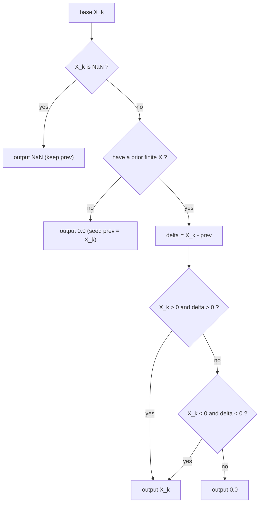

# Nonambiguous Trend Filter (`_Trade`) — William Blau

> **Filter (Group 9.1).**
> The `_Trade` filter is a generic **post-processing transform** applied to any
> normalized, signed oscillator $X$ (e.g. TSI, SMI, DTI, MDI, CMI, CSI). It keeps
> $X$ only where its sign and slope agree — *positive and rising* or *negative and
> falling* — and forces every other (ambiguous) bar to zero. The result is a
> filter whose nonzero stretches correspond one-to-one with genuine up/down price
> trends; congestion and flat regions are blanked out.
>
> This file is **self-contained**. The filter holds no embedded moving averages —
> it operates purely on the value stream of a base indicator. A porting agent
> needs only this document and `nonambiguous-trend-filter.py`.
>
> **Input:** the per-bar value stream of an already-computed base indicator
> $X$ (which may be `NaN` during the base's own warm-up).
>
> **Book-only.** There is no MQL5 implementation of this filter; it is defined in
> *Momentum, Direction, and Divergence* Ch. 8 and Appendix B (Figures B-20…B-23).

---

## 1. Definition

Let $X_k$ be the base indicator value at bar $k$ and $X_{k-1}$ the previous bar's
value. The slope is $\Delta_k = X_k - X_{k-1}$. Then:

$$
X\_\mathrm{Trade}_k =
\begin{cases}
X_k & \text{if } X_k > 0 \text{ and } \Delta_k > 0 \quad(\text{positive and rising})\\[4pt]
X_k & \text{if } X_k < 0 \text{ and } \Delta_k < 0 \quad(\text{negative and falling})\\[4pt]
0   & \text{otherwise (ambiguous — stand aside)}
\end{cases}
$$

This is exactly Blau's EasyLanguage user function (Appendix B), reproduced here
for the TSI base (the SMI/DTI/TVI variants are identical with a different
`Value1 = <base>` line):

```easylanguage
Value1 = TSI(Price, r, s, u);
if Value1 - Value1[1] > 0 AND Value1 > 0 then Value2 = Value1 Else Value2 = 0;
if Value1 - Value1[1] < 0 AND Value1 < 0 then Value3 = Value1 Else Value3 = 0;
TSI_Trade = Value2 + Value3;
```

Because the two retained cases are mutually exclusive (a value cannot be both
positive and negative), `Value2 + Value3` is just a branch selection: at most one
term is nonzero.

### 1.1 Why "nonambiguous"

A rising oscillator in its **positive** region corresponds uniquely to rising
prices, but a *falling* oscillator in the positive region is ambiguous (it can
mean falling **or** flat prices). Symmetrically in the negative region. The
filter keeps only the unambiguous half of each region (positive+rising,
negative+falling), so every nonzero `_Trade` bar maps one-to-one to a real trend.

---

## 2. Conventions (priming, slope, NaN)

Consistent with the rest of this library (Option B priming):

- **First finite bar — no prior slope.** $\Delta$ is undefined at the first bar
  for which a finite $X$ is available (there is no valid $X_{k-1}$). The slope is
  therefore treated as undefined ⇒ **output `0.0`** (cannot confirm rising or
  falling). No NaN is introduced here.
- **NaN propagation.** Some bases (SMI, DTI) emit `NaN` during their own $q$-bar
  look-back warm-up (bars $0..q-2$). Where the base is `NaN`, the filter is
  undefined ⇒ it **outputs `NaN`** and does **not** update its stored previous
  value. The first *finite* base value after the warm-up is then treated as the
  "first finite bar" above (output `0.0`). Bases without a look-back (TSI, MDI,
  CMI, CSI) have no NaN region, so their `_Trade` is finite from bar 0 (bar 0 =
  `0.0`).
- **Slope sign** (utility U2): $\operatorname{slope}(X)_k = \operatorname{sign}(X_k - X_{k-1})$.
  Strict inequalities are used: a flat step ($\Delta = 0$) is **not** rising and
  **not** falling ⇒ zeroed.



---

## 3. Parameters

The filter itself is **parameterless** — all parameters belong to the base
indicator $X$. The book names four canonical instances; this port also applies
the filter to the other built bases (MDI, CMI, CSI):

| Instance | Base | Base inputs | Default base params | Chapter |
|----------|------|-------------|---------------------|---------|
| `TSI_Trade` | TSI  | Close       | r=32, s=13, u=3            | 8 |
| `SMI_Trade` | SMI  | High/Low/Close | q=32, r=64, s=7, u=1   | 9 |
| `DTI_Trade` | DTI  | High/Low    | q=2, r=28, s=28, u=5       | 7 |
| `TVI_Trade` | TVI  | Up/Down ticks | r=32, s=32, u=5          | 10 (TVI not yet ported) |
| `MDI_Trade` | MDI  | Close       | q=20, r=20, s=5, u=3       | 4 (extension) |
| `CMI_Trade` | CMI  | Open/Close  | r=20, s=5, u=3             | 6 (extension) |
| `CSI_Trade` | CSI  | High/Low/Close | r=32, s=32, u=1         | 6 (extension) |

> `CSI_Trade` is degenerate-ish: the CSI is bounded to $[0,100]$, so the
> "negative and falling" branch can never fire — only the positive+rising branch
> and the zero-out branch are exercised. This is expected and is a useful test of
> the one-sided behaviour.

---

## 4. Output

A single value per bar, in the **same range as the base indicator** but with most
bars zeroed:

- nonzero positive ⇒ confirmed up-trend (base positive and rising);
- nonzero negative ⇒ confirmed down-trend (base negative and falling);
- `0.0` ⇒ ambiguous / congestion / flat — stand aside;
- `NaN` ⇒ base indicator still in its warm-up region.

The book's trading template: enter in the direction of `_Trade` when it leaves
zero and a fast oscillator's slope agrees; exit when the oscillator's slope
reverses or `_Trade` returns to zero.

---

## 5. Reference implementation contract

```text
state:
    prev   : float   # last finite base value
    primed : bool    # have we seen a finite base value yet?

update(x) -> float:                 # x = this bar's base indicator value
    if x is NaN:
        return NaN                  # undefined; do NOT touch state
    if not primed:
        prev = x; primed = True
        return 0.0                  # no prior slope -> ambiguous
    delta = x - prev
    prev  = x
    if x > 0 and delta > 0: return x        # positive and rising
    if x < 0 and delta < 0: return x        # negative and falling
    return 0.0                              # ambiguous
```

The NaN test uses the portable idiom `x != x` (true only for NaN).

---

## 6. References

1. Blau, William. *Momentum, Direction, and Divergence.* Wiley, 1995, Ch. 8
   ("Trading the Trend") and Appendix B, Figures B-20…B-23. Defines the
   nonambiguous `_Trade` filter: retain the base oscillator where it is *positive
   and rising* or *negative and falling*, zero elsewhere. Named instances
   `TSI_Trade(32,13,3)`, `SMI_Trade(32,64,7,1)`, `DTI_Trade(28,28,5)`,
   `TVI_Trade(32,32,5)`.

### BibTeX

```bibtex
@book{blau1995momentum,
  author    = {Blau, William},
  title     = {Momentum, Direction, and Divergence: Applying the Latest
               Momentum Indicators for Technical Analysis},
  publisher = {John Wiley \& Sons},
  address    = {New York},
  year      = {1995},
  isbn      = {9780471027294}
}
```

> **Note.** This is a book/EasyLanguage construct (Appendix B); there is no MQL5
> source file for it in the reference set.
