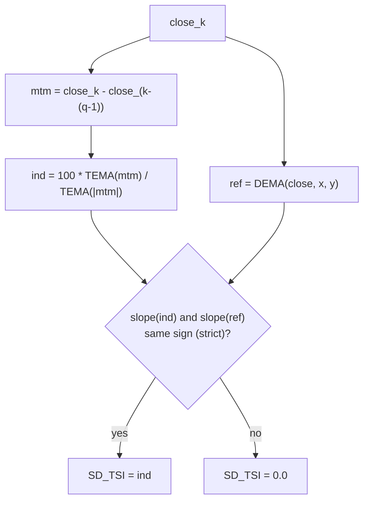

# Slope Divergence TSI Filter (SD_TSI) — William Blau

> **Trend/congestion prefilter (Group 9.3, book Ch. 12).**
> The most sophisticated of Blau's prefilters. It keeps the True Strength Index
> (TSI) value **only when the slope of the TSI agrees in sign with the slope of a
> separate double EMA of price**; otherwise it outputs `0`. The aim is to isolate
> regions of **congestion / flat prices** directly: where the price moving-average
> keeps drifting while momentum rolls over, their slopes *diverge*, and the filter
> stands aside. Everything that is *not* divergence is treated as a trend.
>
> This file is **self-contained**. The EMA primitive and the embedded TSI and
> price-DEMA machinery are inlined in the implementation. A porting agent needs
> only this document and `slope-divergence-tsi-filter.py`.
>
> **Input:** one price series — `close`.

---

## 1. Definition

### 1.1 The filter (book Ch. 12, Appendix B Fig. B-25)

Let

$$ind_k = TSI(close, q, r, s, u)_k, \qquad ref_k = DEMA(close, x, y)_k = EMA(EMA(close, x), y)_k$$

where `TSI` is the triple-smoothed True Strength Index (§1.2) and `DEMA` is the
double exponential moving average of price (Blau's `DXAverage`, Fig. B-6). Define
the per-bar slope as the one-bar change, $\Delta X_k = X_k - X_{k-1}$. Then

$$
\boxed{\;SD\_TSI_k =
\begin{cases}
ind_k & \text{if } \Delta ind_k > 0 \ \text{and}\ \Delta ref_k > 0 \quad(\text{both rising})\\[2pt]
ind_k & \text{if } \Delta ind_k < 0 \ \text{and}\ \Delta ref_k < 0 \quad(\text{both falling})\\[2pt]
0 & \text{otherwise (slope divergence / congestion)}
\end{cases}\;}
$$

The gate is **strict**: the EasyLanguage tests are `> 0` and `< 0`, so a flat
slope ($\Delta = 0$) on *either* series is **not** kept and yields `0`.

> **Verbatim EasyLanguage (Fig. B-25):**
> ```easylanguage
> Value1 = TSI(Price,r,s,u) ;
> Value2 = DXAverage(Price,x,y) ;
> if Value1 - Value1[1] > 0 AND Value2 - Value2[1] > 0 then Value3 = Value1 else Value3 = 0;
> if Value1 - Value1[1] < 0 AND Value2 - Value2[1] < 0 then Value4 = Value1 else Value4 = 0;
> SD_TSI = Value3 + Value4 ;
> ```

### 1.2 The embedded TSI

$$TSI(close, q, r, s, u) = 100 \cdot \frac{\mathrm{TEMA}(mtm, r, s, u)}{\mathrm{TEMA}(|mtm|, r, s, u)}, \qquad mtm_k = close_k - close_{k-(q-1)}$$

with $\mathrm{TEMA}(z, r, s, u) = EMA(EMA(EMA(z, r), s), u)$ and the Blau EMA
($\alpha = 2/(n+1)$, seeded with its first input; period 1 = passthrough). The
book's TSI uses one-bar momentum, i.e. **$q = 2$** ($mtm_k = close_k -
close_{k-1}$). TSI division guard: denominator $0 \Rightarrow TSI = 0$.

> $TSI$ is **bipolar** in $[-100, +100]$. Because $SD\_TSI$ either passes the TSI
> through or zeroes it, $SD\_TSI \in [-100, +100]$ as well.

### 1.3 Why a *separate* price reference (contrast with `_Trade`)

The Chapter-8 `_Trade` filter (Nonambiguous Trend Filter) keeps an oscillator
when its **own** value and **own** slope agree (e.g. positive *and* rising). It
needs only one series. `SD_TSI` is different: it compares the slope of the TSI
against the slope of an **independent** moving average of price. That is exactly
what catches congestion — Blau's Figure 2-9 idealisation shows that in a flat
zone the moving average of price keeps rising while the momentum decays, so the
two slopes oppose. `_Trade` cannot see this because it has no price reference.

---

## 2. Priming / warm-up (Option B)

Consistent with the rest of the library:

- The TSI momentum needs a price $q-1$ bars back, so $ind_k$ — and therefore
  $SD\_TSI_k$ — is `NaN` for bars $0 .. q-2$ and finite from bar $q-1$. With the
  book's $q = 2$ this is a **single `NaN` at bar 0**.
- The price DEMA seeds at bar 0 (**no** NaN) and advances every bar, including
  through the TSI warm-up, so its previous-bar value is current the moment the TSI
  comes online.
- At the **first finite TSI bar** there is no prior TSI value, hence no TSI slope,
  so the output is **`0.0`** (two finite TSI samples are required before a slope
  exists). The first non-`NaN` output of `SD_TSI` is therefore always `0.0`.



---

## 3. Parameters

| Name | Symbol | Type | Range | Default | Meaning |
|------|--------|------|-------|---------|---------|
| `q`  | $q$ | int | $\ge 1$ | 2 | Momentum look-back ($mtm = close_k - close_{k-(q-1)}$). Book uses one-bar momentum, $q=2$. |
| `r`  | $r$ | int | $\ge 1$ | 32 | TSI 1st EMA period. |
| `s`  | $s$ | int | $\ge 1$ | 32 | TSI 2nd EMA period. |
| `u`  | $u$ | int | $\ge 1$ | 7  | TSI 3rd EMA period ($u=1$ ⇒ double-smoothed TSI). |
| `x`  | $x$ | int | $\ge 1$ | 32 | Price DEMA 1st EMA period. |
| `y`  | $y$ | int | $\ge 1$ | 7  | Price DEMA 2nd EMA period ($y=1$ ⇒ single EMA on price). |

**Common configurations:**

- `SD_TSI(close, 32, 32, 7, 32, 7)` — Fig. 12-2, the **recommended** noise-cleaned
  setting (third TSI smoothing $u=7$ and second price smoothing $y=7$).
- `SD_TSI(close, 32, 32, 1, 32, 1)` — Fig. 12-1, the raw double-smoothed form
  ($u=1$, $y=1$): timely but noisier; the book itself recommends adding the
  $u=7/y=7$ smoothing.

---

## 4. Output

A single value per bar, range $[-100, +100]$:

- `> 0` — retained **up-trend** (TSI positive-sloped *and* price positive-sloped);
- `< 0` — retained **down-trend** (both negative-sloped);
- `0` — **slope divergence**: congestion / flat prices (stand aside), or the first
  finite bar, or a flat slope on either series.

Used as a prefilter (Ch. 12 trading system): treat the nonzero `SD_TSI` as a
"slow TSI" surrogate for the trend, and trade a fast oscillator (e.g. a fast SMI)
in the direction of the retained slope; stand aside while `SD_TSI` is `0`.

---

## 5. Reference implementation contract

```text
state:
    history   : last q closes (for q-period momentum)
    num_r,s,u : three chained EMAs for TEMA(mtm)        (TSI numerator)
    den_r,s,u : three chained EMAs for TEMA(|mtm|)      (TSI denominator)
    ref_x,y   : two chained EMAs for DEMA(close)        (price reference)
    prev_tsi  : previous finite TSI value      (+ have_prev_tsi flag)
    prev_ref  : previous-bar price DEMA value  (+ have_prev_ref flag)

update(price) -> float:
    ref = ref_y(ref_x(price))                 # always advances (no NaN)
    push price into history
    if len(history) < q:                      # TSI momentum warm-up
        prev_ref = ref ; return NaN
    mtm = price - history[0]                   # = close_k - close_(k-(q-1))
    n   = num_u(num_s(num_r(mtm)))
    d   = den_u(den_s(den_r(|mtm|)))
    tsi = 0.0 if d == 0 else 100 * n / d       # TSI guard
    if not have_prev_tsi:                       # first finite TSI -> no slope
        result = 0.0
    else:
        d_tsi = tsi - prev_tsi ; d_ref = ref - prev_ref
        if (d_tsi > 0 and d_ref > 0) or (d_tsi < 0 and d_ref < 0):
            result = tsi
        else:
            result = 0.0
    prev_tsi = tsi ; prev_ref = ref ; return result
```

The embedded `ExponentialMovingAverage` class is copied verbatim from its own
folder — do not alter its numerics. The TSI block is identical to the standalone
TSI indicator with $q=2$.

---

## 6. References

1. Blau, William. *Momentum, Direction, and Divergence.* Wiley, 1995, Ch. 12
   ("Slope Divergence"); Appendix B Figure B-25 (`SD_TSI`), with Figures B-2
   (`TSI`), B-1 (`TXAverage` / triple EMA) and B-6 (`DXAverage` / double EMA).
   Defines $SD\_TSI(close, r, s, u, x, y)$ as the triple-smoothed
   $TSI(close, r, s, u)$ retained only where its slope and the slope of the double
   EMA $DXAverage(close, x, y)$ agree in sign, else $0$. Recommended setting
   $SD\_TSI(close, 32, 32, 7, 32, 7)$ (Fig. 12-2); raw form
   $SD\_TSI(close, 32, 32, 1, 32, 1)$ (Fig. 12-1).

### BibTeX

```bibtex
@book{blau1995momentum,
  author    = {Blau, William},
  title     = {Momentum, Direction, and Divergence: Applying the Latest
               Momentum Indicators for Technical Analysis},
  publisher = {John Wiley \& Sons},
  address   = {New York},
  year      = {1995},
  isbn      = {9780471027294}
}
```

> **Note.** There is **no MQL5 reference file** for the slope divergence filter in
> the reference set — the definition above is taken directly from the book's
> EasyLanguage Figure B-25. The catalog pseudocode (`indicators.md`) loosely reads
> "TSI when slope(TSI) == slope(DEMA)", but the authoritative Fig. B-25 code uses
> **strict** `> 0` / `< 0` slope tests (a flat slope is *not* kept); this port
> follows the book code.
