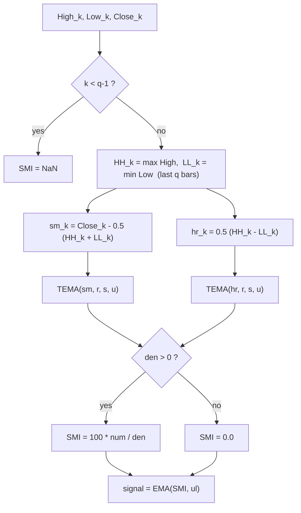

# Stochastic Momentum Index (SMI) — William Blau

> **Indicator (Group 3: Stochastic Momentum-based).**
> The SMI is a double-/triple-smoothed *stochastic* oscillator bounded to
> $[-100, +100]$. Where the ordinary stochastic measures where the close sits
> inside the recent high–low range, Blau's SMI measures the close relative to the
> **midpoint** of that range and then smooths both the numerator and the range
> with the same triple-EMA cascade used by the TSI.
>
> This file is **self-contained**. The EMA primitive is **embedded** (inlined) in
> the implementation — see `../core/exponential-moving-average/description.md` for
> its full derivation. A porting agent needs only this document and
> `stochastic-momentum-index.py`.
>
> **Inputs:** unlike the TSI/Ergodic (close only), the SMI needs **High, Low and
> Close** series, aligned bar-for-bar.
>
> **This is a two-output indicator.** Each `update` returns a named tuple
> `(smi, signal)`: the oscillator above, plus an `ul`-period EMA of it (the
> **signal line**, Blau's *Ergodic* form, ch. 3.4). Both outputs share the same
> NaN warm-up region. Set `ul = 1` for a passthrough signal (`signal == smi`).

---

## 1. Definition

For a look-back of $q$ bars, define the rolling extremes over the last $q$ bars:

$$HH_k = \max_{\,k-(q-1) \le j \le k} High_j, \qquad LL_k = \min_{\,k-(q-1) \le j \le k} Low_j$$

Then the **stochastic momentum** and **half-range**:

$$sm_k = Close_k - \tfrac{1}{2}\,(HH_k + LL_k) \qquad\text{(distance from range midpoint)}$$

$$hr_k = \tfrac{1}{2}\,(HH_k - LL_k) \qquad\text{(half of the } q\text{-bar range)}$$

The SMI is $100\times$ the triple-smoothed momentum over the triple-smoothed
half-range:

$$\boxed{\;SMI(q,r,s,u)_k = 100 \cdot \frac{\mathrm{TEMA}(sm, r, s, u)_k}{\mathrm{TEMA}(hr, r, s, u)_k}\;}$$

where, exactly as in the TSI,

$$\mathrm{TEMA}(x, r, s, u) = EMA(EMA(EMA(x, r), s), u)$$

and `EMA(x, n)` is the Blau EMA ($\alpha = 2/(n+1)$, seeded with its first input;
period 1 = passthrough).

> **Note on the $\tfrac12$ factor.** The MQL5 reference stores
> $hr = 0.5\,(HH-LL)$ *before* smoothing, so the denominator is
> $\mathrm{TEMA}(0.5(HH-LL))$. By linearity of the EMA this equals
> $0.5\cdot\mathrm{TEMA}(HH-LL)$ — both `indicators.md` forms agree. The
> implementation smooths $hr$ (the half-range) directly.

### 1.1 Division guard

If $\mathrm{TEMA}(hr, r, s, u) = 0$ the value is defined as **`0.0`**
(matches `Blau_SMI.mq5`: `value2>0 ? value1/value2 : 0`). Because $hr \ge 0$
always and the EMA of non-negatives is non-negative, the denominator is zero
only in the degenerate case where every half-range seen so far is zero
(a flat $HH=LL$ window).

### 1.2 Bounds

Since $Low_k \le Close_k \le High_k$ and $LL_k \le Low_k$, $High_k \le HH_k$,
we have $|sm_k| \le hr_k$. The triple EMA is a convex average, so
$|\mathrm{TEMA}(sm)| \le \mathrm{TEMA}(hr)$ and therefore
$SMI \in [-100, +100]$.

### 1.3 One-day stochastic ($q = 1$)

With $q = 1$ the window is a single bar, so $HH_k = High_k$, $LL_k = Low_k$ and

$$sm_k = Close_k - \tfrac12(High_k + Low_k), \qquad hr_k = \tfrac12(High_k - Low_k).$$

This is Blau's **One-Day Stochastic / sentiment indicator**: gap-immune, it
reports whether closes favour the day's highs or lows. There is **no NaN warm-up**
when $q=1$.

### 1.4 Signal line (second output)

The signal line is an `ul`-period EMA of the oscillator:

$$signal_k = EMA(SMI, ul)_k$$

Combining the SMI with its signal line is the **Ergodic** form (ch. 3.4). The
signal EMA seeds on the **first finite** SMI value (bar $q-1$), so it shares the
oscillator's NaN warm-up region exactly. With $ul = 1$ the EMA is a passthrough,
so $signal_k = SMI_k$ for every bar.

---

## 2. Priming convention (Option B — book / EasyLanguage)

Same convention as the TSI (see `../true-strength-index/description.md` §2). The
$sm$ and $hr$ series become valid only once $q$ bars of High/Low are available,
i.e. at bar $q-1$; all six EMA stages (three for the numerator cascade, three
for the denominator) seed there together. Therefore:

- **SMI is `NaN` for bars $0 \dots q-2$** and finite from bar $q-1$ onward.
  For $q=1$ there is no NaN region.
- We deliberately do **not** replicate the MQL5 `begin`-offset priming, which
  would blank a further $(r-1)+(s-1)+(u-1)$ bars.



---

## 3. Parameters

| Name | Symbol | Type | Range | Default | Meaning |
|------|--------|------|-------|---------|---------|
| `q`  | $q$  | int | $\ge 1$ | 5  | Stochastic look-back (bars for HH/LL). $q=1$ ⇒ one-day stochastic. |
| `r`  | $r$  | int | $\ge 1$ | 20 | 1st EMA period (on $sm$ and $hr$). |
| `s`  | $s$  | int | $\ge 1$ | 5  | 2nd EMA period. |
| `u`  | $u$  | int | $\ge 1$ | 3  | 3rd EMA period ($u=1$ ⇒ double smoothing). |
| `ul` | $ul$ | int | $\ge 1$ | 3  | Signal-line EMA period (2nd output). $ul=1$ ⇒ signal = SMI. |

**Common configurations:**

- `SMI(5,20,5,3)` — MQL5 reference default.
- `SMI(13,25,2,1)` — book "basic" SMI (double-smoothed).
- `SMI(2,20,20,1)` — book "two-day" SMI.
- `SMI(1,40,20,1)` / `SMI(1,100,20,1)` — one-day sentiment (faster / slow trend).

---

## 4. Output

Two parallel outputs per bar, `(smi, signal)`, both in range $[-100, +100]$:

**Oscillator (`smi`):**

- `> 0` — close sits above the range midpoint (bullish pressure);
- `< 0` — close sits below the midpoint (bearish pressure);
- common alert levels at $\pm 40$.

**Signal line (`signal`):**

- An `ul`-period EMA of the oscillator (§1.4), the **Ergodic** signal line.
- Same range $[-100, +100]$ and the same NaN warm-up region (bars $0 \dots q-2$)
  as the oscillator. $ul = 1$ ⇒ `signal == smi` exactly.

---

## 5. Reference implementation contract

```text
state:
    q          : int
    highs      : ring buffer of last q High values
    lows       : ring buffer of last q Low values
    num_r,s,u  : three chained EMAs for the sm cascade
    den_r,s,u  : three chained EMAs for the hr cascade
    sig_ema    : EMA(ul) for the signal line (2nd output)

update(high, low, close) -> (smi, signal):
    push high into highs, low into lows  (keep last q)
    if fewer than q bars buffered: return (NaN, NaN)   # do NOT advance sig_ema
    HH = max(highs); LL = min(lows)
    sm = close - 0.5*(HH + LL)
    hr = 0.5*(HH - LL)
    num = num_u(num_s(num_r(sm)))
    den = den_u(den_s(den_r(hr)))
    smi = 0.0 if den <= 0 else 100.0 * num / den
    signal = sig_ema(smi)              # seeds on first finite smi
    return (smi, signal)
```

The embedded `ExponentialMovingAverage` class is copied verbatim from its own
folder — do not alter its numerics.

---

## 6. References

1. Blau, William. *Momentum, Direction, and Divergence.* Wiley, 1995. Chapter on
   stochastic momentum defines $sm = close - 0.5(HH+LL)$ and
   $SMI = 100\,\mathrm{TEMA}(sm)/(0.5\,\mathrm{TEMA}(HH-LL))$; the one-day
   stochastic ($q=1$) is presented as a sentiment indicator.
2. MetaQuotes Software Corp. *Blau_SMI.mq5* / *WilliamBlau.mqh*, 2011. MQL5 port;
   default params $q=5, r=20, s=5, u=3$; division guard `value2>0 ? … : 0`.

### BibTeX

```bibtex
@book{blau1995momentum,
  author    = {Blau, William},
  title     = {Momentum, Direction, and Divergence: Applying the Latest
               Momentum Indicators for Technical Analysis},
  publisher = {John Wiley \& Sons},
  address   = {New York},
  year      = {1995},
  isbn      = {9780471027294}
}

@misc{metaquotes2011blausmi,
  author       = {{MetaQuotes Software Corp.}},
  title        = {{Blau\_SMI.mq5}: q-period Stochastic Momentum Index
                  (William Blau), MQL5},
  year         = {2011},
  howpublished = {\url{https://www.mql5.com}},
  note         = {SMI = 100*TEMA(sm,r,s,u)/TEMA(0.5(HH-LL),r,s,u);
                  defaults q=5,r=20,s=5,u=3}
}
```
