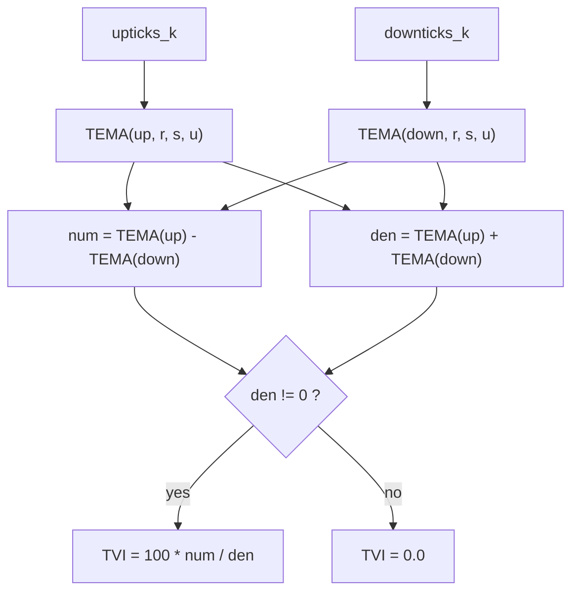

# Tick Volume Indicator (TVI) — William Blau

> **Indicator (Group 8).**
> The TVI separates the **upticks** and **downticks** that occur inside each
> high-low bar and forms a normalized, double-/triple-smoothed oscillator from
> their balance. Its defining virtue is **gap immunity**: because it is built from
> intra-bar tick direction rather than from the close relative to a previous
> close, opening gaps do not bias it. This makes it a clean proxy for intraday
> price direction.
>
> This file is **self-contained**. The EMA primitive is **embedded** (inlined) in
> the implementation. A porting agent needs only this document and
> `tick-volume-indicator.py`.
>
> **Inputs:** two non-negative per-bar series — `upticks` and `downticks`.

---

## 1. Definition

### 1.1 Double-smoothed form (book, Ch. 4 / Appendix B Fig. B-9)

Let $DEMA(x, r, s) = EMA(EMA(x, r), s)$ be the double EMA. Then

$$TVI(r, s) = 100 \cdot \frac{DEMA(up, r, s) - DEMA(down, r, s)}{DEMA(up, r, s) + DEMA(down, r, s)}$$

which ranges from $-100$ to $+100$: $+100$ when all smoothed volume is up,
$-100$ when all is down, $0$ at balance.

### 1.2 Triple-smoothed form (Ch. 10)

Chapter 10 uses a third level of smoothing, written $TVI(r, s, u)$ (e.g.
$TVI(32, 32, 5)$, the third EMA being a small "noise-cleanup" period). This port
applies the third smoothing as a **TEMA on the up/down series** (the convention
chosen to unify with the rest of this library, where every cascade is a TEMA):

$$\boxed{\;TVI(r, s, u) = 100 \cdot \frac{\mathrm{TEMA}(up, r, s, u) - \mathrm{TEMA}(down, r, s, u)}{\mathrm{TEMA}(up, r, s, u) + \mathrm{TEMA}(down, r, s, u)}\;}$$

where $\mathrm{TEMA}(x, r, s, u) = EMA(EMA(EMA(x, r), s), u)$ and `EMA(x, n)` is
the Blau EMA ($\alpha = 2/(n+1)$, seeded with its first input; period 1 =
passthrough).

> **$u = 1$ recovers the book.** Since $EMA(\cdot, 1)$ is a passthrough,
> $\mathrm{TEMA}(x, r, s, 1) = DEMA(x, r, s)$, so $TVI(r, s, 1)$ is exactly the
> double-smoothed book TVI of §1.1. The default is therefore $u = 1$.

> **Note (alternate book form).** Blau notes an equivalent definition using the
> double EMA of the *difference* $up - down$ over the double EMA of the *sum*
> $up + down$. By linearity of the EMA, $\mathrm{TEMA}(up) \pm \mathrm{TEMA}(down)
> = \mathrm{TEMA}(up \pm down)$, so the two forms are algebraically identical; we
> use the separate-cascade form above.

### 1.3 Division guard

If $\mathrm{TEMA}(up) + \mathrm{TEMA}(down) = 0$ the value is **`0.0`** (matches
Appendix B `if Value1 + Value2 <> 0 then ... else 0`). Because both inputs are
non-negative, their smoothed sum is zero only when every tick seen so far is zero
(a fully flat market).

### 1.4 Bounds

Since $up, down \ge 0$, both $\mathrm{TEMA}(up)$ and $\mathrm{TEMA}(down)$ are
$\ge 0$, so the numerator's magnitude never exceeds the denominator and
$TVI \in [-100, +100]$.

---

## 2. Inputs — upticks and downticks (and the synthetic test proxy)

The TVI's true inputs are the **counts of upticks and downticks** within each bar
(available from intraday tick feeds, e.g. TradeStation `Upticks` / `Downticks`).
The library's shared 252-bar fixture is end-of-day OHLC and carries **no real
tick data**, so the test fixtures include a deterministic, reproducible
**synthetic** proxy derived from the bar's own range:

$$up_k = close_k - low_k, \qquad down_k = high_k - close_k$$

Both are non-negative; their sum is the bar range $high_k - low_k$ (zero only on a
flat bar, which would trigger the §1.3 guard). These are **not** real tick counts
— they are a stand-in chosen so the indicator's arithmetic can be exercised on
the common dataset. A production caller passes genuine uptick/downtick counts.

---

## 3. Priming convention (Option B)

Consistent with the rest of the library. Both TEMA cascades seed at bar 0:

- $\mathrm{TEMA}(up)_0 = up_0$, $\mathrm{TEMA}(down)_0 = down_0$.
- **No NaN warm-up region** — the TVI is finite from bar 0 (the EMA seeds on its
  first input; there is no look-back window).
- Bar 0 is $0.0$ only if $up_0 = down_0 = 0$ (guard); otherwise it is a finite
  value in $[-100, 100]$.



---

## 4. Parameters

| Name | Symbol | Type | Range | Default | Meaning |
|------|--------|------|-------|---------|---------|
| `r`  | $r$  | int | $\ge 1$ | 12 | 1st EMA period (on up/down). |
| `s`  | $s$  | int | $\ge 1$ | 12 | 2nd EMA period. |
| `u`  | $u$  | int | $\ge 1$ | 1  | 3rd EMA period. $u=1$ ⇒ book double-smoothed $TVI(r,s)$. |

**Common configurations:**

- `TVI(12, 12, 1)` and `TVI(25, 13, 1)` — book double-smoothed defaults.
- `TVI(32, 32, 5)` — Ch. 10 triple-smoothed form used by `TVI_Trade`.
- `Ergodic_TVI(r) = TVI(r, 5, 1)` with signal `EMA(TVI(r,5,1), 5)` — Ch. 4.

---

## 5. Output

A single value per bar, range $[-100, +100]$:

- `> 0` — upticks dominate (up pressure / rising intraday trend);
- `< 0` — downticks dominate (down pressure);
- `0` — balance, or fully flat market (guard).

---

## 6. Reference implementation contract

```text
state:
    up_r,s,u   : three chained EMAs for the upticks cascade
    dn_r,s,u   : three chained EMAs for the downticks cascade

update(upticks, downticks) -> float:
    tu  = up_u(up_s(up_r(upticks)))         # TEMA(up,   r, s, u)
    td  = dn_u(dn_s(dn_r(downticks)))        # TEMA(down, r, s, u)
    den = tu + td
    return 0.0 if den == 0 else 100.0 * (tu - td) / den
```

The embedded `ExponentialMovingAverage` class is copied verbatim from its own
folder — do not alter its numerics.

---

## 7. References

1. Blau, William. *Momentum, Direction, and Divergence.* Wiley, 1995, Ch. 4
   ("Tick Volume Indicator") and Ch. 10 ("TVI_Trade Filtering"); Appendix B
   Figures B-9 (TVI) and B-6 (DXAverage / double EMA). Defines
   $TVI(r,s) = 100\,(DEMA(up,r,s) - DEMA(down,r,s)) / (DEMA(up,r,s) +
   DEMA(down,r,s))$, range $[-100,100]$, gap-immune; Ch. 10 adds a third
   smoothing $TVI(32,32,5)$.

### BibTeX

```bibtex
@book{blau1995momentum,
  author    = {Blau, William},
  title     = {Momentum, Direction, and Divergence: Applying the Latest
               Momentum Indicators for Technical Analysis},
  publisher = {John Wiley \& Sons},
  address   = {New York},
  year      = {1995},
  isbn      = {9780471027294}
}
```

> **Note.** Blau's Appendix B implements only the double-smoothed $TVI(r,s)$; the
> third smoothing $u$ is described in Ch. 10 prose. This port unifies them as a
> TEMA on the up/down series with $u=1$ reproducing the book exactly. There is no
> MQL5 reference file for the TVI in the reference set.
