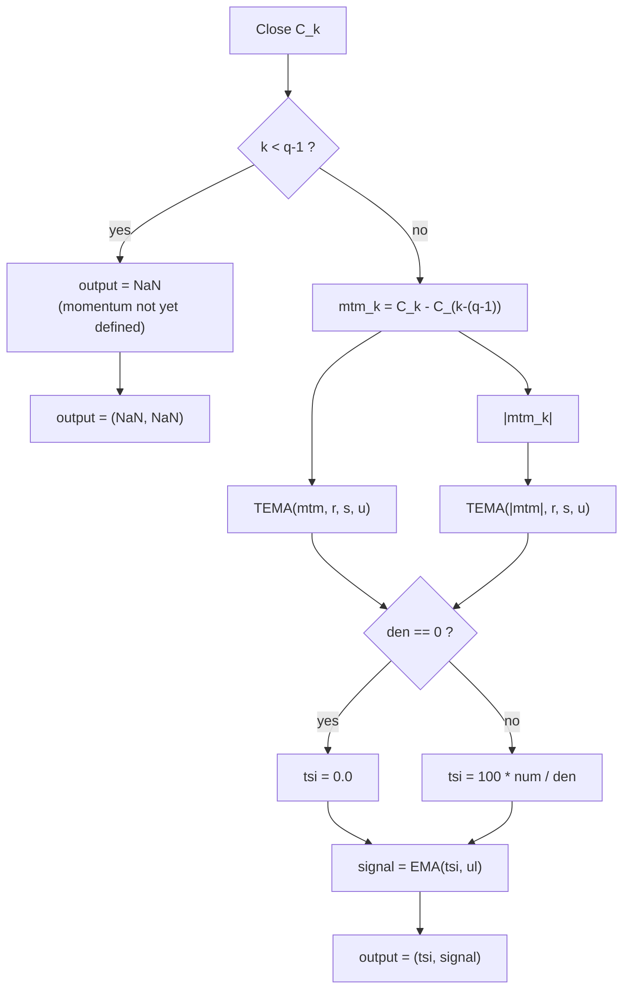

# True Strength Index (TSI) — William Blau

> **Indicator (Group 1: Momentum-based).**
> The True Strength Index is Blau's flagship double-/triple-smoothed momentum
> oscillator. It takes 1-bar price momentum, smooths it through a cascade of
> exponential moving averages, and normalises by the same cascade applied to
> the *absolute* momentum — producing a bounded `[-100, +100]` oscillator that
> tracks price turning points with very low lag.
>
> **This is a two-output indicator.** Each `update` returns a named tuple
> `(tsi, signal)`: the oscillator above, plus an `ul`-period EMA of it (the
> **signal line**, Blau's *Ergodic* form, ch. 1.4). Both outputs share the same
> NaN warm-up region. Set `ul = 1` for a passthrough signal (`signal == tsi`).
>
> This file is **self-contained**: a porting agent needs nothing but this
> document and the accompanying `true-strength-index.py`. The EMA primitive is
> **embedded** (inlined) in the implementation, not imported — see
> `../core/exponential-moving-average/description.md` for its full derivation.

---

## 1. Definition

### 1.1 Momentum

Blau's momentum is the change in price over a look-back window. With period
parameter $q$:

$$mtm_k = C_k - C_{k-(q-1)}$$

where $C_k$ is the price (close) at bar $k$. The look-back distance is $q-1$
bars:

- $q = 2$ → $mtm_k = C_k - C_{k-1}$, the **1-bar momentum** Blau uses throughout
  the book ("today's close minus yesterday's close", ch. 2).
- $q = 1$ → $mtm_k = 0$ identically (degenerate; avoid).
- Larger $q$ → longer-horizon momentum.

Momentum is **undefined (NaN)** for the first $q-1$ bars, because $C_{k-(q-1)}$
does not yet exist.

### 1.2 Triple EMA cascade

Let `EMA(x, n)` be the Blau exponential moving average ($\alpha = 2/(n+1)$,
seeded with its first input; period 1 = passthrough). Define the **triple EMA**:

$$\mathrm{TEMA}(x, r, s, u) = EMA\big(EMA(EMA(x, r), s), u\big)$$

i.e. smooth by $r$, then by $s$, then by $u$. Setting any stage's period to 1
switches that stage off (passthrough), so:

- $u = 1$ → **double** smoothing $EMA(EMA(x,r),s)$ — the book's classic form.
- $s = u = 1$ → **single** smoothing $EMA(x,r)$.

### 1.3 TSI

$$\boxed{\,TSI(q, r, s, u) = 100 \cdot \dfrac{\mathrm{TEMA}(mtm,\; r, s, u)}{\mathrm{TEMA}(|mtm|,\; r, s, u)}\,}$$

The numerator double-/triple-smooths signed momentum; the denominator applies
the **identical** cascade to $|mtm|$. The ratio compresses the output to
$[-100, +100]$. In the book's two-parameter notation (ch. 2, Fig. 2-2):

$$TSI(close, r, s) = 100 \cdot \frac{EMA(EMA(mtm, r), s)}{EMA(EMA(|mtm|, r), s)}$$

which is exactly this formula with $q = 2$ and $u = 1$.

### 1.4 Signal line (second output)

The signal line is an `ul`-period EMA of the oscillator:

$$signal_k = EMA(TSI, ul)_k$$

Combining the TSI with its signal line is what Blau calls the **Ergodic**
oscillator (ch. 1.4). The signal EMA seeds on the **first finite** TSI value
(bar $q-1$), so it shares the oscillator's NaN warm-up region exactly. With
$ul = 1$ the EMA is a passthrough, so $signal_k = TSI_k$ for every bar.

### 1.5 Division guard

If the denominator $\mathrm{TEMA}(|mtm|, r, s, u)$ equals $0$ (only possible when
every momentum value seen so far is exactly $0$, e.g. a run of identical
closes), the TSI output is defined as **`0.0`** (matching the MQL5 reference
`Blau_TSI.mq5`: `value2>0 ? value1/value2 : 0`).

---

## 2. Priming convention (CRITICAL — read before porting)

There are two conventions in the wild for how the EMA cascade primes. **This
library uses the *book / EasyLanguage* convention (Option B).** Reproduce it
exactly or the early outputs will not match.

> **Option B — seed at first valid input (THIS LIBRARY).**
> Every EMA stage seeds on the first value it receives. Because momentum is the
> first thing computed and is valid from bar $q-1$, **all three EMA stages seed
> at bar $q-1$ simultaneously**, and the TSI produces its first finite value at
> bar $q-1$.
>
> - **NaN/primed region:** bars $0 \dots q-2$ are `NaN` (momentum look-back
>   only). For the default $q = 2$, only bar $0$ is `NaN`.
> - At the seed bar $k = q-1$: numerator $= mtm_{q-1}$, denominator $=
>   |mtm_{q-1}|$, so $TSI = \pm 100$ (or $0$ if $mtm_{q-1} = 0$).
> - **Order-independence holds:** $TSI(q,r,s,u) = TSI(q,s,r,u) = \dots$ — the
>   smoothing periods commute (Blau states this explicitly, ch. 2: *"the order
>   of smoothing does not change the end values of the TSI"*). In exact
>   arithmetic the EMA stages commute; in IEEE-754 the two orderings agree only
>   up to floating-point rounding ($\sim 10^{-13}$), since FP operations do not
>   associate. A useful (tolerance-based) invariant to test.

For contrast (NOT used here): the MQL5 port `Blau_TSI.mq5` seeds each later
stage at an accumulated `begin` offset (stage 2 skips $r-1$ inputs, stage 3
skips $s-1$), producing a larger NaN region of $(q-1)+(r-1)+(s-1)+(u-1)$ bars
and breaking order-independence. We deliberately do **not** replicate that, in
favour of Blau's mathematical definition.



EMA cascade detail (same wiring for numerator and denominator):


---

## 3. Parameters

| Name | Symbol | Type | Range | Default | Meaning |
|------|--------|------|-------|---------|---------|
| `q`  | $q$ | int | $\ge 1$ ($\ge 2$ meaningful) | 2 | Momentum look-back distance is $q-1$ bars. $q=2$ = 1-bar momentum. |
| `r`  | $r$ | int | $\ge 1$ | 20 | Period of the **1st** EMA (applied to momentum). |
| `s`  | $s$ | int | $\ge 1$ | 5  | Period of the **2nd** EMA. |
| `u`  | $u$ | int | $\ge 1$ | 3  | Period of the **3rd** EMA. $u=1$ ⇒ classic double-smoothed TSI. |
| `ul` | $ul$ | int | $\ge 1$ | 3  | Period of the **signal-line** EMA (2nd output). $ul=1$ ⇒ signal = TSI (passthrough). |

**Common configurations from the book / practice:**

- `TSI(2,25,13,1)` — Blau's headline example, Fig. 2-1 (`TSI(close,25,13)`).
- `TSI(2,32,5,1)` — basis of the Ergodic oscillator (`TSI(close,r,5)`, $r=32$).
- `TSI(2,64,64,1)` — "slow TSI" trend, Fig. 2-16.
- `TSI(2,20,5,3)` — MQL5 default (triple smoothing).

---

## 4. Output

This indicator produces **two** parallel outputs per bar, `(tsi, signal)`:

**Oscillator (`tsi`):**

- **Range:** $[-100, +100]$ (denominator $\ge$ |numerator| componentwise).
- **Sign:** positive ⇒ net up-momentum (uptrend), negative ⇒ down-momentum.
- **Typical thresholds:** overbought $\approx +25$, oversold $\approx -25$
  (Fig. 2-1); the MQL5 port draws levels at $\pm 25$.

**Signal line (`signal`):**

- An `ul`-period EMA of the oscillator (§1.4), the **Ergodic** signal line.
- Same range $[-100, +100]$ (an EMA of bounded values stays bounded) and the
  same NaN warm-up region (bars $0 \dots q-2$) as the oscillator.
- $ul = 1$ ⇒ `signal == tsi` exactly (passthrough invariant).

---

## 5. Worked seed example

With $q=2$ (1-bar momentum) and closes $C = [10, 12, 11, \dots]$:

| $k$ | $C_k$ | $mtm_k$ | seed? | TSI |
|----:|------:|--------:|-------|-----|
| 0 | 10 | — (NaN) | — | `NaN` |
| 1 | 12 | $+2$ | all EMAs seed here | $100 \cdot 2 / 2 = +100$ |
| 2 | 11 | $-1$ | recurse | depends on $r,s,u$ |

For $r=s=u=1$ (all passthrough), $TSI_k = 100 \cdot mtm_k / |mtm_k| = \pm 100$
for every $k \ge 1$ (and $0$ where $mtm_k = 0$) — a clean test of the
passthrough + division-guard logic.

---

## 6. Reference implementation contract

```text
state:
    q, r, s, u, ul                   # parameters
    history : prices, last q kept    # to compute mtm_k = C_k - C_(k-(q-1))
    num_ema = [EMA(r), EMA(s), EMA(u)]   # cascade for signed momentum
    den_ema = [EMA(r), EMA(s), EMA(u)]   # cascade for |momentum|
    sig_ema = EMA(ul)                    # signal line (2nd output)

update(price) -> (tsi, signal):
    push price into history
    if fewer than q prices seen:      # k < q-1
        return (NaN, NaN)             # do NOT advance sig_ema
    mtm = price - history[k-(q-1)]
    n = num_ema[2](num_ema[1](num_ema[0](mtm)))    # TEMA(mtm,  r,s,u)
    d = den_ema[2](den_ema[1](den_ema[0](abs(mtm)))) # TEMA(|mtm|,r,s,u)
    tsi = 0.0 if d == 0 else 100.0 * n / d
    signal = sig_ema(tsi)             # seeds on first finite tsi
    return (tsi, signal)
```

Each `EMA(n)` is the Blau EMA: `alpha=2/(n+1)`, seeds on first call, blend
recursion `e = alpha*x + (1-alpha)*prev`. See the embedded class in the `.py`.

---

## 7. References

1. Blau, William. *Momentum, Direction, and Divergence.* Wiley, 1995. Chapter 2
   ("True Strength Index") defines $TSI(close,r,s)$, momentum $mtm = C - C[1]$,
   and the order-independence property; Appendix B gives the EasyLanguage source
   (`TSI`, `TXAverage`).
2. Blau, William. "The True Strength Index." *Technical Analysis of Stocks &
   Commodities*, vol. 9, no. 11 (November 1991).
3. MetaQuotes Software Corp. *Blau_TSI.mq5* / *WilliamBlau.mqh*, 2010–2011.
   MQL5 port (uses the alternative begin-offset priming; see §2).

### BibTeX

```bibtex
@book{blau1995momentum,
  author    = {Blau, William},
  title     = {Momentum, Direction, and Divergence: Applying the Latest
               Momentum Indicators for Technical Analysis},
  publisher = {John Wiley \& Sons},
  address   = {New York},
  year      = {1995},
  isbn      = {9780471027294}
}

@article{blau1991tsi,
  author  = {Blau, William},
  title   = {The True Strength Index},
  journal = {Technical Analysis of Stocks \& Commodities},
  volume  = {9},
  number  = {11},
  year    = {1991}
}

@misc{metaquotes2011blautsi,
  author       = {{MetaQuotes Software Corp.}},
  title        = {{Blau\_TSI.mq5}: True Strength Index (William Blau), MQL5},
  year         = {2011},
  howpublished = {\url{https://www.mql5.com}},
  note         = {Momentum $C_k-C_{k-(q-1)}$; triple EMA $(r,s,u)$;
                  begin-offset priming}
}
```
