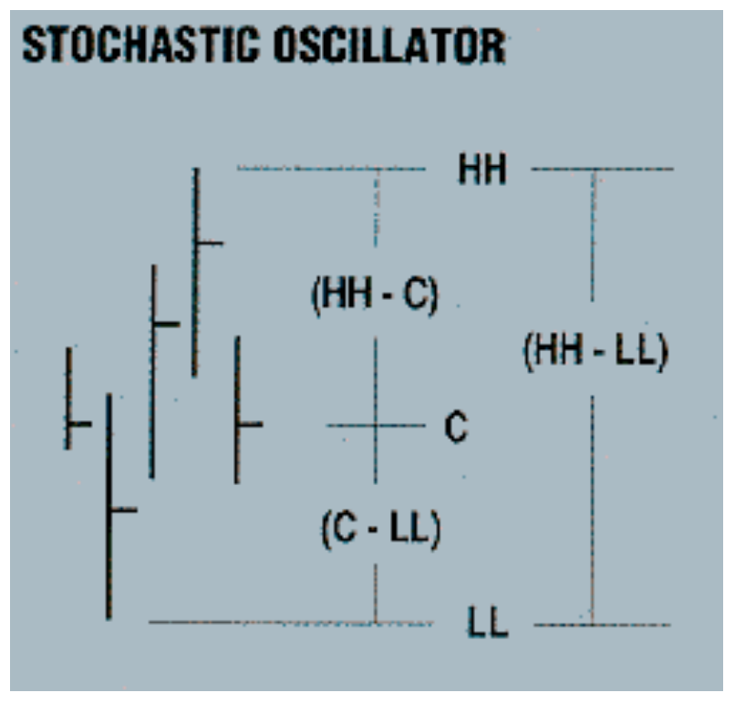
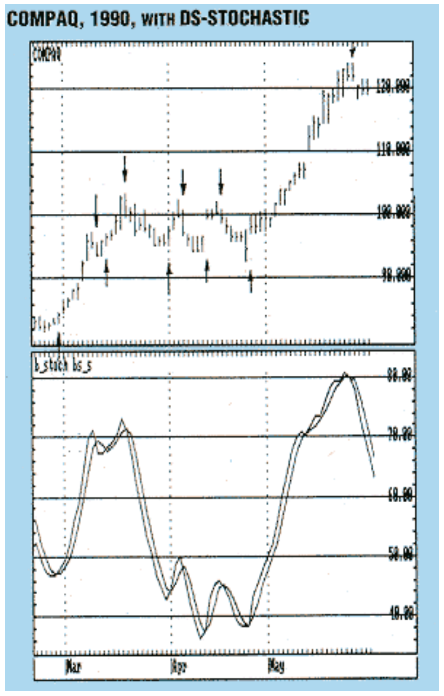
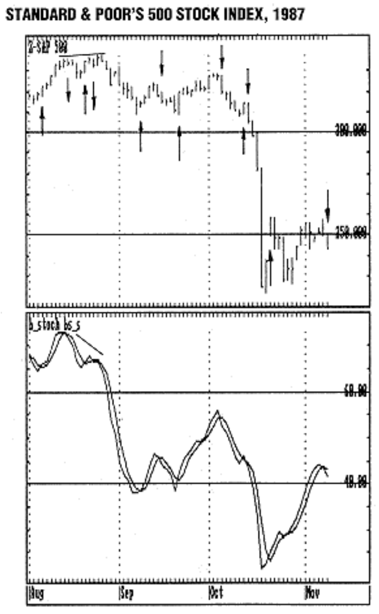

# Double Smoothed-Stochastics

**William Blau**
*Stocks & Commodities V.9:1 (14-16), January 1991*

Source: <https://technical.traders.com/archive/article.asp?file=\V09\C01\DOUBLES.pdf>

---

The stochastic oscillator devised by George Lane is one of the most useful and widely used tools in technical analysis. This oscillator is based on the current close in relation to the highest and lowest prices in a specified time interval (Figure 1). By definition, price increases as the close approaches the highest price of the interval and, conversely, decreases approaching the lowest price in the interval. A maximum is defined when price touches the highest price and then recedes. These characteristics are succinctly expressed by Lane's stochastic:

$$\%K = \text{Raw value} = 100 \cdot \frac{\text{Current close} - \text{Lowest low}_5}{\text{Highest high}_5 - \text{Lowest low}_5}$$

where the oscillations are normalized within a scale of zero to 100. The subscripts (5) indicate "during" the last five days.

The elegance of this expression is in its simplicity. The expression, however, usually suffers from oversensitivity. Too many smaller price changes are revealed, whereas only certain peaks and valleys are important. Ideally, smooth curves are desired to represent price where buying can be performed at or near a price valley, with selling at or near a price peak.

An additional oscillator, %D, is used to help signal market reversals. The formula for %D is:

$$\%D = 100 \cdot \frac{\sum_{n=1}^{3}(\text{Current close} - \text{Lowest low}_5)}{\sum_{n=1}^{3}(\text{Highest high}_5 - \text{Lowest low}_5)}$$

In this formula in which the summation sign (Σ) indicates that the differences formed in the numerator and the denominator are summed three times. A five-day highest high and lowest low with three-day moving averages of numerator and denominator (some versions use a three-day average of %K) has been popular.



**FIGURE 1:** George Lane's stochastic oscillator is based on the current close (C) in relation to the highest and lowest prices in a specified time interval. Price increases as the close approaches the highest price of the interval (HH) and decreases approaching the lowest price (LL).

## Double Smoothed-Stochastics Formulation

The key to the success of stochastics is smoothing to remove false indications, thereby reducing bad trades. Other forms of smoothing exist, such as the double-smoothed stochastic (DS-stochastics), to reduce false trades while maintaining timing for the good trades.

The DS-stochastic is formulated thus:

$$DS\text{-stochastic}_{a,y,z} \equiv 100 \cdot \frac{E_z(E_y(C - L_a))}{E_z(E_y(H_a - L_a))}$$

where:

- C = Current close
- $L_a$ = Lowest low in a days
- $H_a$ = Highest high in a days
- $E_y$ = y-day exponential moving average
- $E_z$ = z-day exponential moving average

Thus, a y-day exponential moving average has an approximate exponential constant (α) of 2/(y + 1). The value y = 2 denotes a moving average over two days with the exponential constant of two-thirds. On the other hand, y = 1 expresses the absence of a moving average.

> In a more chaotic situation, the user would have to rely on the multiple smoothing facilities of the DS-stochastics formulation.

Thus, DS(a,y,z) signifies a double smoothed-stochastic in which the highest highs and lowest lows are used in five-day intervals; the y = seven-day exponential moving average is performed on the numerator and the denominator, while the z = three-day exponential moving average is performed on the value determined by the seven-day exponential value.

A slow version of the DS-stochastics will be produced by using a three-day moving average on the double smoothed-stochastics.

Figure 2 shows a price bar chart of Compaq for March–May 1990. I selected this time period because it embraces both a trending and a consolidation pattern. A DS-stochastic(2, 3, 15) is shown. The highest high and lowest low between adjacent price bars (a = 2) are employed, with double exponential averaging of three and 15 days, respectively. The arrows indicate buy and sell signals using a simple crossover system of the DS-stochastic over its three-day arithmetic average as the trading system.



**FIGURE 2:** This price bar chart of Compaq embraces both a trending and a consolidation pattern. The arrows indicate buy and sell signals using a simple crossover system of the DS-stochastic over its three-day arithmetic average as the trading system.

The first buy signal is given on February 28 at a close of 84 1/4. The rally that ensues is capped off with a sell signal at 93 3/4 on March 12. A buy is indicated at 96 3/8 two days later on March 14, with a small rally to March 20 at a price of 100 1/8. The chart then shows that Compaq consolidated, producing a trading range between roughly 94 3/8 and 102 with an upside breakout on May 4.

Assuming — unrealistically — that we are depending solely on our crossover system, we observe that the DS-stochastic tracks while it smoothes fairly well through the consolidation box. A net gain is indicated using the buy/sell recommendations. The last buy in the box given at a price of 98 1/4 on April 26 precedes the May 4 breakout for an uninterrupted rally up to 122 on May 24.

## Prices, Rallies and Consolidation

The results are aided by the smooth and regular nature of Compaq prices and rallies and through the March–May period. In a more chaotic situation, the user would have to rely on the multiple smoothing facilities of the DS-stochastics formulation.

Figure 3 illustrates the DS-stochastic when a = 1:

$$DS(1, y, z)$$

Here, the close is compared to the high and low for a single day and then smoothed twice through the use of two exponential moving averages of y and z values. This version of the DS-stochastics will be referred to as the HLC index, and it will have a fairly quick response period. (See sidebar, "HLC Index.")



**FIGURE 3:** In this example of DS-stochastic, double exponential smoothing of close - low and high - low is performed over five and 15 days. The double peaks in August signal the downturn via the evident down-divergence shown on the DS-stochastic curve. The divergence starts from an overbought condition on August 14.

Figure 3 is the Standard & Poor's 500 stock index for the period surrounding October 19, 1987. The graph depicts a DS-stochastic(1, 5, 15). Double exponential smoothing of close-low and high-close for a single day is performed over five and 15 days. The double peaks in August signal the downturn via evident down-divergence shown on the DS-stochastic curve. Divergence starts from an overbought condition on August 14. This first maximum is 79.75 at a price of 336, while the second maximum follows at a much lower (diverging) value of 67.07, corresponding to the 337.4 high on August 26, 1987.

---

*William Blau is an independent futures trader.*

## References

- Granger, C.W.J., and Paul Newbold [1986]. *Forecasting Economic Time Series*, second edition, Academic Press, Inc.
- Hutson, Jack K. [1984]. "Filter price data: moving averages vs. exponential moving averages," *Technical Analysis of Stocks & Commodities*, Volume 2: May/June.

---

## Sidebar: HLC Index

When a = 1 in the general formulation for the DS-stochastic, the lowest low and highest high in a single day are specified:

- $L_1$ = Current low = L
- $H_1$ = Current high = H
- C = Current close

Thus:

$$HLC_{1,y,z} = 100 \cdot \frac{E_z(E_y(C - L_{\text{today}}))}{E_z(E_y(H_{\text{today}} - L_{\text{today}}))}$$

I call the expression the HLC Index. This form of the DS-stochastic is based on the location of the close between the high and low of the price bar in a single day. Averaging these values produces a relatively smooth indicator with a fast response.

---

## Citation

```bibtex
@article{blau1991double_smoothed_stochastics,
  author    = {William Blau},
  title     = {Double Smoothed-Stochastics},
  journal   = {Technical Analysis of Stocks \& Commodities},
  volume    = {9},
  number    = {1},
  pages     = {14--16},
  year      = {1991},
  month     = jan,
  url       = {https://technical.traders.com/archive/article.asp?file=\V09\C01\DOUBLES.pdf}
}
```
