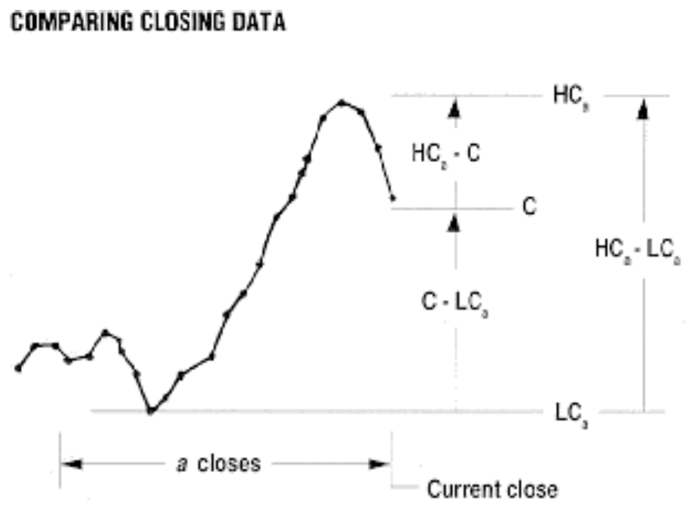
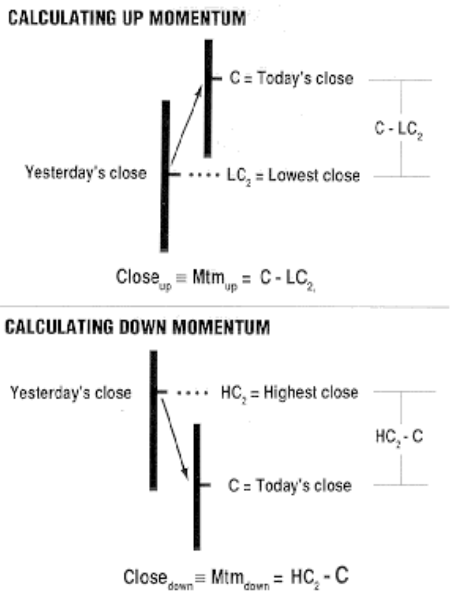
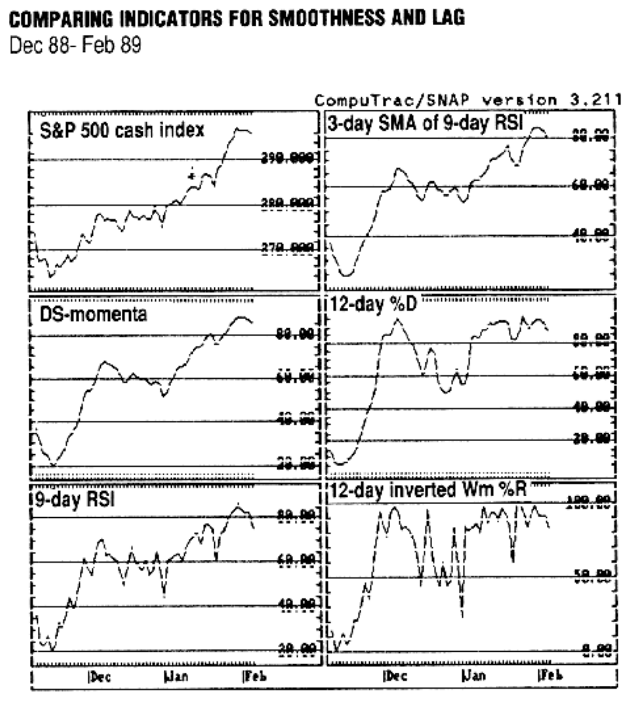
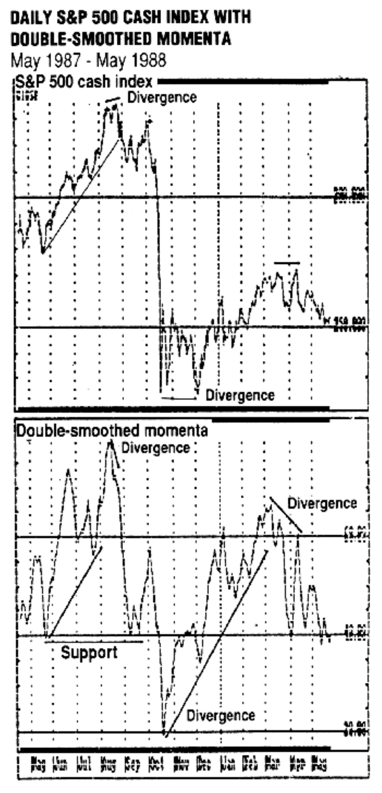

# Double-Smoothed Momenta

**William Blau**
*Stocks & Commodities V.9:5 (202-205), May 1991*

Source: <https://technical.traders.com/archive/article.asp?file=\V09\C05\DOUBLE.pdf>

---

The prices of stocks and commodities are usually plotted as bar graphs. In a bar graph, each bar represents a certain time interval, be it an intraday, daily or weekly bar. The last price in each time interval is designated as the close. For certain markets, the daily close is actually a price determined from the period that makes up the closing range.

The close, or settlement price (the price at which all outstanding positions in a stock or commodity are marked to market), could be considered the most important piece of trading data. One reason is that the close may psychologically affect the trader's outlook. For example, a position that is a loss during an intraday time period may become profitable by the close, increasing the trader's confidence that the position is the correct one. Another reason is that intraday volatility often clouds the true direction of the market. Focusing on the closing prices can provide a clearer picture of the trend. Numerous technical indicators are based only on the closing price.

However, many technical indicators that use the closing price are oversensitive to the singular changes in direction of the closing price. A number of these indicators will in effect give false trading signals due to this sensitivity. Clearly, the method used to smooth the price curve is very important. An indicator that gives smooth curves that indicate price levels at important peaks or valleys would be a superior trading tool.

One such indicator is the Double-smoothed Momenta (DM). The formula for the double-smoothed momenta relates various portions of a series of closing data to today's close (Figure 1). The formula takes into account maximum and minimum values of the closing price in prescribed intervals. These relationships are then smoothed through the use of multiple exponentially smoothed moving averages (or, in other words, an exponential moving average of an exponential moving average). This indicator is designed to warn of overbought and oversold market conditions and to reduce false trading signals.



**FIGURE 1:** The formula for Double-smoothed Momenta (DM) relates today's Close (C) to the Highest Close (HC) and the Lowest Close (LC) during a recent time period (a).



**FIGURE 2:** When today's close is higher than yesterday's close, momentum is labeled up. When today's close is lower than yesterday's close, momentum is labeled down.

## The Formula

The formula for the double-smoothed momenta is:

**(Equation 1)**

$$DM_{a,y,z} = 100 \cdot \frac{E_z(E_y(C - LC_a))}{E_z(E_y(C - LC_a)) + E_z(E_y(HC_a - C))}$$

or, in its alternative form:

**(Equation 2)**

$$DM_{a,y,z} = 100 \cdot \frac{E_z(E_y(C - LC_a))}{E_z(E_y(HC_a - LC_a))}$$

with parameter integers that may assume the following values: a = 2, 3, 4, ... and y, z = 1, 2, 3, 4, ... A family of curves is represented by the a, y, z integers, where:

- C = Close
- $LC_a$ = Lowest close in most recent a days
- $HC_a$ = Highest close in most recent a days
- $E_y$ = y-day exponential moving average with an exponential constant of 2/(y+1)
- $E_z$ = z-day exponential moving average with an exponential constant of 2/(z+1)

## Double-Smoothed Properties

Examination of Equation 1 and the examples in Figures 3 and 4 reveal certain properties of double-smoothed momenta, some of which can be seen in its a/(a+b) format, the basic formulation of Equation 1:

1. The double-smoothed momenta maps the closing price curve and transforms the otherwise infinite range of theoretical closing values into a finite range of zero to 100, giving rise to the so-called overbought and oversold regions.
2. The double-smoothed momenta uses maximum and minimum turning points of the close over a lookback of a days.
3. With a z-day exponential moving average of the y-day exponential moving average, useful, smoothed surrogates for the close can be generated.
4. Most of all, the double-smoothed momenta can provide many choices (curves) for the trader or market timer, assisting him in making trade timing decisions that best fit his personal or corporate psyche.

## Special Case: Relative Strength Index (RSI)

The formula for calculating J. Welles Wilder's relative strength index (RSI) is:

**(Equation 3)**

$$RSI = 100 - \frac{100}{1 + RS}$$

$$RS = \frac{\text{Average of the 14 day's net closes up}}{\text{Average of the 14 day's net closes down}}$$

An up close can be described as today's close minus yesterday's close if today's close is higher than yesterday's close. For our purposes, label the up close as momentum up ($Mtm_{up}$). A close that is lower than yesterday's close will be labeled as momentum down ($Mtm_{down}$):

$$Mtm_{up} = C - LC_2$$
$$Mtm_{down} = HC_2 - C$$

where C represents today's close, $LC_2$ is yesterday's lower close and $HC_2$ is yesterday's higher close (Figure 2).

If we substitute $Mtm_{up}$ and $Mtm_{down}$ in the RS portion of Wilder's formula (Equation 3) and use an exponentially smoothed moving average for the same 14-day period, we get:

**(Equation 4)**

$$RSI_z = 100 - \frac{100}{1 + \frac{E_z(Mtm_{up})}{E_z(Mtm_{down})}}$$

This formula can be represented as:

**(Equation 5)**

$$RSI_z = 100 \cdot \frac{E_z(Mtm_{up})}{E_z(Mtm_{up}) + E_z(Mtm_{down})} = DM_{2,1,z}$$

(See sidebar, "Two versions of the RSI formula," for an explanation of these two formulas.)

## Double-Smoothed Relative Strength Index

Double smoothing of the up and down components of the momenta results from the double-smoothed momenta expressed in Equations 1 and 2. The Double-smoothed Relative Strength Index (DRSI) is essentially a smoothed version of the RSI with lag introduced due to the additional smoothing. With careful design and regard to the particular stock or commodity to be traded, the double-smoothed RSI can be a very useful tool with low false trading signals and with little or no delay of true trading signals.

The equation for the double-smoothed RSI is as follows:

**(Equation 6)**

$$DRSI_{y,z} = 100 \cdot \frac{E_z(E_y(Mtm_{up}))}{E_z(E_y(Mtm_{up})) + E_z(E_y(Mtm_{down}))} = DM_{2,y,z}$$



**FIGURE 3:** The top left-hand chart is the closing price for the S&P 500 index. Counter-clockwise are the Double-smoothed Momenta (DM), 9-day RSI, 12-day inverted Williams %R, 12-day slow stochastic and a 3-day simple moving average of a 9-day RSI. The smoothed RSI, stochastic and DM give timely signals with little delay.

Here are a few examples to demonstrate the benefits of the double-smoothed RSI and double-smoothed momenta. With the help of CompuTrac, Figure 3 displays a six-panel graph of the Standard & Poor's 500 cash index bracketing three months, December 1988 through February 1989. The panels compare the daily close with a double-smoothed momenta, where $DM_{a,y,z} = DM_{12,8,1}$; a nine-day RSI; a three-day simple moving average of the nine-day RSI; a 12-day slow stochastic; and a 12-day inverted Williams' %R. The unsmoothed RSI and unsmoothed Williams' %R are very "noisy." On the other hand, the double-smoothed momenta, smoothed RSI and stochastic are all more or less timely, with little or no delay at turning points. Which to use for trading is an individual's choice. In some cases, one or the other will give a lead of a day or more, which can be of extreme value to the trader.



**FIGURE 4:** The upper chart is the closing price of the S&P 500 index from May 1987 to May 1988. The lower chart is the $DM_{2,5,25}$. Notice the divergence between the market and the DM during August.

Figure 4 depicts the daily S&P 500 cash index for the period from May 1987 to May 1988 with a plot of the double-smoothed momenta, where $DM_{a,y,z} = DM_{2,5,25}$. This is a double-smoothed RSI where $DRSI_{y,z} = DRSI_{5,25}$ (Equation 6). You can see that the double-smoothed curve is relatively smooth and timely. Note that divergences and trendlines come into play here.

A downturn in the August 1987 market was indicated on August 26 and 27 by the clear downward divergence. This downturn was actually initiated on August 18 and confirmed on August 26 and 27 by the downward divergence. Another timely indication of a downturn was given on October 6, with yet another on October 14. The following day, October 15, the double-smoothed momenta dropped below its support level at approximately $DM_{2,5,25} = 40$. This support level was very strong, with four support points at May 21, September 9, September 21 and October 12. There was ample warning (in retrospect, of course) for a major downturn, which materialized a few days later as the October 19, 1987, crash.

## In Summary

Various types of smoothing are applicable in the double-smoothed momenta formulation (Equation 1). For example, the y, z moving averages can be exponential, arithmetic or weighted moving averages, or any paired combinations thereto, although this article demonstrates momenta smoothed only by the double exponential moving averages. A single exponential moving average may be implemented simply by setting y or z equal to 1.

The double-smoothed momenta formulation is a family of smoothed curves that represent turning points in the real world of prices. Many choices are available in a single mathematical expression that lends itself readily to computer implementation. It is easy to use and embraces a wide range of possibilities for the trader.

---

*William Blau is an independent futures trader.*

## References

- Blau, William [1991]. "Double-smoothed stochastics," *STOCKS & COMMODITIES*, January.
- CompuTrac Software, Inc. [1990]. *CompuTrac/PC Version 3.2*, New Orleans.
- Lane, George C. [1984]. "Lane's stochastics," *Technical Analysis of STOCKS & COMMODITIES*, Volume 2: May/June.
- Wilder, J. Welles [1978]. *New Concepts in Technical Trading Systems*, Trend Research.
- Wilder, J. Welles [1986]. "The Relative Strength Index," *Technical Analysis of STOCKS & COMMODITIES*, Volume 4: December.

---

## Sidebar: Two Versions of the RSI Formula

It may not be obvious that:

**(Equation 7)**

$$RSI_{14} = 100 - \frac{100}{1 + RS}$$

is the same as:

**(Equation 8)**

$$RSI_{14} = 100 \cdot \frac{E_{14}(Mtm_{up})}{E_{14}(Mtm_{up}) + E_{14}(Mtm_{down})}$$

where:

- $RSI_{14}$ = Relative strength index of a 14-day period
- $Mtm_{up}$ = Today's close - yesterday's lower close
- $Mtm_{down}$ = Yesterday's higher close - today's close
- $E_{14}$ = 14-day exponential moving average with an exponential constant of 2/(z+1)

Expressing the basic formulas in Equations 7 and 8 without the smoothing should clear the issue:

**(Equation 9)**

$$100 - \frac{100}{1 + a/b} = 100 \cdot \frac{a}{a + b}$$

Equation 9 is a simple representation of Equations 7 and 8 set equal to each other. The RS (up closes/down closes) and the Mtmup and Mtmdown have been replaced by the letters a and b. If you set a=2 and b=5, you have:

$$100 - \frac{100}{1 + 2/5} = 100 \cdot \frac{2}{2 + 5}$$

$$100 - \frac{100}{1.4} = 100 \cdot 0.2857$$

$$28.5714 = 28.5714$$

Thus, Equations 7 and 8 are equivalent.

— Editor

---

## Citation

```bibtex
@article{blau1991double_smoothed_momenta,
  author    = {William Blau},
  title     = {Double-Smoothed Momenta},
  journal   = {Technical Analysis of Stocks \& Commodities},
  volume    = {9},
  number    = {5},
  pages     = {202--205},
  year      = {1991},
  month     = may,
  url       = {https://technical.traders.com/archive/article.asp?file=\V09\C05\DOUBLE.pdf}
}
```
