# True Strength Index

**William Blau**
*Stocks & Commodities V.9:11 (438-446), November 1991*

Source: <https://technical.traders.com/archive/article.asp?file=\V09\C11\TRUESTR.pdf>

---

Price momentum oscillators are popular tools for traders because the nature of these technical tools is to signal trend changes, something every trader wants to know. The ideal indicator would alert the trader to a change in the trend from a down market, at the low of the trend to an up market, correctly indicate that the up trend was in force until the absolute high and then signal the new trend. While this indicator may or may not exist, my own work has led me to the use of applying various smoothing techniques to changes in price. Many changes in price from one level to the next are properly considered to be random or noise. However, if the noise can be filtered or smoothed out, then the trend should be recognizable. Before discussing the smoothing of price changes, let's start with some basics.

## Momentum

Figure 1 depicts a section of a price chart showing the daily close (open, high and low of the price bar are omitted). Momentum is defined as the close minus the close at an earlier time. The daily momentum is today's close minus yesterday's close — for example, the one-day momentum:

$$Mtm = \text{Close} - \text{Close}[1]$$

On November 3, the value of the close is C. On the preceding day the value of the close is C[1]. The one-day momentum for the November 2nd to November 3rd interval is a positive number as shown: the close has increased in value in one day. The slope of the close curve is positive, a rising price. Momentum is increasing from one day to the next.

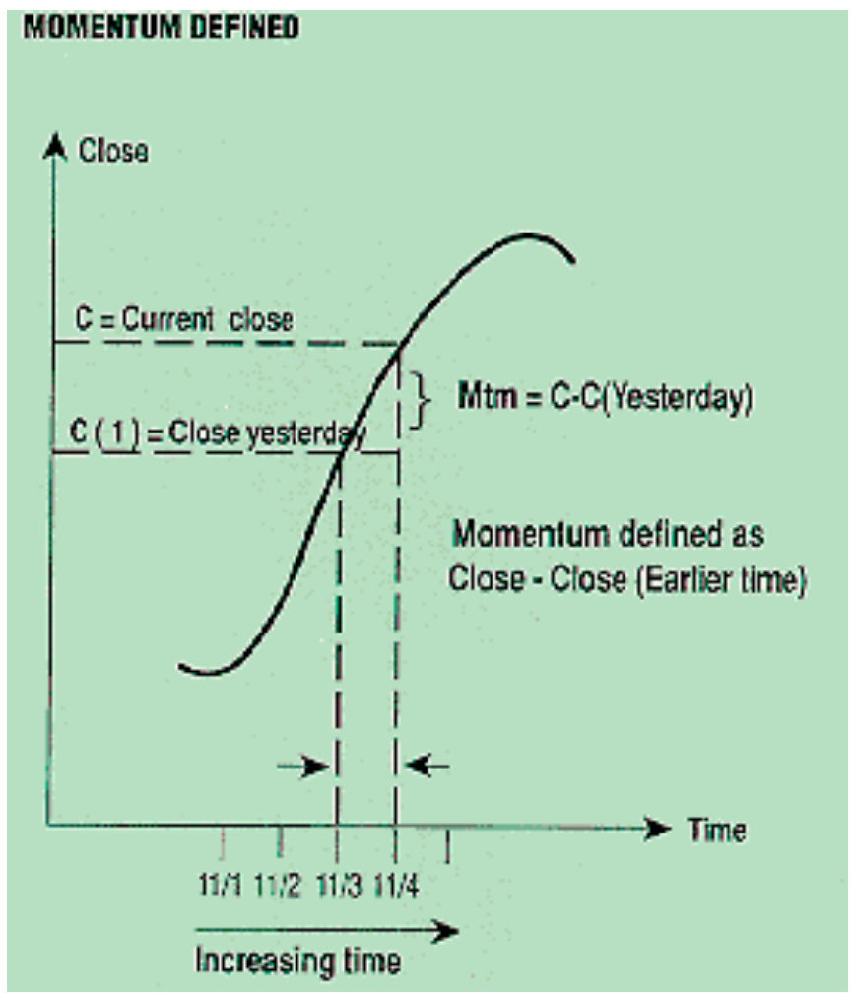

**FIGURE 1:** Momentum is defined as the slope of the price curve. Here it is positive, as prices are rising. The momentum is found by subtracting the close from an earlier close.

> Momentum possesses many characteristics necessary for investing and trading in that it expresses the direction of the market, the amount of movement of the market, and it also highlights market turning points.

If the price falls from one day to the next like C in Figure 2, the price change exhibits a negative slope (going down) and has a one-day momentum that is a negative number. Momentum describes price changes in both magnitude and direction. One formula, the "whole momentum," describes both magnitude and direction. In Figure 2, for example, the price valley at the earliest time shown begins with zero momentum. With passing time, the one-day momentum slowly becomes positive and gets larger as prices rally sharply, and then as the peak at D gets closer, the rally begins to fizzle with decreasing momentum. At the peak itself, the momentum goes to zero. Just past the peak, the momentum changes sign to indicate prices have passed a turning point and are on their way down.

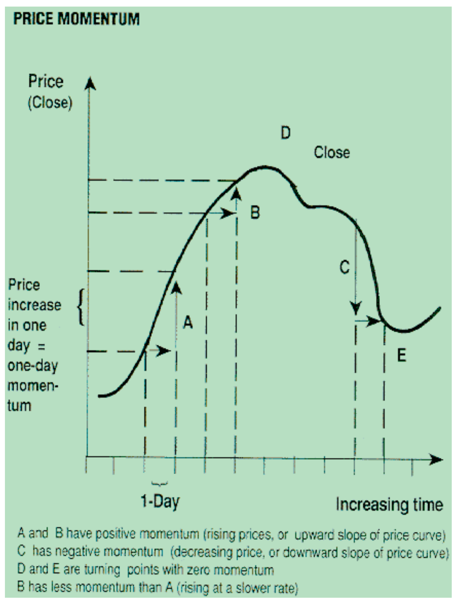

**FIGURE 2**

Momentum possesses many characteristics necessary for investing and trading in that it expresses the direction of the market, the amount of movement of the market, and it also highlights market turning points.

Can we use the one-day momentum without further processing? Generally not. Price (for example, the close) is usually not smooth (see Figures 3 and 4) and its momentum, in turn, is choppy in appearance. Figure 4 shows the one-bar momentum superimposed on its price chart; it rapidly oscillates about its zero line in what appears to be a somewhat random choppy fashion.

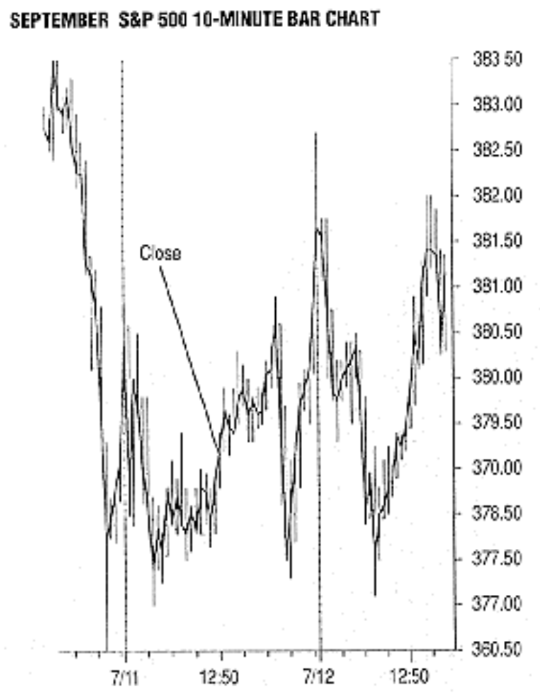

**FIGURE 3:** Closes for July 11-12, 1991, are shown.

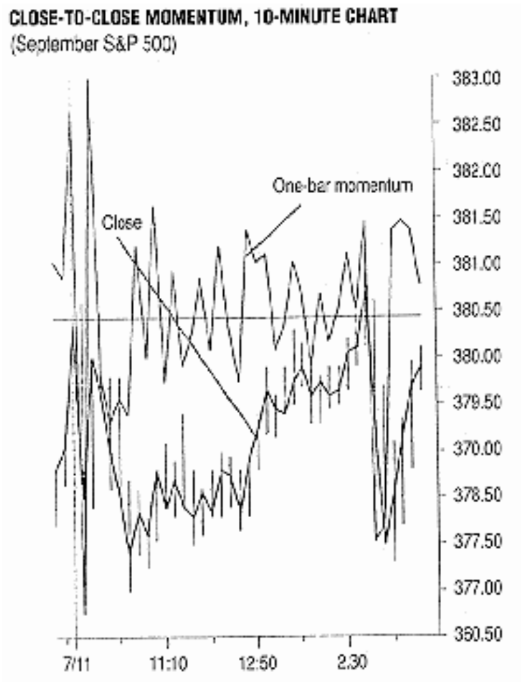

**FIGURE 4:** A magnified view of July 11 shows the choppiness of the close. The momentum of the close is superimposed showing its rapid fluctuations about zero (the horizontal line).

Some sort of smoothing (averaging) is required to reduce the jagged responses. Any form of averaging, however, will produce delay; when subjected to smoothing, momentum peaks will have the major (and too often many of the minor) turning points preserved but lagging their unsmoothed price counterparts that they are supposed to represent. Very smooth responses very often produce too much lag and indicate a turning point long after the actual turning point has occurred. This is a major problem associated with moving averages. Using moving averages on momentum, or mathematical manipulations of momentum of prices instead of moving averages on prices directly, generally results in less lag, although more interpretation of the results may be necessary.

## Relative Strength Index

J. Welles Wilder's relative strength index (RSI) distinguishes between rising and falling closes by separating momentum values that are positive from those that are negative in a (moving) interval (see sidebar, "Calculating RSI"). In Wilder's original work, the formula is given as:

$$RSI = 100 - \frac{100}{1 + RS}$$

where the relative strength is a ratio defined as:

$$RS = \frac{\text{Avg. of 14 days' closes Up}}{\text{Avg. of 14 days' closes Down}}$$

The original formula can be converted to the following:

$$RSI = 100 \cdot \frac{\text{Up avg}}{\text{Up avg} + \text{Down avg}}$$

(See sidebar, "RSI: Two Versions.")

From the "Calculating RSI" sidebar, we see on January 22, the close was down by 3.20 points from the preceding day. The zero in the mtm up column denotes there was no up momentum that day. The average (the exponential moving average determined by multiplying the previous day's average by 13, add today's change and then divide by 14) of the values in the increasing column (mtmup) is computed as the 14-day UP AVG. Similarly, the 14-day average of decreasing momentum values is also computed as the 14-day DN AVG (calculated in the same fashion), and from this we obtain the widely used formulas for RSI and RS.

Because of its wide usage, examples of the RSI abound. It is used for its overbought/oversold properties and its highlighting of divergences between it and the close curve from which it is derived. Very often, it is possible to observe trendlines and breakouts with the RSI in the same manner as the close curve directly. The RSI, however, is an uncontrollable surrogate for the price curve because of its faithful reproduction of the choppiness (high-frequency noise) residing in the price curve (Figure 5). Under normal circumstances, it is difficult to ascertain turning points with the RSI because of noise corruption: many indications turn out to be false. Because of the noise, the RSI is relegated most often to amplitude decisions in overbought and oversold regions and as a divergence indicator.

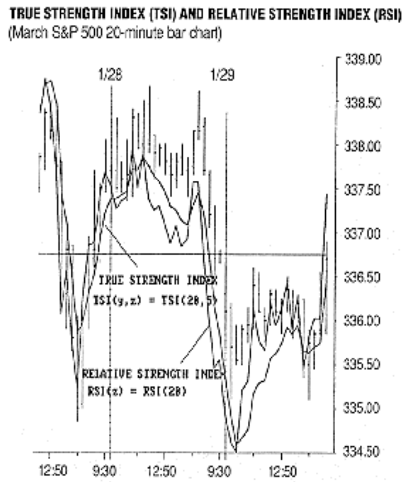

**FIGURE 5:** TSI and RSI are overlaid on the March Standard & Poor's 500 index future with 20-minute bar chart spacing. The TSI, with double smoothing of 20 and five bars, provides a smoothed version of the RSI with little or no lag.

## Double-Smoothed Momenta

A noise-reduction approach to momentum oscillators can be represented as the generalized double-smoothed momenta formulation $DM_{a,y,z}$. For a = 2 it becomes the double-smoothed version of the RSI, which was introduced in the May 1991 S&C and I call $DRSI_{y,z}$:

$$DM_{2,y,z} = 100 \cdot \frac{E_z(E_y(Mtm_{up}))}{E_z(E_y(Mtm_{up})) + E_z(E_y(Mtm_{down}))} = DRSI_{y,z}$$

Where:

- $E_y$ denotes exponential moving average smoothing with "exponential constant" equal to 2/(y + 1)
- $E_z$ denotes exponential moving average smoothing with "exponential constant" equal to 2/(z + 1)
- $Mtm_{up}$ and $Mtm_{down}$ are the one-day up and down momenta, respectively
- $DRSI_{y,z}$ is the double-smoothed RSI with smoothings of y and z days

Comparing the result with the original RSI, the sole difference is in the double exponential averaging relative to single averaging of the up and down components of the one-day momentum. Double smoothing does make a difference, and at times the improvement is significant.

## True Strength Index and Double-Smoothing

The true strength index (TSI) I introduce here is based on momentum as it occurs in nature, with no need to segregate up and down components of the momentum. The RSI in either single- or double-smoothed versions requires that each day's momentum in the y- and z-day averaging process be segregated into up and down components. The up and down momenta are also separately averaged. It is possible with this process to lose sight of the underlying "whole momentum" process. Normally, we describe varying prices in terms of factors such as rate of change, slope of the price (close) curve, or momentum — not in terms of segregated up and down components.

> The TSI as a smoothed overbought/oversold momentum indicator has the additional characteristic that it can often be used as a trading vehicle to determine turning points.

The momentum concept espoused by the various forms of the RSI can be expressed in terms of the momentum itself in place of its up and down components. The formula required for the TSI is:

$$TSI(y, z) = 100 \cdot \frac{E_z(E_y(Mtm))}{E_z(E_y(|Mtm|))} \quad ; \quad y, z = 1, 2, 3, \ldots$$

where the vertical bars in the denominator specify the absolute value or magnitude of the one-day enclosed momentum of the close. Except for a scale factor, the TSI is identical to the RSI, singly or doubly smoothed as the case may be.

From "Calculating TSI" we see that a 14-day exponential moving average (EMA) of the first data column with both positive and negative values is made. A second EMA of, say, three days is made of the result. This double smoothing produces the numerator of the TSI. The denominator results from a 14-day EMA of the second data column (the absolute value of the momentum values), upon the result of which is performed a second average of three days. Multiplication by a factor of 100 completes the computation of the TSI.

Double smoothing of the momentum and its absolute value are basic requirements of the TSI for noise reduction with low lag. The multiple smoothing with long and short smoothing intervals is fundamental to the TSI, setting it apart from the RSI. With single smoothing, results are identical to the RSI except for a scale factor. The TSI as a smooth overbought/oversold momentum indicator has the additional characteristic that it can often be used as a trading vehicle to determine turning points, since false indications due to high-frequency noise (choppiness) are often significantly reduced while maintaining acceptable lag levels.

The effect of multiple smoothing of the momentum will be demonstrated by referring to Figures 4 through 8. The unsmoothed momentum is shown superimposed on the price curve of the September Standard & Poor's 500 futures index contract 10-minute chart in Figure 4, in which many zero crossings can be observed (the horizontal line is zero momentum). Although the close is very choppy, the momentum appears to be even more noisy by visual inspection. Yet, embedded in this seeming hodgepodge of apparently random and rapid oscillations is coherent or correlated information that originally resided in the price curve. The underlying embedded information is not completely random. It may be partially random; it may be said to be partially coherent, in which case, it may be subjected to tests to determine how well correlated it is and how well it compares with some known standard.

For example, if we knew beforehand that the momentum structure was an ideal on/off repeating square wave, we could test with a local on/off square wave. If our local comparison signal was identical, we would have perfect correlation. "Convolution" is the process in which the local comparison signal moves past the momentum structure and is summed or averaged in the process. If correlation is high, what appears to be random noise can be detected and removed from the zero crossing region.

Because we do not know what form the price curve will take, we certainly do not know what its momentum structure will be. However, we have available a convolution (correlating) mechanism, the moving average. We can select its amplitude weighting and/or its time duration. A long-time duration moving average is first employed to "match" the slowly varying information content moving the resulting (partially) correlated curve away from the zero line: the curve itself now appears to be slowly varying with choppiness on its "back" with few, if any, zero crossings. It now remains to attempt to strip away the remaining high-frequency noise modulation, accomplished in large measure by performing a moving average of short time duration matched to that of the period of oscillation of the noise.

Let's check it out. In Figure 6, a 15-bar exponential moving average is applied to the momentum. This is the first average of the momentum, and it lifts the curve away from zero. This indicates that the September S&P 500 contract is not random in 10-minute increments because a slowly varying curve with choppy high-frequency components is displayed. The choppiness of the smoothed momentum follows closely the choppiness in the close price and is a characteristic of the relative strength index (see also Figure 5).

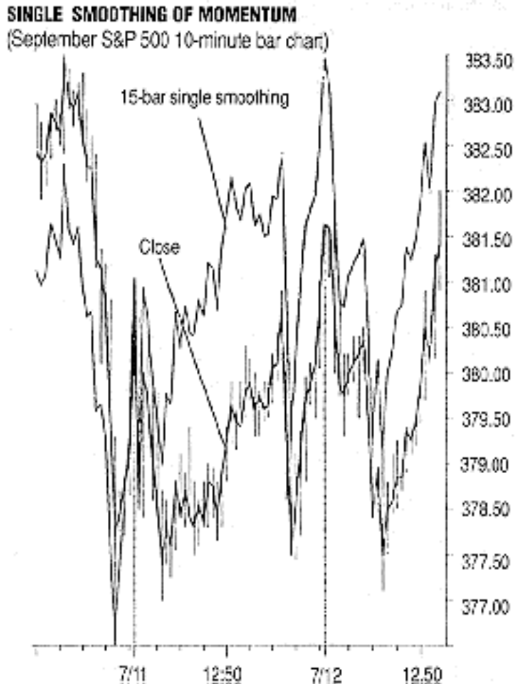

**FIGURE 6:** A 15-minute bar exponential moving average of the momentum in Figure 4 results in a curve that no longer fluctuates about zero. The single smoothed momentum is seen to be "slowly varying" with the noise fluctuations appearing on its envelope. The choppy frequency variations in the close are preserved in the average momentum, an effect present in the RSI.

A second EMA is made of the result of the momentum curve of Figure 6. The time duration of the second EMA is small to match that of the superimposed noise, thereby smoothing it away (Figure 7).

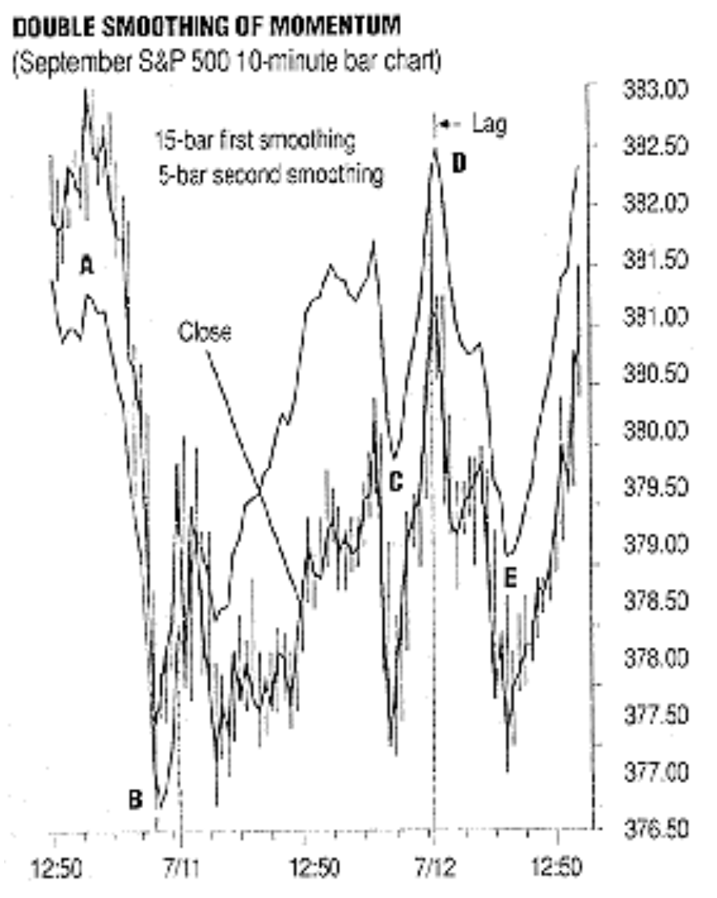

**FIGURE 7:** The 15-bar momentum EMA in Figure 6 is subjected to an additional smoothing of five bars, a duration selected to match the noise and so is necessarily shorter than the first smoothing. The lag introduced is small and usually acceptable.

### And Here's Lag

What about lag? Whenever a moving average (correlation) is performed, the filtering process introduces lag. The longer the time of the averaging process, the greater the lag is. Since the second smoothing is of short duration, it effectively reduces the high-frequency noise with little or no measurable increase in lag. Observation of Figure 7 for a second smoothing of five bars shows a dramatic improvement in smoothness of the double-smoothed momentum curve. Some lag is evident at turning points B, C and D, while lag is absent at points A and E. Reduction of lag and noise enhancement go together. If we desire an exceptionally smooth TSI, we must put up with increased lag. On the other hand, if minimum lag is the prime consideration, then we must accept the penalty of increased choppiness with its attendant corrupting indications. There is a middle ground that is different for every investor/trader, depending largely on the trading system in which the TSI is incorporated and the subjective values inherent to the trader and how he trades. The double-smoothed true strength index gives a choice to the trader; selection of the smaller smoothing time can be made to satisfy individual trading personalities.

Is there anything sacred about double smoothing as opposed to higher levels of smoothing? Generally, no. Indeed, without regard for lag, triple smoothing was demonstrated to provide very smooth average momentum curves in an early S&C article by Jack Hutson.

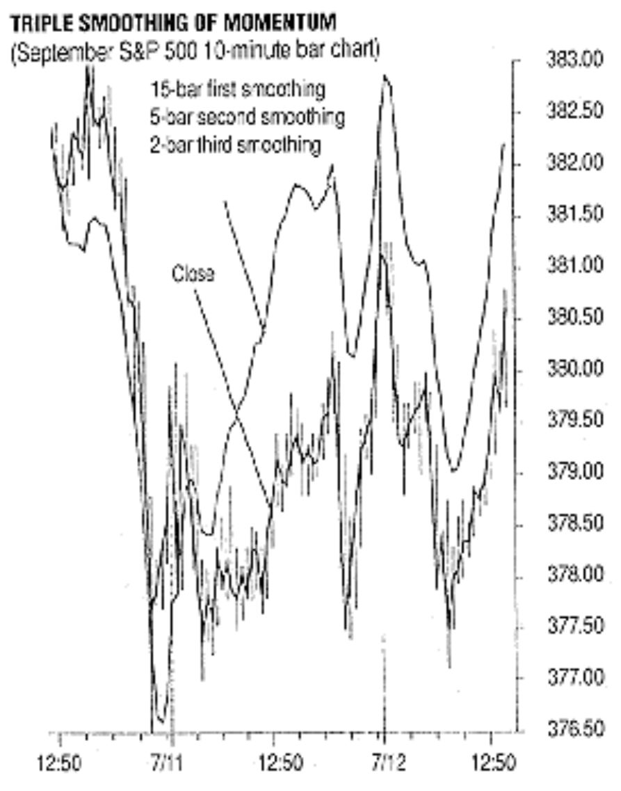

**FIGURE 8:** Usually, most of the noise will be cleaned up with double smoothing. Higher levels of smoothing may be used if lag remains within bounds. Triple smoothing, as in this example, provides a bit more noise cleanup while maintaining acceptable lag. There is always a tradeoff between smoothness and lag.

Figure 8 depicts triple smoothing with low lag. As before, a large interval, 15 bars, is employed for the first smoothing. The result of the first moving average is smoothed using a five-bar interval. The curve now looks like that of Figure 7 being double-smoothed, with the result again smoothed by a yet smaller interval, two bars, for a further noise cleanup with minimal further introduction of lag.

## Divergence and the TSI Numerator

The numerator of the TSI is simply the (double) moving average of the one-day momentum of the close. I call it the divergence indicator (DI):

$$DI_{y,z} = E_z(E_y(Mtm)) \quad ; \quad y, z = 1, 2, 3, \ldots$$

because of its excellent highlighting of divergences between average momentum and the price curve and my usage of the indicator over the years.

The divergence indicator is one of the simplest and most useful indicators that I currently use. It is obtained by finding the daily momentum, which is yesterday's close subtracted from today's close. The daily momentum over a number of days is plotted, and a single (1, z) or double (y, z) moving average(s) is performed.

That's it. The DI may be calculated by hand or by computer. It can be on just about any computer with a program that utilizes moving averages.

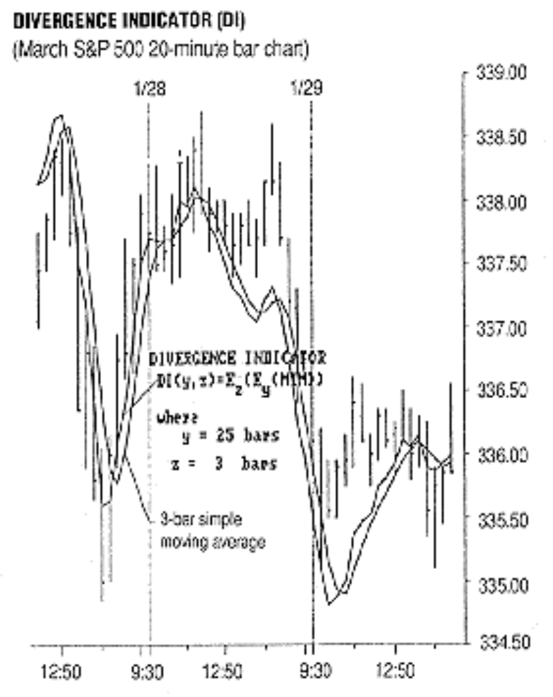

**FIGURE 9:** The DI is the numerator of the TSI. It is the (double) moving average of the momentum of the close. Plotted here is the DI with its three-bar arithmetic moving average. Although the close is very choppy, the DI is very smooth with timely (acceptable lag) determination of turning points via moving average crossovers.

Figure 9 shows a simple trading system using the divergence indicator crossing over its three-bar simple moving average. Because of the low lag and smooth contouring, the "true" turning points are clearly indicated. My research into smoothing momentum has focused on intraday trading as the figures given represent, but the approach is just as applicable to daily data.

---

*William Blau, (407) 368-9095, is an independent futures trader.*

## References

- Wilder, J. Welles [1978]. *New Concepts in Technical Trading Systems*, Trend Research.
- Blau, William [1991]. "Double smoothed-stochastics," *STOCKS & COMMODITIES*, January.
- Blau, William [1991]. "Double-smoothed momenta," *STOCKS & COMMODITIES*, May.
- Hutson, Jack K. [1983]. "Triple exponential smoothing oscillator: Good TRIX," *Technical Analysis of STOCKS & COMMODITIES*, Volume 1: July/August.

---

## Sidebar: Calculating RSI

Calculate RSI by summing the up closes during the first 14 days and dividing by 14. This is the up average (Column E). Then sum the down closes during the first 14 days and divide by 14. This is the down average (Column F). All values are absolute values (positive integers). Then divide the up average by the down average to determine the RS value (Column G). Add 1 to the RS value (Column H). This result is divided into 100 (Column I). The quotient is then subtracted from 100 to produce the RSI value (Column J).

After the first 14 days of up averages and down averages are calculated, the future values are determined by using the previous day's up and down averages. First, multiply each average by 13. If today's change in price is positive, add today's change in price to the up average, then divide by 14. Add zero to the down average and divide by 14. For a day with a down close, you will add the absolute value of the down close to the down average and divide by 14. Add zero to yesterday's up average (first multiplied by 13) and divide by 14 for today's new up average. The remainder of the calculation for RSI remains as before.

— Editor

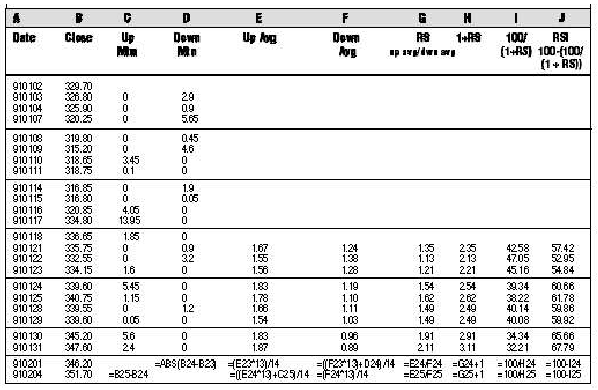

---

## Sidebar: Calculating TSI

Calculating the true strength index requires an introduction to exponentially smoothed moving averages (EMA):

**Exponential Moving Average** — The EMA for day D is calculated as:

$$EMA_D = \alpha \cdot PR_D + (1 - \alpha) \cdot EMA_{D-1}$$

where PR is the price on day D and α (alpha) is a smoothing constant (0 < α < 1). Alpha may be estimated as 2/(n+1), where n is the simple moving average length.

The one-day changes in price are smoothed using an EMA for calculating the TSI:

1. **Momentum** (Column C): net change in price for today from yesterday
2. **Absolute value** (Column D): absolute value of the one-day change in price
3. **First smoothing** — 14-day EMA (constant = 2/(14+1) = 0.1333):
   - Column E: 14-day EMA of momentum
   - Column G: 14-day EMA of absolute momentum
4. **Second smoothing** — 3-day EMA (constant = 2/(3+1) = 0.50):
   - Column F: 3-day EMA of Column E (numerator / divergence indicator)
   - Column H: 3-day EMA of Column G (denominator)
5. **TSI** (Column I) = Column F / Column H

— Editor

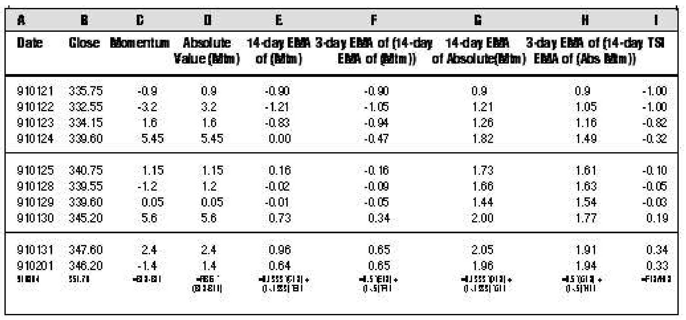

---

## Sidebar: RSI — Two Versions

It may not be obvious that:

$$(1) \quad RSI_{14} = 100 - \frac{100}{1 + RS}$$

is the same as:

$$(2) \quad RSI_{14} = 100 \cdot \frac{E_{14}(Mtm_{up})}{E_{14}(Mtm_{up}) + E_{14}(Mtm_{down})}$$

where:

- $RSI_{14}$ = Relative strength index of a 14-day period
- $Mtm_{up}$ = Today's close - yesterday's lower close
- $Mtm_{down}$ = Yesterday's higher close - today's close
- $E_{14}$ = 14-day exponential moving average with an exponential constant of 2/(z + 1)

Expressing the basic formulas in Equations 1 and 2 without the smoothing should clear the issue:

$$(3) \quad 100 - \frac{100}{1 + a/b} = 100 \cdot \frac{a}{a + b}$$

Equation 3 is a simple representation of Equations 1 and 2 set equal to each other. The RS (up closes/down closes) and the Mtmup and Mtmdown have been replaced by the letters a and b. If you set a=2 and b=5, you have:

$$100 - \frac{100}{1 + 2/5} = 100 \cdot \frac{2}{2 + 5}$$

$$100 - \frac{100}{1.4} = 100 \cdot 0.2857$$

$$28.5714 = 28.5714$$

Thus, Equations 1 and 2 are equivalent.

— Editor

---

## Citation

```bibtex
@article{blau1991true_strength_index,
  author    = {William Blau},
  title     = {True Strength Index},
  journal   = {Technical Analysis of Stocks \& Commodities},
  volume    = {9},
  number    = {11},
  pages     = {438--446},
  year      = {1991},
  month     = nov,
  url       = {https://technical.traders.com/archive/article.asp?file=\V09\C11\TRUESTR.pdf}
}
```
