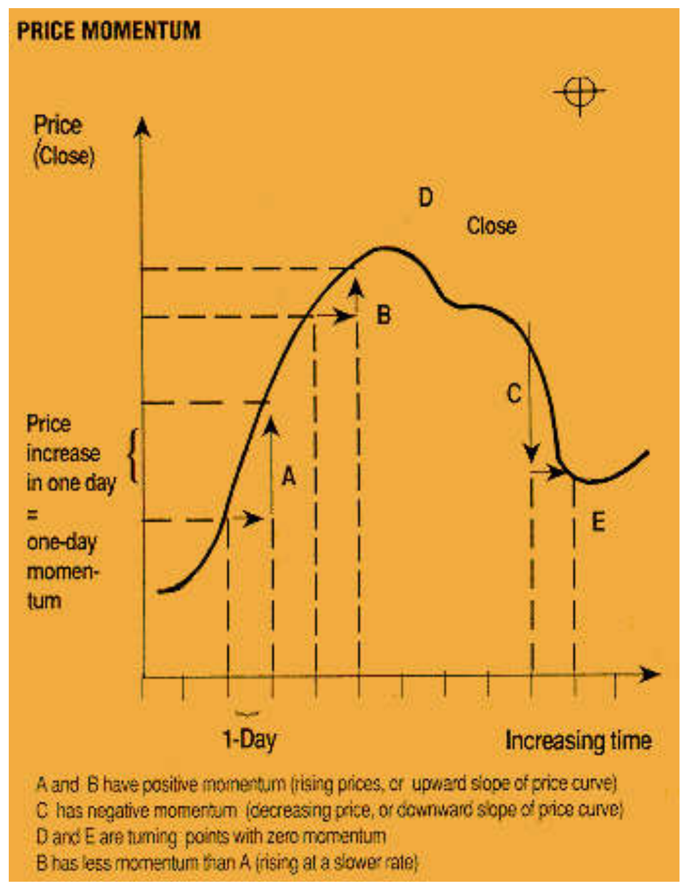
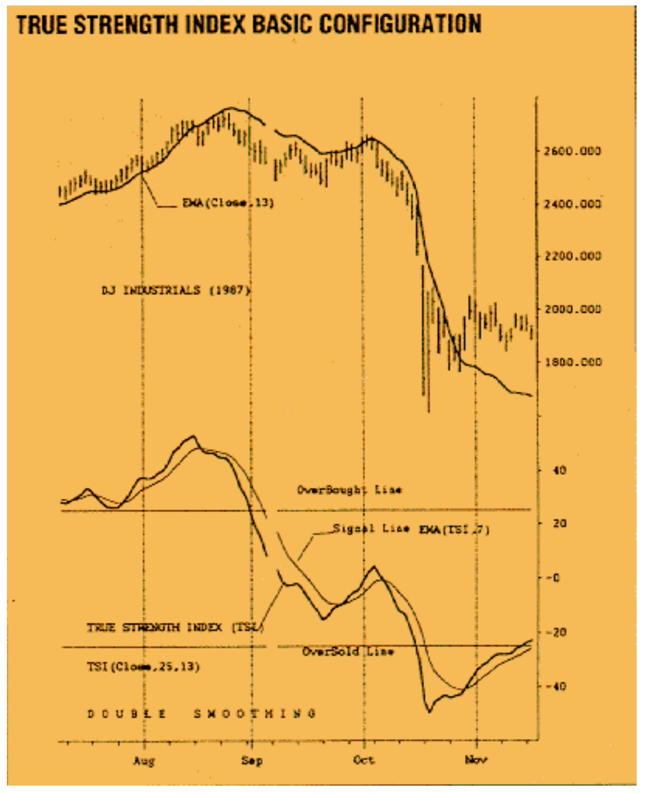
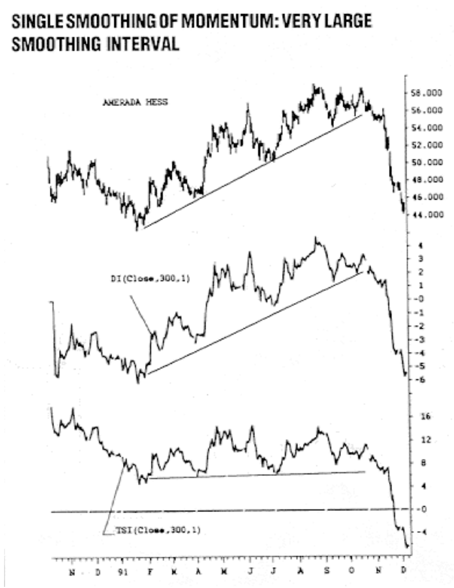
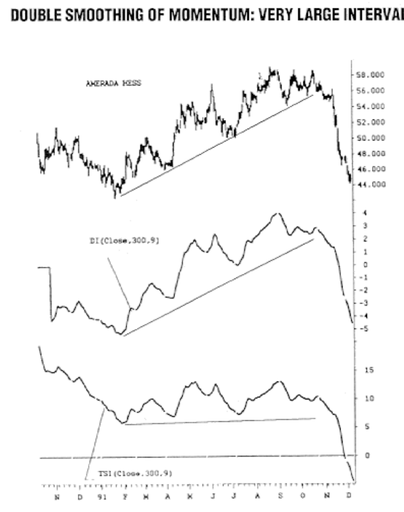
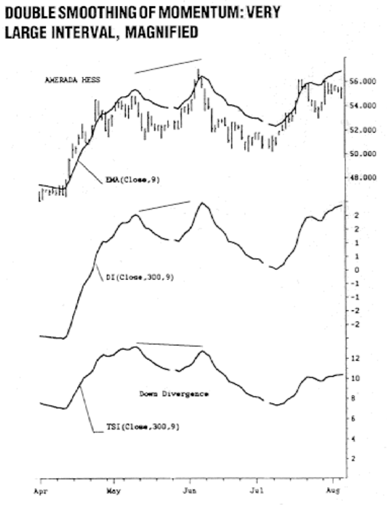
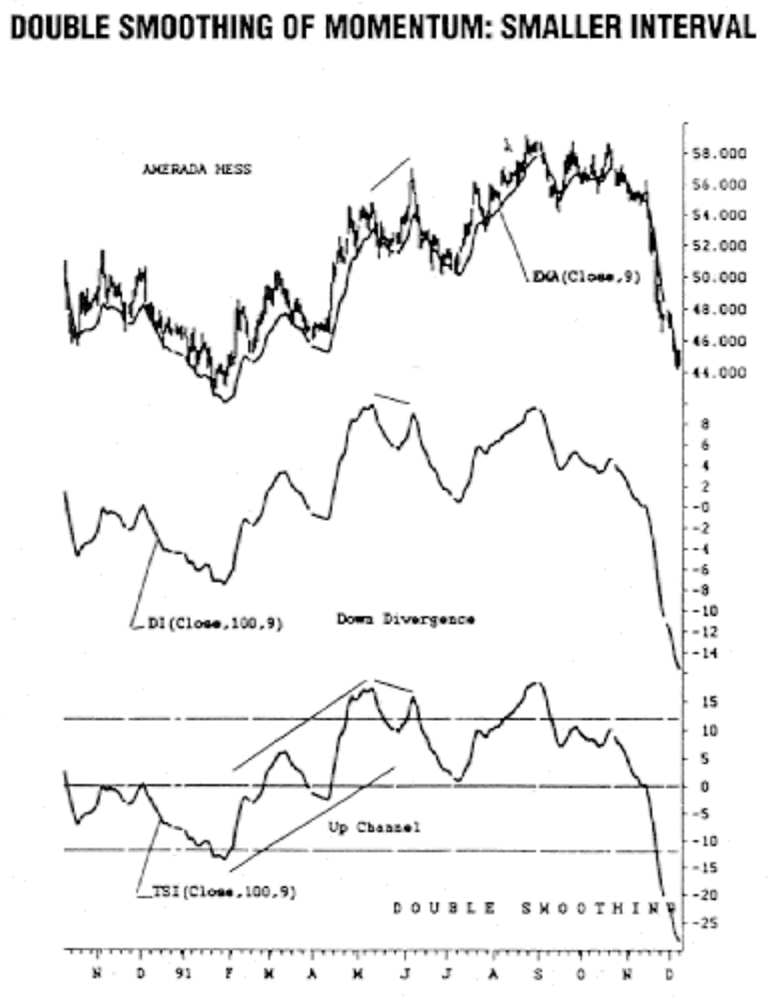
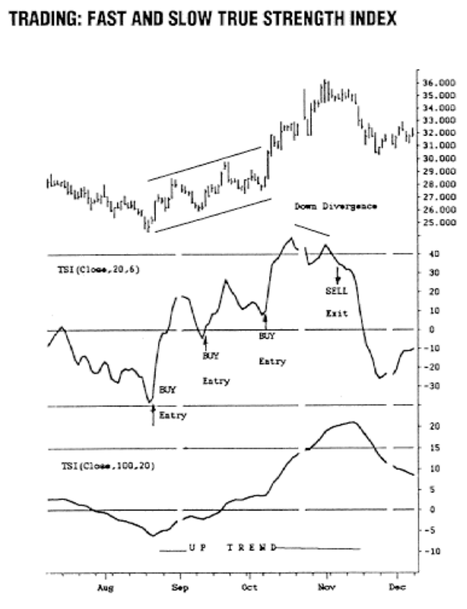
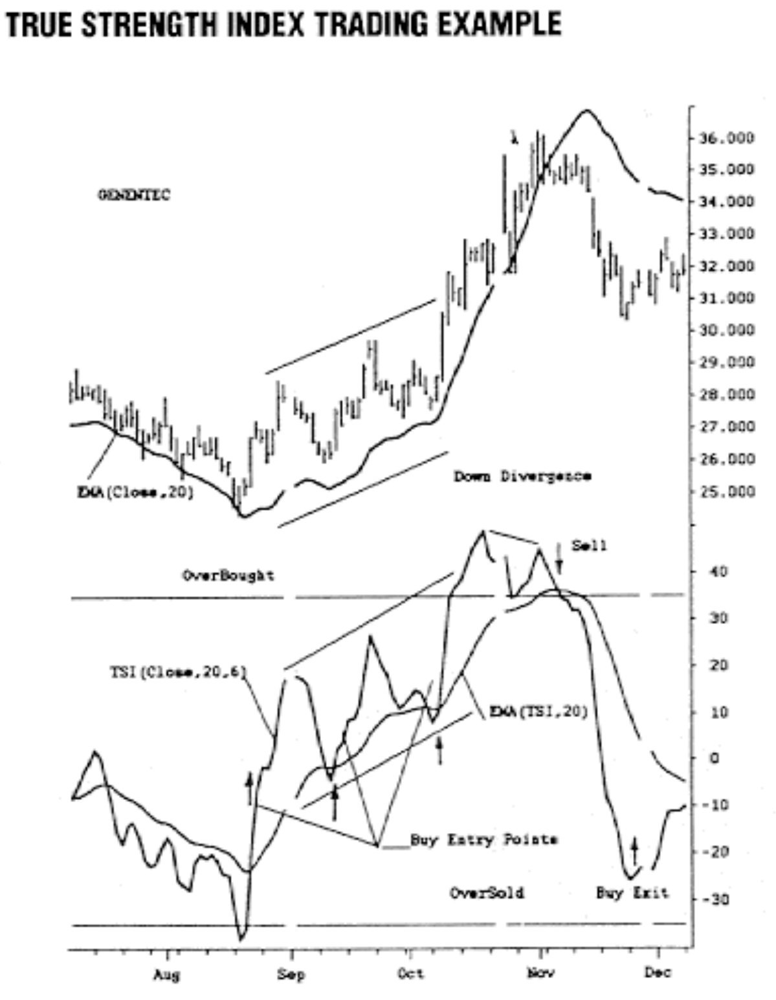
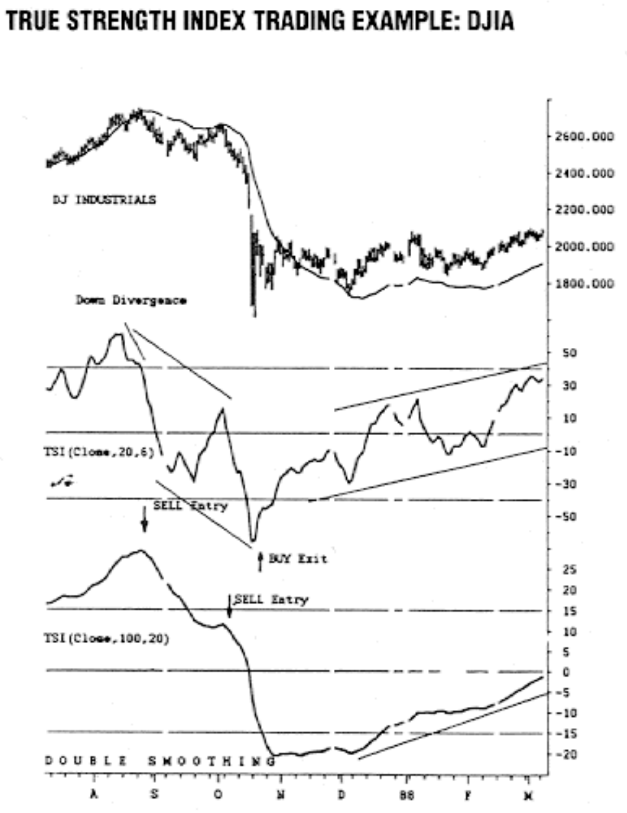
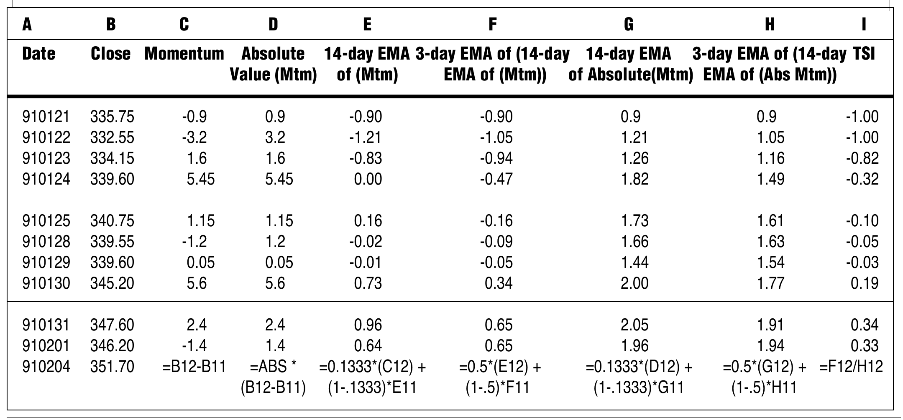

# Trading With The True Strength Index

**William Blau**
*Stocks & Commodities V.10:5 (214-219), May 1992*

Source: <https://technical.traders.com/archive/article.asp?file=\V10\C05\TRADING.pdf>

---

The true strength index, which was introduced late last year in these pages, may be considered to be a cross between a relative strength indicator and a moving average convergence/divergence indicator with many of the desirable properties from each. Creator William Blau, who introduced the indicator to S&C readers last year, explains how to trade with the index.

## Introduction

The true strength index introduced in STOCKS & COMMODITIES November 1991 was discussed as a smooth momentum indicator stripped of high-frequency noise useful for expressing the direction of market trends, the amount of movement of the market and highlighting market turning points. Figure 1 depicts a section of a price chart showing the daily close (with the open, high and low of the price bars omitted). Momentum is defined as the close minus the close of an earlier period. The daily momentum is today's close minus yesterday's close; for example, the one-day momentum is:

$$Mtm = \text{Close}_{\text{today}} - \text{Close}_{\text{yesterday}}$$

When the close's value increases from one day to the next, the slope of the close curve is positive; momentum is increasing from one day to the next.

On the other hand, if price falls from one day to the next (like C in Figure 1), the price change exhibits a negative slope (that is, it is going down) and has a one-day momentum that is a negative number. Momentum describes price changes in magnitude and direction. In Figure 1, for example, the price valley at the earliest time shown begins with zero momentum. As time passes, the one-day momentum becomes positive and gets larger when prices rally sharply and then as the peak at D gets closer, the rally slows down with decreasing momentum. At the peak itself, the momentum is zero. Immediately past the peak, the momentum changes sign to indicate prices have passed a turning point on their way down.



**FIGURE 1**

Momentum possesses many characteristics necessary for investing and trading in that it expresses the direction of the market and the amount of the movement of the market, and it also highlights market turning points. The formula for the true strength index is given by:

$$TrSI(y, z) = 100 \cdot \frac{E_z(E_y(Mtm))}{E_z(E_y(|Mtm|))}$$

In the numerator, an exponential moving average (EMA) of the one-day momentum of the close is made for y-days. This result is subjected to a second EMA for z-days. In effect, the numerator performs double smoothing of the momentum. The denominator, however, performs double smoothing on the absolute value or magnitude of the momentum; its sole purpose is to normalize the true strength formula so that the numbers are bounded and easy to handle across a variety of price conditions. (See sidebar, "Calculating TrSI.")

Figure 2 shows the true strength index of the close for double smoothing of 25 and 13 days, respectively. (Notation employed on charts is TrSI(close,25,13), where the first numeric represents the first smoothing and the second numeric represents the second smoothing.) The true strength index is seen as relatively smooth (not as choppy as the close curve). Peaks and valleys of the index track those of the close with little or no measurable lag. The true strength index appears to be confined between plus and minus 100, no matter what the variation in price (this is the normalization provided by the denominator). Two parallel basis lines are placed at levels where they serve as thresholds to indicate historic overbought and oversold price conditions. A signal line may be employed to select turning points via crossover of the true strength index over its EMA. The signal line in Figure 2 results from a seven-day EMA of the true strength index line.



**FIGURE 2:** The true strength index has maximum/minimum values of +100/-100 showing overbought/oversold price regions. The signal line is a moving average of the true strength index. Turning points are highlighted by true strength index crossovers.

> Does double smoothing of momentum via the true strength index lead to new possibilities in trading systems? Let's explore.

Like its predecessor, the relative strength index (RSI), the true strength index also shows divergences between it and the close curve from which it is derived, often signifying a coming change of price direction. Support and resistance often become evident on the true strength index prior to price. Similarly, trendlines appear on the true strength index chart corresponding to those on the price chart. The true strength index also provides noise cleaning with low lag by virtue of its double smoothing.

## A Proxy for Price

What is the underlying mechanism that permits us to use moving average momentum as a stand-in for price? Why do price and moving average momentum diverge? Can we control divergences? What is the effect of double smoothing on trending? Is it possible to perform moving average trending in the domain of the true strength index more "efficiently" than in the price domain? Does double smoothing of momentum via the true strength index lead to new possibilities in trading systems? Let's explore the possibilities.

Mathematically, it can be shown that moving average momentum is a valid representation of price (except for scaling) if the window of the moving average is allowed to increase without limit. Moving average momentum is defined by the true strength index numerator, which I call the divergence indicator (DI):

$$DI_{y,z} = E_z(E_y(Mtm))$$

which is defined for y, z days' double smoothing. Single smoothing is defined for z-days when y = 1.

Figure 3 is a high-low-close bar graph of Amerada Hess with subgraphs of the divergence indicator and true strength index. Single smoothing (exponential moving average) of momentum is displayed for a moving window of 300 days. The divergence indicator appears to be an excellent replica of the price curve. There are no divergences between price and the large window moving average; the shapes of the curves track each other well. The true strength index plotted on the graph does not track in the same manner due to the scale compression resulting from amplitude normalization (the denominator in the true strength index formula). However, the position of turning points and secondary maxima and minima are preserved. Scale changes produce changes in the relative size of peaks and valleys, giving birth to divergences between the true strength index and the price curve — for example, mid-April to early June. In addition, note that the trendline appearing on the price curve is preserved in both the divergence indicator and true strength index subgraphs. In the latter, the scale compression of the true strength index has changed the slope of the trendline.



**FIGURE 3:** A large 300-day moving average of momentum DI(close,300,1) produces a curve that is a good approximation of price shape. The true strength index is "normalized" momentum and is an amplitude-compressed version of momentum showing divergences not otherwise present.

Figure 4 introduces double smoothing to the 300-day moving average. In this example, the second smoothing is for nine days. The shapes of the respective curves are preserved with rapidly fluctuating noise removed and with low lag of turning points. Both the 300-day DI and true strength index can be viewed as being reasonably smooth replicas of the price curve. See Figure 5 for a magnified section of Figure 4, with the DI closely tracking the exponential moving average (EMA) of the close. The true strength index also tracks the EMA of the close with the added feature of a down divergence.



**FIGURE 4:** The 300-day average momentum of Figure 3 is smoothed by a nine-day EMA resulting in a noise-free curve with low lag, similar to a nine-day EMA of the close.



**FIGURE 5:** Here's a magnified view of Figure 4.

The next step in our iteration is to reduce the large moving average from 300 days to 100 days while maintaining the second smoothing of nine days, as can be seen in Figure 6. The DI and true strength index now appear to be shaped approximately the same, although their respective amplitude scales are different. Both exhibit the same trending and divergence characteristics. In this sense, the true strength index with its desirable normalization is thus justified, permitting many price curves to be compared on the same numeric scale (see also Figure 2).



**FIGURE 6:** A reduction in smoothing interval to 100 days and nine days produces a divergence in the DI momentum where it did not exist before. Except for scaling, the DI and true strength index appear almost identical.

## Trading and Double Smoothing

As a consequence of double smoothing, the true strength index appears to have many characteristics suitable for trading found also in the moving average convergence/divergence (MACD) indicator. The true strength index is very smooth and is usually more timely than moving averages taken directly on price. A timely trend of price can be obtained by selecting the two smoothing intervals. Divergence between the true strength index and price usually signals a price reversal, although the amount of movement in the new direction is not specified. The index has overbought and oversold regions that flag imminent price reversals based on prior price performance.

To demonstrate the index as a component of a trading system, look at Genentech in Figure 7. (However, this example is not a complete trading system, nor should it be construed as such.) The trend is defined by a true strength index with double-smoothing values of 100 and 20 days, respectively. A true strength index uptrend results from mid-August to mid-November. The aim, of course, is to buy low and sell high. In this example, the bottom curve will give us an entry time to buy; the sell signal, however, is late, occurring in the second week of November, well past the price peak. To alleviate this situation, a fast oscillator is used for entry/exit purposes with the "slow" trending true strength index. The oscillator selected in this example is a "fast" version of the true strength index, having double smoothings of 20 and six days, respectively (the middle graph of Figure 7). The indicator component of the trading system consists of a fast true strength index for entry/exit with a slow index trend. Three possible buy entries in the direction of the slow index uptrend can be seen. A down divergence appears in the overbought region of the fast index (note the overbought basis line at +40). The sell exit signal immediately follows the divergence and is timely, occurring at the peak.



**FIGURE 7:** As a component of a trading system, a slow TrSI(close,100,20) defines a trend. A fast TrSI(close,20,6) selects entry/exit points. Smoothness of the true strength index, divergence property and overbought/oversold scale all aid in timely trading.

Pretty much the same results for Genentech can be obtained in Figure 8 with a slightly different method. Again, a fast index with 20 and six days of double smoothing is employed. The trend is obtained by taking a 20-day EMA of the fast true strength index.



**FIGURE 8:** A fast TrSI(close,20,6) defines entry and exit points. Moving average of true strength index defines the trend.

Another example can be seen in Figure 9 for the Dow Jones Industrial Average (DJIA), using the fast/slow true strength index method. Timeliness of entry and exit points is crucial.



**FIGURE 9:** Here's another trading example, this time using the DJIA.

The fast oscillator selected for entry/exit may be a particular favorite, such as the slow stochastic %D or the MACD. You may also employ a fast version of the DS-stochastic (double-smoothed stochastic) indicator. These are useful in that they are all mutually competitive in regard to timeliness (low lag) and are relatively smooth indicators. Timeliness is present in J. Welles Wilder's RSI and Donald Lambert's Commodity Channel Index (CCI) but at the expense of (usually) jittery noiselike fluctuations.

## Concluding Remarks

The true strength index provides avenues for a variety of trading systems, limited only by the trader's imagination. It permits trending; it maps price onto a numeric scale for absolute comparison of price with historic price; it is, more or less, invariant in its usefulness with any particular security, whether hourly, daily, weekly or monthly data; for example, double true strength index smoothing of 25 and 13 days produces substantially similar results in trending. I suggest the following double smoothing parameters:

- **Fast-TrSI**: double-exponential smoothing of 20 and 6 days
- **Slow-TrSI**: double-exponential smoothing of 40 and 20 days
- **Slower-TrSI**: double-exponential smoothing of 80 and 40 days

These are suggested numbers and are not appropriate for everyone. The numbers are a trade-off, which is different for each individual. Lag, as usual, is the unseen enemy.

---

*William Blau, (407) 368-9095, is an independent futures trader.*

## References

- Appel, Gerald [1985]. *The Moving Average Convergence-Divergence Trading Method*, Advanced Version, Scientific Investment Systems.
- Blau, William [1991]. "True strength index," *Technical Analysis of STOCKS & COMMODITIES*, Volume 9: November.
- Blau, William [1991]. "Double-smoothed stochastics," *Technical Analysis of STOCKS & COMMODITIES*, Volume 9: January.
- Lambert, Donald R. [1983]. "Commodity Channel Index: Tool for trading cyclic trends," *Technical Analysis of STOCKS & COMMODITIES*, Volume 1: Chapter 5.
- Lane, George C. [1984]. "Lane's stochastics," *Technical Analysis of STOCKS & COMMODITIES*, Volume 2: Chapter 3.
- Wilder, J. Welles [1978]. *New Concepts in Technical Trading Systems*, Trend Research.

---

## Sidebar: Calculating TrSI

Calculating the true strength index requires an introduction to exponentially smoothed moving averages (EMA):

**Exponential Moving Average** — The EMA for day D is calculated as:

$$EMA_D = \alpha \cdot PR_D + (1 - \alpha) \cdot EMA_{D-1}$$

where PR is the price on day D and α (alpha) is a smoothing constant (0 < α < 1). Alpha may be estimated as 2/(n+1), where n is the simple moving average length.

The one-day changes in price are smoothed using an EMA for calculating the TrSI:

1. **Momentum** (Column C): net change in price for today from yesterday
2. **Absolute value** (Column D): absolute value of the one-day change in price
3. **First smoothing** — 14-day EMA (constant = 2/(14+1) = 0.1333):
   - Column E: 14-day EMA of momentum
   - Column G: 14-day EMA of absolute momentum
4. **Second smoothing** — 3-day EMA (constant = 2/(3+1) = 0.50):
   - Column F: 3-day EMA of Column E (numerator / divergence indicator)
   - Column H: 3-day EMA of Column G (denominator)
5. **TrSI** (Column I) = Column F / Column H

### Spreadsheet Formulas

```
Cell E: =0.1333*(C) + (1-0.1333)*E_prev     [14-day EMA of Mtm]
Cell F: =0.5*(E) + (1-0.5)*F_prev           [3-day EMA of 14-day EMA of Mtm]
Cell G: =0.1333*(D) + (1-0.1333)*G_prev     [14-day EMA of |Mtm|]
Cell H: =0.5*(G) + (1-0.5)*H_prev           [3-day EMA of 14-day EMA of |Mtm|]
Cell I: =F/H                                 [TrSI]
```



**SIDEBAR FIGURE:** Spreadsheet example of calculating the true strength index.

---

## Citation

```bibtex
@article{blau1992trading_tsi,
  author    = {William Blau},
  title     = {Trading With The True Strength Index},
  journal   = {Technical Analysis of Stocks \& Commodities},
  volume    = {10},
  number    = {5},
  pages     = {214--219},
  year      = {1992},
  month     = may,
  url       = {https://technical.traders.com/archive/article.asp?file=\V10\C05\TRADING.pdf}
}
```
