# Stochastic Momentum

**William Blau**
*Stocks & Commodities V.11:1 (11-18), January 1993*

Source: <https://technical.traders.com/archive/article.asp?file=\V11\C01\STOCHAS.pdf>

---

A new twist on the venerable stochastic formula was presented in a January 1991 article, "Double-smoothed stochastics," written by William Blau. Here, Blau expounds on stochastic double smoothing in a somewhat different form that emphasizes momentum characteristics.

## DS-Stochastic Formula

Double smoothing of both numerator and denominator of the original formula for %K of the stochastic indicator aids in obtaining low-lag smooth-contoured indicator curves. In lieu of a single parameter to specify the stochastic, the Ds-stochastic formulation provides an additional two parameters for a double-EMA (exponential moving average) effect. The Ds-stochastic formula is given by:

$$DS(q, r, s) = 100 \cdot \frac{E_s(E_r(\text{Close} - LL_q))}{E_s(E_r(HH_q - LL_q))}$$

where, for the numerator:

- $HH_q$ = highest high in a lookback of q-days
- $LL_q$ = lowest low in a lookback of q-days
- $\text{Close} - LL_q$ = numerator of Lane's q-day fast stochastic
- $E_r(\text{Close} - LL_q)$ = r-day EMA of (Close - LL:q)
- $E_s(E_r(\text{Close} - LL_q))$ = s-day EMA of $E_r(\text{Close} - LL_q)$ = double-smoothing

and, similarly, for the denominator.

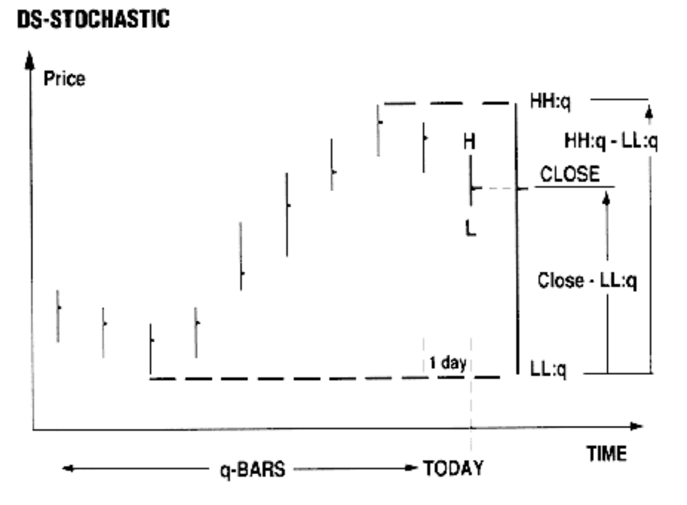

**FIGURE 1:** In a lookback period of q-bars, the range of the bars is HH:q - LL:q. The close is referenced to the low point of the range.

Figure 1 depicts a train of high, low and close price bars. The dark bar on the right describes the range, HH:q - LL:q, assumed by the price bars in a lookback of q-bars. The raw stochastic formula, Ds(q,1,1), represents where the current close is relative to the low point of the stochastic range. A close near the upper portion of the range will be near the highest high in the most recent q-days, for example.

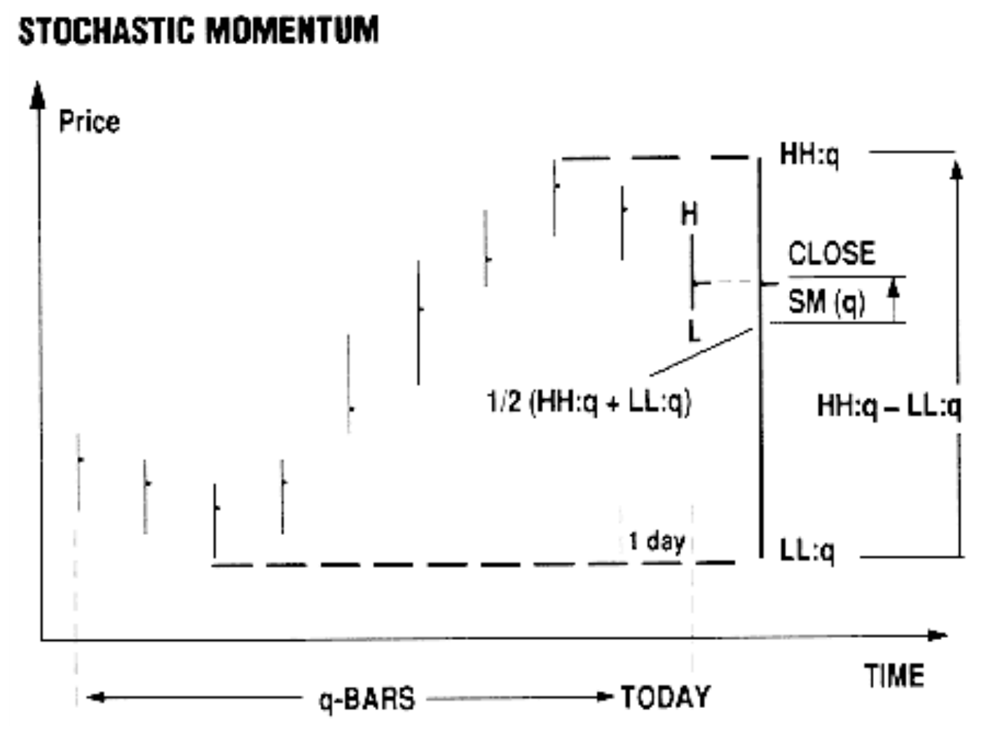

**FIGURE 2:** In a lookback period of q-bars, the range of the bars is HH:q - LL:q. The close is referenced to the midpoint of the range. Stochastic momentum is defined as: SM(q) = Close - 0.5(HH:q + LL:q). SM(q) is positive when close is greater than the midpoint of the range, direction up. SM(q) is negative when close is less than the range midpoint, going down. Amount of movement of market is determined by how large SM(q) is relative to its range.

## Stochastic Momentum

Figure 2 shows the same train of high, low and close price bars but with different annotations. The stochastic range remains unchanged. The close is now referenced to the midpoint, 0.5(HH:q + LL:q), of the range.

The distance of the current close from the midpoint defines stochastic momentum as:

$$SM(q) = \text{Close} - 0.5(HH_q + LL_q)$$

As a momentum, SM(q) takes on positive and negative values; the magnitude of the momentum is determined by how large a displacement there is of the close relative to the midpoint of the range. When the close is greater than the midpoint of the range, the stochastic momentum is positive. The largest plus value occurs when the close equals HH:q. SM(q) takes on negative values when the close is less than the midpoint having its greatest negative value when it is equal to the lowest low in the q-bar lookback. A comparison is made in Figure 3 between close momentum and stochastic momentum. Close momentum is simply the close, 20 days ago, subtracted from today's close. With stochastic momentum, a function of the close 20 days ago is subtracted from today's close. Observing Figure 3, the similarity between the two is evident.

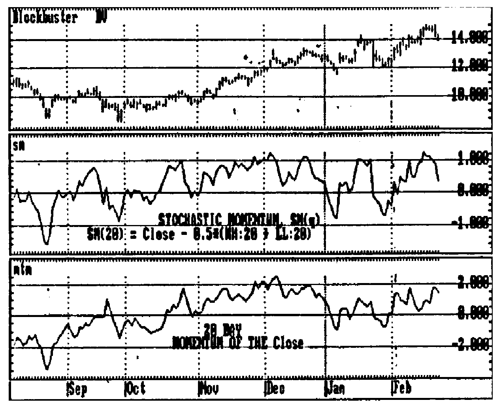

**FIGURE 3:** COMPARISON OF CLOSE MOMENTUM AND STOCHASTIC MOMENTUM. Close momentum = Close - Close [20 days ago], while stochastic momentum = Close - A function of the close [20 days ago].

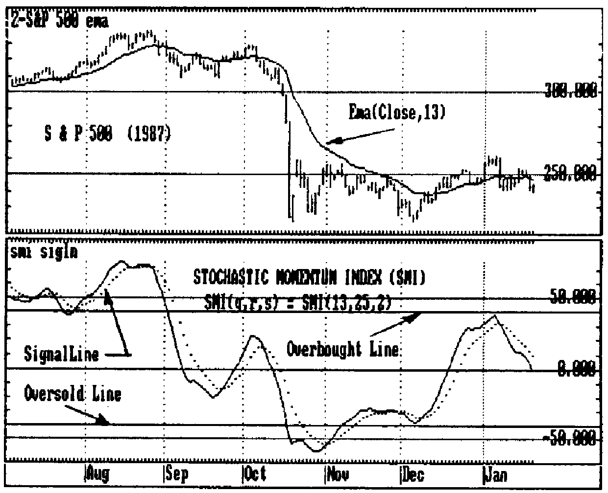

**FIGURE 4:** STOCHASTIC MOMENTUM INDEX, BASIC CONFIGURATION. A q = 13-day stochastic is shown. The indicator maps prices into a range from -100 to +100 on its scale. Prices are deemed to be at high levels when the indicator is above its overbought line. Prices are said to be at low levels when the indicator is below its oversold line. The signal line is the EMA of the SMI(q, r, s). It is normally in the range of three to 12 bars. When the SMI is above its signal line, the trend is said to be up; a downtrend is said to be in force when the SMI is below its signal line. Chart notations: SMI(q, r, s) = SMI(13, 25, 2) means a q = 13-bar stochastic lookback with r = 25-bar first smoothing, s = two-bar second smoothing.

## Stochastic Momentum Index

Embracing stochastic momentum, the stochastic momentum index (SMI) is now formulated as:

$$SMI(q, r, s) = 100 \cdot \frac{E_s(E_r(SM(q)))}{0.5 \cdot E_s(E_r(HH_q - LL_q))}$$

where:

- $SM(q) = \text{Close} - 0.5(HH_q + LL_q)$ = stochastic momentum
- $ASM(q) = E_s(E_r(SM(q)))$ = average stochastic momentum (ASM) = double-smoothing of stochastic momentum

The SMI is the bipolar form of the Ds-stochastic. Both have the same shape.

The basic configuration of the stochastic momentum index is shown in Figure 4 for a q = 13-day lookback with EMA smoothings of 25 and two days, respectively. The indicator maps prices into a corresponding range of from -100 to +100 on its scale. Prices are considered to be at "high" levels when the indicator is above its threshold overbought line (here set at +40). Prices are said to be at "low" levels when the indicator is below its threshold oversold line (here set at -40). The signal line shown is the EMA of SMI(q,r,s). It is normally in the range of three to 12 bars. When the SMI is above its signal line, a price uptrend is indicated; a downtrend is defined when the SMI is below its signal line.

Double-smoothing in the stochastic momentum index, SMI(q,r,s), is obtained by using any two of the q,r,s parameters while holding the remaining parameter fixed. Smoothing is readily evident in the r,s parameters because they represent direct exponential moving averages. Smoothing is also intrinsic to the q-parameter describing the stochastic momentum, SM(q). See Figure 5 for the smoothing effect of the cumulative sum of the stochastic momentum. The result is comparable to taking an EMA directly on the close.

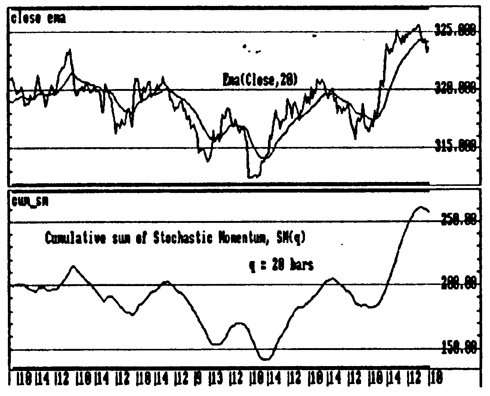

**FIGURE 5:** SMOOTHING EFFECT OF STOCHASTIC MOMENTUM. For numbers of price bars in excess of two bars, the stochastic momentum has a smoothing effect. This becomes evident when the cumulative sum of the stochastic momentum is made. A 20-day lookback is shown. The cumulative sum appears as a smoothed version of the price curve inclusive of the attendant lag of smoothing. A 20-day EMA of the close is also shown for comparison.

## Stochastic Momentum as a Proxy for Price

When the stochastic momentum is taken over a very large interval, SM(q) for q a very large number, the stochastic momentum takes on the characteristics of price shape. Figure 6 shows a q = 300-day interval of stochastic momentum, SM(300). If the number scales on the right of the charts had been omitted, a user would be hard pressed to determine which was the close curve and which was the stochastic momentum.

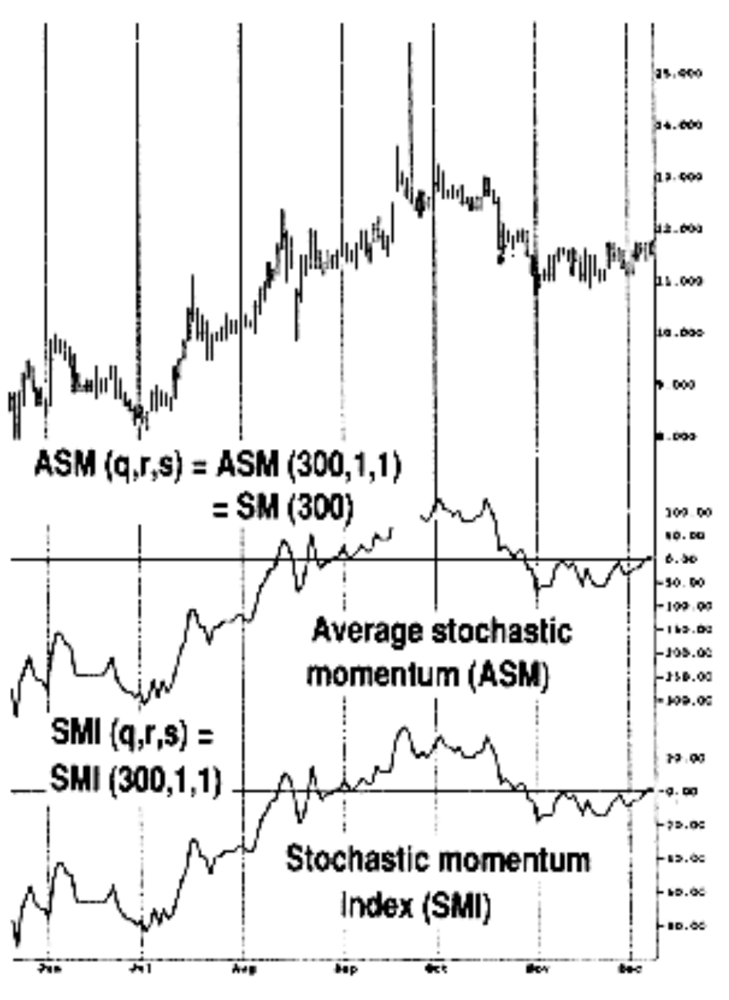

**FIGURE 6:** STOCHASTIC MOMENTUM AS A PROXY FOR PRICE - VERY LARGE INTERVAL. A large q = 300 day interval of stochastic momentum, SM(300), produces a curve that is a good approximation of price shape. The unsmoothed stochastic momentum index, SMI(300,1,1), is an amplitude compressed version of stochastic momentum. Here, the ASM and SMI have almost identical shapes, although their amplitude scales are different.

Figure 7 shows the large interval stochastic momentum (the first "smoothing", as in Figure 6) with a second smoothing of five days. The result is a stripping away of the high frequency noise fluctuations producing a smoother curve. Because a short-duration EMA is employed, introduction of lag (delay due to moving average effects) is minimal.

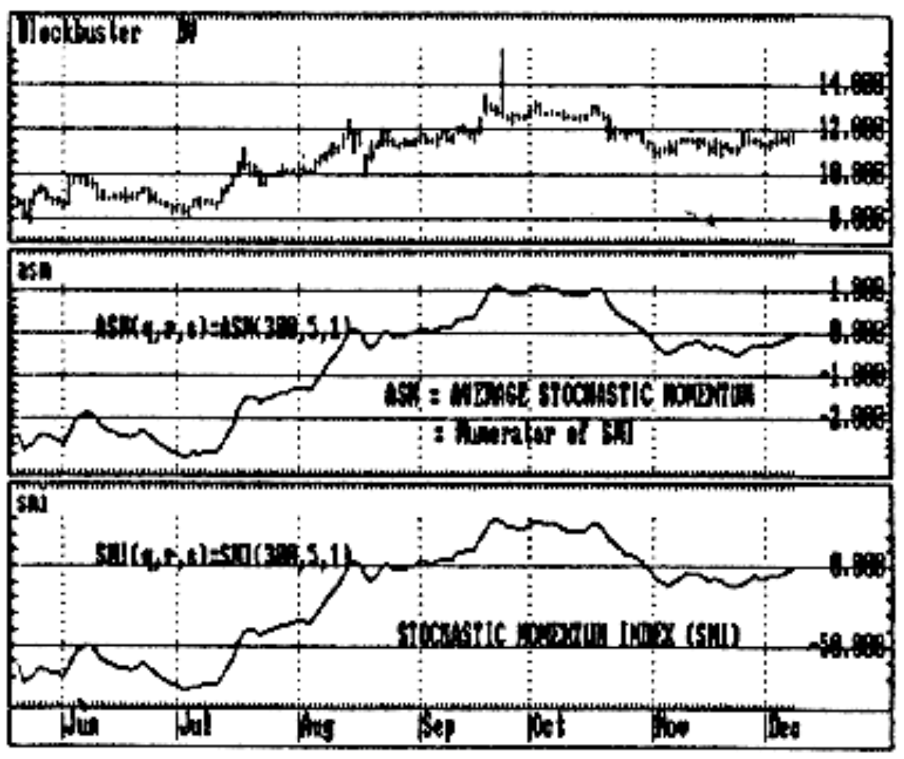

**FIGURE 7:** STOCHASTIC MOMENTUM SMOOTHING FOR NOISE REDUCTION. The 300-day stochastic momentum is smoothed by a five-day EMA, resulting in a noise-reduced curve.

Figure 7 shows double smoothing using the parameter pair: q, r. The only lag introduced was due to the r-day EMA. The q-day span for stochastic momentum did not (ideally) produce any lag, although q = 300 days is a very large number of days. This is a very important characteristic of double-smoothed momentum indicators: Generally, one of the smoothing functions will be of long duration; the other will be of shorter or equal duration. Only one will (ideally) introduce lag. This is certainly not the case when moving averages are taken on price: a 300-day span for a moving average produces a great deal of lag. This feature of double-smoothing of momentum indicators is fundamental to their timeliness and smoothness as indicators of stocks and commodities. Currently, two of the most popular indicators, the slow stochastic and MACD (moving average convergence/divergence), are double smoothed indicators. Two recently introduced indicators, TSI (true strength index) and Ds-stochastic (double-smoothed stochastic), also employ double smoothing.

Normally, the very long time spans of Figure 7 are rarely used. Figure 8 shows an arrangement with a stochastic lookback of q = 20 days with r = five days. (It is implied that there is only double smoothing and the additional s-parameter is fixed at s=1.) The stochastic momentum after double smoothing, dubbed the ASM(q,r,s), is seen as being timely and relatively free of noise variations. The SMI(q,r,s), stochastic momentum index, is similar in appearance. Divergences appear when smaller time spans are employed. A down divergence is identified via points A and B or A and C, indicating a possible end to the price rally. Indeed, it ended with the plateau in late September to early October.

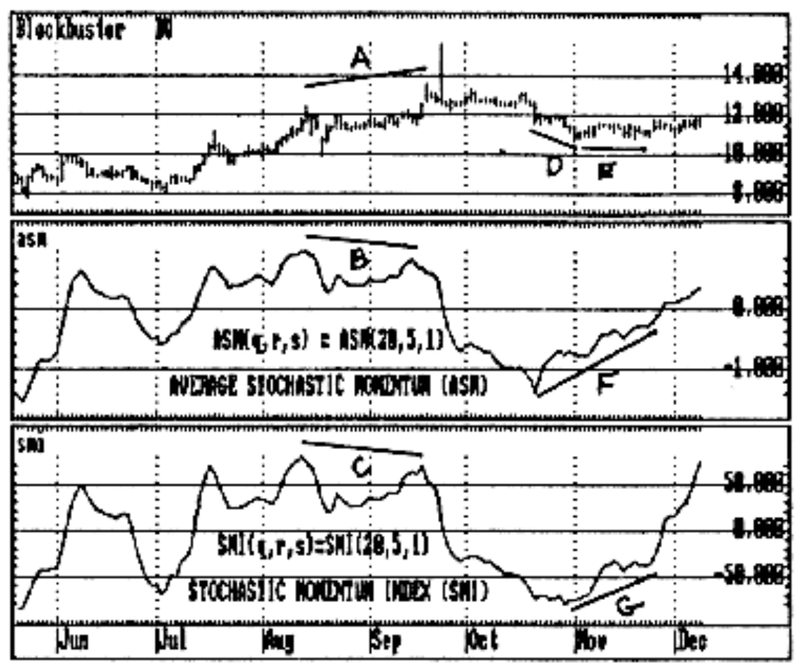

**FIGURE 8:** SHORTER INTERVAL, ASM & SMI. A reduction in the stochastic lookback interval to 20 days with five days of smoothing sharpens the turning points and produces divergences in the SMI relative to price where they did not exist before. Again except for scaling, the ASM and SMI appear very similar in shape. The differences are due to compression effects in the normalization of the SMI.

The slow stochastic and the stochastic momentum index (SMI) are compared in Figure 9. They approximate each other well in terms of shape. The small disparity between the two is due to the use of exponential moving average in the SMI versus a simple moving average in the slow stochastic.

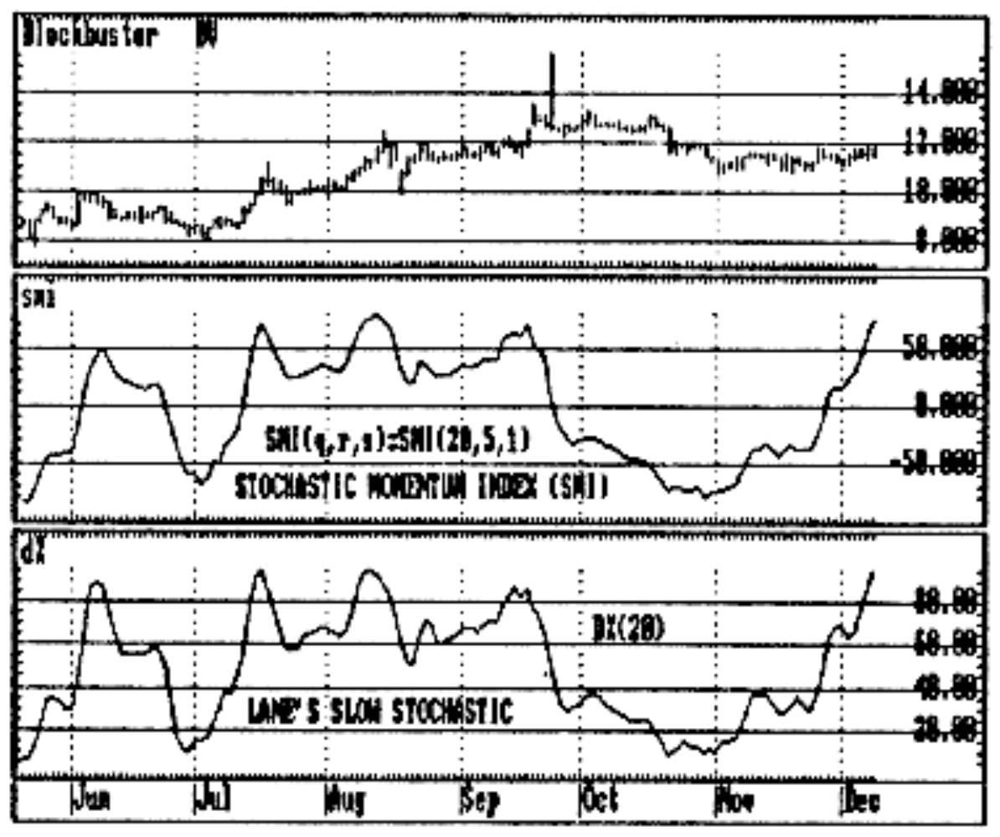

**FIGURE 9:** LANE'S SLOW STOCHASTIC AND THE STOCHASTIC MOMENTUM INDEX. SMI(q,5,1) approximates the slow stochastic in shape and timing with the exception of scaling. The small differences are mainly due to the five-day EMA in lieu of the three-day SMA built into the %D(q) of the slow stochastic.

A departure from the slow stochastic is made in Figure 10 by increasing the EMA smoothing interval from five days to 20 days, producing SMI(q,r,s) = SMI(20,20,1). The stochastic momentum index now appears to trend as prices trend. (The slow stochastic is retained for comparison.) The major turning points are highlighted in a timely manner with lag less than, or equal to, that produced by the same moving average applied directly to price. Divergences now appear at B, C, D, E and F. A divergence from the beginning of B to C signals the end of a rally in prices, or the beginning of a decline. At A, the slope of the SMI trends up with prices. At A, the slow stochastic remains noisily flat in an overbought region. As shown, the stochastic momentum index is slowly varying, showing price trends, major turning points and labeling of turning points via divergences with price.

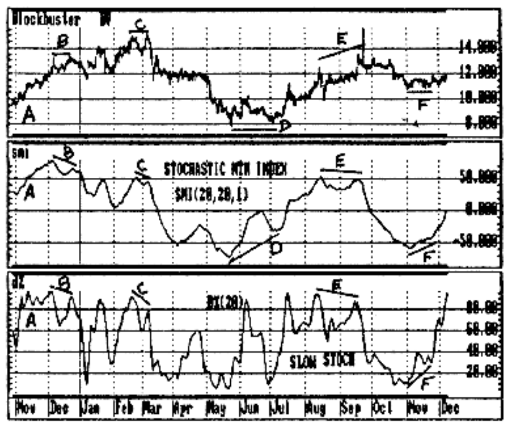

**FIGURE 10:** INCREASING THE EMA SMOOTHING INTERVAL. Increasing the EMA interval to 20 days obtains SMI(q,r,s) = SMI(20,20,1), which no longer has the appearance of a fast oscillator. The SMI now appears to trend as prices trend. Divergences appear at B, C, D, E and F. A divergence from the beginning of B to C signals the end of a price uptrend. Also, at A the slope of the SMI trends with price. The slow stochastic is shown for comparison; the region A remains noisily flat in an overbought condition.

The slow stochastic may now be used as an entry (or exit) vehicle for trading with the stochastic momentum index defining the trend of prices. An example can be seen in Figure 11 for an SMI(q,r,s) = SMI(20,60,1) defining the trend and a 20-day slow stochastic. Note the smoothness of the SMI due to the increased smoothing to an EMA of 60 days with essentially very little lag introduction of the major turning points.

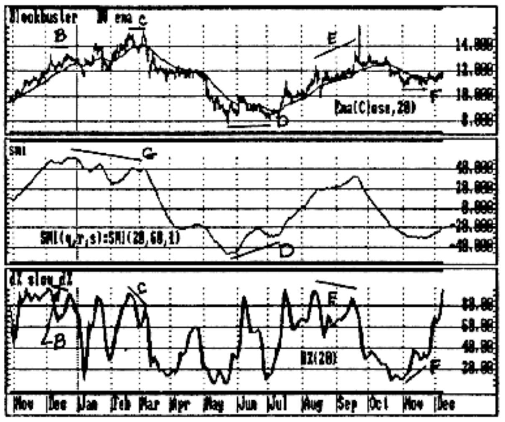

**FIGURE 11:** FURTHER INCREASE OF EMA SMOOTHING INTERVAL. SMI(20,60,1) produces a very smooth trendline with essentially no lag introduced for the main turning points (compare with Figure 10). Divergences exist now only at D, E, F and G. The divergences that were at B and C are now absent. The major downtrend in March is keyed by the long divergence at G and is further supported by the slow stochastic divergence at C. The slow stochastic may now be used as an entry (or exit) vehicle for trading with the stochastic momentum index defining the trend of prices.

## Long Trend Anomaly

Long trends are often troublesome to those indicators that are inherently oscillators. Broadly speaking, when the time duration of the trend exceeds the indicator's natural period of oscillation, the indicator may not properly show the trend direction. Figure 12 depicts such a situation. The lag is determined by the smallest value of q, r in the stochastic momentum index, SMI(q,r,s). The turning points to be retained, the "major" turning points, are filtered by the largest value of the double smoothing (q,r) parameters. In Figure 12, the anomaly of having a downtrend in prices erroneously indicated is corrected by increasing the r parameter from 20 to 150.

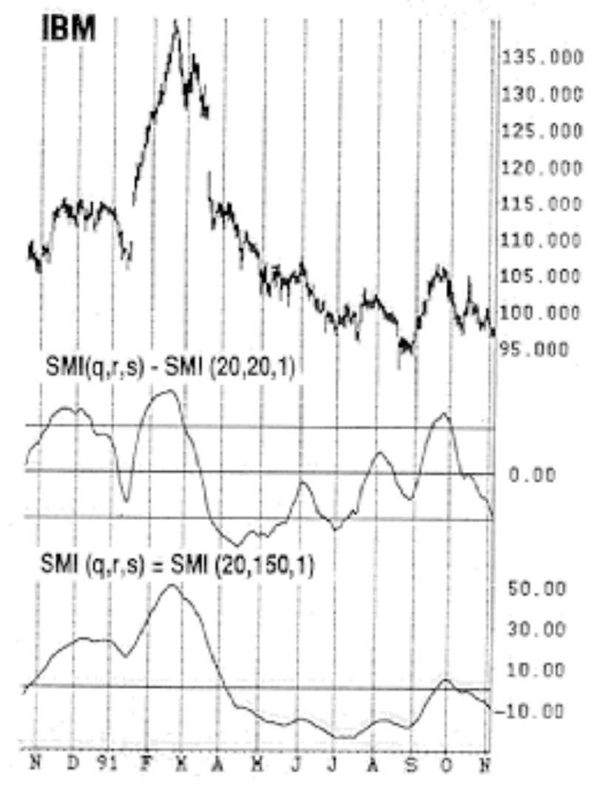

**FIGURE 12:** LONG TREND ANOMALY. In the middle panel SMI(20,20,1) is timely and smooth, however, it gives erroneous indications of trends when the price trend is of very long duration. Starting in April, it indicates an uptrend while, in fact, prices are declining. In the bottom panel SMI(20,150,1) removes the error so that the indicator again trends correctly with price. Timeliness and smoothness are present with very little additional lag.

## Two-Day Stochastics

When q=2, there are two price bars in the lookback period as shown in Figure 13. Both the Ds-stochastic and the stochastic momentum index are described. The latter is more appropriate for our present purposes, as it permits the use of stochastic momentum, which here becomes:

$$SM(2) = \text{Close} - 0.5(HH_2 + LL_2)$$

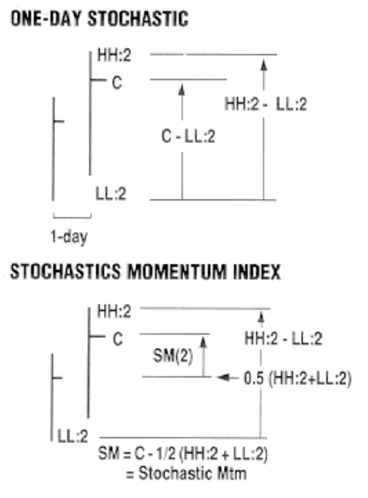

**FIGURE 13:** Designations for the DS-stochastic and stochastic momentum index formulas are shown; q=2 defines a two-day stochastic (two daily price bars).

To determine if the two-day stochastic is a reasonable proxy for price, a large (300-day) moving average is employed in the stochastic momentum index, SMI(q,r,s) = SMI(2,300,1). Comparison with the price chart on Figure 14 reveals it to be an excellent stand-in for price.

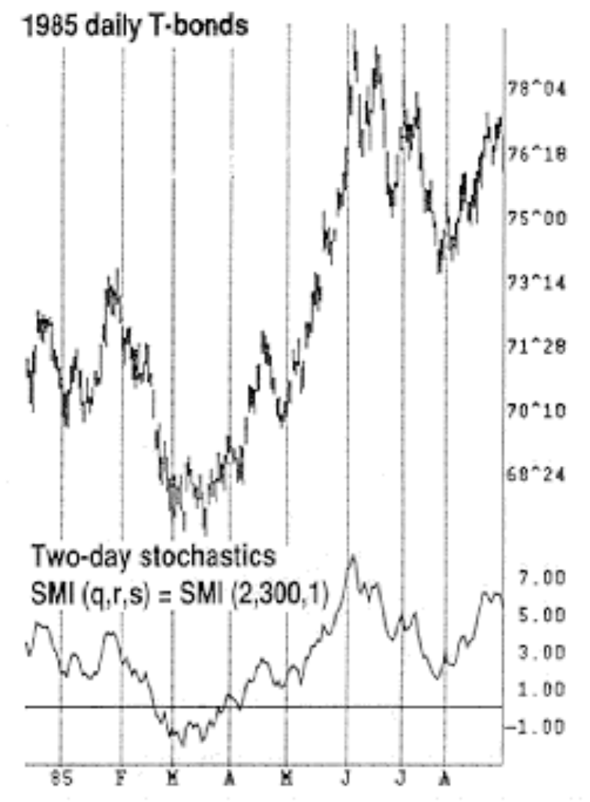

**FIGURE 14:** TWO-DAY STOCHASTICS AS A PROXY FOR PRICE. A large interval 300-day moving average shows the two-day stochastic to be a good approximation of price (bar graph).

An example of two-day stochastics is shown in Figure 15 for Treasury bonds where SMI(q,r,s) = SMI(2,20,20). The fixed parameter is q=2; the two variable parameters for double smoothing are the r-day EMA, which is subsequently smoothed by an s-day EMA. The effect of the double smoothing is to remove high-frequency fluctuation, obtaining a relatively smooth trending curve (see sidebar, "Stochastics momentum index"). The curve is observed to be timely, low lag, with access to major turning points in prices. The overbought and oversold thresholds here are set at plus and minus 20, respectively. Generally, a buy is indicated for the SMI crossing above its signal line; a sell is indicated for the SMI crossing from above to below its signal line.

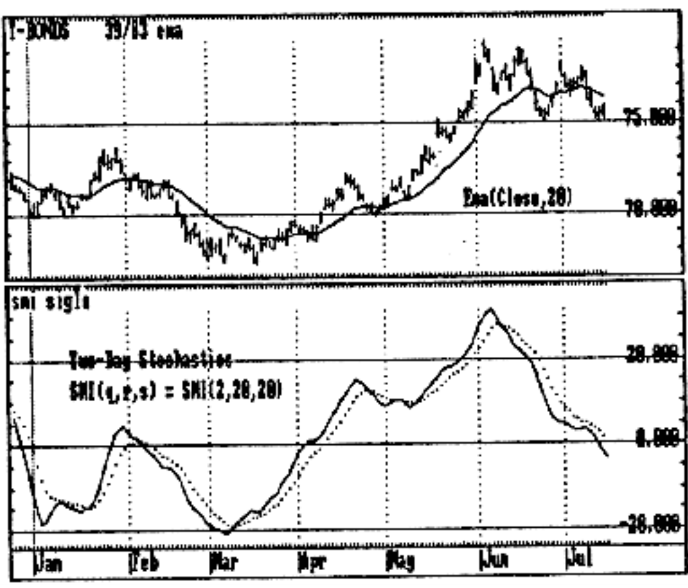

**FIGURE 15:** TWO-DAY STOCHASTIC ON T-BONDS. The smoothing interval is reduced to 20 days. A second interval also of 20 days is used to smooth the result of the first smoothing. The effect of double smoothing is to remove the high-frequency fluctuations and obtain a relatively smooth trending curve that is timely (low lag) with access to major turning points in prices.

An interesting situation is depicted in Figure 16: the effect of a key reversal pattern. A key reversal occurring in mid-September produces a two-day stochastic momentum index differently than does a true strength index (TSI), both using the same smoothing parameters (see sidebar, "True strength index"). The TSI(close,40,20) tracks the close-to-close price curve well remaining unaffected by the key reversal. However, the long spike of the key reversal has a dramatic response with the two-day SMI(2,40,20). This is to be expected, because two-day stochastics are very sensitive to the location of the close relative to the extreme prices today and yesterday. Note the sudden drop in the response of the SMI(2,40,20).

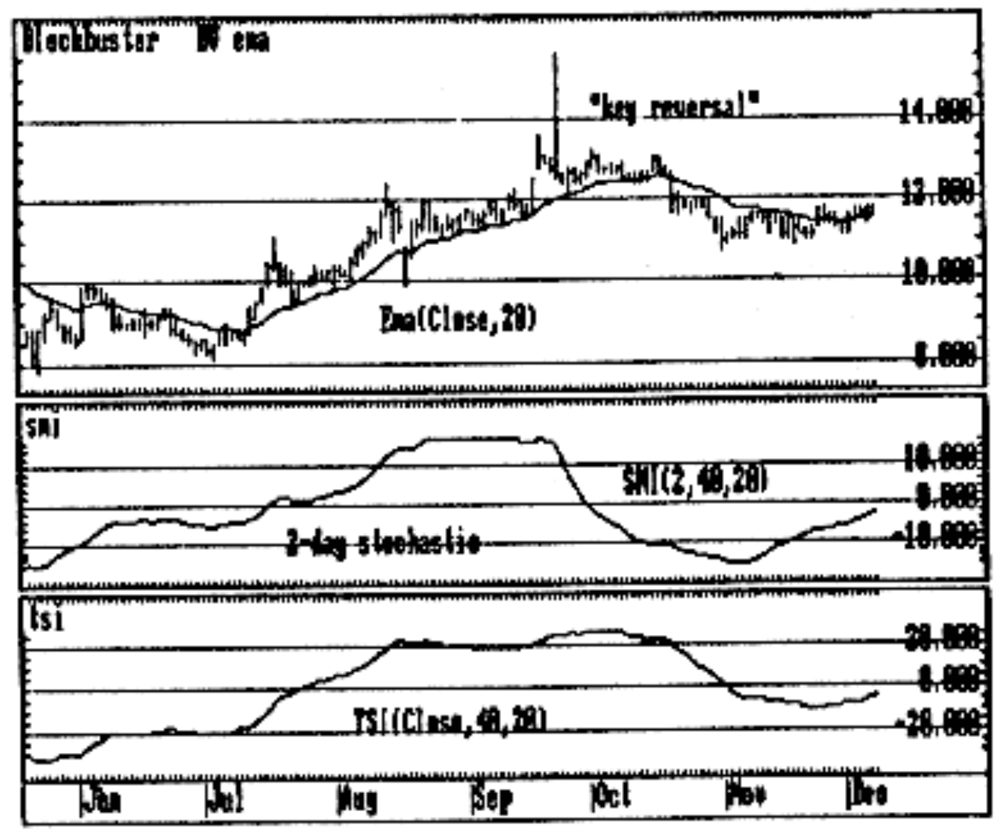

**FIGURE 16:** KEY REVERSAL PATTERN. Two-day stochastics are sensitive to the location of the close relative to the extreme of prices today and yesterday. A key reversal pattern has a large displacement of the close from the extreme (high) today relative to yesterday's extreme (low). An immediate downturn is generated in the SMI(2,40,20). Compare with a TSI(Close,40,20), which closely tracks the close-to-close variations in price.

## One-Day Stochastics

When q = 1, the nomenclature suitable for Ds-stochastics and the stochastic momentum index is shown in Figure 17. With a lookback of q = 1 bar, the stochastic momentum is defined within the highest high and lowest low of the day:

$$SM(1) = \text{Close} - 0.5(\text{High} + \text{Low}) = \text{one-day stochastic momentum}$$

The stochastic momentum index becomes:

$$SMI(1, r, s) = 100 \cdot \frac{E_s(E_r(SM(1)))}{0.5 \cdot E_s(E_r(\text{High} - \text{Low}))}$$

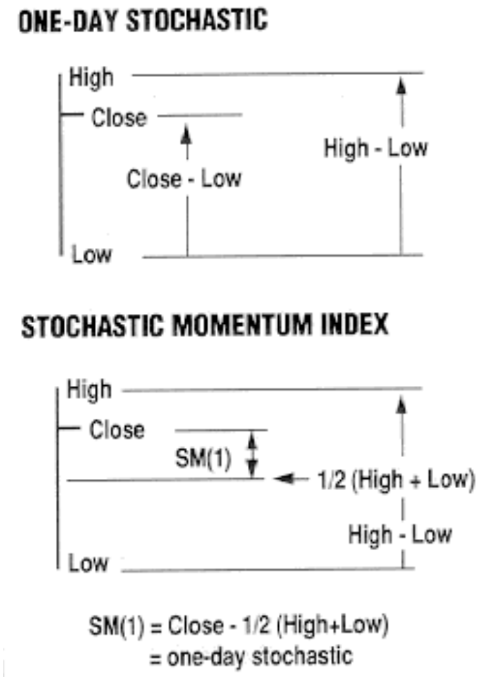

**FIGURE 17:** Designation for the DS-stochastic and stochastic momentum index formulas are shown; q=1 defines a one-day stochastic (one price bar).

The one-day stochastic is sensitive to the location of the close relative to the high and low of the day. This characteristic is useful as a sentiment, or trend identification, indicator, such as in Figure 18, where a true strength index, TSI(close,100,20), is compared with a stochastic momentum index, SMI(1,100,20), for a 20-minute December S&P 500 futures contract. The TSI is seen to track the close-to-close variations of the price curve: up, down, sideways. The one bar stochastic, on the other hand, gives more of a sense of the overall direction of the market. Often, the one-bar stochastic may be used as a direct trading vehicle signaling major turning points on a smooth and timely basis.

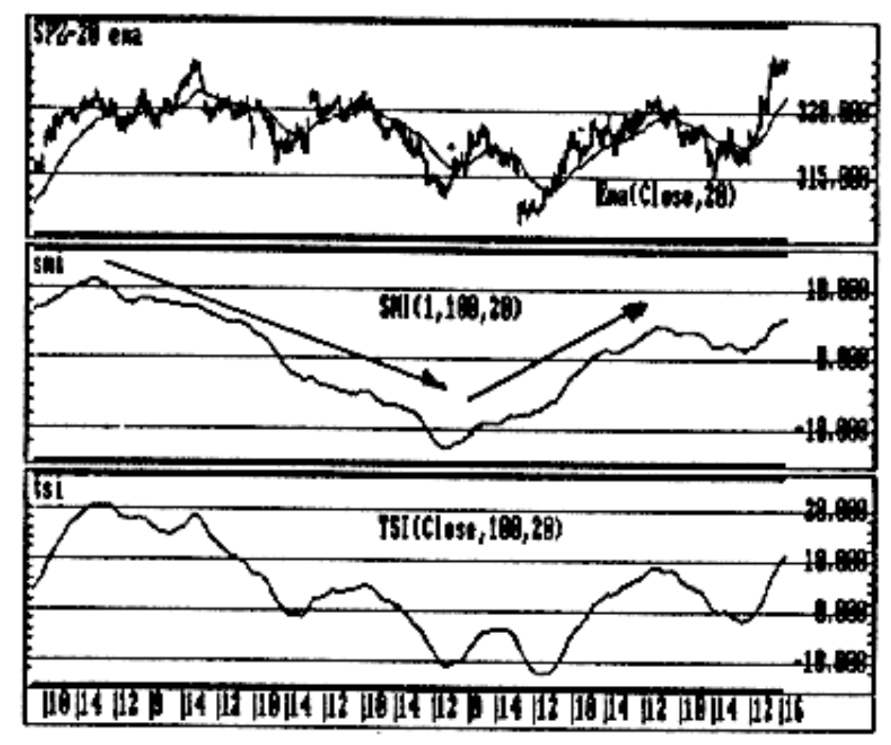

**FIGURE 18:** TREND IDENTIFICATION (SENTIMENT) USING ONE-DAY STOCHASTICS. One-day stochastics detect any propensity for the close to favor either the high side or low side of the price bar. This is a form of a sentiment indication or trend identification. See SMI(1,100,20) of a 20-minute bar chart of the December S&P. By contrast, the TSI(close,100,20) tracks the close-to-close daily changes.

In Figure 19, the 20-minute price curve is shown with up sentiment as indicated by SMI(1,40,20). A TSI(close,40,20) curve is included for comparison. The TSI curve tracks the close-to-close prices and is greatly affected by the gap opening. The one-bar stochastic is unaffected by the gap opening continuing its rise from one day to the next.

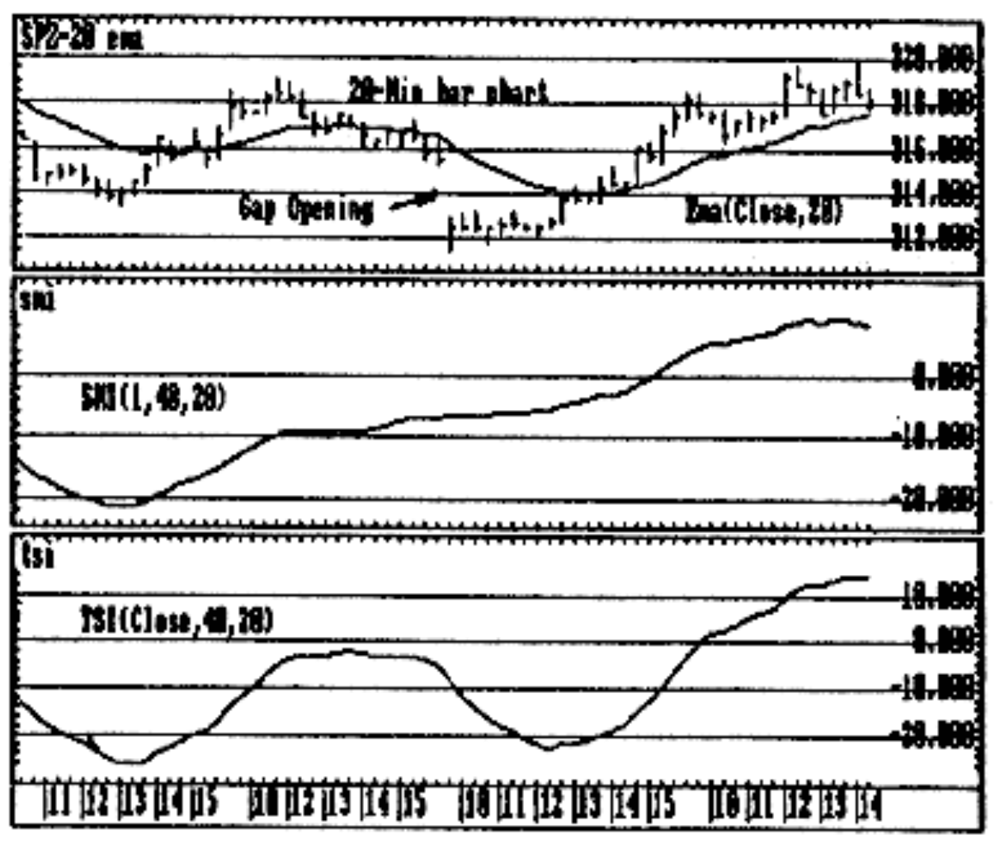

**FIGURE 19:** GAPS & GAP OPENING. The gap opening takes time for the EMA(close,20) and TSI(close,40,20) to absorb. The one-bar stochastic, SMI(1,40,20), is unaffected by the gap continuing its ascent. The overall sentiment is up. Examination of the bars reveals the closes are dominantly above the midpoint of their 20-minute range over the smoothing interval.

---

*William Blau, (407) 368-9095, is an independent futures trader.*

## References

- Appel, Gerald [1985]. *The Moving Average Convergence-Divergence Trading Method, Advanced Version*, Scientific Investment Systems.
- Blau, William [1991]. "Double-smoothed stochastics," *Technical Analysis of STOCKS & COMMODITIES*, Volume 9: January.
- Blau, William [1991]. "True strength index," *Technical Analysis of STOCKS & COMMODITIES*, Volume 9: November.
- Blau, William [1992]. "Trading with the true strength index," *Technical Analysis of STOCKS & COMMODITIES*, Volume 10: May.
- Blau, William [1991]. "True strength index & double-smoothed stochastics," presented at the CompuTrac TAG14 Technical Analysis Seminar, New Orleans, November 20-22.
- Chande, Tushar [1991]. "The midpoint oscillator," *Technical Analysis of STOCKS & COMMODITIES*, Volume 9: November.
- Lane, George C. [1984]. "Lane's stochastics," *Technical Analysis of STOCKS & COMMODITIES*, Volume 2: Chapter 3.

---

## Sidebar: Stochastics Momentum Index

The spreadsheet features in sidebar Figure 1 an example of calculating the stochastics momentum index (SMI) for a lookback period of two days (q = 2) and a double smoothing of 20 days (r = 20, s = 20) using an exponential smoothed moving average (EMA). The first step is to determine the highest high for the last two days, which is column E. The formula for cell E21 is:

```
=MAX(B20:B21)
```

Then determine the lowest low for the last two days. This is performed in column F. The formula for F21 is:

```
=MIN(C20:C21)
```

Next we calculate the SM, which is in the numerator. The SM is the close minus the midpoint of the lookback range. This is performed in column G. The formula for cell G21 is:

```
=D21 - 0.5*(E21+F21)
```

The first smoothing of the SM is done in column H using an exponential smoothed moving average. Recalling that the constant alpha (a) used to smooth the data is estimated as 2/(n+1) where n is the simple moving average length, so with n=20, then a = 2/(20+1) = 0.095. The formula for the first EMA is in column H. The formula for cell H21 is:

```
=H20 + 0.095*(G21-H20)
```

One point to note: The first calculation of an EMA does not have a previous EMA to work with; note that cells G3, H3 and I3 are the same values. The smoothing does not begin until G4, H4 and I4. The second smoothing is performed in column I. The formula for cell I21 is:

```
=I20 + 0.095*(H21-I20)
```

The denominator begins with calculating the difference between the highest high and the lowest low in the lookback period. This is calculated in column J. The formula for J21 is:

```
=E21-F21
```

Next, we smooth this difference in column K. The formula for K21 is:

```
=K20 + 0.095*(J21-K20)
```

The second smoothing is performed in column L. The formula for L21 is:

```
=L20 + 0.095*(K21-L20)
```

The SMI is calculated in column M. The formula for M21 is:

```
=100*(I21/(0.5*L21))
```

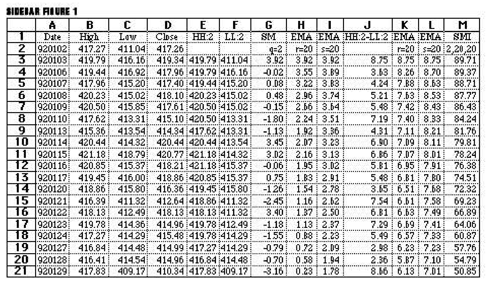

**SIDEBAR FIGURE 1:** Spreadsheet example of calculating the stochastics momentum index.

---

## Citation

```bibtex
@article{blau1993stochastic_momentum,
  author    = {William Blau},
  title     = {Stochastic Momentum},
  journal   = {Technical Analysis of Stocks \& Commodities},
  volume    = {11},
  number    = {1},
  pages     = {11--18},
  year      = {1993},
  month     = jan,
  url       = {https://technical.traders.com/archive/article.asp?file=\V11\C01\STOCHAS.pdf}
}
```
