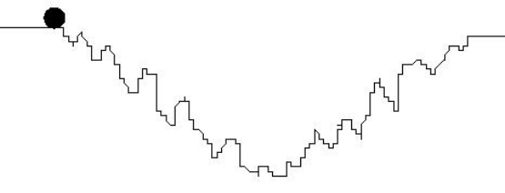
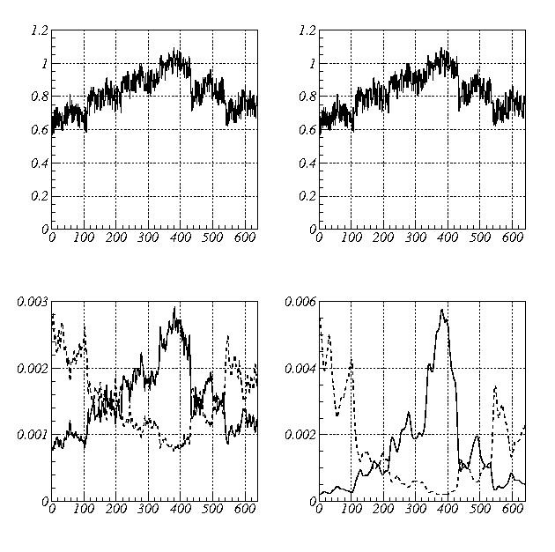
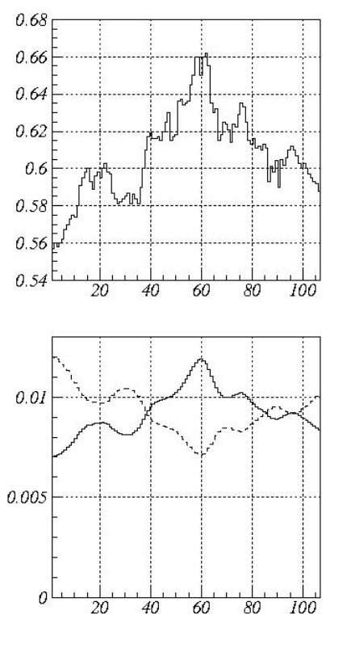

# Moving Mini-Max — A New Indicator for Technical Analysis

- **Author:** Z. K. Silagadze (Budker Institute of Nuclear Physics and Novosibirsk State University, 630 090, Novosibirsk, Russia)
- **Published:** IFTA Journal 11 (2011), 46–49
- **arXiv:** [0802.0984v2](https://arxiv.org/abs/0802.0984v2)
- **Subjects:** Statistical Finance (q-fin.ST); Physics and Society (physics.soc-ph)
- **Keywords:** Technical analysis, Econophysics

## BibTeX

```bibtex
@article{Silagadze2008MiniMax,
  author        = {Silagadze, Z. K.},
  title         = {Moving Mini-Max -- a new indicator for technical analysis},
  journal       = {IFTA Journal},
  volume        = {11},
  pages         = {46--49},
  year          = {2011},
  eprint        = {0802.0984},
  archiveprefix = {arXiv},
  primaryclass  = {q-fin.ST},
  url           = {https://arxiv.org/abs/0802.0984v2},
  note          = {Originally submitted February 2008, revised February 2011}
}
```

---

## Abstract

We propose a new indicator for technical analysis. The indicator emphasizes maximums and minimums in price series with inherent smoothing and has a potential to be useful in both mechanical trading rules and chart pattern analysis.

---

## 1. Introduction

Despite the widespread use of technical analysis in short-term marketing strategies, its usefulness is often questioned. According to the efficient market hypothesis [1], no one can ever outperform the market and earn excess returns by using only the information that the market already knows. Therefore, technical analysis, which is based on the price history only, is expected to be of the same value for efficient markets as astrology: "Technical strategies are usually amusing, often comforting, but of no real value" [2].

However, the efficient market hypothesis assumes that all market participants are rational, while it is a well known fact that human behavior is seldom completely rational. Therefore, the idea that one can try "to forecast future price movements on the assumption that crowd psychology moves between panic, fear, and pessimism on one hand and confidence, excessive optimism, and greed on the other" [3] does not seem to be completely hopeless.

At least, "by the start of the twenty-first century, the intellectual dominance of the efficient market hypothesis had become far less universal. Many financial economists and statisticians began to believe that stock prices are at least partially predictable" [4].

Besides, the market efficiency can be significantly distorted at periods of central bank interventions which allow traders to profit by using even very simple technical trading rules at these periods [5, 6].

Anyway the use of technical analysis is widespread among practitioners, becoming in fact one of the invisible forces shaping the market. For example, many successful financial forecasting methods seem to be self-destructive [4, 7]: their initial efficiency disappears once these methods become popular and shift the market to a new equilibrium.

The technical analysis is based on the supposition that asset prices move in trends and that "trends in motion tend to remain in motion unless acted upon by another force" (the analogue of Newton's first law of motion) [8]. The financial forces that compel the trend to change are subject of fundamental analysis [9]. Efficient markets react quickly to various volatile fundamental factors and to the spread of the corresponding information leaving little chance to practitioners of either technical or fundamental analysis to beat the market.

However, real markets react with some delay (inertia) to changing financial conditions [10] and trends in these transition periods can reveal some characteristic behavior determined by human psychology and corresponding irrational expectations of traders. A skilled analyst can detect these characteristic features with tools of technical analysis alone (although some fundamental analysis, of course, might be also helpful and reduce risks).

Practitioners of the technical analysis often use charting (graphing the history of prices over some time period) to identify trends and forecast their future behavior [3, 8, 11, 12]. At that peaks and troughs in the price series play important role. Location of such local maximums and minimums is hampered by short-term noise in the price series and usually some smoothing procedures are first applied to remove or reduce this noise.

Below an algorithm for searching of local maximums and minimums is presented. The algorithm is borrowed from nuclear physics and it enjoys an inherent smoothing property. A new indicator of technical analysis, the moving mini-max, can be based on this algorithm.

## 2. The Idea Behind the Indicator

The idea behind the proposed algorithm can be traced back to George Gamow's theory of alpha decay [13]. The alpha particle is trapped in a potential well by the nucleus and classically has no chance to escape. However, according to quantum mechanics it has non-zero, albeit tiny, probability of tunneling through the barrier and thus to escape the nucleus.

Now imagine a small ball placed on the edge of the irregular potential well (see Fig. 1). Classical ball will not roll down stopping in front of the foremost obstacle. However, if the ball is quantum, so that it can penetrate through narrow potential barriers, it will still find its way towards the potential well bottom and oscillate there.



*Figure 1: A schematic illustration of the idea behind the algorithm: a small quantum ball can penetrate through narrow barriers and find its way downhill despite the noise in the potential well shape.*

Instead of considering a real quantum-mechanical problem, one can only mimic the quantum behavior to reduce the computational complexities. In [14], suitably defined Markov chains were used for this goal. The algorithm that emerged proved to be useful and statistically robust in γ-ray spectroscopy [15, 16]. Two-dimensional generalizations of the algorithm were also suggested recently [17, 18].

## 3. The Indicator

Let $S_i,\ i=1,\ldots, n$ be a price series for some time window. For our purposes, the moving mini-max of this price series, $u(S)_i$, can be considered as a non-linear transformation:

$$u(S)_i = \frac{u_i}{u_1 + u_2 + \ldots + u_n}$$

where $u_1 = 1$ and $u_i,\ i > 1$ are defined through the recurrent relations:

$$u_i = \frac{P_{i-1,i}}{P_{i,i-1}} \cdot u_{i-1}, \quad i = 2, 3, \ldots, n$$

Evidently, the moving mini-max series satisfies the normalization condition:

$$\sum_{i=1}^n u(S)_i = 1$$

The transition probabilities $P_{ij}$, which just mimic the tunneling probabilities of a small quantum ball through narrow barriers of the price series, are determined as follows:

$$P_{i,i+1} = \frac{Q_{i,i+1}}{Q_{i,i+1} + Q_{i,i-1}}, \quad P_{i,i-1} = \frac{Q_{i,i-1}}{Q_{i,i+1} + Q_{i,i-1}}$$

with

$$Q_{i,i+1} = \sum_{k=1}^m \exp\left[\frac{2(S_{i+k} - S_i)}{S_{i+k} + S_i}\right], \quad Q_{i,i-1} = \sum_{k=1}^m \exp\left[\frac{2(S_{i-k} - S_i)}{S_{i-k} + S_i}\right]$$

Here $m$ is a width of smoothing window. This parameter mimics the (inverse) mass of the quantum ball and therefore allows to govern its penetrating ability. Besides, it is assumed that $S_{i+k} = S_n$, if $i+k > n$, and $S_{i-k} = S_1$ if $i-k < 1$.

The moving mini-max $u(S)_i$ emphasizes local maximums of the primordial price series $S_i$ as illustrated by Fig. 2. Its inherent smoothing property is also clearly seen in this figure.



*Figure 2: A price series $S_i$ (top) and its mini-max (bottom) for the smoothing window widths $m=3$ (left) and $m=10$ (right). The solid line corresponds to the up mini-max $u(S)_i$ which emphasizes local maximums and the dashed line — to the down mini-max $d(S)_i$ which emphasizes local minimums.*

Alternatively, we can construct the moving mini-max $d(S)_i$ which will emphasize local minimums. All what is needed is to change $Q_{i,i\pm 1}$ in the above formulas with $Q'_{i,i\pm 1}$ defined as follows:

$$Q'_{i,i+1} = \sum_{k=1}^m \exp\left[-\frac{2(S_{i+k} - S_i)}{S_{i+k} + S_i}\right], \quad Q'_{i,i-1} = \sum_{k=1}^m \exp\left[-\frac{2(S_{i-k} - S_i)}{S_{i-k} + S_i}\right]$$

That is we change sign to the opposite in all exponents while calculating the transition probabilities.

## 4. Possible Applications



*Figure 3: A price series $S_i$ (top) that exhibits a head-and-shoulders pattern and its mini-max (bottom) for the smoothing window width $m=5$. The solid line corresponds to the up mini-max $u(S)_i$ and the dashed line — to the down mini-max $d(S)_i$.*

Do not trying to foresee the imagination of practitioner traders, we indicate only several possible applications of the new indicator which lay rather on the surface.

Resistance and support lines play an important role in technical analysis [11, 12]. To identify lines of resistance and support, traders usually use some moving average indicator. If the price goes through the local maximum and crosses a moving average, we have a resistance line indicating the price at which a majority of traders expect that prices will move lower. A support line happens when the price crosses a moving average after the local minimum. The support line indicates the price at which a majority of traders feel that prices will move higher. The problem is fluctuations of the price which hampers the identification of both the local extremums and the corresponding crossing points with the moving average. The new indicator can come to the rescue because it naturally suppresses the noise. We can use $u(S)$ moving mini-max for both the price and its moving average and search for the crossing points of the corresponding moving mini-maxes to identify resistance lines. Analogously, $d(S)$ moving mini-maxes can be used to search for the support lines.

It is widely believed that certain chart patterns can signal either a continuation or reversal in a price trend. Maybe the most notorious pattern of this kind is the head-and-shoulders pattern [19, 20]. As the identification of this pattern requires to find the extrema of the price series, it is evident that the moving mini-max can find its application here.

As an illustration, Fig. 3 shows an alleged head-and-shoulders pattern and the corresponding behavior of the moving mini-max indicators. Note that $u(S)$ and $d(S)$ indicators form a characteristic spindle like pattern at the location of the head-and-shoulders. The same behavior is observed at greater scales in Fig. 2.

## 5. Conclusions

We hope that the suggested indicator can find its applications in technical analysis. "The classical technical analysis methods of financial indices, stocks, futures, ... are very puzzling" [21]. Nevertheless, many traders find them useful and entertaining. It's unlikely the new indicator to disentangle the puzzlement, but we hope it can add some new flavor and delight to the occult science of technical analysis.

## Acknowledgments

The author thanks V. Yu. Koleda who initiated a practical realization of the suggested indicator and enlightened the author about Forex technical analysis. The work is supported in part by grants Sci.School-905.2006.2 and RFBR 06-02-16192-a.

---

## References

1. E. F. Fama, "Efficient Capital Markets: A Review of Theory and Empirical Work," *The Journal of Finance* **25** (1970), 383–417.
2. B. G. Malkiel, *A Random Walk Down Wall Street*, W. W. Norton & Company, 1990, p. 154.
3. M. J. Pring, *Technical Analysis Explained*, McGraw-Hill, New York, 1991, p. 3.
4. B. G. Malkiel, "The Efficient Market Hypothesis and Its Critics," *The Journal of Economic Perspectives* **17** (2003), 59–82.
5. B. LeBaron, "Technical Trading Rule Profitability and Foreign Exchange Intervention," *Journal of International Economics* **49** (1999), 125–143.
6. A. C. Szakmary and I. Mathur, "Central Bank Intervention and Trading Rule Profits in Foreign Exchange Markets," *Journal of International Money and Finance* **16** (1997), 513–535.
7. A. Timmermann and C. W. J. Granger, "Efficient Market Hypothesis and Forecasting," *International Journal of Forecasting* **20** (2004), 15–27.
8. C. J. Neely, "Technical analysis in the foreign exchange market: a layman's guide," Federal Reserve Bank of St. Louis Review, 1997, September issue, pp. 23–38.
9. B. Lev and S. R. Thiagarajan, "Fundamental Information Analysis," *Journal of Accounting Research* **31** (Autumn, 1993), 190–215.
10. J. L. Treynor and R. Ferguson, "In Defense of Technical Analysis," *The Journal of Finance* **40** (1985), 757–773.
11. R. D. Edwards and J. Magee, *Technical Analysis of Stock Trends*, AMACOM, New York, 2001.
12. J. J. Murphy, *Technical Analysis of the Financial Markets: A Comprehensive Guide to Trading Methods and Applications*, New York Institute of Finance, New York, 1999.
13. G. Gamow, "Zur Quantentheorie des Atomkernes," *Zeitschrift für Physik* **51** (1928), 204–212.
14. Z. K. Silagadze, "A New algorithm for automatic photopeak searches," *Nuclear Instruments and Methods in Physics Research A* **376** (1996), 451–454.
15. T. Wroblewski, "X-ray Imaging of Polycrystalline and Amorphous Materials," *Advances in X-ray Analysis* **40** (1996).
16. D. Lübbert and T. Baumbach, "Visrock: a program for digital topography and X-ray microdiffraction imaging," *Journal of Applied Crystallography* **40** (2007), 595–597.
17. Z. K. Silagadze, "Finding two-dimensional peaks," *Physics of Particles and Nuclei Letters* **4** (2007), 73–80.
18. M. Morháč, "Multidimensional peak searching algorithm for low-statistics nuclear spectra," *Nuclear Instruments and Methods in Physics Research A* **581** (2007), 821–830.
19. T. N. Bulkowski, "The Head and Shoulders Formation," *Technical Analysis of Stocks and Commodities* **15** (1997), 366–372.
20. G. Savin, P. Weller and J. Zvingelis, "The Predictive Power of 'Head-and-Shoulders' Price Patterns in the U.S. Stock Market," *Journal of Financial Econometrics* **5** (2007), 243–265.
21. M. Ausloos and K. Ivanova, "Classical technical analysis of Latin American market indices. Correlations in Latin American currencies (ARS, CLP, MXP) exchange rates with respect to DEM, GBP, JPY and USD," *Brazilian Journal of Physics* **34** (2004), 504–511.
