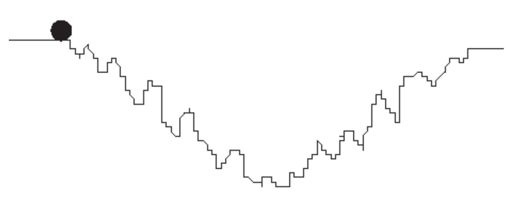
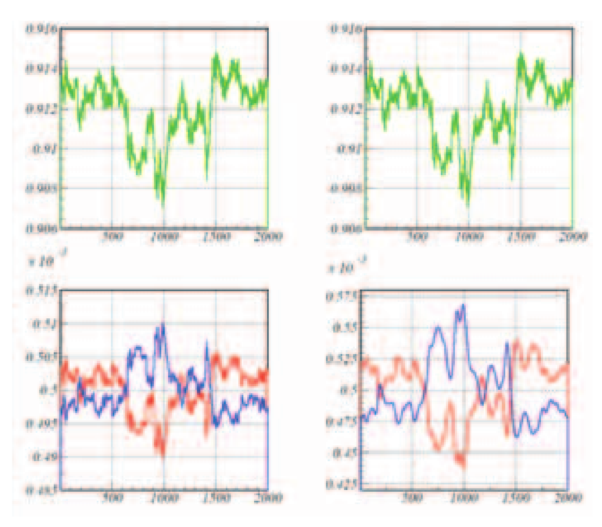
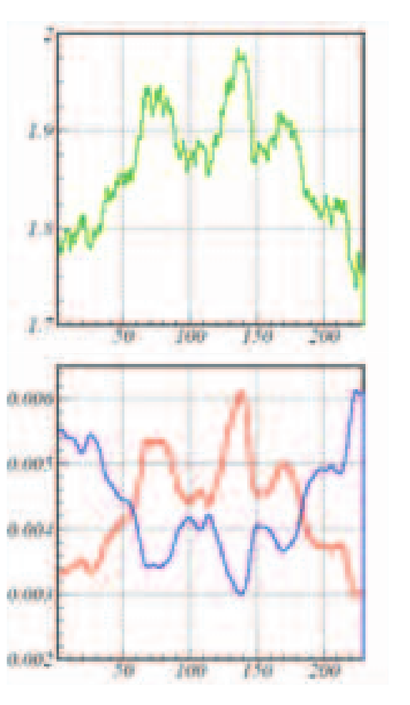
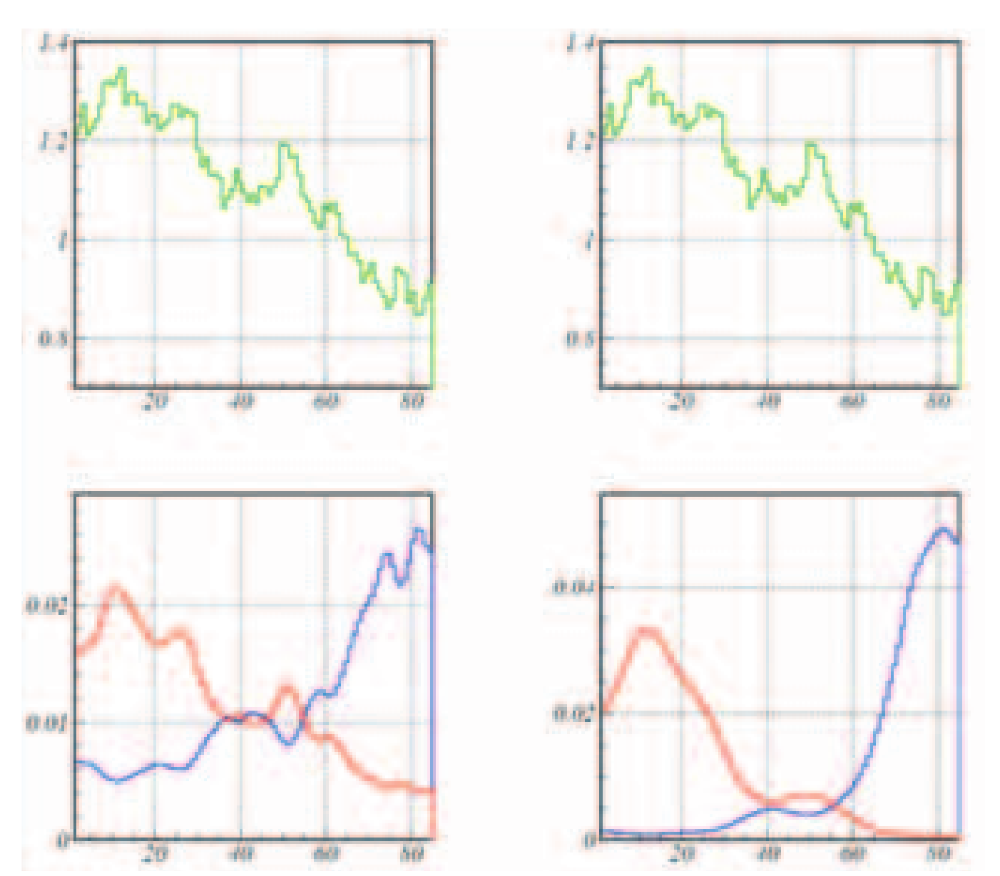
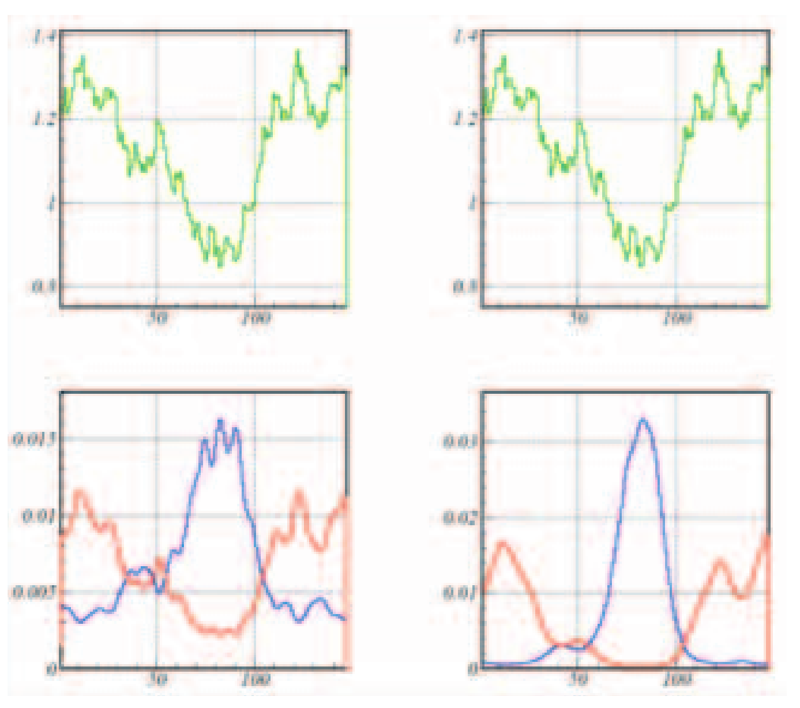

# Moving Mini-Max – A New Indicator for Technical Analysis

- **Author:** Zurab Silagadze
- **Publication:** IFTA Journal, 2011 Edition, pp. 46–49
- **Article URL:** [IFTA Journal 2011 (full PDF)](https://www.ifta.org/assets/docs/d_ifta_journal_11.pdf)
- **IFTA Journal Index Reference:** Moving Mini-Max – A New Indicator for Technical Analysis | Zurab Silagadze | pp. 46–49 | Article | Introduces the Moving Mini-Max indicator.
- **arXiv preprint:** [0802.0984v2](https://arxiv.org/abs/0802.0984v2)
- **Keywords:** Technical analysis, Econophysics

## BibTeX

```bibtex
@article{ifta2011:silagadze_minimax,
  author  = {Silagadze, Zurab},
  title   = {Moving Mini-Max -- A New Indicator for Technical Analysis},
  journal = {IFTA Journal},
  year    = {2011},
  pages   = {46--49},
  url     = {https://www.ifta.org/assets/docs/d_ifta_journal_11.pdf},
  note    = {ISSN 2409-0271}
}

@online{ifta2011:silagadze_minimax_pdf,
  author  = {Silagadze, Zurab},
  title   = {Moving Mini-Max -- A New Indicator for Technical Analysis (IFTA Journal 2011)},
  url     = {https://www.ifta.org/assets/docs/d_ifta_journal_11.pdf},
  urldate = {2026-05-28},
  note    = {Pages 46--49 of the full IFTA Journal 2011 PDF}
}
```

---

## Abstract

A new indicator for technical analysis is proposed which emphasises maximums and minimums in price series with inherent smoothing and has the potential to be useful in both mechanical trading rules and chart pattern analysis.

---

## Introduction

Despite the widespread use of technical analysis in short-term marketing strategies, its usefulness is often questioned. According to the efficient market hypothesis^i, no one can ever outperform the market and earn excess returns by only using the information that the market already knows. Therefore, technical analysis, which is based on price history, is expected to be of the same value for efficient markets as astrology: "Technical strategies are usually amusing, often comforting, but of no real value"^ii.

However, the efficient market hypothesis assumes that all market participants are rational, while it is a well known fact that human behaviour is seldom completely rational. Therefore, the idea that one can try "to forecast future price movements on the assumption that crowd psychology moves between panic, fear, and pessimism on one hand and confidence, excessive optimism, and greed on the other"^iii does not seem to be completely hopeless.

At least, "by the start of the twenty-first century, the intellectual dominance of the efficient market hypothesis had become far less universal. Many financial economists and statisticians began to believe that stock prices are at least partially predictable"^iv.

Besides, the market efficiency can be significantly distorted at periods of central bank interventions allowing traders to profit by using even very simple technical trading rules.^v,vi

In any case, it appears that the use of technical analysis is widespread among practitioners, becoming in fact one of the invisible forces shaping the market. For example, many successful financial forecasting methods seem to be self-destructive^vii,viii — their initial efficiency disappears once these methods become popular and shift the market to a new equilibrium.

Technical analysis is based on the supposition that asset prices move in trends and that "trends in motion tend to remain in motion unless acted upon by another force" (the analogue of Newton's first law of motion)^ix. The financial forces that compel the trend to change are the subject of fundamental analysis^x. Efficient markets react quickly to various volatile fundamental factors and to the spread of the corresponding information, leaving little chance to practitioners of either technical or fundamental analysis to beat the market.

However, real markets react with some delay (inertia) to changing financial conditions^xi and trends in these transition periods can reveal some characteristic behaviour determined by human psychology and corresponding irrational expectations of traders. A skilled analyst can detect these characteristic features with tools of technical analysis alone (although some fundamental analysis, of course, might be also helpful and reduce risks).

Practitioners of technical analysis often use charting (graphing the history of prices over different time frames) to identify trends and forecast their future behaviour^xii,xiii with peaks and troughs in the price series playing important roles. The location of such local maximums and minimums is hampered by short-term noise in the price series and usually some smoothing procedures are first applied to remove or reduce this noise.

Below an algorithm for searching for local maximums and minimums is presented. The algorithm is borrowed from nuclear physics and it enjoys an inherent smoothing property. A new indicator for technical analysis, the moving mini-max, can be based on this algorithm.

## The Idea Behind the Indicator

The idea behind the proposed algorithm can be traced back to George Gamow's theory of alpha decay^xiv. The alpha particle is trapped in a potential well by the nucleus and classically has no chance to escape. However, according to quantum mechanics it has non-zero, albeit tiny, probability of tunneling through the barrier and thus to escape the nucleus.

Now imagine a small ball placed on the edge of the irregular potential well (see Figure 1). A classical ball will not roll down but will stop in front of the foremost obstacle. However, if the ball is quantum, so that it can penetrate through narrow potential barriers, it will find its way towards the potential well bottom and oscillate there.



**Figure 1.** A schematic illustration of the idea behind the algorithm: a small quantum ball can penetrate through narrow barriers and find its way downhill despite the noise in the potential well shape.

Instead of considering a real quantum-mechanical problem, one can only mimic the quantum behaviour to reduce the computational complexities. In previous studies^xv, suitably defined Markov chains were used for this goal. The algorithm that emerged proved to be useful and statistically robust in γ-ray spectroscopy^xvi,xvii. Two-dimensional generalizations of the algorithm have been researched recently, notably by Morháč^xviii,xix.

## The Indicator

Let $S_i,\ i=1,\ldots,n$ be a price series in a time window. For our purposes, the moving mini-max of this price series, $u(S)_i$, can be considered as a non-linear transformation:

$$u(S)_i = \frac{u_i}{u_1 + u_2 + \ldots + u_n}$$

where $u_1 = 1$ and $u_i,\ i > 1$ are defined through the recurrent relations:

$$u_i = \frac{P_{i-1,i}}{P_{i,i-1}} \cdot u_{i-1}, \quad i = 2, 3, \ldots, n$$

Evidently, the moving mini-max series satisfies the normalisation condition:

$$\sum_{i=1}^n u(S)_i = 1$$

The transition probabilities $P_{ij}$, which mimic the tunneling probabilities of a small quantum ball through narrow barriers of the price series, are determined as follows:

$$P_{i,i+1} = \frac{Q_{i,i+1}}{Q_{i,i+1} + Q_{i,i-1}}, \quad P_{i,i-1} = \frac{Q_{i,i-1}}{Q_{i,i+1} + Q_{i,i-1}}$$

with

$$Q_{i,i+1} = \sum_{k=1}^m \exp\left[\frac{2(S_{i+k} - S_i)}{S_{i+k} + S_i}\right], \quad Q_{i,i-1} = \sum_{k=1}^m \exp\left[\frac{2(S_{i-k} - S_i)}{S_{i-k} + S_i}\right]$$

Here $m$ is the width of the smoothing window. This parameter mimics the (inverse) mass of the quantum ball and therefore governs its penetrating ability. Besides, it is assumed that $S_{i+k} = S_n$, if $i+k > n$, and $S_{i-k} = S_1$ if $i-k < 1$.

The moving mini-max $u(S)_i$ emphasises local maximums of the primordial price series $S_i$. Alternatively, we can construct the moving mini-max $d(S)_i$ which will emphasise local minimums. What is required is to change $Q_{i,i\pm 1}$ in the above formulas with $Q'_{i,i\pm 1}$ defined as follows:

$$Q'_{i,i+1} = \sum_{k=1}^m \exp\left[-\frac{2(S_{i+k} - S_i)}{S_{i+k} + S_i}\right], \quad Q'_{i,i-1} = \sum_{k=1}^m \exp\left[-\frac{2(S_{i-k} - S_i)}{S_{i-k} + S_i}\right]$$

That is, the sign is changed to the opposite in all exponents while calculating the transition probabilities.

Figure 2 shows $u(S)_i$ and $d(S)_i$ moving mini-maxes in action and highlights their inherent smoothing property.



**Figure 2.** A price series $S_i$ (top) and its mini-max (bottom) for the smoothing window widths $m=3$ (left) and $m=10$ (right). The red line corresponds to the up mini-max $u(S)_i$, which emphasises local maximums, and the blue line – to the down mini-max $d(S)_i$ which emphasises local minimums.

## Possible Applications

Resistance and support lines play an important role in technical analysis. To identify lines of resistance and support, the use of moving averages appears popular among traders. If the price goes through the local maximum and crosses a moving average, we have a resistance line indicating the price at which a majority of traders expect that prices will move lower. A support line materialises when the price crosses a moving average after the local minimum. The support line indicates the price from which a majority of traders feel that prices will move higher. A problem with this is can be that price fluctuations hamper the identification of both the local extremes and the corresponding crossing points with the moving average. In these situations the new indicator can be useful as it automatically suppresses the noise. Using $u(S)$ moving mini-max for both the price and its moving average it allows the search for the crossing points of the corresponding moving mini-maxes to identify resistance lines. Analogously, $d(S)$ moving mini-maxes can be used to search for the support lines.

It is widely believed that certain chart patterns can signal either a continuation or reversal in a price trend. Maybe the most notorious pattern of this kind is the head-and-shoulders pattern^xx,xxi. For the identification of this pattern, the extreme of the price series needs to be located and the moving mini-max can find an application here.

As an illustration, Figure 3 shows an alleged head-and-shoulders pattern and the corresponding behaviour of the moving mini-max indicators. Note that $u(S)$ and $d(S)$ indicators form a characteristic spindle like pattern at the location of the head-and-shoulders.



**Figure 3.** A price series $S_i$ (top) which exhibits a head-and-shoulders pattern and its mini-max (bottom) for the smoothing window width $m=5$. The red line corresponds to the up mini-max $u(S)_i$, and the blue line – to the down mini-max $d(S)_i$.

As further examples, Figure 4 shows the behaviour of the $u(S)$ and $d(S)$ indicators for a price series with a clear downward trend. While Figure 5 illustrates what happens under the trend reversal.



**Figure 4.** A price series $S_i$ (top) with a downward trend and its mini-max (bottom) for the smoothing window widths $m=3$ (left) and $m=20$ (right). The red line corresponds to the up mini-max $u(S)_i$, and the blue line – to the down mini-max $d(S)_i$.



**Figure 5.** A price series $S_i$ (top) with a trend reversal and its mini-max (bottom) for the smoothing window widths $m=3$ (left) and $m=20$ (right). The red line corresponds to the up mini-max $u(S)_i$, and the blue line – to the down mini-max $d(S)_i$.

## Conclusion

The examples displayed in this report are just a few of the potential applications of this indicator. Borrowing from nuclear physics, the moving mini-max uses an algorithm with an inherent smoothing quality which has the ability of diffusing some of the noise in the identification of patterns and trends within the landscape of markets. "The classical technical analysis methods of financial indices, stocks, futures, ... are very puzzling"^xxii. It's unlikely the new indicator can completely disentangle the puzzlement, but it is hoped that it can add some new flavour and delight to the field of technical analysis.

## Acknowledgments

The author thanks V. Yu. Koleda who initiated a practical realisation of the suggested indicator and enlightened the author about the use of technical analysis in Forex. The work is supported in part by grants Sci.School-905.2006.2 and RFBR 06-02-16192-a.

---

## References

i. E. F. Fama, "Efficient Capital Markets: A Review of Theory and Empirical Work," *The Journal of Finance* vol.25, 1970, pp.383–417.

ii. B. G. Malkiel, *A Random Walk Down Wall Street*, W. W. Norton & Company, New York, 1990, p.154.

iii. M. J. Pring, *Technical Analysis Explained*, McGraw-Hill, New York, 1991, p.3.

iv. B. G. Malkiel, "The Efficient Market Hypothesis and Its Critics," *The Journal of Economic Perspectives*, vol.17, 2003, pp.59–82.

v. B. LeBaron, "Technical Trading Rule Profitability and Foreign Exchange Intervention," *Journal of International Economics*, vol.49, 1999, pp.125–143.

vi. A. C. Szakmary & I. Mathur, "Central Bank Intervention and Trading Rule Profits in Foreign Exchange Markets," *Journal of International Money and Finance*, vol.16, 1997, pp.513–535.

vii. Malkiel, "The Efficient Market Hypothesis," loc.cit.

viii. A. Timmermann & C. W. J. Granger, "Efficient Market Hypothesis and Forecasting," *International Journal of Forecasting*, vol.20, 2004, pp.15–27.

ix. C. J. Neely, "Technical analysis in the foreign exchange market: a layman's guide," *Federal Reserve Bank of St. Louis Review*, September 1997, pp.23–38.

x. B. Lev & S. R. Thiagarajan, "Fundamental Information Analysis," *Journal of Accounting Research*, vol.31, Autumn 1993, pp.190–215.

xi. J. L. Treynor & R. Ferguson, "In Defense of Technical Analysis," *The Journal of Finance*, vol.40, 1985, pp.757–773.

xii. Pring, loc.cit.

xiii. Neely, loc.cit.

xiv. G. Gamow, "Zur Quantentheorie des Atomkernes," *Zeitschrift für Physik*, vol.51, 1928, pp.204–212.

xv. Z. K. Silagadze, "A New algorithm for automatic photopeak searches," *Nuclear Instruments and Methods in Physics Research A*, vol.376, 1996, pp.451–454.

xvi. T. Wroblewski, "X-ray Imaging of Polycrystalline and Amorphous Materials," *Advances in X-ray Analysis*, vol.40, 1996.

xvii. D. Lübbert & T. Baumbach, "Visrock: a program for digital topography and X-ray microdiffraction imaging," *Journal of Applied Crystallography*, vol.40, 2007, pp.595–597.

xviii. Z. K. Silagadze, "Finding two-dimensional peaks," *Physics of Particles and Nuclei Letters*, vol.4, 2007, pp.73–80.

xix. M. Morháč, "Multidimensional peak searching algorithm for low-statistics nuclear spectra," *Nuclear Instruments and Methods in Physics Research A*, vol.581, 2007, pp.821–830.

xx. T. N. Bulkowski, "The Head and Shoulders Formation," *Technical Analysis of Stocks and Commodities*, vol.15, 1997, pp.366–372.

xxi. G. Savin, P. Weller & J. Zvingelis, "The Predictive Power of 'Head-and-Shoulders' Price Patterns in the U.S. Stock Market," *Journal of Financial Econometrics*, vol.5, 2007, pp.243–265.

xxii. M. Ausloos & K. Ivanova, "Classical technical analysis of Latin American market indices. Correlations in Latin American currencies (ARS, CLP, MXP) exchange rates with respect to DEM, GBP, JPY and USD," *Brazilian Journal of Physics*, vol.34, 2004, pp.504–511.

## Bibliography

- Edwards, R. D. & J. Magee, *Technical Analysis of Stock Trends*, AMACOM, New York, 2001.
- Murphy, J. J., *Technical Analysis of the Financial Markets: A Comprehensive Guide to Trading Methods and Applications*, New York Institute of Finance, New York, 1999.
