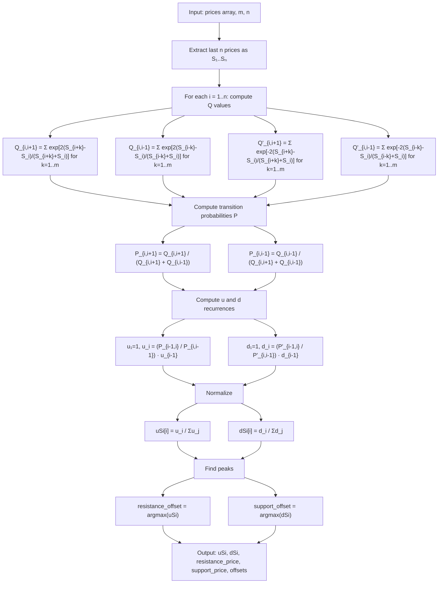

# Moving Mini-Max Indicator

A nonlinear indicator for technical analysis that emphasizes local maximums and minimums in price series with inherent smoothing. Proposed by Z. K. Silagadze (2008/2011), based on algorithms from nuclear physics (gamma-ray spectroscopy peak finding).

---

## Basic Principles (for Non-Mathematicians)

Imagine a price chart as a hilly landscape. You place a tiny ball at one end and want it to roll downhill to find the deepest valley (local minimum) or the highest peak (local maximum). In classical physics, the ball would get stuck behind the first small bump it encounters — analogous to short-term noise preventing identification of true peaks/troughs.

However, in quantum mechanics, particles can "tunnel" through thin barriers with small but nonzero probability. The Moving Mini-Max indicator mimics this quantum tunneling behavior:

1. **The ball can pass through small barriers** (noise), but is stopped by large ones (real trend reversals).
2. **The smoothing window `m`** controls how easily the ball tunnels through barriers — a larger `m` means the ball "sees" more neighbors and passes through small bumps more readily, producing smoother output.
3. **The result is a probability distribution** over the price window that peaks at local maxima (up mini-max) or local minima (down mini-max).

The indicator computes transition probabilities at each bar based on relative price differences with neighbors, chains them together via a Markov-like recurrence, and normalizes the result. The output naturally suppresses noise while highlighting genuine extrema.

---

## Mathematical Description

### Price Series and Notation

Let $S_i,\ i = 1, \ldots, n$ be a price series for a given time window of length $n$.

### Up Mini-Max $u(S)_i$

The up mini-max is a nonlinear transformation that emphasizes local **maximums**:

$$u(S)_i = \frac{u_i}{u_1 + u_2 + \ldots + u_n}$$

where $u_1 = 1$ and subsequent values are defined by the recurrence:

$$u_i = \frac{P_{i-1,i}}{P_{i,i-1}} \cdot u_{i-1}, \quad i = 2, 3, \ldots, n$$

The normalization condition is satisfied:

$$\sum_{i=1}^n u(S)_i = 1$$

### Transition Probabilities

The transition probabilities mimic quantum tunneling probabilities:

$$P_{i,i+1} = \frac{Q_{i,i+1}}{Q_{i,i+1} + Q_{i,i-1}}, \quad P_{i,i-1} = \frac{Q_{i,i-1}}{Q_{i,i+1} + Q_{i,i-1}}$$

Note that $P_{i,i+1} + P_{i,i-1} = 1$ by construction.

### Q-Values (Unnormalized Transition Weights)

$$Q_{i,i+1} = \sum_{k=1}^{m} \exp\left[\frac{2(S_{i+k} - S_i)}{S_{i+k} + S_i}\right]$$

$$Q_{i,i-1} = \sum_{k=1}^{m} \exp\left[\frac{2(S_{i-k} - S_i)}{S_{i-k} + S_i}\right]$$

The argument of the exponential is the relative difference between neighboring prices: $\frac{2(S_b - S_a)}{S_b + S_a}$ equals the difference divided by the average, which is a symmetric percentage change measure.

### Down Mini-Max $d(S)_i$

To emphasize local **minimums**, negate the exponents:

$$Q'_{i,i+1} = \sum_{k=1}^{m} \exp\left[-\frac{2(S_{i+k} - S_i)}{S_{i+k} + S_i}\right]$$

$$Q'_{i,i-1} = \sum_{k=1}^{m} \exp\left[-\frac{2(S_{i-k} - S_i)}{S_{i-k} + S_i}\right]$$

Then compute $P'$, $d_i$, and $d(S)_i$ using the same recurrence and normalization formulas as above.

### Boundary Conditions

At the edges of the window:
- If $i + k > n$, use $S_{i+k} = S_n$
- If $i - k < 1$, use $S_{i-k} = S_1$

### Recurrence Interpretation

The ratio $P_{i-1,i} / P_{i,i-1}$ measures how much easier it is to move **toward** position $i$ from the left versus moving **away** from position $i$ to the left. At a local maximum, prices rise toward $i$ from both sides, making this ratio large and amplifying $u_i$.

---

## Parameters

| Parameter | Description | Default | Valid Range |
|-----------|-------------|---------|-------------|
| `m` | Smoothing window width. Controls the "penetrating ability" of the quantum ball. Larger values produce smoother output, suppressing smaller peaks. | 5 | $\geq 1$ |
| `n` | Lookback window size. Number of price bars over which the indicator is computed. | 300 | $> 2m$ |
| `num_extrema` | Number of distinct support/resistance levels to detect and return. | 3 | $\geq 1$ |

### Parameter Guidance

- **Small `m` (1–3):** Sensitive to short-term fluctuations; picks up minor peaks/troughs.
- **Medium `m` (4–10):** Good balance for daily charts; identifies swing highs/lows.
- **Large `m` (10–30):** Only major peaks/troughs survive; suitable for identifying significant support/resistance.
- **`n`:** Should be large enough to capture the price context. Typical values: 100–500.

---

## Outputs

| Output | Description |
|--------|-------------|
| `uSi[i]` | Up mini-max value at bar $i$. Peaks indicate local price maximums (resistance candidates). |
| `dSi[i]` | Down mini-max value at bar $i$. Peaks indicate local price minimums (support candidates). |
| `resistances` | List of `num_extrema` distinct resistance levels, sorted by strength (strongest first). Each entry contains `price`, `offset`, and `strength`. |
| `supports` | List of `num_extrema` distinct support levels, sorted by strength (strongest first). Each entry contains `price`, `offset`, and `strength`. |

Each resistance/support entry:

| Field | Description |
|-------|-------------|
| `price` | Price value at that extremum. |
| `offset` | Number of bars from the most recent bar to this level. 0 = newest bar, n-1 = oldest. |
| `strength` | The minimax value at that peak (higher = more significant extremum). |

The `uSi` and `dSi` arrays sum to 1.0 each (normalization condition). Higher values indicate stronger extrema.

### Peak Detection

Distinct peaks are found by locating local maxima in the minimax curve and applying a minimum separation constraint (equal to `m` bars) to avoid returning adjacent bars from the same broad hump. This ensures each returned level corresponds to a truly separate swing high/low.

---

## Algorithmic Flow



---

## Implementation Notes

### MQ5 Code Bug (Do Not Use as Reference)

The widely circulated MQ5 implementation by "investeo" contains a confirmed indexing bug. In the Q-value calculation, the code uses `S[i]` as the reference point but `S[m-1+i+k]` for the neighbor, creating an inconsistent offset of `m-1` bars. The correct implementation (per the paper) should use the same base index for both terms. Additionally, the loop runs `k=0..m-1` instead of the paper's `k=1..m`, including a spurious k=0 term.

Our Python implementation follows the paper exactly.

### Repainting Behavior

By design, the indicator recalculates over the entire window on each new bar. The full window of `uSi` and `dSi` values changes as new data arrives. This is inherent to the algorithm, not a bug.

### Lag

The indicator has a natural lag of approximately `m` bars due to the smoothing window.

---

## References

```bibtex
@article{Silagadze2008MiniMax,
  author        = {Silagadze, Z. K.},
  title         = {Moving Mini-Max -- a new indicator for technical analysis},
  journal       = {IFTA Journal},
  volume        = {11},
  pages         = {46--49},
  year          = {2011},
  eprint        = {0802.0984},
  archiveprefix = {arXiv},
  primaryclass  = {q-fin.ST},
  url           = {https://arxiv.org/abs/0802.0984v2},
  note          = {Originally submitted February 2008, revised February 2011}
}

@article{ifta2011:silagadze_minimax,
  author  = {Silagadze, Zurab},
  title   = {Moving Mini-Max -- A New Indicator for Technical Analysis},
  journal = {IFTA Journal},
  year    = {2011},
  pages   = {46--49},
  url     = {https://www.ifta.org/assets/docs/d_ifta_journal_11.pdf},
  note    = {ISSN 2409-0271}
}

@online{mql5_investeo_minimax,
  author  = {investeo},
  title   = {Moving Mini-Max: a New Indicator for Technical Analysis and Its Implementation in MQL5},
  url     = {https://www.mql5.com/en/articles/238},
  urldate = {2026-05-28},
  year    = {2011},
  month   = jan,
  note    = {MQL5 article implementing Silagadze's Moving Mini-Max indicator}
}
```
