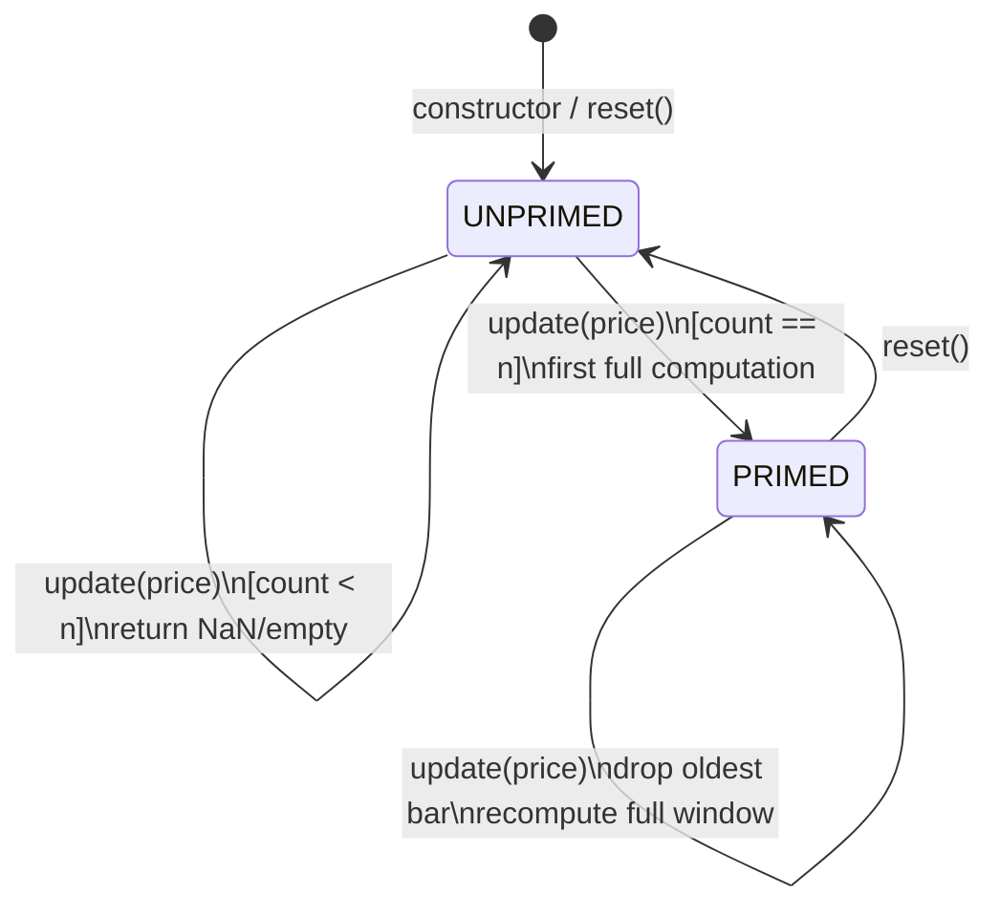
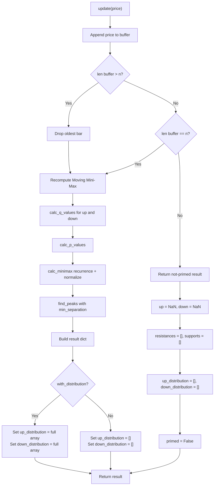

# Moving Mini-Max — Streaming API

## Overview

The streaming version of the Moving Mini-Max indicator accepts one price bar at a time and maintains internal state (a sliding window buffer). It is designed for real-time data feeds where prices arrive sequentially and the indicator must produce output after each new bar.

Once enough bars have been received (the indicator is "primed"), each call to `update(price)` returns the full indicator output: the latest up/down mini-max values, detected support/resistance levels, and optionally the full probability distribution arrays.

---

## Why Full Recomputation on Each Bar

The Moving Mini-Max **cannot** be updated incrementally. Here's why:

1. **The recurrence is chained.** Each $u_i$ depends on $u_{i-1}$, which depends on $u_{i-2}$, all the way back to $u_1 = 1$. Adding a new bar at position $n$ doesn't just affect $u_n$ — it shifts the entire window, making position 1 now refer to a different price than before.

2. **Normalization couples all values.** $u(S)_i = u_i / \sum u_j$. Even if only one $u_j$ changes, every normalized value changes. There is no local update.

3. **Q-values at boundaries change.** The boundary condition ($S_{i+k} = S_n$ when $i+k > n$) means that Q-values near the right edge depend on the newest bar. But the newest bar also shifts which bar is "position 1" (the oldest surviving bar after the window slides).

4. **The transition probabilities at every position are recomputed.** Each $P_{i,i+1}$ depends on the $m$ neighbors of position $i$. When the window slides by one bar, positions are relabeled, and every P potentially changes.

**Bottom line:** There is no mathematical shortcut. The algorithm must recompute all Q-values, all P-values, the full recurrence, and the normalization on every new bar. This is by design — it's what gives the indicator its "moving" property (the same bar gets a different mini-max value as the window slides past it).

### Is This a Problem?

No. The computational cost is $O(n \cdot m)$ per bar:
- For typical parameters ($n = 300$, $m = 5$): ~3,000 `exp()` calls + ~300 multiplications
- Wall-clock time: well under 1ms on modern hardware
- Memory: $O(n)$ for the buffer + $O(n)$ for intermediate arrays during computation

This is negligible even for tick-by-tick data on liquid instruments.

---

## API Reference

### Constructor

```python
MovingMiniMax(m=5, n=300, num_extrema=3, with_distribution=False)
```

| Parameter | Type | Default | Description |
|-----------|------|---------|-------------|
| `m` | int | 5 | Smoothing window width. Larger = smoother. |
| `n` | int | 300 | Lookback window size. Bars needed before priming. |
| `num_extrema` | int | 3 | Number of distinct support/resistance levels to detect. |
| `with_distribution` | bool | False | If True, include full n-length distribution arrays in output. |

### Methods

#### `update(price: float) -> dict`

Feed one new price bar. Returns the indicator output dict (see Output Shape below).

#### `is_primed() -> bool`

Returns True once `n` prices have been received.

#### `reset()`

Clear all internal state. The indicator returns to UNPRIMED and must receive `n` new bars before producing output again.

### Output Shape

Every call to `update()` returns a dict with the same keys:

```python
{
    'primed': bool,              # True once n bars received
    'up': float,                 # Latest bar's up-minimax value (NaN if not primed)
    'down': float,               # Latest bar's down-minimax value (NaN if not primed)
    'resistances': list,         # [{price, offset, strength}, ...] or [] if not primed
    'supports': list,            # [{price, offset, strength}, ...] or [] if not primed
    'up_distribution': list,     # n-length list or [] (see below)
    'down_distribution': list,   # n-length list or [] (see below)
}
```

**Distribution arrays:**
- If `with_distribution=False` (default): always `[]`
- If `with_distribution=True` and primed: full n-length arrays
- If `with_distribution=True` and not primed: `[]`

**Checking in any language:** `len(up_distribution) == 0` means no distribution available.

---

## State Diagram



**States:**
- **UNPRIMED** — Fewer than `n` prices received. Output contains NaN/empty values. Buffer is accumulating.
- **PRIMED** — Buffer full. Each new bar slides the window (drop oldest, append newest) and triggers full recomputation.

---

## Flowchart: `update(price)` Call



---

## Memory Usage

| Component | Size | Notes |
|-----------|------|-------|
| Price buffer | $O(n)$ | Stores the last `n` prices |
| Q-value arrays (4x) | $O(n)$ each | Temporary, during computation |
| P-value arrays (4x) | $O(n)$ each | Temporary, during computation |
| Unnormalized u/d arrays | $O(n)$ each | Temporary, during computation |
| Output distribution | $O(n)$ each | Only allocated if `with_distribution=True` |
| Extrema lists | $O(\text{num\_extrema})$ | Always small |

Total steady-state memory: ~$O(n)$ (buffer only). Peak during computation: ~$O(12n)$ for all temporary arrays. With $n=300$ and 8-byte floats: ~29 KB peak.

---

## Usage Example

```python
from streaming import MovingMiniMax

# Create indicator: m=5 smoothing, n=100 lookback, detect top 3 levels
indicator = MovingMiniMax(m=5, n=100, num_extrema=3)

# Simulate receiving bars from a data feed
for price in price_feed:
    result = indicator.update(price)

    if not result['primed']:
        continue  # Not enough data yet

    # Use the results
    print(f"Up: {result['up']:.6f}, Down: {result['down']:.6f}")

    for r in result['resistances']:
        print(f"  Resistance: {r['price']:.2f} ({r['offset']} bars ago)")

    for s in result['supports']:
        print(f"  Support: {s['price']:.2f} ({s['offset']} bars ago)")
```

---

## Porting Notes

The `streaming.py` file is **self-contained** — all computation functions are inlined (not imported from the batch file). This makes it straightforward to port to other languages:

- Only standard library dependency: `math.exp()`
- No classes with inheritance, no generics — simple struct + methods pattern
- All arrays are plain lists of floats
- The circular buffer is implemented as a simple list with append + slice (no ring buffer tricks)
- All loops are explicit `for` with index access — no iterators, comprehensions, or functional patterns that lack direct equivalents in systems languages

For Rust/Zig/Go ports: replace `list` with `Vec<f64>` / `[]f64` / `[]float64`, replace `dict` with a struct, replace `float('nan')` with `f64::NAN` / `math.NaN` / `math.NaN()`.
