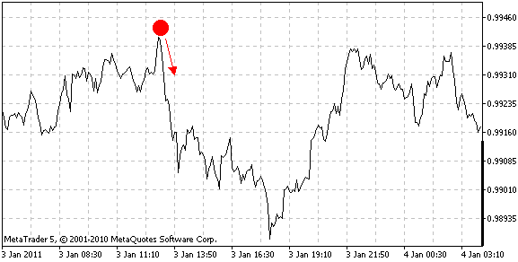
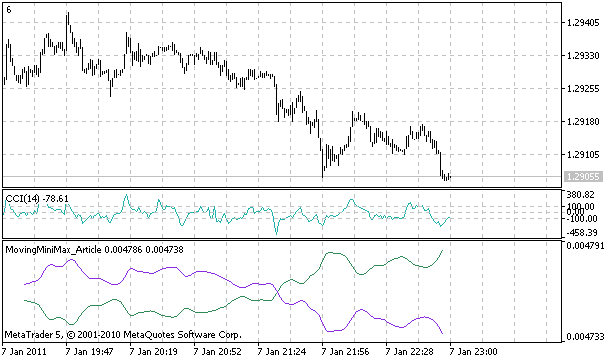
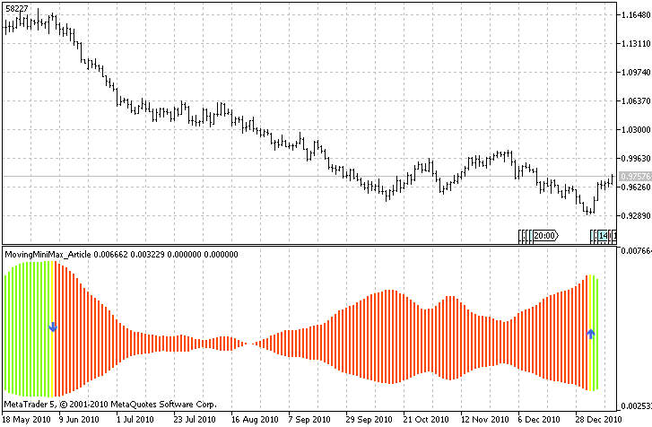

# Moving Mini-Max: a New Indicator for Technical Analysis and Its Implementation in MQL5

- **Author:** investeo (Poland)
- **Platform:** MetaTrader 5
- **Published:** 21 January 2011
- **Article URL:** [https://www.mql5.com/en/articles/238](https://www.mql5.com/en/articles/238)
- **Based on:** Z.K. Silagadze, "Moving Mini-Max — a new indicator for technical analysis," arXiv:0802.0984
- **Source code:** [movingminimax.mq5](movingminimax.mq5) (7.34 KB)

## BibTeX

```bibtex
@online{mql5_investeo_minimax,
  author  = {investeo},
  title   = {Moving Mini-Max: a New Indicator for Technical Analysis and Its Implementation in MQL5},
  url     = {https://www.mql5.com/en/articles/238},
  urldate = {2026-05-28},
  year    = {2011},
  month   = jan,
  note    = {MQL5 article implementing Silagadze's Moving Mini-Max indicator}
}
```

---

## Introduction

There is a science, named Quantitative Finance, that allows to study the financial derivative pricing models using the methods of theoretical and mathematical physics. Lately I came across a paper that describes a new indicator for technical analysis that combines ideas from quantum physics and brings them to finance. I got interested in it and decided I would teach how to implement indicators based on scientific papers in MQL5.

The original Moving Mini-Max paper [2] is written by Z.K. Silagadze, a quantum physicist from Budker Institute of Nuclear Physics and Novosibirsk State University. The link to the paper as well as MQL5 source code are available at the end of the article.

## Indicator

The idea behind technical analysis of financial timeseries — we are mostly looking to find:
- support and resistance price levels;
- direction of the short term and long term trends;
- tops and bottoms of the trends.

The original idea of Moving Mini-Max indicator is to find tops and bottoms on the chart by using analogue of quantum alpha particle that tries to escape a nucleus. The problem is taken from the theory of alpha decay by George Gamov [1].



**Figure 1.** Imaginary quantum ball on forex price chart.

Imagine a ball is thrown from the top of the hill or in our case from a recent top on the timeseries chart. In classical mechanics it will bounce from the obstacles and it might not have a chance to stop in the front of the foremost obstacle, since it may stuck somewhere on the way. But according to quantum mechanics and alpha decay theory such a ball can have a very small, but non-zero probability of tunneling through the barriers finding its way to the potential well bottom and oscillate there.

This is an analogue of finding a local minimum in the price chart. The paper by Z.K. Silagadze [2] proposes that in order to reduce computation complexities instead of solving real quantum-mechanical problem it is enough to mimic quantum behaviour.

I will present mathematical background that is presented in the original paper, and later the implementation in MQL5.

Let $S_i,\ i=1,\ldots,n$ be a price series for some time window. The Moving Mini-Max is a non-linear transformation of the price series:

$$u(S)_i = \frac{u_i}{u_1 + u_2 + \ldots + u_n}$$

where $u_1 = 1$ and for $i > 1$ is defined as follows:

$$u_i = \frac{P_{i-1,i}}{P_{i,i-1}} \cdot u_{i-1}, \quad i = 2, 3, \ldots, n$$

The moving mini-max series satisfies normalization condition (sum of all elements equals one):

$$\sum_{i=1}^n u(S)_i = 1$$

Tunneling probabilities of a quantum ball are called transition probabilities because they model probabilities of crossing through narrow barriers of price series:

$$P_{i,i+1} = \frac{Q_{i,i+1}}{Q_{i,i+1} + Q_{i,i-1}}, \quad P_{i,i-1} = \frac{Q_{i,i-1}}{Q_{i,i+1} + Q_{i,i-1}}$$

with

$$Q_{i,i+1} = \sum_{k=1}^m \exp\left[\frac{2(S_{i+k} - S_i)}{S_{i+k} + S_i}\right], \quad Q_{i,i-1} = \sum_{k=1}^m \exp\left[\frac{2(S_{i-k} - S_i)}{S_{i-k} + S_i}\right]$$

Parameter $m$ is a width of smoothing window that mimics the (inverse) mass of the quantum ball and its ability to pass through small obstacles. Alternatively moving mini-max $d(S)_i$ that emphasises local minimums can be constructed by putting minus sign in the exponent:

$$Q'_{i,i+1} = \sum_{k=1}^m \exp\left[-\frac{2(S_{i+k} - S_i)}{S_{i+k} + S_i}\right], \quad Q'_{i,i-1} = \sum_{k=1}^m \exp\left[-\frac{2(S_{i-k} - S_i)}{S_{i-k} + S_i}\right]$$

## Implementation

Having read about math behind the indicator we can implement it in MQL5. In order to do it the best is to look from the last equation upwards. If you put attention to `m` and `n` variables you will see that this indicator needs `n+2m` element array of price series for one mini-max window and will have lag size of `m` bars.

This is because of $S_{i+k}$ and $S_{i-k}$ indexes in Q variables calculation. Variable `i` is incremented from 1 to `n` and `k` is incremented from 1 to `m`, therefore we will need `n+2m` buffer to start from. This can be achieved by calling:

```mql5
double S[];
ArrayResize(S, n+2*m);
CopyClose(Symbol(), 0, 0, n+2*m, S);
```

This will declare array of doubles, resize it to `n+2m` and copy close values of last `n+2m` bars from the current symbol chart starting from the latest bar.

The next step is to calculate Q values. If you carefully read the definition you will see that for the i-th element of the analyzed price series we need to sum `m` results of exp() function with price values variables. Therefore we need to make a loop from 1 to `n` that will count all Q values:

```mql5
void calcQii()
  {
   int i,k;

   for(i=0; i<n; i++)
     {
      double sqiip1=0;
      double sqiim1=0;
      double dqiip1=0;
      double dqiim1=0;

      for(k=0; k<m; k++)
        {
         sqiip1 += MathExp(2*(S[m-1+i+k]-S[i])/(S[m-1+i+k]+S[i]));
         sqiim1 += MathExp(2*(S[m-1+i-k]-S[i])/(S[m-1+i-k]+S[i]));

         dqiip1 += MathExp(-2*(S[m-1+i+k]-S[i])/(S[m-1+i+k]+S[i]));
         dqiim1 += MathExp(-2*(S[m-1+i-k]-S[i])/(S[m-1+i-k]+S[i]));       
        }

      sQiip1[i] = sqiip1;
      sQiim1[i] = sqiim1;
      dQiip1[i] = dqiip1;
      dQiim1[i] = dqiim1;
     }
  }
```

As you can observe the calcQii function calculates i-th Q and Q' values for the observed price window of size `n`. `S` array holds the price values and `sQiip1`, `sQiim1`, `dQiip1`, `dQiim1` are used as intermediate calculation variables of Q and Q'.

Probabilities are calculated based on Q and Q' variables, therefore we can make another function that loops from 1 to `n` through sQii and dQii arrays:

```mql5
void calcPii()
  {
   int i;

   for(i=0; i<n; i++)
     {
      sPiip1[i] = sQiip1[i] / (sQiip1[i] + sQiim1[i]);
      sPiim1[i] = sQiim1[i] / (sQiip1[i] + sQiim1[i]);
      dPiip1[i] = dQiip1[i] / (dQiip1[i] + dQiim1[i]);
      dPiim1[i] = dQiim1[i] / (dQiip1[i] + dQiim1[i]);
     }
  }
```

What is left is to calculate uSi and later dSi elements and put the results in uSi and dSi arrays:

```mql5
void calcui()
  {
   int i;

   sui[0] = 1;
   dui[0] = 1;

   for(i=1; i<n; i++) 
     {
      sui[i] = (sPiim1[i]/sPiip1[i])*sui[i-1];
      dui[i] = (dPiim1[i]/dPiip1[i])*dui[i-1];
     }

   double uSum = 0;
   double dSum = 0;

   ArrayInitialize(uSi, 0.0);
   ArrayInitialize(dSi, 0.0);

   for(i=0; i<n; i++) { uSum+=sui[i]; dSum+=dui[i]; }
   for(i=0; i<n; i++) { uSi[n-1-i] = sui[i] / uSum; dSi[n-1-i] = dui[i] / dSum; }
  }
```

In order to check if normalization condition is valid, one can add the following lines:

```mql5
double result=0;
for(i=0; i<n; i++) { /* Print("i = "+i+" uSi = "+uSi[i]); */ result+=uSi[i]; }

Print("Result = "+DoubleToString(result));
```

After all calculations were made, we need to display it inside indicator window. In order to do it, one must declare at least two indicator buffers, one for uSi and second for dSi array and define indicator type as DRAW_LINE.

```mql5
#property indicator_separate_window

#property indicator_buffers 2
#property indicator_plots 2
#property indicator_type1 DRAW_LINE
#property indicator_type2 DRAW_LINE
#property indicator_color1 SeaGreen
#property indicator_color2 BlueViolet
```

Then by calling `SetIndexBuffer()` function we assign uSi and dSi arrays to be displayed as `INDICATOR_DATA`:

```mql5
SetIndexBuffer(0, uSi, INDICATOR_DATA);
SetIndexBuffer(1, dSi, INDICATOR_DATA);

PlotIndexSetDouble(0, PLOT_EMPTY_VALUE, 0.0);
PlotIndexSetDouble(1, PLOT_EMPTY_VALUE, 0.0);

PlotIndexSetInteger(0, PLOT_SHIFT, -(m-1));
PlotIndexSetInteger(1, PLOT_SHIFT, -(m-1));
```



**Figure 2.** Implemented Moving Mini-Max indicator.

Possible applications of the indicator described in the article are identifying support and resistance lines and identification of chart patterns by inherent smoothing of the indicator. As for the support and resistance lines they are formed by crossing the moving mini-max of price series and moving mini-max of its moving average.

If price goes through the local maximum and crosses a moving average we have a resistance. After implementing it I saw that the method is suffering from a few false signals, but I am pasting a source code for reference on how to put lines in MQL5 using ChartObjectsLines.mqh library:

```mql5
void SR()
{
   // if price goes through local maximum and crosses a moving average draw resistance
   int i, cnt=0;
   int rCnt = CopyClose(Symbol(), 0, 0, n+2*m, S);
   for(i=n-2; i>=0; i--)
     if(uSi[i]<uSi_MA[i] && uSi[i+1]>=uSi_MA[i+1]) 
       {
        Print("Resistance at " + i);
        CChartObjectHLine *line=new CChartObjectHLine();
        line.Create(0, "MiniMaxResistanceLine:"+IntegerToString(cnt), 0, S[i]);
        line.Color(LightSkyBlue);
        line.Width(1);
        line.Background(true);
        line.Selectable(false);
        cnt++;
       }
   // if price goes through local minimum and crosses a moving average draw support
   for(i=n-2; i>=0; i--)
     if(dSi[i]<dSi_MA[i] && dSi[i+1]>=dSi_MA[i+1]) 
       {
        Print("Support at " + i);
        CChartObjectHLine *line=new CChartObjectHLine();
        line.Create(0, "MiniMaxSupportLine:"+IntegerToString(cnt), 0, S[i]);
        line.Color(Tomato);
        line.Width(1);
        line.Background(true);
        line.Selectable(false);
        cnt++;
       }
}
```

The interesting fact of the indicator though is that I saw that it recognizes quite well local short-trend minimums and maximum for a given time window. It is enough to filter the spread between highest and lowest readings of moving mini-maxes and mark them as a beginning of a short-term bull or bear trend.

We may exploit this behaviour in accordance to other indicators and money management to make a profitable Expert Advisor.

In order to mark the highest readings on the current time window we may use additional indicator buffers to display up and down arrows every time the spread is largest. Additionally to make the indicator more appealing I decided to use new feature of MQL5: a color histogram. The downtrend and uptrend are coloured in different colors, and the trend change is signalled by a yellow bar.

In order to use the colour histogram between two buffers we must use 2 data buffers and one buffer for colour indexes. Please observe how to define plots. There are 5 indicator buffers in total, and three colors are defined for color histogram.

```mql5
//+------------------------------------------------------------------+
//|                                                MovingMiniMax.mq5 |
//|                                      Copyright 2011, Investeo.pl |
//|                                               http://Investeo.pl |
//+------------------------------------------------------------------+
#property copyright   "Copyright 2011, Investeo.pl"
#property link        "http://Investeo.pl"

#property description "Moving Mini-Max indicator"
#property description "proposed by Z.K. Silagadze"
#property description "from Budker Institute of Nuclear Physics"
#property description "and Novosibirsk State University"
#property description "Original paper can be downloaded from:"
#property description "http://arxiv.org/abs/0802.0984"

#property version     "0.6"
#property indicator_separate_window

#property indicator_buffers 5
#property indicator_plots 3

#property indicator_type1 DRAW_COLOR_HISTOGRAM2
#property indicator_type2 DRAW_ARROW
#property indicator_type3 DRAW_ARROW

#property indicator_color1 Chartreuse, OrangeRed, Yellow
#property indicator_color2 RoyalBlue
#property indicator_color3 RoyalBlue

#property indicator_width1 5
#property indicator_width2 4
#property indicator_width3 4
```

Please notice that histogram takes two buffers of type `INDICATOR_DATA` and one buffer `INDICATOR_COLOR_INDEX`. The buffers must be setup precisely in the following order, data buffers come first, after that a color index buffer is defined.

```mql5
SetIndexBuffer(0, uSi, INDICATOR_DATA);
SetIndexBuffer(1, dSi, INDICATOR_DATA);
SetIndexBuffer(2, trend, INDICATOR_COLOR_INDEX);
SetIndexBuffer(3, upArrows, INDICATOR_DATA);
SetIndexBuffer(4, dnArrows, INDICATOR_DATA);

PlotIndexSetDouble(0, PLOT_EMPTY_VALUE, 0.0);
PlotIndexSetDouble(1, PLOT_EMPTY_VALUE, 0.0);
PlotIndexSetDouble(2, PLOT_EMPTY_VALUE, 0.0);

PlotIndexSetInteger(1, PLOT_ARROW, 234);
PlotIndexSetInteger(2, PLOT_ARROW, 233);
```

Buffers 0, 1, 2 are for color histogram, buffers 3 and 4 are for arrow display. The coloring algorithm is as follows:

```mql5
if (upind<dnind) 
  { 
    for (i=0; i<upind; i++) trend[i]=0;
    for (i=upind; i<dnind; i++) trend[i]=1;
    for (i=dnind; i<n; i++) trend[i]=0;
  }
else
  {
    for (i=0; i<dnind; i++) trend[i]=1;
    for (i=dnind; i<upind; i++) trend[i]=0;
    for (i=upind; i<n; i++) trend[i]=1;
  }
   
trend[upind] = 2;
trend[dnind] = 2;
```

 I am pasting the screenshot of the final result:



**Figure 3.** Moving Mini-Max indicator on USDCHF Daily chart.

The interesting fact of the indicator is that it recognizes quite well local short-term minimums and maximums for a given time window. It is enough to filter the spread between highest and lowest readings of moving mini-maxes and mark them as a beginning of a short-term bull or bear trend.

One must remember that the values for downtrend and uptrend are calculated for a given time window every time a new bar arrives — this is the reason to call the indicator "moving mini-max." Although it lags by $m$ bars it gives surprisingly good overview for the trend in the current time window.

I am convinced that this indicator can be profitable.

## Conclusion

I presented mathematics behind a new indicator for technical analysis and its implementation in MQL5. The original paper by Z.K. Silagadze is available at http://arxiv.org/abs/0802.0984. The attached source code is available to download.

## References

1. G. Gamov, "Zur Quantentheorie des Atomkernes," *Zeitschrift für Physik* 51 (1928), 204–212.
2. Z. K. Silagadze, "Moving Mini-Max — a new indicator for technical analysis," arXiv:0802.0984 (2008); IFTA Journal 11 (2011), 46–49.

---

## Forum Discussion

### Thread: Discussion of article "Moving Mini-Max"

**URL:** [https://www.mql5.com/en/forum/3018](https://www.mql5.com/en/forum/3018)

44 comments across 5 pages. Key discussion points below.

---

### Alexey Subbotin (alsu) — Parameter Interpretation and Physics Commentary

**URL:** [https://www.mql5.com/en/forum/3018#comment_56991763](https://www.mql5.com/en/forum/3018#comment_56991763)

> I looked at the original publication of Silagadze, unfortunately he does not give the conclusions of the equations.... but not the point: based on my student experience with quantum mechanics I can say that this conclusion is probably quite simple.
>
> Generally speaking, the primary source interprets this parameter as "the inverse of the ball mass". I.e., depending on m, the uncertainty of the energy required to drag the ball under the potential barrier changes. It seems to me that rigid setting of this parameter is one of the reasons for frequent false signals. This can be justified by the fact that there are values on the market that are analogues of mass and, like the latter, characterise inertness. In the first approximation we can consider the amount of funds available to market participants as such value, in the next — their readiness to make certain decisions (market expectations). We can't estimate these factors directly from the chart, but there is a possibility to use at least the data on trading volumes. Depending on this, we can fine-tune the m parameter. I think it is worth a try.
>
> Still, I would like to see the calculations — from what model Silagadze proceeded. After all, by and large, the ball should overcome a potential barrier located "perpendicular to the market", on the energy axis, i.e. where the participants place orders. You can see these potential barriers clearly here: http://fxtrade.oanda.com/analysis/historical-open-orders. I would solve this problem using quantum methods! And Silagadze (it seemed to me so) makes some rather rough approximation, trying to project energies on the price axis. Hence there may be a mess: perhaps it is worth to apply some quadratic transformation to prices before processing in order to bring the coordinate representation closer to the energy one.

---

### investeo — Correction on Parameter Description

**URL:** [https://www.mql5.com/en/forum/3018#comment_56991773](https://www.mql5.com/en/forum/3018#comment_56991773)

> Thanks, corrected to:
>
> The parameter m is the width of the smoothing window, this parameter makes sense as a value inverse to the mass of the ball, it allows you to control its "penetration capacity".

---

### Anonymous User — Question About Array Indexing in Code

**URL:** [https://www.mql5.com/en/forum/3018/page2#comment_430775](https://www.mql5.com/en/forum/3018/page2#comment_430775)

> I have read the original paper and your code. I have a question about the code following:
>
> ```mql5
> for(k=0; k<m; k++)
> {
>   sqiip1 += MathExp(2*(S[m-1+i+k]-S[i])/(S[m-1+i+k]+S[i]));
>   sqiim1 += MathExp(2*(S[m-1+i-k]-S[i])/(S[m-1+i-k]+S[i]));
>   dqiip1 += MathExp(-2*(S[m-1+i+k]-S[i])/(S[m-1+i+k]+S[i]));
>   dqiim1 += MathExp(-2*(S[m-1+i-k]-S[i])/(S[m-1+i-k]+S[i]));       
> }
> ```
>
> Since the footnote of i in the formula was changed by m-1+i in the code, why the other part of the code does not change the footnote of i?
>
> I mean: shouldn't this code be like following?
>
> ```mql5
> sqiip1 += MathExp(2*(S[m-1+i+k]-S[m-1+i])/(S[m-1+i+k]+S[m-1+i]));
> ```

---

### Anonymous User — Explanation of the Mathematical Core

**URL:** [https://www.mql5.com/en/forum/3018/page4#comment_8855703](https://www.mql5.com/en/forum/3018/page4#comment_8855703)

> The whole secret behind all this is much more simple than one can think.
>
> Let's say we have two numbers, 10 and 12. If we start from 10, 12 represents a 20% increase: (12-10)/10 = 0.2. If we reverse their order: (10-12)/12 = -0.1667 (-17%).
>
> However, let's say both numbers are unordered. So, one cannot know which one is the correct number. In this case, we simply do the average of both cases. So, the average of 12 and 10 is (12+10)/2 = 11. And their difference is (12-10) = 2. Now, we divide both numbers and find 2/11 = 0.181818.
>
> So, the real secret lies in dividing the difference by the average value:
>
> $$q = \frac{x_2 - x_1}{(x_1 + x_2)/2} = \frac{2(x_2 - x_1)}{x_1 + x_2}$$
>
> No news about it. K12 maths.
>
> But let's think about real probability, and not statistics. One can replace the denominator by the median, instead of the average. For two numbers, that would not make any difference. But for 3 or more, it would. Give it a try :)

---

### Roberto_Ev — Code Correction at Line 225

**URL:** [https://www.mql5.com/en/forum/3018/page4#comment_56996336](https://www.mql5.com/en/forum/3018/page4#comment_56996336)

> The Moving Mini-Max code is working, but you should make a correction starting at line 225:

```mql5
//| ----- Error: Has been replaced by the lines below ----- |

//| double result=0;
//|**** Original:for(i=0; i<n; i++) { Print("i ="+i+" uSi ="+uSi[i]); result+=uSi[i]; }
//| ---------------------------------------------------------- |

double result=0;
for(i=0; i<n; i++) // Removed Print statement
{
    result+=uSi[i];
}
```

---

## Community Assessment

The forum discussion reveals mixed reception:

- **Positive:** Intellectually interesting physics-finance crossover; Alexey Subbotin provided insightful physics commentary on parameter interpretation and suggested using volume data to dynamically adjust $m$
- **Negative:** Multiple users (Munir Sayed Yousef Ibrahim, Siarhei Kudrytski, andrenduarte) confirmed the indicator **repaints** — it recalculates the entire history on each new bar, making it unreliable for real-time trading signals
- **Siarhei Kudrytski (Dec 2024):** "The idea itself is very interesting, but the implementation is not very good — the indicator overdraws, only misleading. Everything looks very beautiful on the history, but in practice — sometimes it guesses the direction, and sometimes not. If it does not guess, the arrow is removed and a new one is drawn."

---

## Forum Discussion BibTeX

```bibtex
@online{mql5_forum_minimax_alsu,
  author  = {{alsu (Alexey Subbotin)}},
  title   = {Discussion of article "Moving Mini-Max" --- parameter interpretation},
  url     = {https://www.mql5.com/en/forum/3018#comment_56991763},
  urldate = {2026-05-28},
  year    = {2011},
  note    = {Forum post on parameter m as inverse ball mass; suggests using volume data}
}

@online{mql5_forum_minimax_investeo_reply,
  author  = {investeo},
  title   = {Reply: correction on parameter description},
  url     = {https://www.mql5.com/en/forum/3018#comment_56991773},
  urldate = {2026-05-28},
  year    = {2011},
  note    = {Forum post}
}

@online{mql5_forum_minimax_indexing,
  author  = {{Anonymous}},
  title   = {Question about array indexing in Moving Mini-Max code},
  url     = {https://www.mql5.com/en/forum/3018/page2#comment_430775},
  urldate = {2026-05-28},
  note    = {Forum post questioning S[i] vs S[m-1+i] in the implementation}
}

@online{mql5_forum_minimax_math,
  author  = {{Anonymous}},
  title   = {Explanation of the mathematical core of Moving Mini-Max},
  url     = {https://www.mql5.com/en/forum/3018/page4#comment_8855703},
  urldate = {2026-05-28},
  note    = {Forum post explaining 2*(x2-x1)/(x1+x2) as difference/average}
}

@online{mql5_forum_minimax_codefix,
  author  = {{Roberto\_Ev}},
  title   = {Code correction for Moving Mini-Max at line 225},
  url     = {https://www.mql5.com/en/forum/3018/page4#comment_56996336},
  urldate = {2026-05-28},
  year    = {2024},
  note    = {Forum post with bug fix removing Print statement from normalization loop}
}
```
