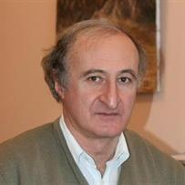
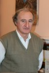

# Zurab Silagadze



Taken from [https://loop.frontiersin.org/people/163497/bio](https://loop.frontiersin.org/people/163497/bio)



Taken from [https://www.inp.nsk.su/~silagadz/](https://www.inp.nsk.su/~silagadz/)

```bibtex
@onl{neloop_silagadze,
  author  = {Silagadze, Zurab},
  title   = {Zurab Silagadze --- Loop Profile},
  url     = {https://loop.frontiersin.org/people/163497/bio},
  urldate = {2026-05-28},
  note    = {Budker Institute of Nuclear Physics (RAS), Novosibirsk, Russia. Frontiers Loop academic profile.}
}
@online{silagadze_binp_homepage,
  author  = {Silagadze, Zurab Karlovich},
  title   = {Personal WWW page of Z.K. Silagadze},
  url     = {https://www.inp.nsk.su/~silagadz/},
  urldate = {2026-05-28},
  note    = {Research Physicist, Budker Institute of Nuclear Physics, Bldg.\ 1, Room 253, Novosibirsk, Russia}
}
```
